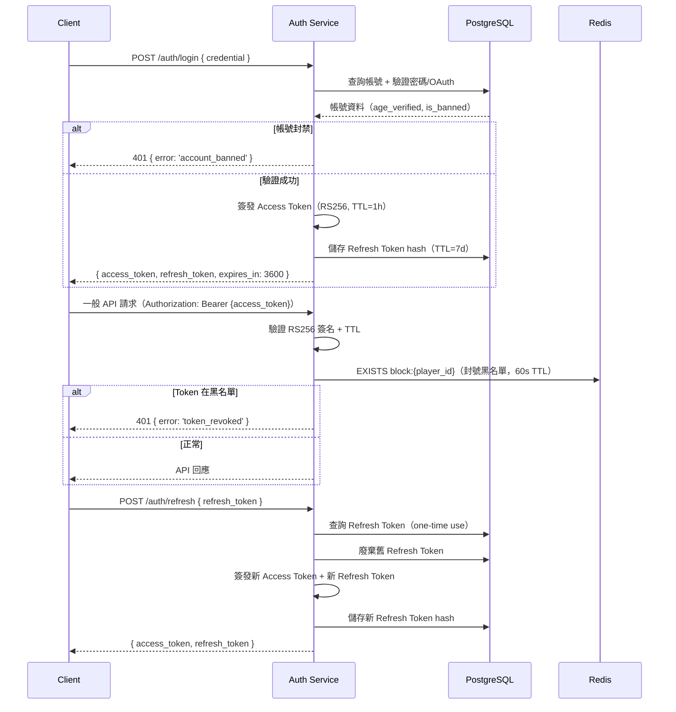

# API — API 規格文件

<!-- SDLC API Specification — Layer 3：API Design Document -->

---

## Document Control

| 欄位 | 內容 |
|------|------|
| **DOC-ID** | API-SAM-GONG-GAME-20260422 |
| **專案名稱** | 三公遊戲（Sam Gong 3-Card Poker）即時多人線上平台 |
| **文件版本** | v1.1 |
| **狀態** | DRAFT（STEP-11 Review 完成，12 findings 修復；依 EDD v1.4-draft）|
| **作者** | Evans Tseng（由 STEP-09 自動生成） |
| **日期** | 2026-04-22 |
| **來源 EDD** | EDD-SAM-GONG-GAME-20260422 v1.4-draft §4 |

---

## Change Log

| 版本 | 日期 | 作者 | 變更摘要 |
|------|------|------|---------|
| v1.0 | 2026-04-22 | STEP-09 | 初稿；依 EDD v1.4-draft §4 生成；涵蓋所有 REST API 端點、WebSocket 協議、錯誤碼、速率限制 |
| v1.1 | 2026-04-22 | STEP-11 Review | 修復 12 findings：F1 rescue_chip 錯誤碼區分（400=rescue_unavailable/403=rescue_chip_claimed）；F2 KYC submit 改 201；F3 rate limit table 補 L2b rescue-chip 與 L1b otp/send；F4 CORS 設定 §1.6；F5 audit-log 分頁完整化；F6 error code enum 補 rescue_unavailable；F7 nullable JSON schema 表示法修正；F8 KYC content-type 說明補充；F9 audit-log query param 正式表格；F10 my_rank null 說明；F11 banned_until nullable 說明；F12 otp/send rate limit 改 per-IP；F13 rescue_chips/rescue_not_available WS 描述補充 |

---

## 1. API Overview

### 1.1 基礎資訊

| 項目 | 值 |
|------|---|
| Base URL（REST）| `https://api.samgong.io/api/v1` |
| Base URL（WebSocket）| `wss://ws.samgong.io` |
| 協議 | HTTPS（TLS 1.2+）/ WSS（WebSocket Secure） |
| 內容類型 | `application/json`（REST）/ Colyseus Binary Protocol（WS） |
| OpenAPI Spec | `https://api.samgong.io/api/docs`（Swagger UI） |
| 版本策略 | URL Path 版本控制（`/api/v1/`） |

### 1.2 API 版本策略

- **當前版本**：v1（穩定）
- **v2 引入條件**：Breaking Changes（欄位移除/重命名、語義變更）
- **v1 Deprecation 通知**：至少 6 個月；Response Header 加入 `Deprecation: date` 和 `Sunset: date`
- **OpenAPI**：`express-openapi-validator` 自動驗證；規格發佈至 `/api/docs`

### 1.3 認證方式

所有需要認證的端點使用 **Bearer JWT（RS256）**：

```
Authorization: Bearer {access_token}
```

- Access Token TTL：≤ 1 小時（NFR-17）
- 封號後 60s 內 Token 失效（Redis 黑名單機制）
- 不使用 Cookie 認證（CSRF 防護，Bearer Token 瀏覽器端不可被跨站讀取）

### 1.4 共用 Request Headers

| Header | 必填 | 說明 |
|--------|:----:|------|
| `Authorization` | 視端點 | `Bearer {access_token}` |
| `Content-Type` | 是（POST/PUT）| `application/json` |
| `X-Request-ID` | 否 | 分散式追蹤 ID（UUID v4） |

### 1.5 共用 Response Headers

| Header | 說明 |
|--------|------|
| `X-Request-ID` | 回傳請求 ID（來自 request 或自動生成） |
| `Retry-After` | 429 回應時，剩餘秒數 |
| `Deprecation` | API 廢棄日期（若已廢棄） |
| `Sunset` | API 下線日期（若已廢棄） |

### 1.6 CORS 設定

REST API 端點採用嚴格 CORS 策略（Express `cors` 套件）：

| 設定項目 | 值 |
|---------|---|
| `Access-Control-Allow-Origin` | 白名單（`https://samgong.io`, `https://www.samgong.io`）；非白名單 Origin 回傳 CORS 錯誤 |
| `Access-Control-Allow-Methods` | `GET, POST, PUT, DELETE, OPTIONS` |
| `Access-Control-Allow-Headers` | `Authorization, Content-Type, X-Request-ID` |
| `Access-Control-Allow-Credentials` | `false`（Bearer Token 模式不需要 Credentials） |
| `Access-Control-Max-Age` | `86400`（Preflight Cache 24h） |

- Preflight OPTIONS 請求直接回傳 `204 No Content`
- Admin API（內網 VPN Only）不設 CORS（僅 VPN 內網存取，無跨域需求）
- WebSocket（WSS）不受 CORS 限制，由 JWT Bearer Token 驗證

---

## 2. Authentication

### 2.1 JWT RS256 認證流程



### 2.2 封號後 60s 失效機制（NFR-17）

```
封號時：
  1. UPDATE users SET is_banned = true WHERE id = {player_id}
  2. SETEX block:{player_id} 60 "1"        ← Redis 60s TTL
  3. DEL session:{player_id}                ← 強制 Session Cache 失效
  4. PUBLISH sam-gong:admin:force_disconnect "{player_id}"

Token 驗證時：
  1. 驗證 JWT RS256 簽名 + TTL
  2. EXISTS block:{player_id} → 命中 → HTTP 401（token_revoked）
```

### 2.3 Refresh Token Rotation

- Refresh Token 一次性使用（one-time use）
- 每次 `/auth/refresh` 廢棄舊 Token，簽發新 Access Token + 新 Refresh Token
- Refresh Token hash 存於 PostgreSQL `refresh_tokens` 表
- TTL 7 天；已撤銷 Token 7 日後定時清理

---

## 3. REST API Endpoints

### 3.1 Auth（認證）

---

#### POST /api/v1/auth/register

**描述**：新帳號註冊（Guest / OAuth）
**Auth**：不需要
**Rate Limit**：30 次/min/IP

**Request Body**：
```json
{
  "username": "string",       // 可選（Guest 模式省略）
  "password": "string",       // 可選（OAuth 模式省略）
  "oauth_provider": "google|facebook",  // 可選
  "oauth_token": "string"     // OAuth Access Token
}
```

**Response 201**：
```json
{
  "player_id": "uuid",
  "display_name": "string",
  "access_token": "string",
  "refresh_token": "string",
  "expires_in": 3600
}
```

**Response Codes**：`201` 成功 / `400` 格式錯誤 / `409` 帳號已存在

---

#### POST /api/v1/auth/login

**描述**：登入，取得 Access Token + Refresh Token
**Auth**：不需要
**Rate Limit**：30 次/min/IP

**Request Body**：
```json
{
  "username": "string",
  "password": "string"
}
```

**Response 200**：
```json
{
  "access_token": "string",
  "refresh_token": "string",
  "expires_in": 3600,
  "player_id": "uuid"
}
```

**Response Codes**：`200` / `400` 格式錯誤 / `401` 帳號或密碼錯誤 / `429` Rate Limit

---

#### POST /api/v1/auth/refresh

**描述**：Refresh Token Rotation，取得新 Access Token
**Auth**：Refresh Token（Bearer）
**Rate Limit**：30 次/min/IP

**Request Body**：
```json
{
  "refresh_token": "string"
}
```

**Response 200**：
```json
{
  "access_token": "string",
  "refresh_token": "string",
  "expires_in": 3600
}
```

**Response Codes**：`200` / `401` Token 無效或已撤銷 / `429` Rate Limit

---

#### POST /api/v1/auth/logout

**描述**：登出，撤銷 Refresh Token
**Auth**：JWT Bearer
**Rate Limit**：60 次/min/user

**Request Body**：
```json
{
  "refresh_token": "string"
}
```

**Response 200**：
```json
{
  "message": "Logged out successfully"
}
```

**Response Codes**：`200` / `401` Token 無效

---

#### POST /api/v1/auth/otp/send

**描述**：發送 OTP 簡訊（年齡驗證 REQ-014）
**Auth**：不需要
**Rate Limit**：5 次/min/IP（未登入端點以 IP 計量）；每手機號每日 ≤ 5 次（Redis `otp:daily:{phone_hash}:{date}`）

**Request Body**：
```json
{
  "phone_number": "string",   // 台灣格式 09xxxxxxxx
  "birth_year": 2000          // 出生年份（整數）
}
```

**Response 200**：
```json
{
  "message": "OTP sent",
  "expires_in_seconds": 300   // OTP 有效期 5 分鐘
}
```

**Response Codes**：`200` / `400` 手機格式錯誤 / `429` Rate Limit

---

#### POST /api/v1/auth/otp/verify

**描述**：驗證 OTP + 啟用帳號年齡驗證
**Auth**：不需要
**Rate Limit**：30 次/min/IP；3 次錯誤 OTP 失效

**Request Body**：
```json
{
  "phone_number": "string",
  "otp_code": "123456",       // 6 碼 OTP
  "birth_year": 2000
}
```

**Response 200**：
```json
{
  "age_verified": true,
  "is_minor": false,
  "message": "Age verification successful"
}
```

**Response Codes**：`200` / `400` OTP 格式錯誤 / `401` OTP 無效或過期 / `429` Rate Limit

---

### 3.2 Player（玩家）

---

#### GET /api/v1/player/me

**描述**：取得玩家個人資料 + 籌碼餘額
**Auth**：JWT Bearer（必填）
**Rate Limit**：60 次/min/user
**讀取來源**：Read Replica（排行榜過濾後）

**Response 200**：
```json
{
  "player_id": "uuid",
  "display_name": "string",
  "avatar_url": "string | null",
  "chip_balance": 100000,
  "age_verified": true,
  "is_minor": false,
  "tutorial_completed": false,
  "show_in_leaderboard": true,
  "music_volume": 70,
  "sfx_volume": 80,
  "vibration": true,
  "daily_chip_claimed_at": "2026-04-22 | null",
  "created_at": "2026-04-22T00:00:00Z",
  "last_login_at": "2026-04-22T10:00:00Z"
}
```

> **Schema 說明**：`avatar_url` 和 `daily_chip_claimed_at` 為 nullable（`string | null`）；未設定時為 `null`。

**Response Codes**：`200` / `401` Token 無效

---

#### PUT /api/v1/player/settings

**描述**：更新玩家設定（音量、動畫、排行榜顯示、Cookie 同意）
**Auth**：JWT Bearer（必填）
**Rate Limit**：60 次/min/user

**Request Body**（所有欄位可選，只更新傳入的欄位）：
```json
{
  "display_name": "string",        // 最長 24 字元（可選）
  "avatar_url": "string",          // URL（可選）
  "music_volume": 70,              // 0-100（可選）
  "sfx_volume": 80,                // 0-100（可選）
  "vibration": true,               // boolean（可選）
  "show_in_leaderboard": true      // 關閉後同步 ZREM（可選）
}
```

**Response 200**：
```json
{
  "message": "Settings updated",
  "updated_fields": ["music_volume", "show_in_leaderboard"]
}
```

**Response Codes**：`200` / `400` 格式錯誤 / `401` Token 無效

---

#### DELETE /api/v1/player/me

**描述**：申請帳號刪除（7 工作日內完成；個資刪除，財務記錄匿名化保留 7 年）
**Auth**：JWT Bearer（必填）
**Rate Limit**：60 次/min/user

**Response 202**：
```json
{
  "message": "Account deletion requested",
  "deletion_scheduled_at": "2026-04-29T00:00:00Z",
  "note": "Financial records will be anonymized and retained for 7 years per regulation"
}
```

**Response Codes**：`202` 已接受（非同步刪除）/ `401` Token 無效

---

#### POST /api/v1/player/daily-chip

**描述**：每日籌碼領取（冪等；每日重置依 UTC+8）
**Auth**：JWT Bearer（必填）
**Rate Limit**：5 次/min/user

**Response 200**：
```json
{
  "chips_awarded": 1000,
  "new_balance": 101000,
  "next_claim_available_at": "2026-04-23T00:00:00+08:00"
}
```

**Response 400（已領取）**：
```json
{
  "error": "daily_task_limit",
  "message": "Daily chips already claimed today",
  "next_claim_available_at": "2026-04-23T00:00:00+08:00"
}
```

**Response Codes**：`200` 成功 / `400` 今日已領取 / `401` Token 無效 / `429` Rate Limit

---

#### POST /api/v1/player/rescue-chip

**描述**：申請救援籌碼（chip_balance < 500 時可申請，每日 1 次，冪等）
**Auth**：JWT Bearer（必填）
**Rate Limit**：≤ 1 次/day/user

**業務規則**：
- `chip_balance < 500` 才可申請
- 每日（UTC+8）只能申請 1 次
- 冪等 DB 原子操作：`UPDATE users SET chip_balance = chip_balance + 1000, daily_rescue_claimed_at = NOW() WHERE id = $1 AND chip_balance < 500 AND (daily_rescue_claimed_at IS NULL OR DATE(daily_rescue_claimed_at AT TIME ZONE 'Asia/Taipei') < CURRENT_DATE AT TIME ZONE 'Asia/Taipei') RETURNING id, chip_balance`

**Response 200**：
```json
{
  "chips_awarded": 1000,
  "new_balance": 1000
}
```

**Response 400（餘額不符條件：chip_balance ≥ 500）**：
```json
{
  "error": "rescue_unavailable",
  "message": "Chip balance is sufficient; rescue chip threshold not met (balance >= 500)"
}
```

**Response 403（今日已領取）**：
```json
{
  "error": "rescue_chip_claimed",
  "message": "Rescue chip already claimed today",
  "next_claim_available_at": "2026-04-23T00:00:00+08:00"
}
```

**Response Codes**：`200` / `400` 餘額 ≥ 500 不符申請條件 / `401` Token 無效 / `403` 今日已領取（`rescue_chip_claimed`）/ `429` Rate Limit

---

#### GET /api/v1/player/chip-transactions

**描述**：籌碼交易記錄查詢（分頁）
**Auth**：JWT Bearer（必填）
**Rate Limit**：60 次/min/user
**讀取來源**：Read Replica

**Query Parameters**：
| 參數 | 類型 | 必填 | 說明 |
|------|------|:----:|------|
| `page` | int | 否 | 頁碼（預設 1） |
| `limit` | int | 否 | 每頁筆數（預設 20，最大 100） |
| `tx_type` | string | 否 | 篩選類型（game_win\|game_lose\|daily_gift 等） |
| `from` | date | 否 | 起始日期（ISO 8601） |
| `to` | date | 否 | 結束日期（ISO 8601） |

**Response 200**：
```json
{
  "data": [
    {
      "id": "uuid",
      "tx_type": "game_win",
      "amount": 500,
      "balance_before": 99500,
      "balance_after": 100000,
      "created_at": "2026-04-22T10:00:00Z",
      "game_session_id": "uuid | null",
      "metadata": {}
    }
  ],
  "pagination": {
    "page": 1,
    "limit": 20,
    "total": 150,
    "total_pages": 8
  }
}
```

**Response Codes**：`200` / `401` Token 無效

---

#### POST /api/v1/player/ad-reward

**描述**：AdMob 廣告觀看獎勵（REQ-020a），冪等 by ad_view_token
**Auth**：JWT Bearer（必填）
**Rate Limit**：≤ 5 次/min/user

**Request Body**：
```json
{
  "ad_view_token": "string"   // AdMob 廣告觀看憑證（唯一）
}
```

**Response 200**：
```json
{
  "chips_awarded": 100,
  "new_balance": 100100
}
```

**Response Codes**：
- `200` 獎勵發放成功
- `400` ad_view_token 格式無效或已使用
- `401` JWT 缺失或失效
- `429` Rate Limit（超過 5 次/min）

---

#### POST /api/v1/player/cookie-consent

**描述**：提交 Cookie 同意記錄（REQ-016 GDPR/個資法）
**Auth**：JWT 可選（未登入前也可提交）
**Rate Limit**：無限制

**Request Body**：
```json
{
  "analytics_consent": true,
  "marketing_consent": false,
  "consent_version": "1.0.0",
  "session_id": "string"     // 未登入時的會話識別
}
```

**Response 200**：
```json
{
  "consent_id": "uuid",
  "consented_at": "2026-04-22T10:00:00Z"
}
```

**Response Codes**：`200` / `400` 格式錯誤

---

### 3.3 Leaderboard（排行榜）

---

#### GET /api/v1/leaderboard

**描述**：取得週排行榜（weekly / chip type）
**Auth**：JWT Bearer（可選）
**Rate Limit**：60 次/min/user
**讀取來源**：Redis ZREVRANGE（`lb:weekly:{week_key}`）+ DB 過濾 `show_in_leaderboard`

**Query Parameters**：
| 參數 | 類型 | 必填 | 說明 |
|------|------|:----:|------|
| `type` | string | 否 | `weekly`（預設） |
| `week` | string | 否 | ISO 週格式如 `2026-W17`（預設當週） |
| `limit` | int | 否 | 排名數量（預設 100，最大 200） |

**Response 200**：
```json
{
  "week_key": "2026-W17",
  "updated_at": "2026-04-22T10:00:00Z",
  "data": [
    {
      "rank": 1,
      "player_id": "uuid",
      "display_name": "string",
      "avatar_url": "string | null",
      "net_chips": 50000,
      "first_win_at": "2026-04-22T08:00:00Z"
    }
  ],
  "my_rank": {
    "rank": 42,
    "net_chips": 1200
  }
}
```

> **Schema 說明**：`my_rank` 未登入時為 `null`；已登入但未上榜時，`rank` 仍回傳實際名次（排行榜過濾後）。

**Response Codes**：`200` / `400` week 格式錯誤

---

### 3.4 Tasks（每日任務）

---

#### GET /api/v1/tasks

**描述**：取得今日每日任務列表
**Auth**：JWT Bearer（必填）
**Rate Limit**：60 次/min/user

**Response 200**：
```json
{
  "date": "2026-04-22",
  "tasks": [
    {
      "task_id": "complete_3_games",
      "name": "完成 3 場遊戲",
      "reward_chips": 500,
      "completed": false,
      "completed_at": null
    }
  ]
}
```

**Response Codes**：`200` / `401` Token 無效

---

#### POST /api/v1/tasks/:id/complete

**描述**：完成任務 + 發放獎勵（冪等）
**Auth**：JWT Bearer（必填）
**Rate Limit**：5 次/min/user

**Path Parameters**：`id` = task_id（如 `complete_3_games`）

**Response 200**：
```json
{
  "task_id": "complete_3_games",
  "reward_chips": 500,
  "new_balance": 100500,
  "completed_at": "2026-04-22T10:00:00Z"
}
```

**Response Codes**：`200` / `400` 任務條件未達成 / `401` Token 無效 / `404` 任務不存在 / `429` Rate Limit

---

### 3.5 KYC（身份驗證）

---

#### POST /api/v1/kyc/submit

**描述**：提交 KYC 身份文件（REQ-018；文件加密存儲）
**Auth**：JWT Bearer（必填）
**Rate Limit**：60 次/min/user

**Request Headers**：`Content-Type: application/json`（文件 URL 預先上傳至 S3，此端點僅接收 URL 參照）

**Request Body**：
```json
{
  "kyc_type": "full_kyc",
  "document_type": "national_id|passport",
  "document_front_url": "string",   // 預先加密上傳至 S3 後的 URL
  "document_back_url": "string"     // 預先加密上傳至 S3 後的 URL
}
```

**Response 201**：
```json
{
  "kyc_id": "uuid",
  "status": "pending",
  "submitted_at": "2026-04-22T10:00:00Z",
  "estimated_review_time": "1-3 business days"
}
```

**Response Codes**：`201` 提交成功（資源已建立）/ `400` 格式錯誤 / `401` Token 無效

---

#### GET /api/v1/kyc/status

**描述**：查詢 KYC 審核狀態
**Auth**：JWT Bearer（必填）
**Rate Limit**：60 次/min/user

**Response 200**：
```json
{
  "kyc_type": "full_kyc",
  "status": "pending | approved | rejected",
  "submitted_at": "2026-04-22T10:00:00Z",
  "reviewed_at": "2026-04-23T10:00:00Z | null"
}
```

> **Schema 說明**：`status` 枚舉值為 `pending`、`approved`、`rejected`；`reviewed_at` 為 nullable，未審核時為 `null`。

**Response Codes**：`200` / `401` Token 無效

---

### 3.6 Rooms（私人房間）

---

#### POST /api/v1/rooms/private

**描述**：建立私人房間（返回 room_code 供其他玩家加入）
**Auth**：JWT Bearer（必填）
**Rate Limit**：一般 API（60 次/min/user）

**Request Body**：
```json
{
  "tier": "青銅廳|白銀廳|黃金廳|鉑金廳|鑽石廳"
}
```

**Response 201**：
```json
{
  "room_code": "ABC123",
  "colyseus_room_id": "string",
  "tier": "青銅廳",
  "expires_at": "2026-04-22T11:00:00Z"
}
```

**Response Codes**：`201` 成功 / `400` tier 無效或餘額不足

---

#### GET /api/v1/rooms/private/{room_code}

**描述**：查詢私人房間資訊（給 Colyseus joinById 使用）
**Auth**：JWT Bearer（必填）
**Rate Limit**：一般 API

**Path Parameters**：`room_code` = 6 位大寫英數字

**Response 200**：
```json
{
  "room_code": "ABC123",
  "colyseus_room_id": "string",
  "tier": "青銅廳",
  "current_players": 3,
  "max_players": 6,
  "status": "active"
}
```

**Response Codes**：`200` / `404` 房間不存在或已關閉

---

### 3.7 Admin API（內部 VPN Only）

---

#### POST /api/v1/admin/player/:id/ban

**描述**：封鎖帳號（Admin Only；內網 VPN 存取）
**Auth**：Admin JWT（role=admin，獨立私鑰）
**Rate Limit**：內網 VPN Only

**Path Parameters**：`id` = player_id（UUID）

**Request Body**：
```json
{
  "reason": "string",          // 封號原因
  "duration_days": 7           // null = 永久封號
}
```

**Response 200**：
```json
{
  "player_id": "uuid",
  "banned": true,
  "ban_reason": "string",
  "banned_at": "2026-04-22T10:00:00Z",
  "banned_until": "2026-04-29T10:00:00Z | null"
}
```

> **Schema 說明**：`banned_until` 為 nullable；`null` 代表永久封號（`duration_days: null`）。

**封號附帶效果**（Server 端）：
```
1. UPDATE users SET is_banned = true
2. SETEX block:{player_id} 60 "1"
3. DEL session:{player_id}
4. PUBLISH sam-gong:admin:force_disconnect "{player_id}" → client.leave(4001)
```

**Response Codes**：`200` / `400` 格式錯誤 / `401` Admin JWT 無效 / `403` 非 Admin 角色

---

#### GET /api/v1/admin/audit-log

**描述**：稽核日誌查詢（Admin Only）
**Auth**：Admin JWT（role=admin）
**Rate Limit**：內網 VPN Only

**Query Parameters**：

| 參數 | 類型 | 必填 | 說明 |
|------|------|:----:|------|
| `from` | date | 否 | 起始日期（ISO 8601，如 `2026-04-01`） |
| `to` | date | 否 | 結束日期（ISO 8601，如 `2026-04-30`） |
| `player_id` | uuid | 否 | 篩選特定玩家的稽核記錄 |
| `action` | string | 否 | 篩選操作類型（如 `ban_player\|adjust_chips`） |
| `page` | int | 否 | 頁碼（預設 1） |
| `limit` | int | 否 | 每頁筆數（預設 20，最大 100） |

**Response 200**：
```json
{
  "data": [
    {
      "id": "uuid",
      "admin_id": "uuid",
      "action": "ban_player|adjust_chips|...",
      "target_player_id": "uuid",
      "payload": {},
      "created_at": "2026-04-22T10:00:00Z"
    }
  ],
  "pagination": { "page": 1, "limit": 20, "total": 50, "total_pages": 3 }
}
```

**Response Codes**：`200` / `401` Token 無效 / `403` 非 Admin 角色

---

### 3.8 System（系統）

---

#### GET /api/v1/health

**描述**：健康檢查（k8s liveness probe）
**Auth**：不需要
**Rate Limit**：無限制

**Response 200**：
```json
{
  "status": "ok",
  "timestamp": "2026-04-22T10:00:00Z"
}
```

---

#### GET /api/v1/health/ready

**描述**：就緒探針（DB + Redis 連線確認；k8s readiness probe）
**Auth**：不需要
**Rate Limit**：無限制

**Response 200**：
```json
{
  "status": "ready",
  "checks": {
    "postgresql": "ok",
    "redis": "ok"
  }
}
```

**Response 503（任一依賴不健康）**：
```json
{
  "status": "not_ready",
  "checks": {
    "postgresql": "ok",
    "redis": "error: connection timeout"
  }
}
```

---

#### GET /api/v1/config

**描述**：用戶端設定（伺服器域名、廳別設定、Feature Flags）
**Auth**：不需要
**Rate Limit**：300 次/min/IP

**Response 200**：
```json
{
  "ws_server_url": "wss://ws.samgong.io",
  "tiers": [
    {
      "tier_name": "青銅廳",
      "entry_chips": 1000,
      "min_bet": 100,
      "max_bet": 500,
      "quick_bet_amounts": [100, 200, 300, 500]
    },
    {
      "tier_name": "白銀廳",
      "entry_chips": 10000,
      "min_bet": 1000,
      "max_bet": 5000,
      "quick_bet_amounts": [1000, 2000, 3000, 5000]
    },
    {
      "tier_name": "黃金廳",
      "entry_chips": 100000,
      "min_bet": 10000,
      "max_bet": 50000,
      "quick_bet_amounts": [10000, 20000, 30000, 50000]
    },
    {
      "tier_name": "鉑金廳",
      "entry_chips": 1000000,
      "min_bet": 100000,
      "max_bet": 500000,
      "quick_bet_amounts": [100000, 200000, 300000, 500000]
    },
    {
      "tier_name": "鑽石廳",
      "entry_chips": 10000000,
      "min_bet": 1000000,
      "max_bet": 5000000,
      "quick_bet_amounts": [1000000, 2000000, 3000000, 5000000]
    }
  ],
  "feature_flags": {
    "iap_enabled": false,
    "tutorial_enabled": true
  },
  "server_version": "1.0.0"
}
```

---

## 4. WebSocket Protocol

### 4.1 Colyseus 連線建立

**連線端點**：`wss://ws.samgong.io`

**Colyseus Room 名稱**：`sam_gong`（正式）/ `sam_gong_tutorial`（教學）

**Client SDK（Cocos Creator）：**
```typescript
import { Client } from 'colyseus.js';

const client = new Client('wss://ws.samgong.io');

// 配對加入
const room = await client.joinOrCreate('sam_gong', {
  tier: '青銅廳',
  token: access_token    // JWT Access Token（Bearer）
});

// 加入私人房間
const room = await client.joinById(colyseus_room_id, {
  token: access_token
});

// 連線成功後儲存重連憑證
const reconnectInfo = { roomId: room.id, sessionId: room.sessionId };
```

### 4.2 Client → Server 訊息

| 訊息類型 | Payload | 驗證規則 | 說明 |
|---------|---------|---------|------|
| `banker_bet` | `{ amount: number }` | phase === 'banker-bet'；is_banker；min_bet ≤ amount ≤ max_bet；amount ≤ chip_balance | 莊家下注 |
| `call` | `{}` | phase === 'player-bet'；本人輪次；chip_balance ≥ banker_bet_amount | 閒家跟注（Call） |
| `fold` | `{}` | phase === 'player-bet'；本人輪次 | 閒家棄牌 |
| `see_cards` | `{}` | phase === 'banker-bet'；is_banker | 莊家查看手牌 |
| `send_chat` | `{ text: string }` | text.length ≤ 200；rate limit ≤ 2/s | 房間內聊天 |
| `report_player` | `{ target_id: string, message_id: string, reason: string }` | target_id 存在房間；reason 合法枚舉 | 舉報玩家 |
| `confirm_anti_addiction` | `{ type: "adult" }` | is_adult；type=adult | 成人確認防沉迷 2h 提醒 |

**Client → Server 訊息速率限制**：每連線每秒 ≤ 10 條訊息（NFR-15）

### 4.3 Server → Client 訊息

| 訊息類型 | Payload | 說明 |
|---------|---------|------|
| Room State Sync | Schema diff（自動）| Colyseus 自動推送 SamGongState diff |
| `my_session_info` | `{ session_id: string, player_id: string }` | 玩家加入後 Server 推送（sendTo client），Client 識別自身 session |
| `myHand` | `{ cards: Card[] }` | 推送玩家手牌（私人訊息，dealing phase 後） |
| `showdown_reveal` | `{ hands: { [seat_index]: Card[] } }` | 所有未 Fold 玩家手牌（廣播，showdown phase） |
| `anti_addiction_warning` | `{ type: "adult", session_minutes: number }` | 成人 2h 連續遊玩提醒（需確認） |
| `anti_addiction_signal` | `{ type: "underage", daily_minutes_remaining: number, midnight_timestamp: number }` | 未成年每日 2h 硬停訊號 |
| `rescue_chips` | `{ amount: 1000, new_balance: number }` | 結算後偵測 chip_balance < 500 且今日未領取時自動觸發補發（DB 原子 UPDATE 防 Race Condition） |
| `rescue_not_available` | `{ reason: "already_claimed" \| "balance_sufficient" }` | 結算後偵測餘額 < 500 但今日已領取（`already_claimed`）或餘額 ≥ 500（`balance_sufficient`）時推送；Client 顯示對應提示 |
| `rate_limit` | `{ error: "rate_limit", retry_after_ms: number }` | 訊息速率超限回應 |
| `error` | `{ code: string, message: string }` | 一般錯誤回應（非法操作、驗證失敗） |
| `matchmaking_expanded` | `{ expanded_tiers: string[] }` | 配對擴展至相鄰廳別（30s 後） |
| `send_message_rejected` | `{ reason: "content_filter" \| "rate_limit" }` | 聊天訊息被拒絕 |

### 4.4 Room State Schema（公開欄位）

`SamGongState`（Colyseus Schema，自動同步至所有 Client）：

```typescript
// 公開欄位（所有 Client 可見）
{
  players: MapSchema<PlayerState>,  // key = seat_index.toString()
  phase: string,                    // 'waiting'|'dealing'|'banker-bet'|'player-bet'|'showdown'|'settled'
  banker_seat_index: number,
  banker_bet_amount: number,
  min_bet: number,
  max_bet: number,
  current_pot: number,
  action_deadline_timestamp: number, // Server Unix ms（Client 計算倒計時）
  round_number: number,
  current_player_turn_seat: number,
  settlement: SettlementState,
  tier_config: TierConfig,
  is_tutorial: boolean,
  room_id: string,                  // 私人房間 room_code
  room_type: string,                // 'matchmaking'|'private'
  matchmaking_status: MatchmakingStatus
}

// PlayerState（每個玩家的公開狀態）
{
  player_id: string,
  seat_index: number,
  chip_balance: number,      // 開放籌碼設計（所有玩家可見）
  bet_amount: number,
  is_connected: boolean,
  is_folded: boolean,
  has_acted: boolean,
  is_banker: boolean,
  display_name: string,
  avatar_url: string
  // 手牌不在此 Schema（僅透過私人訊息 myHand 推送）
}
```

### 4.5 斷線重連流程

**Client 端（Cocos Creator）：**

```typescript
room.onLeave(async (code) => {
  if (code === 4000) return; // 被踢出，不重連
  const stored = { roomId: room.id, sessionId: room.sessionId };
  cc.sys.localStorage.setItem('reconnect_info', JSON.stringify(stored));
  try {
    const reconnInfo = JSON.parse(cc.sys.localStorage.getItem('reconnect_info'));
    room = await client.reconnect(reconnInfo.roomId, reconnInfo.sessionId);
    // 重連成功後 Server 重新推送 myHand
  } catch (e) {
    cc.sys.localStorage.removeItem('reconnect_info');
    UIManager.navigateTo('LobbyScene');
  }
});
```

**Server 端（onLeave）**：
- `consented=false` → `allowReconnection(client, 30)`（30s 重連視窗）
- 重連成功 → Server 重新推送 `myHand`（private message）
- 30s 超時 → 玩家自動 Fold（遊戲進行中）或退出（waiting phase）

---

## 5. Error Codes Reference

### 5.1 REST API 統一錯誤格式

```typescript
interface ErrorResponse {
  error: string;        // Error code（機器可讀）
  message: string;      // 人類可讀說明（英文，用於 debug）
  detail?: object;      // 額外上下文（可選）
  request_id?: string;  // X-Request-ID
}
```

**範例**：
```json
{
  "error": "insufficient_chips",
  "message": "Player chip balance is below the required amount for this tier",
  "detail": {
    "required": 10000,
    "current_balance": 5000
  },
  "request_id": "550e8400-e29b-41d4-a716-446655440000"
}
```

### 5.2 WebSocket 錯誤格式

```typescript
interface WsErrorMessage {
  code: string;
  message: string;
}
```

### 5.3 完整 Error Code 枚舉

**認證/授權**：
| Code | HTTP Status | 說明 |
|------|:-----------:|------|
| `token_expired` | 401 | Access Token 已過期 |
| `token_invalid` | 401 | Token 格式錯誤或簽名無效 |
| `token_revoked` | 401 | Token 已撤銷（封號黑名單）|
| `account_banned` | 401 | 帳號已封禁 |
| `account_not_found` | 401 | 帳號不存在 |

**遊戲邏輯**：
| Code | 說明 |
|------|------|
| `invalid_phase` | 操作不符當前 phase |
| `insufficient_chips` | 籌碼不足 |
| `invalid_bet_amount` | 下注金額無效 |
| `bet_out_of_range` | 下注金額超出廳別限制 |
| `already_called` | 玩家已 Call |
| `already_folded` | 玩家已 Fold |
| `banker_insolvent` | 莊家破產 |
| `room_full` | 房間已滿 |
| `room_not_found` | 房間不存在 |

**速率限制**：
| Code | HTTP Status | 說明 |
|------|:-----------:|------|
| `rate_limit_exceeded` | 429 | 超過速率限制 |
| `daily_task_limit` | 400 | 每日任務已完成 |
| `rescue_unavailable` | 400 | 救援籌碼不符申請條件（chip_balance ≥ 500）|
| `rescue_chip_claimed` | 403 | 今日已領取救援籌碼（每日 1 次上限）|

**KYC/合規**：
| Code | 說明 |
|------|------|
| `age_verification_required` | 需要年齡驗證 |
| `underage_session_expired` | 未成年每日遊戲時間已達上限 |
| `otp_invalid` | OTP 代碼無效 |
| `otp_expired` | OTP 已過期 |

**系統**：
| Code | HTTP Status | 說明 |
|------|:-----------:|------|
| `server_maintenance` | 503 | 伺服器維護中 |
| `internal_error` | 500 | 內部伺服器錯誤 |
| `request_timeout` | 504 | 請求超時 |

Client 端根據 `code`（即 i18n key `error.{code}`）本地化顯示。

---

## 6. Rate Limiting

### 6.1 四層速率限制（NFR-19）

| 層次 | 適用端點 | Redis Key | 限制 | 超限回應 |
|------|---------|-----------|------|---------|
| L1 認證 | `/auth/*`（除 OTP）| `rl:auth:{ip}` | 30 次/min/IP | HTTP 429 |
| L1b OTP 發送 | `POST /auth/otp/send` | `rl:otp_send:{ip}` | 5 次/min/IP | HTTP 429 |
| L2 高敏感 | `POST /player/daily-chip`, `POST /tasks/:id/complete` | `rl:sensitive:{player_id}` | 5 次/min/user | HTTP 429 |
| L2b 每日唯一 | `POST /player/rescue-chip` | `rl:rescue:{player_id}:{date}` | ≤ 1 次/day/user（UTC+8 日期 key）| HTTP 429 |
| L3 一般 | 所有其他 `/api/v1/*` | `rl:general:{player_id}` | 60 次/min/user | HTTP 429 |
| L4 IP 全局 | 所有端點 | `rl:global:{ip}` | 300 次/min/IP | HTTP 429 |

### 6.2 超限回應格式

```json
{
  "error": "rate_limit_exceeded",
  "message": "Too many requests",
  "retry_after_seconds": 30,
  "limit": 30,
  "window_seconds": 60
}
```

Response Headers：
```
HTTP/1.1 429 Too Many Requests
Retry-After: 30
X-RateLimit-Limit: 30
X-RateLimit-Remaining: 0
X-RateLimit-Reset: 1714000000
```

### 6.3 Redis Lua Script（原子性計數）

```lua
-- rate_limit.lua（原子 GET + INCR + EXPIRE）
local key = KEYS[1]
local limit = tonumber(ARGV[1])
local window = tonumber(ARGV[2])
local current = redis.call('INCR', key)
if current == 1 then
  redis.call('EXPIRE', key, window)
end
if current > limit then
  return redis.call('TTL', key)  -- 返回剩餘秒數
else
  return 0  -- 0 = 未超限
end
```

### 6.4 WebSocket 訊息速率限制

每連線每秒 ≤ 10 條訊息（NFR-15）：
- 超限回應：Server 推送 `{ type: 'rate_limit', retry_after_ms: 1000 }`
- 不斷線，讓 Client 有機會重試

---

## 7. WebSocket Close Codes

| Code | 含義 | 觸發條件 | Client 處理 |
|------|------|---------|-------------|
| `4000` | 被系統踢出（禁止重連）| 帳號封禁且 Redis Pub/Sub 觸發踢出 | 顯示封號訊息，清除 token，不重連 |
| `4001` | Token 失效或帳號封禁 | JWT 驗證失敗或封號黑名單命中 | 清除 token，跳轉登入頁 |
| `4002` | 伺服器維護 | Server 計劃性維護 | 顯示維護中訊息，5 分鐘後重試 |
| `4003` | 未成年每日遊戲時間上限 | AntiAddictionManager 達 2h 每日上限 | 顯示下線提示，次日台灣午夜後可重連 |
| `4004` | 重連逾時（reconnect window 過期）| 30s 重連視窗過期 | 清除 reconnect_info，返回大廳 |
| `4005` | 重複登入（同帳號其他裝置已登入）| Redis Pub/Sub force_disconnect_device | 顯示「其他裝置已登入」，清除本地 token |
| `1001` | 伺服器正常關閉（Going Away）| Pod 優雅關閉（preStop 30s）| 嘗試重連，最多 3 次 |

---

## Appendix A：廳別設定速查

| 廳別 | Entry 籌碼 | min_bet | max_bet | quick_bet_amounts |
|------|:---------:|:-------:|:-------:|:-----------------:|
| 青銅廳 | 1,000 | 100 | 500 | [100, 200, 300, 500] |
| 白銀廳 | 10,000 | 1,000 | 5,000 | [1000, 2000, 3000, 5000] |
| 黃金廳 | 100,000 | 10,000 | 50,000 | [10000, 20000, 30000, 50000] |
| 鉑金廳 | 1,000,000 | 100,000 | 500,000 | [100000, 200000, 300000, 500000] |
| 鑽石廳 | 10,000,000 | 1,000,000 | 5,000,000 | [1000000, 2000000, 3000000, 5000000] |

## Appendix B：賠率表（PRD §5.4）

| 閒家牌型 | 賠率（N）| 閒家勝 net_chips | 說明 |
|---------|:-------:|:--------------:|------|
| 三公 | 3x | +3 × banker_bet | 3 張 10 點牌 |
| 9 點 | 2x | +2 × banker_bet | sum mod 10 = 9 |
| 1-8 點（非三公）| 1x | +1 × banker_bet | 一般比點 |
| 平手 | 0x | 0（退注）| D8 比牌後仍平手 |
| 輸 | -1x | -called_bet | 閒家點數低於莊家 |
| Fold | - | 0 | 不扣款 |
| Insolvent Win | - | -called_bet | 莊家破產後排隊中的贏家 |

---

*文件版本 v1.1 — 依 EDD v1.4-draft §4 生成 — 2026-04-22 — STEP-11 Review 完成*
