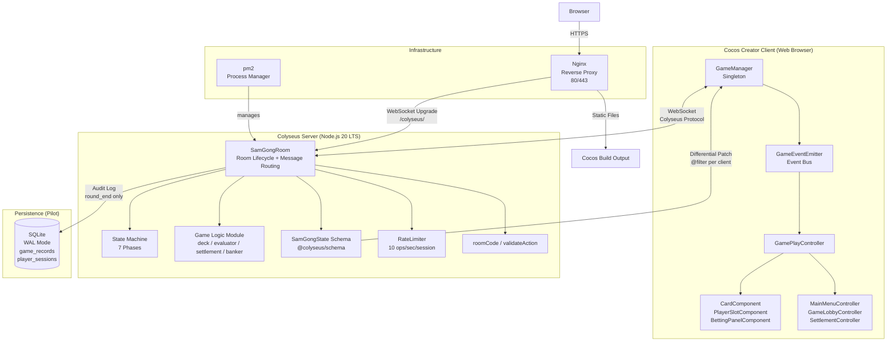

# ARCH — 三公遊戲系統架構文件

## Document Control

| 欄位 | 內容 |
|------|------|
| **DOC-ID** | ARCH-SAM-GONG-20260421 |
| **版本** | v1.0 |
| **狀態** | DRAFT |
| **來源** | EDD-SAM-GONG-20260421 / TECH_STACK v1.0 |
| **作者** | devsop-autodev |
| **日期** | 2026-04-21 |

---

## 1. Architecture Overview

### 1.1 Pattern: Server-Authoritative + Client-Rendering

三公遊戲採用**Server-Authoritative + Client-Rendering**兩層架構：

- **Colyseus Server（唯一可信方）**：所有牌局決策（洗牌、發牌、判勝負、結算）100% 在 Server 執行。Client 無法偽造任何遊戲狀態，所有操作僅以 WebSocket 訊息形式傳送至 Server，由 Server 驗證後執行。
- **Cocos Creator Client（純 Rendering）**：Client 只負責接收 Server 廣播的狀態差分（State Diff）並渲染畫面。不持有任何遊戲邏輯，不做任何牌局決策。

這種設計的核心優勢：
1. **反作弊**：未翻牌的牌面資料從未送達其他玩家的客戶端，無法透過 DevTools 竊取
2. **單一狀態來源**：`SamGongState` Schema 是所有客戶端視圖的唯一來源
3. **可測試性**：Server 端的純函數 Game Logic（deck / evaluator / settlement）可獨立單元測試，不依賴 Client

### 1.2 Architecture Diagram



### 1.3 Deployment Architecture (Pilot)

Pilot 版採用單一 VPS 部署，不需要 cluster 或外部 DB 服務：

```
Internet (HTTPS)
      ↓
[Nginx :80/:443]
      ├── /colyseus/ → WebSocket Proxy → Colyseus :2567
      └── /          → Static Files (/var/www/sam-gong/)
                              ↓
                    [Colyseus Node.js Process]
                       (pm2, single instance)
                              ↓
                    [SQLite ./data/game.db]
                         (WAL Mode)
```

Scale Target（Pilot）：50 concurrent 房間 × 最多 6 人 = 300 WebSocket 連接。單 Node.js 進程可輕鬆承載，Server 記憶體 < 512MB。

---

## 2. Component Breakdown

### 2.1 Server Components

| Component | File | Responsibility |
|-----------|------|----------------|
| App Entry | `server/src/index.ts` | Colyseus Server 初始化、Room 註冊、埠號綁定 |
| SamGongRoom | `server/src/rooms/SamGongRoom.ts` | Room 生命週期（onCreate/onJoin/onLeave/onDispose）、訊息路由、State Machine 驅動、重連管理 |
| SamGongState | `server/src/schema/SamGongState.ts` | `@colyseus/schema` 定義（Card、PlayerState、SamGongState），含 `@filter` 反作弊 decorator |
| deck.ts | `server/src/logic/deck.ts` | 建立 52 張牌組、Fisher-Yates 洗牌、發牌（純函數） |
| evaluator.ts | `server/src/logic/evaluator.ts` | 計算三公點數、compareHands、getPointsDisplay（純函數） |
| settlement.ts | `server/src/logic/settlement.ts` | 正常結算（settle）、流局結算（settleForfeit）（純函數） |
| banker.ts | `server/src/logic/banker.ts` | 初始莊家隨機選取、順時針輪換（純函數） |
| sqlite.ts | `server/src/db/sqlite.ts` | SQLite 稽核日誌 wrapper（game_records / player_sessions 寫入） |
| roomCode.ts | `server/src/utils/roomCode.ts` | 生成 6 位英數房間碼（去除 O/0/I/1 易混淆字元） |
| rateLimiter.ts | `server/src/utils/rateLimiter.ts` | Per-session 操作頻率限制（≤ 10 次/秒） |

### 2.2 Client Components

| Component | File | Responsibility |
|-----------|------|----------------|
| GameManager | `client/assets/scripts/managers/GameManager.ts` | Colyseus.Client 連線、createRoom/joinRoom/reconnect、所有 sendMessage 集中於此（Singleton） |
| GameEventEmitter | `client/assets/scripts/managers/GameEventEmitter.ts` | Event Bus，解耦 GameManager 與各 UI Controller |
| PlayerLayoutManager | `client/assets/scripts/managers/PlayerLayoutManager.ts` | 玩家座位布局計算（Scene 載入時執行一次） |
| AudioManager | `client/assets/scripts/managers/AudioManager.ts` | 音效管理（MVP stub） |
| MainMenuController | `client/assets/scripts/ui/MainMenuController.ts` | 創建/加入房間入口、房間碼輸入驗證 |
| GameLobbyController | `client/assets/scripts/ui/GameLobbyController.ts` | 等待大廳、顯示房間碼、玩家列表 |
| GamePlayController | `client/assets/scripts/ui/GamePlayController.ts` | 主場景控制器（最複雜）：監聽所有 GameEventEmitter 事件、依 roomPhase 控制 Panel/Overlay、協調翻牌序列 |
| SettlementController | `client/assets/scripts/ui/SettlementController.ts` | 結算 Overlay（正常結算 + 流局結算兩種顯示模式） |
| CardComponent | `client/assets/scripts/components/CardComponent.ts` | 顯示牌面 Sprite 或牌背、flipCard Tween 動畫（rotateY 0→90→0，0.6s） |
| PlayerSlotComponent | `client/assets/scripts/components/PlayerSlotComponent.ts` | 玩家格：頭像/名稱/籌碼/狀態 Badge/莊家標識/斷線 UI |
| BettingPanelComponent | `client/assets/scripts/components/BettingPanelComponent.ts` | 押注面板：莊家視圖（4 個底注選項）/ 閒家視圖（Call/Fold）/ 等待視圖 |
| CountdownComponent | `client/assets/scripts/components/CountdownComponent.ts` | 倒計時數字 Label + ProgressBar，≤5s 紅色閃爍 |
| ChipCounterComponent | `client/assets/scripts/components/ChipCounterComponent.ts` | 籌碼數字顯示（結算時 lerp 動畫） |

### 2.3 Shared Types

| File | Content |
|------|---------|
| `shared/types.ts` | `SettlementResult`、`PlayerInput`、錯誤碼常數等 Client 與 Server 共用型別定義 |
| `client/assets/scripts/schema/SamGongState.ts` | 與 Server schema 同步的 Colyseus Schema 定義（Client 端用於 state decode） |

---

## 3. Data Flow

### 3.1 Game Start Flow

```
Client (Host)          GameManager          SamGongRoom         SamGongState
     │                     │                    │                    │
     │─── create room ────►│                    │                    │
     │                     │─── client.create──►│                    │
     │                     │                    │── onCreate ────────►│ init state
     │                     │                    │   maxClients=6      │ roomPhase="lobby"
     │◄── room joined ─────│◄── roomId/code ────│                    │
     │                     │                    │                    │
Client (Player)            │                    │                    │
     │─── join room ───────►│                    │                    │
     │                     │─── client.join ────►│                    │
     │                     │                    │── onJoin ──────────►│ add PlayerState
     │                     │                    │   verify room code  │ bankerQueue.push
     │◄── state diff ──────│◄──── schema sync ──│◄── diff patch ─────│
     │                     │                    │                    │
     │─── start_game ──────►│                    │                    │
     │                     │─── sendMessage ────►│                    │
     │                     │                    │── validateHost ─────│
     │                     │                    │── transition ───────►│ roomPhase="banker_selection"
     │◄── state diff ──────│◄──── schema sync ──│◄── diff patch ─────│
```

### 3.2 Card Deal Flow (Anti-Cheat Critical)

```
SamGongRoom (Server)                    PlayerA Client        PlayerB Client
      │                                      │                     │
      │── shuffle(deck) ──────────────────── (server-side only, NOT in Schema state)
      │
      │── dealCards(deck, playerIds)
      │     ↓
      │── Write PlayerA.cards[0..2]: suit/rank (actual values)
      │── Write PlayerB.cards[0..2]: suit/rank (actual values)
      │
      │── @filter evaluation for PlayerA:
      │     card.sessionId === A.sessionId → true → send actual suit/rank
      │── @filter evaluation for PlayerB (for PlayerA's cards):
      │     card.sessionId !== B.sessionId && !revealed → false → omit cards field
      │
      │────── diff patch (PlayerA's cards) ──────────────────────►│
      │                                                             │ has own cards
      │────── diff patch (NO cards field) ──────────────────────────────────────────►│
      │                                                                               │ sees seat exists but no card data
      │
      │── roomPhase = "dealing"
      │────── state diff ────────────────────────────────────────►│ play deal animation
      │────── state diff ──────────────────────────────────────────────────────────►│ play deal animation
```

### 3.3 Reveal Flow

```
SamGongRoom (Server)            All Clients
      │                              │
      │── for each player:           │
      │     cards[*].revealed = true │
      │                              │
      │── @filter re-evaluation:     │
      │     revealed=true → true     │
      │     → include all suit/rank  │
      │                              │
      │────── full state diff ──────►│ all clients now receive all card data
      │                              │── play flip animation (rotateY 0.6s per card)
      │                              │── show hand comparison highlight
      │                              │
      │── roomPhase = "settling"     │
      │── broadcast "game_result"    │
      │────── SettlementResult[] ───►│ show settlement overlay
```

---

## 4. State Synchronization

### 4.1 @colyseus/schema Differential Sync

`@colyseus/schema` 僅傳送**發生變化的欄位**（diff patch），而非完整 state：

- `roomPhase` 變更 → 僅下發 roomPhase 欄位（< 20 bytes）
- `countdownSeconds` 每秒 -1 → 僅 1 個 number 欄位的 patch
- 玩家籌碼變更 → 僅對應 PlayerState.chips 欄位
- 正常操作下每次 diff patch < 1KB（最多 6 玩家 × 少數欄位）

型別對應（節省 bandwidth）：
- 籌碼、底注：`@type("number")`（整數，非 float64）
- 牌面花色/點數：`@type("string")`
- 狀態旗標：`@type("boolean")`

### 4.2 Card Visibility Model

```typescript
// schema/SamGongState.ts
export class PlayerState extends Schema {
  @filter(function(
    this: PlayerState,
    client: Client,
    value: ArraySchema<Card>,
    root: SamGongState
  ) {
    // 牌主本人 → 完整發送（true）
    // 所有牌均已翻開（REVEAL 階段後）→ 完整發送（true）
    // 其他情況 → 過濾（false）：cards 欄位從 patch 中完全省略
    return this.sessionId === client.sessionId || value.toArray().every(c => c.revealed);
  })
  @type([Card]) cards = new ArraySchema<Card>();
}
```

備案（EQ-1）：若 `@filter` 僅能過濾整個 ArraySchema 而無法個別 Card，改用 `onBeforePatch`：patch 前手動清空 `suit=""` `rank=""`，patch 後恢復。Client 收到有結構但無牌面資訊的 Card 物件。

**開發者工具驗收**（Phase C3）：使用 Chrome DevTools Network 確認 PlayerB 的 WebSocket frames 中，PlayerA 未翻牌時不含任何 suit/rank 資料。

---

## 5. Security Architecture

### 5.1 Trust Boundary

```
[Untrusted Zone]                    [Trusted Zone]
  Client Browser              │       Colyseus Server
  ─────────────────           │       ──────────────────────
  - Renders state only        │       - All game decisions
  - Sends intent messages     │       - Deck shuffle & deal
  - Cannot modify state       │       - Win/loss evaluation
  - Cannot read others' cards │       - Settlement calculation
                              │       - State machine transitions
        WebSocket (messages only)
        ─────────────────────────►
        State Diff (filtered per client)
        ◄─────────────────────────
```

Server 是系統中**唯一可信方**。Client 的所有訊息都視為不可信輸入，必須通過多層驗證。

### 5.2 Anti-Cheat: Card Filtering

牌面資料流的反作弊設計分三層：

1. **Server-side Storage**：洗牌後的完整牌組存於 `SamGongRoom` 的私有屬性，**不放入 Schema state**。發牌時才逐一寫入各玩家的 `PlayerState.cards`。

2. **@filter Decorator**：Colyseus Schema 層面，對每個 client 個別決定是否發送 `cards` 欄位。非牌主 client 的 patch 中完全省略 cards 欄位（不是空值，而是欄位不存在）。

3. **Reveal Phase Control**：只有 Server 將 `card.revealed = true` 後，@filter 才返回 `true`，廣播完整牌面。Client 無法自行設定 revealed 狀態。

### 5.3 Input Validation Layers

所有 `onMessage` handler 依序執行四層驗證：

| 層次 | 驗證內容 | 失敗回應 |
|------|---------|---------|
| 1. 身份驗證 | `players.get(client.sessionId)` 存在 | error 4003 |
| 2. Phase 驗證 | `room.state.roomPhase === requiredPhase` | error 4004 |
| 3. 角色驗證 | `player.isBanker` 或 `!player.isBanker` | error 4003 |
| 4. 值域驗證 | betAmount 在白名單 `{10,20,50,100}`；action 在 `{call,fold}` | error 4006 |

另有籌碼充足性驗證：`player.chips >= betAmount`（error 4005）。

### 5.4 Rate Limiting

```
Per-session: ≤ 10 operations/second
Implementation: RateLimiter class in SamGongRoom
              Map<sessionId, { count, resetAt }>
              滑動視窗，每秒 reset
```

---

## 6. Scalability & Reliability

### 6.1 Pilot Scale Targets

| 指標 | 目標 | 實現方式 |
|------|------|---------|
| Concurrent 房間 | 50 | 單 Node.js 進程，Colyseus 事件驅動 |
| Concurrent 連線 | 300（50×6） | Node.js I/O 輕鬆承載 |
| Server CPU（空閒） | < 20% | Colyseus diff patch 開銷極小 |
| Server 記憶體 | < 512MB | 每房間 state < 10KB |
| 操作響應延遲 | < 300ms P95 | diff patch < 50ms，WebSocket RTT 主導 |
| 發牌完成時間 | < 2s | 動畫 1.5s，並行執行 |

### 6.2 Failure Modes

| 故障情境 | 行為 | 恢復方式 |
|---------|------|---------|
| Server 崩潰（mid-game） | 所有 WebSocket 連接斷開，Client 顯示重連 Overlay | pm2 1 秒內重啟；原房間 state 丟失（Pilot 可接受）|
| Client 斷線 | Server 設定 `player.status = "disconnected"`；60s 等待重連 | `allowReconnection(client, 60)` |
| SQLite 不可用 | 寫入失敗 log error；**不影響牌局進行**（SQLite 僅稽核） | 牌局繼續；下次重啟後補寫或放棄 |
| 所有閒家棄牌（流局） | State Machine：`betting` → `round_end`（跳過 dealing/reveal） | `settleForfeit()`，所有人 chipsChange=0 |
| 60s 重連逾時 | 依當前 phase 自動處理：未跟注 → 棄牌；已跟注 → 以現有牌繼續 | `checkAndAdvancePhase()` 推進 State Machine |

### 6.3 Reconnection Architecture

```typescript
// SamGongRoom.onLeave
async onLeave(client: Client, consented: boolean) {
  const statusBeforeDisconnect = player.status; // 保存斷線前狀態
  player.status = "disconnected";               // 廣播給其他玩家

  if (!consented && roomPhase !== "lobby") {
    try {
      await this.allowReconnection(client, 60); // 60s 等待
      player.status = statusBeforeDisconnect;   // 恢復斷線前狀態
    } catch {
      // 超時：自動處理（棄牌或繼續）
      this.checkAndAdvancePhase();
    }
  }
}
```

Client 重連機制：每 5s 呼叫 `GameManager.reconnect()`，使用 `reconnectionToken`。重連成功後 Colyseus 自動下發當前完整 state diff，Client 恢復正確畫面。

---

## 7. State Machine

### 7.1 Phase Transition Table

```
lobby
  └──(start_game, host only, ≥2 players)──► banker_selection
        └──(server assigns banker)──► betting
              ├──(all players decide OR countdown expires)──► dealing
              │     └──(server deals 3 cards each)──► reveal
              │           └──(server sets revealed=true)──► settling
              │                 └──(settlement calculated)──► round_end
              │                       ├──(request_new_round)──► betting  [next banker]
              │                       └──(all leave)──► lobby [dissolve]
              └──(all players fold = forfeit)──► round_end
```

### 7.2 Illegal Transitions (Server Rejects)

`lobby→dealing`, `lobby→settling`, `betting→settling`, `dealing→betting`, `round_end→settling`

任何非法轉換呼叫 `transition()` 時拋出 `Error`，拒絕執行。

### 7.3 Phase → Client UI Mapping

| roomPhase | GamePlayController 行為 | 操作區 |
|-----------|------------------------|--------|
| `lobby` | 顯示 GameLobby 場景 | N/A |
| `banker_selection` | 切換至 GamePlay + BankerSelectionOverlay | 所有按鈕 disabled |
| `betting` | BettingPanel 顯示 | 莊家：底注選項；閒家：Call/Fold |
| `dealing` | 發牌動畫（0.4s/張） | 所有按鈕 disabled |
| `reveal` | 翻牌序列（0.6s/張，rotateY） | 所有按鈕 disabled |
| `settling` | 比牌高亮 + 籌碼 lerp 動畫 | 所有按鈕 disabled |
| `round_end` | SettlementOverlay | [繼續] / [離開] |

---

## 8. Directory Structure

```
sam-gong-game/                          # Monorepo 根目錄
├── server/
│   ├── src/
│   │   ├── index.ts                    # Colyseus Server 入口（Room 註冊、埠號）
│   │   ├── rooms/
│   │   │   └── SamGongRoom.ts          # Room 實作（State Machine + handlers）
│   │   ├── schema/
│   │   │   └── SamGongState.ts         # Card / PlayerState / SamGongState Schema
│   │   ├── logic/                      # 純函數，無副作用，可獨立單元測試
│   │   │   ├── deck.ts                 # createDeck / shuffle / dealCards
│   │   │   ├── evaluator.ts            # calculatePoints / compareHands / getPointsDisplay
│   │   │   ├── settlement.ts           # settle / settleForfeit
│   │   │   └── banker.ts               # selectInitialBanker / getNextBanker
│   │   ├── db/
│   │   │   └── sqlite.ts               # SQLite 稽核日誌 wrapper
│   │   └── utils/
│   │       ├── roomCode.ts             # generateRoomCode（6位英數）
│   │       └── rateLimiter.ts          # RateLimiter class
│   ├── tests/
│   │   ├── unit/
│   │   │   ├── deck.test.ts
│   │   │   ├── evaluator.test.ts       # 含 1000 組隨機牌局測試
│   │   │   ├── settlement.test.ts
│   │   │   └── banker.test.ts
│   │   └── integration/
│   │       └── samGongRoom.test.ts     # Colyseus Testing 框架
│   └── package.json
│
├── client/
│   ├── assets/
│   │   ├── scripts/
│   │   │   ├── managers/
│   │   │   │   ├── GameManager.ts      # Colyseus 連線 Singleton
│   │   │   │   ├── GameEventEmitter.ts # Event Bus
│   │   │   │   ├── AudioManager.ts     # MVP stub
│   │   │   │   └── PlayerLayoutManager.ts
│   │   │   ├── ui/
│   │   │   │   ├── MainMenuController.ts
│   │   │   │   ├── GameLobbyController.ts
│   │   │   │   ├── GamePlayController.ts
│   │   │   │   └── SettlementController.ts
│   │   │   ├── components/
│   │   │   │   ├── CardComponent.ts
│   │   │   │   ├── PlayerSlotComponent.ts
│   │   │   │   ├── CountdownComponent.ts
│   │   │   │   ├── BettingPanelComponent.ts
│   │   │   │   └── ChipCounterComponent.ts
│   │   │   └── schema/
│   │   │       └── SamGongState.ts     # Client 端 Schema（與 Server 同步）
│   │   ├── prefabs/
│   │   │   ├── ui/                     # HUD / BettingPanel / SettlementOverlay
│   │   │   ├── game/                   # CardComponent / PlayerSlot / ChipCounter
│   │   │   └── common/                 # CountdownTimer / BankerCrown
│   │   ├── resources/
│   │   │   ├── sprites/cards/          # 52 張牌面 Sprite Atlas
│   │   │   └── audio/                  # sfx_deal / flip / win / lose / tick / click
│   │   └── scenes/
│   │       ├── MainMenu.scene
│   │       ├── GameLobby.scene
│   │       └── GamePlay.scene
│   └── package.json
│
├── shared/
│   └── types.ts                        # SettlementResult / PlayerInput / 錯誤碼等共用型別
│
├── docs/
│   ├── PRD.md
│   ├── PDD.md
│   ├── TECH_STACK.md
│   ├── EDD.md
│   ├── API.md                          # Colyseus 訊息協議 / 錯誤碼 / 客戶端整合範例
│   ├── SCHEMA.md                       # Colyseus Runtime Schema + SQLite DDL 完整定義
│   └── ARCH.md                         # 本文件
│
├── infra/
│   └── nginx.conf                      # Nginx WebSocket + 靜態檔案設定
│
├── docker-compose.yml                  # 本地開發環境
└── package.json                        # Monorepo root
```

---

## 9. Technology Decisions Summary

| # | Decision | Choice | Rationale |
|---|---------|--------|-----------|
| D1 | Game Client Framework | Cocos Creator 4.x | BRD §8 硬性限制 |
| D2 | Multiplayer Server Framework | Colyseus 0.15 | BRD §8 硬性限制；Server-Authoritative 架構原生支援 |
| D3 | Language (both) | TypeScript 5.x | 強型別保護牌局邏輯；Client/Server 共用型別 |
| D4 | Client-Server Binding | @colyseus/cocos-sdk 0.15 | Colyseus 官方 Cocos 整合，社群案例完整 |
| D5 | State Sync | @colyseus/schema diff | 差分更新節省 bandwidth；@filter 提供 per-client 過濾能力 |
| D6 | Project Structure | Monorepo | shared/types.ts 跨 client/server 共用型別，避免定義重複 |
| D7 | Pilot Database | SQLite (WAL Mode) | 零設定，稽核日誌低頻寫入，50 concurrent 房間無 write contention |
| D8 | Production Database | PostgreSQL + Prisma | Pilot → Production migration path，Prisma ORM TypeScript 原生 |
| D9 | Reverse Proxy | Nginx | WebSocket Upgrade 處理 + 靜態檔案服務，單一入口 |
| D10 | Process Management | pm2 (single instance) | Colyseus 不需 cluster mode；崩潰自動重啟 1s |
| D11 | Server Unit Tests | Jest | 純函數 Game Logic 可直接 import 測試，無 framework 依賴 |
| D12 | E2E Tests | Playwright | Web 端 multi-context 模擬多玩家；Network 攔截驗證反作弊 |
| D13 | Anti-Cheat Core | @filter decorator | 牌面資料從 Schema 層面過濾，DevTools 無法截取他人牌面 |
| D14 | Countdown Authority | Server-side (room.clock) | 避免 Client 計時 drift，保證所有玩家倒計時一致 |

---

## 10. Open Engineering Questions

| # | 問題 | 影響 | 截止 | 狀態 |
|---|------|------|------|------|
| EQ-1 | Colyseus 0.15 `@filter` 是否支援 ArraySchema 內個別元素過濾？ | 反作弊實作複雜度 | Phase A5 前 | 待確認；備案：onBeforePatch 手動清空 suit/rank |
| EQ-2 | `request_new_round` 需所有玩家確認還是任意一人觸發？ | UX 流暢度 | Phase B7 前 | 建議：任意一人即可（最簡單） |
| EQ-3 | 玩家暱稱 MVP 方案：座位號（P1/P2）還是 Session 前綴？ | GameLobby UI | Phase B3 前 | 建議：座位號（最簡單，Pilot 可接受） |
| EQ-4 | Pilot SQLite 路徑：Docker volume 還是本機絕對路徑？ | 資料持久化 | Phase D 前 | 建議：Docker volume（資料不隨 container 消失） |
