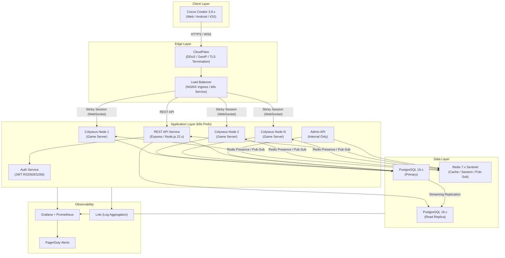

# ARCH — 系統架構文件

<!-- SDLC Architecture Document — Layer 3：Architecture Design -->

---

## Document Control

| 欄位 | 內容 |
|------|------|
| **DOC-ID** | ARCH-SAM-GONG-GAME-20260422 |
| **專案名稱** | 三公遊戲（Sam Gong 3-Card Poker）即時多人線上平台 |
| **文件版本** | v1.0 |
| **狀態** | DRAFT（STEP-09 自動生成，依 EDD v1.4-draft） |
| **作者** | Evans Tseng（由 STEP-09 自動生成） |
| **日期** | 2026-04-22 |
| **來源 EDD** | EDD-SAM-GONG-GAME-20260422 v1.4-draft |

---

## Change Log

| 版本 | 日期 | 作者 | 變更摘要 |
|------|------|------|---------|
| v1.0 | 2026-04-22 | STEP-09 | 初稿；依 EDD v1.4-draft 生成；涵蓋系統架構、組件設計、部署拓樸、安全架構、可觀測性、TDR |
| v1.1 | 2026-04-22 | STEP-10 Round 1 | 修復 7 個 findings：F1 readiness probe 說明補齊（Room state init）；F2 Redis Key Pattern 補充 active_device（多裝置登入偵測）；F3 staging 環境描述補充 Beta 測試；F4 監控表補充 rake_exceeds_theoretical_max 指標；F5 CCU 告警說明強調非 HPA 觸發；F6 Alertmanager 規則補充路由說明（critical→PagerDuty/warning→Slack 5min 匯聚）；F7 Colyseus Monitor 矛盾說明修正（Production 預設禁用）；F8 settled phase 補充 rescue_chips 觸發機制及結算步驟描述精確化 |

---

## 1. Architecture Overview

三公遊戲採用 **Server-Authoritative** 架構，所有遊戲邏輯（洗牌、發牌、比牌、結算）完全由 Server 執行，Client（Cocos Creator 3.8.x）為「啞渲染器（dumb renderer）」，僅負責狀態渲染與使用者互動收集。

### 1.1 核心架構原則

1. **Server-Authoritative**：遊戲邏輯 100% 在 Server，Client 不含任何遊戲邏輯（TypeScript project references CI 強制邊界）
2. **無狀態水平擴展**：REST API 無狀態；Colyseus 透過 `@colyseus/redis-presence` 跨節點協調
3. **事務一致性優先**：PostgreSQL ACID + SERIALIZABLE 隔離保證籌碼守恆（誤差容忍 = 0）
4. **多層防禦**：CloudFlare DDoS → NGINX Ingress Rate Limit → Redis Token Bucket → Colyseus 訊息驗證
5. **高可用設計**：Redis Sentinel 3 節點 + PostgreSQL Primary/Replica，SLA ≥ 99.5%（NFR-03）

### 1.2 高層次架構圖（Mermaid）



---

## 2. System Components

### 2.1 Component Overview Table

| 元件名稱 | 技術 | 角色 | 可擴展性策略 |
|---------|------|------|------------|
| Colyseus Game Server | Colyseus 0.15.x / Node.js 22.x / TypeScript 5.4.x | WebSocket 連線管理、Room 生命週期、遊戲狀態同步 | k8s HPA 水平擴展；`@colyseus/redis-presence` 跨節點協調；Sticky Session |
| REST API Service | Express.js / Node.js 22.x / TypeScript 5.4.x | 非即時操作：帳號、排行榜、每日任務、籌碼領取、個資刪除 | k8s HPA 無狀態水平擴展 |
| Auth Service | JWT RS256/ES256 / Node.js | Token 簽發、驗證、Refresh Token Rotation；帳號封鎖後 60s 失效 | 無狀態；可隨 REST API 部署或獨立 Pod |
| PostgreSQL 16.x Primary | PostgreSQL | 主要持久化：users、chip_transactions、game_sessions、kyc_records | Streaming Replication；pgBouncer Transaction Mode 連線池 |
| PostgreSQL 16.x Read Replica | PostgreSQL | 讀取分流：排行榜、玩家資料、交易記錄查詢 | 獨立 pgBouncer 實例（replica-pgbouncer:5432） |
| Redis 7.x Sentinel | Redis Sentinel 模式（3 節點） | Session Cache、Rate Limit 計數器、Leaderboard Sorted Set、Matchmaking Queue、Colyseus Room Presence | Sentinel 自動 Failover；3 節點（1 master + 2 replicas，quorum=2） |
| NGINX Ingress | k8s NGINX Ingress Controller | 負載均衡、TLS Termination、Sticky Session（WebSocket）、Rate Limit 第一層 | k8s Ingress 擴展 |
| CloudFlare | CDN / DDoS 防護 | TLS、GeoIP 偵測（REQ-016 EU GDPR）、DDoS 緩解 | CloudFlare 彈性擴展 |
| Admin API | Internal Node.js Service | SRE 操作工具：查詢帳號狀態、封號、籌碼審計；僅限內網 VPN | 單一 Pod（非關鍵路徑） |
| Grafana + Prometheus | Monitoring Stack | CCU、延遲 P95/P99、錯誤率、籌碼異常監控 | Prometheus 抓取所有 Pod metrics |
| Loki | Log Aggregation | 結構化日誌（JSON）彙整，支援 Grafana Dashboard | Loki 水平擴展 |

### 2.2 Colyseus Game Server

**角色**：核心遊戲邏輯執行環境，管理 SamGongRoom 生命週期。

**關鍵模組（server-only TypeScript package）：**

```
server/src/game/
├── DeckManager.ts          — 洗牌（Fisher-Yates + crypto.randomInt）、發牌
├── HandEvaluator.ts        — 點數計算（mod 10）、D8 比牌（花色/點數排名）
├── SettlementEngine.ts     — 三步驟結算、Rake 計算、莊家破產（D13 先到先得）
├── AntiAddictionManager.ts — 防沉迷計時器（成人 2h 提醒 / 未成年 2h 硬停）
├── BankerRotation.ts       — 輪莊邏輯（順時鐘、跳過破產莊家）
└── TutorialScriptEngine.ts — 教學固定劇本（R1/R2/R3）
```

**單節點容量**：~500 CCU（~83 個 6 人房間）

**Health Server**：Port 3001 獨立 HTTP server（獨立 Express HTTP server，與 Colyseus WS port 2567 分離）
- `GET /health` → liveness probe（HTTP 200）
- `GET /ready` → readiness probe（DB + Redis 連線確認且 Room state 初始化完成後回應 200）

### 2.3 REST API Service

**基礎 URL**：`https://api.samgong.io/api/v1`

**功能分組**：
- Auth：登入、登出、Refresh Token Rotation、OTP 年齡驗證
- Player：個人資料、設定、每日籌碼、救援籌碼、廣告獎勵
- Game：排行榜、每日任務、私人房間管理
- KYC：KYC 提交/查詢
- Admin：封號、稽核日誌（VPN Only）
- System：健康檢查、設定讀取

**OpenAPI Spec**：`express-openapi-validator` 自動生成，發佈於 `/api/docs`

### 2.4 PostgreSQL Primary + Read Replica

**連線池架構（pgBouncer）：**

| 節點 | 模式 | max_client_conn | pool_size | 說明 |
|------|------|:--------------:|:---------:|------|
| Primary | Transaction | 200 | 50 | 寫入操作（結算事務 SERIALIZABLE） |
| Read Replica | Transaction | 100 | 30 | 讀取分流（排行榜、玩家資料） |

**Failover**：PostgreSQL Streaming Replication；Failover ≤ 5 分鐘（NFR-18）

### 2.5 Redis 7.x Sentinel

**Sentinel 架構**：3 節點（1 master + 2 replicas），quorum=2，自動 Failover

**用途映射**：

| 用途 | Key Pattern | TTL |
|------|------------|-----|
| JWT 黑名單（封號） | `block:{player_id}` | 60s |
| Session Cache | `session:{player_id}` | 1h |
| Rate Limit（認證） | `rl:auth:{ip}` | 60s |
| Rate Limit（敏感） | `rl:sensitive:{player_id}` | 60s |
| Rate Limit（一般） | `rl:general:{player_id}` | 60s |
| Rate Limit（IP 全局）| `rl:global:{ip}` | 60s |
| Leaderboard ZSET | `lb:weekly:{week_key}` | 8 天 |
| Matchmaking Queue | `mm:queue:{tier_name}` | 90s |
| Colyseus Presence | `colyseus:presence:{room_id}` | 由 Colyseus 管理 |
| Anti-Addiction | `aa:session:{player_id}` | 距次日 UTC+8 00:00 |
| OTP 每日計數 | `otp:daily:{phone_hash}:{date}` | 24h |
| 多裝置登入偵測 | `active_device:{player_id}` | Refresh Token 有效期（≤ 7d）|

---

## 3. Deployment Architecture

### 3.1 Kubernetes 叢集規劃

```yaml
# 命名空間
namespaces:
  - sam-gong-prod       # 生產環境
  - sam-gong-staging    # 測試環境
  - sam-gong-dev        # 開發環境（docker-compose 為主）
  - monitoring          # Prometheus + Grafana + Loki
```

### 3.2 Colyseus Server Deployment

```yaml
kind: Deployment
metadata:
  name: colyseus-server
  namespace: sam-gong-prod
spec:
  replicas: 2  # 初始；HPA 自動擴展
  template:
    spec:
      containers:
        - name: colyseus-server
          image: sam-gong/colyseus-server:${VERSION}
          ports:
            - containerPort: 2567  # WebSocket
            - containerPort: 3001  # Health HTTP
          resources:
            requests:
              cpu: "500m"
              memory: "512Mi"
            limits:
              cpu: "2000m"
              memory: "2Gi"
          lifecycle:
            preStop:
              exec:
                command: ["/bin/sh", "-c", "sleep 30"]  # 優雅排空連線 30s
          livenessProbe:
            httpGet:
              path: /health
              port: 3001
            initialDelaySeconds: 15
            periodSeconds: 20
            failureThreshold: 3
          readinessProbe:
            httpGet:
              path: /ready
              port: 3001
            initialDelaySeconds: 5
            periodSeconds: 10
            successThreshold: 1
            failureThreshold: 3
```

### 3.3 HPA 設定

| 服務 | minReplicas | maxReplicas | 觸發條件 | scaleDown 策略 |
|------|:-----------:|:-----------:|---------|----------------|
| colyseus-server | 2 | 10 | CPU > 70%（持續 5min） | stabilizationWindow 300s；每分鐘最多縮 25% |
| rest-api | 2 | 8 | CPU > 70% | 預設 |

**CCU 監控**（> 450 單節點）為輔助告警（PagerDuty Warning），不觸發 HPA 自動擴容。

### 3.4 StatefulSet 服務

| 服務 | Replicas | Storage | 備注 |
|------|:--------:|---------|------|
| postgres-primary | 1 | 50Gi SSD PVC | 主要寫入節點 |
| postgres-replica | 1 | 50Gi SSD PVC | Streaming Replication 接收 |
| redis-sentinel | 3 | 10Gi SSD PVC | 各節點同時運行 redis-server + sentinel |

### 3.5 環境策略

| 環境 | 用途 | 資源規格 | 部署觸發 |
|------|------|---------|---------|
| dev | 功能開發、本地測試 | 單節點（docker-compose） | push to feature/* |
| staging | Integration Test、性能測試、Beta 測試 | 2 Colyseus + 1 PG + 1 Redis | push to develop |
| prod | 正式服務 | 完整 k8s 叢集（HPA） | push to main（需 Review + Approval） |

### 3.6 CI/CD Pipeline（GitHub Actions）

```
on: push to [main, develop]

jobs:
  test:
    - npm audit（高危阻擋）
    - ESLint（含 client bundle 關鍵字掃描）
    - TypeScript project references 邊界驗證
    - Unit Tests（HandEvaluator ≥ 200 vectors）
    - Integration Tests（Settlement 並發）
    - Semgrep SAST（rules/sql-injection.yaml）
    - Coverage ≥ 80%（lines/branches/functions）

  build:
    - Docker multi-stage build
    - Trivy 容器漏洞掃描
    - OSS License 檢查
    - Push to ECR（tagged with commit SHA）

  deploy-staging → deploy-prod（需手動 Approval）
```

**Auto-rollback 觸發（Blue-Green 切換後 5min）：**
- `api_error_rate_5xx > 1%`（持續 2min）
- `websocket_latency_p95 > 200ms`（持續 2min）
- health check 失敗率 > 30%

---

## 4. Network Architecture

### 4.1 域名與 Ingress 路由

| 域名 | 路徑 | 目標服務 | 協議 |
|------|------|---------|------|
| `api.samgong.io` | `/api` | rest-api:3000 | HTTPS |
| `ws.samgong.io` | `/` | colyseus-server:2567 | WSS（WebSocket Upgrade） |
| `api.samgong.io` | `/api/docs` | rest-api:3000（OpenAPI UI） | HTTPS |

### 4.2 NGINX Ingress 關鍵 Annotations

```yaml
annotations:
  nginx.ingress.kubernetes.io/proxy-read-timeout: "3600"   # WebSocket 長連線
  nginx.ingress.kubernetes.io/affinity: "cookie"            # Sticky Session
  nginx.ingress.kubernetes.io/proxy-body-size: "10m"        # 上傳限制
  nginx.ingress.kubernetes.io/ssl-redirect: "true"          # 強制 HTTPS
```

### 4.3 TLS / Security Layer

| 層次 | 元件 | 功能 |
|------|------|------|
| L1 | CloudFlare | DDoS 緩解、GeoIP、TLS Termination（TLS 1.2+） |
| L2 | NGINX Ingress | SSL 終止（或 CloudFlare Proxy Mode）、Sticky Session |
| L3 | Application | JWT RS256/ES256 驗證；WebSocket over wss:// |

**CORS 設定（Production）：**
```
Access-Control-Allow-Origin: https://samgong.io, https://app.samgong.io
Access-Control-Allow-Methods: GET, POST, PUT, DELETE, OPTIONS
Access-Control-Allow-Headers: Authorization, Content-Type, X-Request-ID
Access-Control-Max-Age: 86400
Access-Control-Allow-Credentials: false
禁止: Access-Control-Allow-Origin: *
```

### 4.4 WebSocket Sticky Session

Colyseus WebSocket 連線必須保持 Sticky Session（同一玩家的 WS 連線固定路由至同一 Pod）：

```
NGINX: upstream hash $cookie_colyseus_session
k8s Service: sessionAffinity: ClientIP（備選）
```

跨節點重連由 `@colyseus/redis-presence` 協調，玩家可在不同 Pod 間重連。

---

## 5. Data Flow

### 5.1 玩家登入流程

```
1. Client → CloudFlare → NGINX → POST /api/v1/auth/login
2. Auth Service → PostgreSQL：查詢帳號 + 驗證密碼/OAuth
3. Auth Service → Redis：DEL session:{player_id}（清除舊 Session Cache）
4. Auth Service → PostgreSQL：儲存 Refresh Token hash
5. Auth Service → Client：{ access_token（RS256, TTL=1h）, refresh_token（TTL=7d） }
```

### 5.2 玩家進房（配對）流程

```
1. Client → GET /api/v1/config（獲取廳別設定、WS Server 域名）
2. Client → Colyseus WS：client.joinOrCreate('sam_gong', { tier, token })
3. Colyseus onJoin：
   a. 驗證 JWT RS256 簽名 + TTL
   b. 檢查 Redis block:{player_id}（封號黑名單）
   c. 驗證 chip_balance ≥ tier entry_chips
   d. 分配 seat_index；初始化 PlayerState
   e. 年齡路由（is_minor → trackUnderageDaily / trackAdultSession）
   f. 推送 my_session_info（私人訊息）
4. Colyseus → Redis：更新 Room Presence
5. State Sync → Client：SamGongState diff（Colyseus 自動）
```

### 5.3 遊戲局流程（dealing → settled）

```
dealing phase（≤ 1s）：
1. DeckManager.buildDeck() + Fisher-Yates shuffle（crypto.randomInt）
2. 發 3 張牌給每位玩家
3. 各玩家手牌透過私人訊息推送（client.send('myHand', cards)）
4. State: phase → 'banker-bet'

banker-bet phase（30s）：
1. 莊家收到 banker_bet 訊息
2. Server 驗證：phase, is_banker, min_bet ≤ amount ≤ max_bet, amount ≤ chip_balance
3. 扣除 escrow（banker chip_balance -= bet）
4. 廣播 banker_bet_amount；State: phase → 'player-bet'

player-bet phase（每人 30s）：
1. 閒家逐一收到 call / fold 訊息
2. call：chip_balance -= banker_bet_amount（escrow）
3. fold：bet_amount = 0，無扣款
4. 所有閒家行動完成或超時 → phase → 'showdown'

showdown phase（≤ 1s）：
1. HandEvaluator 計算每位玩家點數（sum mod 10，三公=3張10點牌）
2. D8 比牌（花色排名 > 點數排名）
3. SettlementEngine.settle()：多步驟原子性結算（比牌 → 莊家破產檢查 D13 → 籌碼分配 → Rake 計算 → 籌碼守恆驗證）

settled phase（≈ 5s）：
1. 廣播 showdown_reveal（所有未 Fold 手牌）
2. 廣播 SettlementState（結算結果）
3. PostgreSQL（SERIALIZABLE 事務）：
   a. UPDATE users SET chip_balance 每位玩家
   b. INSERT INTO chip_transactions（每人一筆 + rake 一筆，rake user_id = SYSTEM_ACCOUNT_UUID）
   c. INSERT INTO game_sessions（結算快照）
   d. Redis ZADD lb:weekly（排行榜更新，跳過 show_in_leaderboard=false 玩家）
4. AntiAddictionManager.persistTimers()
5. 偵測 chip_balance < 500 → 觸發救援籌碼檢查（rescue_chips 私人訊息或 rescue_not_available 通知）
6. 5s 後 resetForNextRound()，若 players.size ≥ 2 → 'dealing'；否則 → 'waiting'
```

### 5.4 結算引擎籌碼守恆驗證

```
結算完成後必須滿足：
  sum(all participants' net_chips) + rake_amount === 0

若驗證失敗：
  1. 回滾 PostgreSQL 事務
  2. 記錄 CRITICAL 日誌（含完整 settlement_payload）
  3. PagerDuty 立即告警（SRE ≤ 15min 響應）
```

---

## 6. Scalability Strategy

### 6.1 Colyseus 水平擴展

| 指標 | 值 |
|------|---|
| 單節點容量 | ~500 CCU（~83 個 6 人房間） |
| GA 目標 | 500 CCU（2 Colyseus Pods） |
| +6M 目標 | 2,000 CCU（4+ Colyseus Pods，HPA 自動擴展） |

**跨節點協調機制：**
- `@colyseus/redis-presence`：Room Presence 資訊存於 Redis，所有 Pod 共享
- Matchmaking Queue：Redis List/Sorted Set 集中管理（`mm:queue:{tier_name}`）
- Pub/Sub：封號踢出廣播（`sam-gong:admin:force_disconnect`）

### 6.2 PostgreSQL 讀寫分離

```
Write（INSERT/UPDATE）→ Primary
Read（SELECT）→ Read Replica：
  - GET /leaderboard（排行榜查詢）
  - GET /player/me（玩家資料）
  - GET /player/chip-transactions（交易記錄）

Primary pgBouncer：Transaction Mode；max_client_conn=200，pool_size=50
Replica pgBouncer：Transaction Mode；max_client_conn=100，pool_size=30
Circuit Breaker：連線池耗盡後 30s 返回 HTTP 503 + Retry-After:30
```

**pgBouncer Transaction Mode + SERIALIZABLE 相容性**：結算事務使用 BEGIN/COMMIT 顯式事務包裹，Transaction Mode 可正常運作。禁止使用 advisory lock 或 PREPARE TRANSACTION。

### 6.3 Redis Leaderboard 策略

```
排行榜維護：
- PUT /api/v1/player/settings（show_in_leaderboard=false）→ ZREM lb:weekly:{week_key} {player_id}
- 結算後（game_win/game_lose）→ ZADD lb:weekly:{week_key} score player_id
- GET /api/v1/leaderboard → ZREVRANGE + 應用層過濾 show_in_leaderboard
- 每週歸檔排程 → leaderboard_weekly 表聚合
```

### 6.4 Load Estimation

| 指標 | GA（500 CCU）| +6M（2,000 CCU）|
|------|:-----------:|:--------------:|
| 同時遊戲房間數 | 83 | 333 |
| 每秒 WS 訊息（Peak）| ~330 msg/s | ~1,320 msg/s |
| PostgreSQL 結算 TPS | ~3 TPS | ~12 TPS |
| Redis 操作（Peak） | ~1,000 ops/s | ~4,000 ops/s |

---

## 7. High Availability & Disaster Recovery

### 7.1 Redis Sentinel HA

```
架構：3 節點（1 master + 2 replicas，各節點同時運行 redis-server + sentinel）
Quorum：2（多數決自動選主）
Failover 時間：< 30s（Sentinel 檢測 + 選主）
RPO：≤ 15 分鐘（RDB 快照）
Failback：舊 master 恢復後自動降為 replica
Anti-Addiction 計時：Write-Through 策略，Redis 重啟後從 PostgreSQL 回填
```

### 7.2 PostgreSQL Failover

```
架構：Primary + Read Replica（Streaming Replication）
Failover 觸發：Primary 不可達（pg_primary_unavailable == 1）
Failover 時間：≤ 5 分鐘（NFR-18）
工具：Patroni 或手動提升（kubectl exec pgctl promote）
季度演練：每季度執行 1 次 Failover 演練（NFR-18）
DB Lag 監控：postgres_replication_lag_bytes > 10MB → PagerDuty Warning
```

### 7.3 Blue-Green Deployment

```
部署流程：
1. 部署新版本至 Green 環境（保持 Blue 繼續服務）
2. Smoke Test + Health Check 通過
3. NGINX Ingress 流量 Blue → Green（30s 內完成）
4. 監控 5 分鐘（Error Rate、Latency P95）
5. 無異常：下線 Blue；有問題：Rollback ≤ 30s
```

### 7.4 SLA 設計

```
各組件獨立可用性：≥ 99.9%
串聯可用性（4 組件）：0.999^4 ≈ 99.6%
整體服務 SLA 目標：≥ 99.5%/月（NFR-03）
Error Budget：每月 3.65 小時

Error Budget 消耗策略：
- 50%：凍結非緊急上線，集中修復
- 100%：立即凍結所有發布直到下月
```

---

## 8. Security Architecture

### 8.1 JWT RS256 認證

```
算法：RS256（RSA 2048-bit）或 ES256（ECDSA P-256）
禁止：HS256（對稱密鑰洩漏風險）

Token 規格：
  Access Token TTL：≤ 1 小時（NFR-17）
  Refresh Token TTL：≤ 7 天，一次性使用（Rotation）

封號後失效機制（60s Block-to-Expire）：
  1. UPDATE DB is_banned = true
  2. SETEX block:{player_id} 60 "1"（Redis TTL 60s）
  3. DEL session:{player_id}（強制 Session Cache 失效）
  4. PUBLISH sam-gong:admin:force_disconnect "{player_id}"
  5. Colyseus Pod 收到後 client.leave(4001)

私鑰管理：AWS KMS（或等效 HSM）
金鑰輪換：每 90 天（NFR-05）
```

### 8.2 四層速率限制（NFR-19）

| 層次 | 適用範圍 | Key | 限制 |
|------|---------|-----|------|
| L1 | 認證端點（/auth/*） | `rl:auth:{ip}` | 30 次/min/IP |
| L2 | 高敏感端點（daily-chip, tasks） | `rl:sensitive:{player_id}` | 5 次/min/user |
| L3 | 一般 API | `rl:general:{player_id}` | 60 次/min/user |
| L4 | IP 全局 | `rl:global:{ip}` | 300 次/min/IP |

超限回應：HTTP 429 + `Retry-After` header

**Redis Lua Script（原子性計數）**：
```lua
local current = redis.call('INCR', KEYS[1])
if current == 1 then redis.call('EXPIRE', KEYS[1], ARGV[2]) end
if current > tonumber(ARGV[1]) then return redis.call('TTL', KEYS[1]) else return 0 end
```

### 8.3 SQL Injection 防護

所有 PostgreSQL 查詢使用 node-postgres parameterized queries（`$1`, `$2` 佔位符），嚴禁字串拼接 SQL。CI pipeline Semgrep SAST 規則包含 SQL injection 偵測（`rules/sql-injection.yaml`）。

### 8.4 反作弊架構

| 層次 | 機制 |
|------|------|
| 架構隔離 | TypeScript project references；CI Client bundle 關鍵字掃描 |
| 靜態分析 | ESLint 自定義規則；禁止關鍵字清單（20+ 詞）；0 命中才 Pass |
| Server 驗證 | 每條 WS 訊息：phase 驗證、金額驗證、身份驗證 |
| 行為偵測 | 滾動 10 局累計 ≥ 5 次標記 → 臨時封號 24h |
| 封包測試 | Alpha 前 Wireshark 抓包（REQ-002 AC-5）；6 人房間 0 次手牌洩漏 |

### 8.5 Admin API 安全

```
存取限制：內網 VPN Only
認證：獨立 Admin JWT（claims: role=admin，不同私鑰）
稽核：所有 Admin 操作記入 audit_log
高風險操作：封號（POST /api/v1/admin/player/:id/ban）
TOTP 2FA：OQ-3（待決策，預計 2026-05-15）
Colyseus Monitor：Production 預設禁用（`NODE_ENV=production` 時不掛載 monitor middleware）；Staging 可用；若 Production 環境需啟用，須使用 k8s NetworkPolicy 限制僅 VPN/Bastion IP 可存取，並加入 BasicAuth
```

---

## 9. Monitoring & Alerting

### 9.1 Grafana Dashboard 指標

| 指標類別 | 指標名稱 | 告警閾值 | 動作 |
|---------|---------|---------|------|
| CCU | `colyseus_room_clients_total` | > 450（單節點）| PagerDuty Warning（輔助告警，HPA 仍僅由 CPU > 70% 觸發）|
| 延遲 | `websocket_latency_p95_ms` | > 100ms | PagerDuty Warning |
| 延遲 | `websocket_latency_p99_ms` | > 500ms | PagerDuty Critical |
| 錯誤率 | `api_error_rate_5xx` | > 1% | PagerDuty |
| 房間數 | `colyseus_rooms_total` | > 350（單節點）| PagerDuty Warning |
| 籌碼守恆 | `chip_conservation_violation` | > 0 | PagerDuty Critical（SRE ≤ 15min）|
| 負值餘額 | `chip_balance_negative_count` | > 0 | PagerDuty Critical |
| 異常抽水 | `rake_exceeds_theoretical_max` | > 0 | PagerDuty Critical |
| DB Lag | `postgres_replication_lag_bytes` | > 10MB | PagerDuty Warning |
| Redis 記憶體 | `redis_memory_usage_percent` | > 80% | PagerDuty Warning |
| SLA | `service_availability_percent` | < 99.9% | PagerDuty Critical |

### 9.2 Alertmanager 規則

| 規則名稱 | 表達式 | 持續時間 | Severity | 路由 |
|---------|--------|---------|---------|------|
| `ChipConservationViolation` | `chip_conservation_violation > 0` | 0m（立即）| critical | PagerDuty（立即）|
| `HighErrorRate` | `api_error_rate_5xx > 0.01` | 2m | warning | Slack #alerts-sam-gong（5 分鐘匯聚）|
| `ColyseusLatencyHigh` | `ws_latency_p95 > 100` | 3m | warning | Slack #alerts-sam-gong（5 分鐘匯聚）|
| `DatabaseFailover` | `pg_primary_unavailable == 1` | 0m（立即）| critical | PagerDuty（立即）|
| `AntiAddictionMiss` | `anti_addiction_session_write_failure > 0` | 0m（立即）| critical | PagerDuty（立即）|

告警路由：`critical` → PagerDuty（立即）；`warning` → Slack #alerts-sam-gong（5 分鐘匯聚）。

**On-call Escalation**：L1（SRE On-call）→ 5min → L2（Tech Lead）→ 10min → L3（CTO）

### 9.3 Structured Logging

```json
{
  "timestamp": "2026-04-22T10:00:00.000Z",
  "level": "info|warn|error|critical",
  "service": "colyseus-server|rest-api|auth-service",
  "room_id": "...",
  "player_id": "...",
  "game_session_id": "...",
  "event": "settlement_completed|rate_limit_triggered|...",
  "payload": {},
  "trace_id": "..."
}
```

**CRITICAL 事件（立即 PagerDuty）**：
- 籌碼守恆失敗（sum(net_chips) ≠ -rake）
- 單玩家 chip_balance 出現負值
- 結算事務回滾
- DB 連線池耗盡

### 9.4 可觀測性工具鏈

| 工具 | 用途 |
|------|------|
| Prometheus + prometheus-client | 指標收集（Node.js） |
| OpenTelemetry | 分散式追蹤（trace_id 跨服務） |
| Pino | 結構化 JSON 日誌 |
| Loki | 日誌收集 + Grafana 查詢 |
| Grafana | Dashboard + 告警 |
| PagerDuty | On-call 通知（SLA ≤ 15min 響應） |

---

## 10. Technology Decision Records (TDR)

### TDR-001：Server-Authoritative 架構

- **狀態**：Locked
- **決策**：所有遊戲邏輯在 Server TypeScript 執行；Client 為純渲染器
- **理由**：防止 Client 端作弊；台灣法規要求可稽核的遊戲公平性；籌碼守恆誤差容忍 = 0
- **影響**：Server 計算負載增加；Client 體驗依賴 NFR-02（P95 ≤ 100ms）

### TDR-002：Colyseus 0.15.x

- **狀態**：Locked（版本鎖定 `~0.15.0`，minor 禁止跳版）
- **決策**：採用 Colyseus 0.15.x
- **理由**：官方 Cocos Creator SDK；內建 Room 生命週期、Matchmaking、Presence；Redis Presence 跨節點擴展；社群活躍
- **影響**：受 0.15.x API 約束；升級至 0.16+ 需完整回歸測試

### TDR-003：JWT RS256/ES256

- **狀態**：Locked（NFR-17）
- **決策**：RS256 非對稱簽名；禁止 HS256
- **理由**：水平擴展不依賴 Session 共享；非對稱簽名防止私鑰洩漏風險
- **影響**：需要 AWS KMS 管理私鑰；Refresh Token Rotation 需 PostgreSQL 儲存；封號後 60s 失效窗口為已知接受限制

### TDR-004：PostgreSQL 16.x（而非 MongoDB）

- **狀態**：Locked
- **決策**：PostgreSQL ACID + SERIALIZABLE 隔離
- **理由**：籌碼守恆必須 ACID；財務記錄 7 年保留；複雜結算 JOIN 查詢；Streaming Replication 支援 NFR-18
- **影響**：Schema 遷移需要 DDL 管理（node-pg-migrate 或 Flyway）

### TDR-005：Redis 7.x Sentinel（而非 Cluster）

- **狀態**：Locked（v1.0 規模可接受 Sentinel 模式）
- **決策**：Sentinel 模式（3 節點，非 Cluster）
- **理由**：v1.0 規模（2,000 CCU）Sentinel 足夠；Cluster 增加運維複雜度
- **影響**：Redis 是關鍵單點；Failover 期間 Matchmaking Queue 從 PostgreSQL 重建

### TDR-006：chip_transactions 月分區（pg_partman）

- **狀態**：Locked（財務記錄 7 年保留 + REQ-019）
- **決策**：`PARTITION BY RANGE (created_at)` 按月分區；pg_partman 自動管理
- **理由**：7 年記錄量龐大（需 partitioning）；DROP 舊分區比 DELETE 更高效
- **影響**：查詢時需包含 `created_at` 範圍以利用分區裁剪

---

*文件版本 v1.0 — 依 EDD v1.4-draft 生成 — 2026-04-22*
