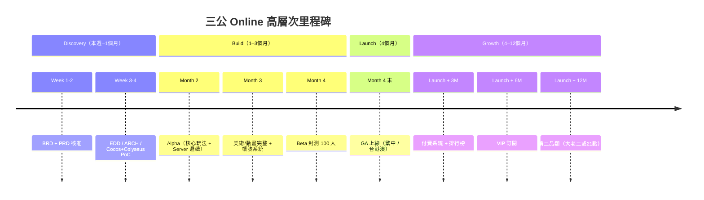

# BRD — 三公遊戲（Sam Gong 3-Card Poker）即時多人線上平台

<!-- SDLC Requirements Engineering — Layer 1：Business Requirements -->

---

## Document Control

| 欄位 | 內容 |
|------|------|
| **DOC-ID** | BRD-SAM-GONG-GAME-20260421 |
| **專案名稱** | 三公遊戲（Sam Gong 3-Card Poker）即時多人線上平台 |
| **文件版本** | v0.1-draft |
| **狀態** | DRAFT |
| **作者** | Evans Tseng（由 /devsop-idea 自動生成） |
| **日期** | 2026-04-21 |
| **建立方式** | /devsop-idea 自動生成，請執行 /devsop-brd-review 審查 |

---

## Change Log

| 版本 | 日期 | 作者 | 變更摘要 |
|------|------|------|---------|
| v0.1-draft | 2026-04-21 | /devsop-idea | 初稿，由 AI 自動生成 |

---

## §0 背景研究（/devsop-idea 自動蒐集）

### 競品/參考資源

- **colyseus-2d-multiplayer-card-game-templates**（GitHub，sominator）：Unity / Phaser / Defold / Godot 四種 2D 卡牌模板，使用 Colyseus 作為 Server backend。可直接參考其 room state 設計。
- **Colyseus 官方 UNO 範例**：Turn-based 卡牌遊戲官方範例，完整展示 Schema-based state sync 與 Command Pattern。
- **Riffle**（GitHub，Ronan-H）：Angular + Colyseus 的 Web 卡牌遊戲，展示 Web client 與 Colyseus 整合實務。
- **Colyseus Cocos Creator SDK**（官方）：Colyseus 已提供 Cocos Creator 官方 SDK，使用方式與 JavaScript/TypeScript SDK 一致。
- **既有三公遊戲**：多為單機版、地區性娛樂 App（如各類「三公」關鍵字 Google Play App），但普遍欠缺專業 UI/UX、無 Server-authoritative 架構保證公平性。

### 技術建議

- **Client**：Cocos Creator 3.x（Web + 手機跨平台），TypeScript 開發。
- **Server**：Colyseus 0.15+（Node.js/TypeScript），`@colyseus/schema` 做狀態同步。
- **架構原則**：Server-authoritative — Schema 類別僅含欄位定義，遊戲邏輯獨立於 State，使用 Command Pattern 管理回合流程。
- **持久層**：PostgreSQL（玩家資料、牌局紀錄）+ Redis（matchmaking queue、session cache）。
- **部署**：Colyseus Cloud 或自建 k8s；Client 走 WebSocket + TLS。

### 已知風險

- **R-Legal（台灣法規）**：三公屬「博弈」性質遊戲。依我國《刑法》第 266 條與最高法院判例，凡以「財物或可兌換財物之物」為賭注即違法。本產品必須採「虛擬籌碼、不可兌換、不可購買」模式以規避賭博罪嫌疑。《詐欺犯罪危害防制條例》亦將線上遊戲經營者納入規管，須遵守身份驗證、可疑交易通報等義務。
- **R-Cheat**：卡牌遊戲最大技術風險為作弊（偷看牌、結果預測、外掛注入）。Server-authoritative 是基本功，但 Client 端仍可能有自動下注/讀秒外掛，須配合行為分析與伺服器速率限制。
- **R-Scale**：Colyseus 單實例約支援 1,000-3,000 同時連線；若目標規模 >10,000，需提早規劃 horizontal scaling（@colyseus/redis-presence + matchmaker driver）。
- **R-UX**：賭場風格 + 像素美術在跨平台（手機小螢幕）易顯擁擠；UI 需響應式設計並考慮大螢幕／小螢幕不同 layout。

---

## 1. Executive Summary（PR-FAQ 風格）

### 1.1 假設新聞稿

> **標題：** Sayyo Games 推出「三公 Online」，打造華人市場首款 Server-Authoritative 公平三公即時多人遊戲
>
> **第一段（What & Who）：** Sayyo Games 今日推出「三公 Online」，一款主打「絕對公平」的即時多人三公遊戲。玩家可跨手機與網頁加入房間，與真人對戰，享受復古像素風賭場氛圍，所有牌局計算由伺服器權威判定，杜絕任何作弊可能。
>
> **第二段（Why Now）：** 市面既有三公遊戲多為單機 App 或 P2P 連線，玩家普遍擔心對手作弊或伺服器灌水；同時現代華人玩家在手機與網頁間頻繁切換，需要跨平台即時對戰體驗。Colyseus 等 authoritative 框架成熟、Cocos Creator 跨平台能力完整，讓我們得以用小團隊在 4 個月內交付專業級多人遊戲。
>
> **第三段（How It Works）：** （1）進入大廳，選擇籌碼級距或快速配對；（2）房間開局後，伺服器洗牌、發牌，Client 僅呈現動畫；（3）玩家下注、比牌、結算，所有計算在 Server 完成，玩家獲得無作弊疑慮的公平體驗。
>
> **用戶引言：** 「以前玩三公 App 最怕對手作弊或 App 發牌不公平。這款每一張牌、每一次比較都由伺服器決定，終於能安心玩了。」— 張先生，45 歲，華人社群三公老玩家。

### 1.2 FAQ（預先回答最困難的問題）

| 問題 | 回答 |
|------|------|
| 為什麼現在做這個？ | Cocos Creator 3.x 與 Colyseus 0.15 成熟，跨平台多人遊戲開發成本降至小團隊可承擔；華人手機遊戲市場對「公平性」呼聲高，Server-authoritative 成為差異化關鍵。 |
| 為什麼是我們來做？ | 團隊具備 Cocos/Unity 跨平台開發經驗與 Node.js 後端能力，能快速交付 Server-authoritative 架構，並理解華人市場 UI 美學偏好。 |
| 最大的風險是什麼？ | **法規風險**：三公屬博弈遊戲，必須以「虛擬娛樂籌碼、不可兌換、不可購買」模式運營，避免觸犯刑法賭博罪。**作弊風險**：即便 Server-authoritative 也須防 Client 外掛自動化。 |
| 如果失敗，原因最可能是？ | （1）法規定位失誤導致被迫下架；（2）美術質感不達玩家預期；（3）房間同時在線數 < 200 使對戰配對失敗率過高，體驗崩壞。 |
| 競品為什麼沒做？ | 既有三公 App 多由小團隊或個人獨立開發者產出，缺乏 authoritative server 架構能力；大型博弈廠商則聚焦德撲、21 點等國際化品類。 |

---

## 2. Problem Statement

### 2.1 現狀描述

華人玩家（特別是 35-55 歲年齡層）對三公這類傳統撲克遊戲有強烈懷舊需求，目前主要透過：
- 線下實體聚會（受空間與時間限制）；
- 既有手機三公 App（Google Play / App Store 可搜到數十款，但多為單機對 AI、或 P2P 連線，美術簡陋、公平性不透明）；
- 通訊軟體自建群組配合線下籌碼（門檻高、易生糾紛）。

共通痛點：缺乏「可信、即時、跨平台、美術精緻」的三公多人遊戲。

### 2.2 根本原因（5 Whys）

```
問題現象：玩家擔心既有三公 App 作弊或發牌不公平
  Why 1：既有 App 多為 Client-side 計算或 P2P 架構
    Why 2：開發團隊多為小團隊/個人，缺乏後端 authoritative server 能力
      Why 3：authoritative server 需要專業後端框架與持續維運成本
        Why 4：過去幾年 authoritative 多人框架（如 Colyseus）成熟度不足且學習曲線陡
          Why 5（根本原因）：缺乏「易用、成熟、支援 Cocos Creator」的 authoritative server 框架生態，使小團隊無法負擔此類產品開發
```

### 2.3 問題規模（量化）

| 指標 | 數據 | 來源 |
|------|------|------|
| 受影響用戶數（華人三公潛在玩家） | 估計全球華人市場 500 萬+ 潛在玩家 | AI 推斷，待市場調查驗證 |
| 每人每週娛樂時間（可轉移至本產品） | 3-5 小時 | AI 推斷 |
| 市場規模（TAM） | 華人休閒博弈類 App 年收入約 USD 8 億 | AI 推斷，待研究 |
| 可服務市場（SAM） | 繁體中文市場（台灣 / 港澳 / 海外華人）約 USD 1 億 | AI 推斷 |
| 可獲取市場（SOM） | SAM 的 5-10%，約 USD 500 萬-1,000 萬/年 | AI 推斷 |

---

## 3. Business Objectives

### 3.1 商業目標

| # | 目標 | 量化指標 | 時間框架 | 優先度 |
|---|------|---------|---------|--------|
| O1 | 推出 Server-authoritative 公平三公多人遊戲 | GA 上線、Server 權威計算率 100%、Client 無任何結果計算邏輯 | 4 個月 | Must |
| O2 | 建立穩定同時在線（CCU）基礎 | Peak CCU ≥ 500，DAU ≥ 2,000 | 6 個月 | Must |
| O3 | 建立變現模式（虛擬籌碼商店） | ARPPU ≥ USD 10，付費率 ≥ 3% | 9 個月 | Should |
| O4 | 擴展遊戲品類（大老二、21 點） | 至少 1 個新品類上線 | 12 個月 | Could |

### 3.2 與公司策略的對應

| 公司策略目標 | 本專案如何貢獻 |
|------------|--------------|
| 建立華人市場休閒遊戲 IP 組合 | 以三公為首發，驗證 authoritative 多人框架，複製至其他撲克類遊戲 |
| 累積多人遊戲後端能力 | Colyseus + Cocos 技術棧可複用於未來所有多人專案 |
| 合規營運模式探索 | 以虛擬籌碼娛樂為底線，建立可跨境複製的合規 playbook |

### 3.3 投資報酬分析（3 情境）

| 項目 | 悲觀（-30%）| 基準 | 樂觀（+30%）|
|------|-----------|------|-----------|
| 開發成本（4 個月） | NT$ 300 萬 | NT$ 450 萬 | NT$ 600 萬 |
| 12 個月維運成本 | NT$ 180 萬 | NT$ 240 萬 | NT$ 300 萬 |
| 預期年收益（Launch+12M） | NT$ 200 萬 | NT$ 800 萬 | NT$ 2,000 萬 |
| Payback Period | >24 個月 | 14 個月 | 6 個月 |

### 3.4 Requirements Traceability Matrix（需求追溯矩陣，RTM）

| 業務目標 | 成功指標 | 功能需求（PRD REQ-ID）| 測試覆蓋 | 狀態 |
|---------|---------|---------------------|---------|------|
| O1：Server authoritative 公平性 | Server 權威計算 100%、0 P0 Cheat Bug | REQ-001 Shuffle, REQ-002 Deal, REQ-003 Compare, REQ-004 Settlement | BDD S-001~S-004 | 🔲 待 PRD 填入 |
| O2：CCU 規模 | Peak CCU ≥ 500 | REQ-010 Matchmaking, REQ-011 Room | Load Test L-001 | 🔲 待 PRD 填入 |
| O3：變現 | ARPPU ≥ USD 10 | REQ-020 Shop, REQ-021 VIP | BDD S-020 | 🔲 待 PRD 填入 |
| O4：品類擴展 | 1 個新品類 | （未來 PRD v2） | N/A | 🔲 待 v2 |

### 3.5 Benefits Realization Plan（效益實現計畫）

| 效益 | 基準值（Pre-launch）| 目標值 | 測量時間點 | 測量方式 | 負責人 | 若未達標的行動 |
|------|:------------------:|:-----:|----------|---------|--------|--------------|
| 公平性信任度（NPS "認為遊戲公平" 題目） | N/A | ≥ 70 | Launch + 3M | In-app Survey | PM | 公開 Server 洗牌日誌 / 第三方審計 |
| CCU 規模 | 0 | Peak CCU ≥ 500 | Launch + 6M | Colyseus Monitor | Eng Lead | 啟動廣告採買 / Hotfix Sprint |
| 付費率 | 0% | ≥ 3% | Launch + 9M | Revenue Dashboard | PM | A/B 測試定價 / 用戶訪談 |
| 留存率（7 日）| N/A | ≥ 35% | Launch + 6M | Analytics | Product | 新手引導優化 / 每日任務改版 |

---

## 4. Stakeholders & Users

### 4.1 Target Users

| 用戶群 | 規模估算 | 核心需求 | 目前解法 | 痛點 |
|--------|---------|---------|---------|------|
| 華人 35-55 歲休閒博弈玩家（主群） | 300 萬+ | 懷舊三公、社交對戰 | 既有 App / 線下 | 擔心作弊、App 美術差、無法跨平台 |
| 華人 25-34 歲上班族（次群） | 150 萬+ | 碎片時間娛樂、輕社交 | 手遊 / 社群 | 三公門檻高、缺乏新手引導 |
| 海外華人社群 | 50 萬+ | 文化連結、同鄉社交 | 線下聚會 | 實體距離限制 |

### 4.2 Not Our Users

- ❌ 未成年玩家（18 歲以下）：法規與道德考量，必須有年齡驗證閘門。
- ❌ 尋求真實金錢賭博的玩家：本產品僅提供虛擬籌碼，不可兌換實體金錢。
- ❌ 國際市場非華人用戶：首發聚焦繁體中文市場，英文/其他語系為未來擴展。

### 4.3 Stakeholder Map

| 角色 | 職責 | 主要關切 |
|------|------|---------|
| Product Lead | 需求定義、玩法規則、UX | 玩家留存、公平性、變現 |
| Engineering Lead | Client + Server 技術實作 | 同時在線數、延遲、安全 |
| Art/UI Designer | 像素風 / 賭場美術、動畫 | 視覺品質、跨螢幕適配 |
| Game Designer | 牌局規則、賠率、籌碼曲線 | 遊戲性、平衡、留存 |
| Legal | 法規合規（賭博、個資） | 合規邊界、免責聲明 |
| Marketing / Ops | 獲客、社群運營 | CAC、LTV、活動 |
| End User | 玩家 | 好玩、公平、流暢 |

### 4.4 RACI Matrix

| 活動 | Product Lead | Engineering Lead | Art Designer | Game Designer | Legal |
|------|:-----------:|:---------------:|:-----------:|:-------------:|:-----:|
| 需求定義 | A/R | C | C | C | I |
| 技術架構（Cocos + Colyseus） | C | A/R | I | I | I |
| 三公規則與賠率設計 | A | C | I | R | C |
| UI/UX（像素/賭場風格） | A | C | R | C | I |
| 法規審查（博弈定位） | A | I | I | I | R |
| 上線決策 | A/R | C | C | C | C |

---

## 5. Proposed Solution

### 5.1 解法概述

打造一款 **Server-authoritative 即時多人三公遊戲**，Client 端以 **Cocos Creator** 負責 UI/動畫/輸入，Server 端以 **Colyseus（Node.js/TypeScript）** 負責所有遊戲邏輯。美術採用 **復古像素風 + 賭場氛圍** 雙軌嘗試，最終由玩家測試結果擇一或融合。

### 5.2 核心價值主張

**Customer Jobs（用戶要完成的任務）：**
- Functional：與真人玩一場公平、流暢、跨平台的三公牌局。
- Emotional：懷舊感、賭場刺激感、贏牌成就感、社交歸屬感。
- Social：與朋友組桌、炫耀手氣、累積牌技聲望。

**Pain Relievers：**
- Server-authoritative 架構，杜絕 Client 作弊疑慮。
- 跨平台（Web + Android + iOS）即時連線，不分裝置自由加入。
- 專業像素/賭場美術，提升質感。

**Gain Creators：**
- 虛擬籌碼等級（青銅→鑽石）累積，產生進度感。
- 每日任務、排行榜、好友組桌，強化社交。
- 新手引導教學，降低老玩家以外的進入門檻。

### 5.3 解法邊界與 MoSCoW

**In Scope（本版本 MVP）：**

| 功能 | MoSCoW | 對應目標 |
|------|--------|---------|
| 三公核心玩法（發牌/比牌/結算）| Must Have | O1 |
| Server-authoritative 洗牌與判牌 | Must Have | O1 |
| Room State + 玩家狀態同步 | Must Have | O1 |
| 下注系統（虛擬籌碼）| Must Have | O1 |
| 大廳 + Matchmaking（快速配對 / 指定房間）| Must Have | O2 |
| 像素風 / 賭場風 UI（至少一套完整）| Must Have | O1 |
| 發牌/翻牌/結算動畫 | Must Have | O1 |
| 帳號系統（遊客登入 + Google/Facebook 綁定）| Must Have | O2 |
| 虛擬籌碼每日贈送（留存機制）| Should Have | O2 |
| 好友系統 | Should Have | O2 |
| 虛擬籌碼商店（IAP）| Should Have | O3 |
| 排行榜 | Could Have | O2 |
| 聊天室（房間內）| Could Have | O2 |
| 多語系（英、簡中）| Won't Have（v1.0） | — |
| 其他撲克品類 | Won't Have（v1.0） | O4 |

**Out of Scope（明確排除）：**
- ❌ 真實金錢下注（法規風險）。
- ❌ 虛擬籌碼兌換現實財物（法規風險）。
- ❌ 未成年用戶（必須有年齡閘）。
- ❌ 跨區伺服器（首版僅亞太區）。

---

## 6. Market & Competitive Analysis

### 6.1 競品分析

| 競品 | 優勢 | 劣勢 | 我們的差異化 |
|------|------|------|------------|
| 既有「三公」手機 App（多家）| 已有用戶基礎 | 美術簡陋、Client-side 計算、疑似作弊 | Server-authoritative、專業美術 |
| 德州撲克類 App（Zynga Poker, PokerStars）| 成熟變現模式、國際化 | 非三公、華人親切度低 | 聚焦華人本土遊戲 |
| 大老二 / 麻將 App（多家）| 華人市場熟悉 | 品類不同 | 差異化品類定位 |
| 線下實體牌局 | 社交深度、氛圍 | 空間時間受限 | 隨時隨地、跨平台 |

### 6.2 市場定位（Positioning Map）

```
          專業級 / 授權級
               │
               │  ○ PokerStars（國際撲克）
               │         ● 三公 Online（目標定位：華人專業三公）
               │
非華人導向 ────┼──────── 華人導向
               │
  ○ Zynga Poker│  ○ 既有三公 App（華人但業餘）
               │
          業餘 / 單機級
```

**定位聲明：** 三公 Online 定位為「華人市場首款 Server-Authoritative 專業級三公多人遊戲」，差異化在於公平性保證 + 華人原生玩法 + 專業跨平台美術。

---

## 7. Success Metrics

### 7.1 北極星指標

**North Star：** 週活躍對戰場次數（Weekly Active Rounds）— 代表真正在玩、回來玩、並且享受對戰的使用者總量。

### 7.2 業務指標階層

```
Outcome：華人三公玩家信任並長期使用「三公 Online」作為主要娛樂平台
  Output：CCU ≥ 500 / DAU ≥ 2,000 / 7日留存 ≥ 35%
  Output：公平性 NPS ≥ 70 / 投訴作弊率 ≤ 0.1%
    Input：每週上線場次 / 籌碼商店轉換率 / 新手引導完成率
```

### 7.3 投資門檻（Go / No-Go 條件）

| 里程碑 | 評估時間 | Go 條件 | No-Go 條件 | 決策者 |
|--------|---------|---------|-----------|--------|
| Alpha 驗收 | Launch - 2M | 核心玩法完整、P0 Bug = 0、Server 洗牌通過亂度測試 | P0 Bug ≥ 1 或核心玩法未完成 | PM + Eng Lead |
| Beta 驗收（封測 100 人） | Launch - 1M | 7日留存 ≥ 25%、主觀公平性評分 ≥ 4/5 | 留存 < 15% 或公平性 < 3.5/5 | PM + Exec Sponsor |
| GA 決策 | Launch | 負載測試 500 CCU 通過、合規審查完成 | 壓測失敗或法務未簽核 | Exec Sponsor + Legal |
| Post-Launch 3M | Launch + 3M | DAU ≥ 1,000、付費率 ≥ 1% | DAU < 300 或持續負成長 | Exec Sponsor |

---

## 8. Constraints & Assumptions

### 8.1 業務限制

| 限制 | 類型 | 影響 |
|------|------|------|
| 技術：必須 Cocos Creator Client + Colyseus Server | 硬性 | 技術選型鎖定 |
| 法規：禁止真實金錢下注 / 籌碼兌換 | 硬性 | 商業模式鎖定 |
| 規模：MVP 支援 500 Peak CCU | 軟性 | 影響架構設計 |
| 預算：NT$ 450 萬開發成本上限 | 軟性 | 功能優先序取捨 |
| 時程：4 個月 MVP 上線 | 硬性 | Scope 必須縮至 MoSCoW Must-Have |

### 8.2 關鍵假設（需驗證）

| # | 假設 | 驗證方式 | 若假設錯誤的影響 |
|---|------|---------|----------------|
| A1 | 華人玩家對 Server-authoritative 公平性有明顯付費/留存偏好 | 封測 A/B 訊息測試 | 差異化失效，需重新定位 |
| A2 | Cocos Creator 3.x + Colyseus SDK 整合無阻塞性技術問題 | 2 週 PoC | 延期或換技術棧 |
| A3 | Colyseus 單節點可承載 500 CCU + < 100ms latency | 壓測 | 需提早 horizontal scaling |
| A4 | 以虛擬籌碼/不可兌換模式在台灣法律風險可控 | 法務意見書 | 商業模式重建 |
| A5 | 付費率 3% 在華人休閒博弈類為合理目標 | Benchmark 同類 App | 財務預測調整 |

---

## 9. Regulatory & Compliance Requirements

### 9.1 適用法規

| 法規 / 標準 | 適用範圍 | 關鍵義務 | 負責人 |
|-----------|---------|---------|--------|
| 中華民國《刑法》第 266 條（賭博罪） | 遊戲機制 | 不得以財物或可兌換財物之物為賭注 | Legal |
| 《詐欺犯罪危害防制條例》| 線上遊戲經營者 | 實名制/KYC、可疑交易通報、配合檢警調查 | Legal + Ops |
| 《個人資料保護法》| 玩家資料處理 | 告知、同意、最小蒐集、刪除權 | Legal + Eng |
| 《兒童及少年福利與權益保障法》| 未成年保護 | 年齡驗證、防沉迷機制 | Product |
| Google Play / App Store 政策 | 上架審查 | 博弈類 App 嚴格審查；必須強調「無實質獎勵」 | Product |
| GDPR（若海外華人用戶涉入歐盟） | 歐盟個資 | DSR、DPO、DPIA | Legal |

### 9.2 合規影響評估

| 合規要求 | 對產品設計的影響 | 對架構的影響 | 合規成本估算 |
|---------|--------------|------------|------------|
| 刑法賭博罪 | 虛擬籌碼不可購買？還是僅限「非賭金」式購買？（需法務釐清） | 籌碼系統需可靈活切換模式 | 法律顧問費 NT$ 30 萬 |
| 詐欺防制條例 | 需實名制 / KYC 機制 | 帳號模組需串接身份驗證 | 3rd-party KYC 服務 NT$ 20 萬/年 |
| 個資法 | 隱私權政策、刪除機制 | 資料刪除 API | 開發內建 |
| 未成年保護 | 年齡閘、防沉迷 | 帳號系統設定 | 開發內建 |
| 平台審查 | 強調「娛樂性質、無實質獎勵」 | 文案與行銷材料 | 開發內建 |

### 9.3 合規時程里程碑

| 里程碑 | 預計日期 | 負責人 | 狀態 |
|--------|---------|--------|------|
| 法律意見書（博弈定位釐清） | 2026-05-15 | Legal | PENDING |
| DPIA（資料保護影響評估） | 2026-06-01 | Legal | PENDING |
| 架構安全審查 | EDD 完成後 | Eng + Legal | PENDING |
| 法規合規測試 | Beta 前 | QA + Legal | PENDING |
| 平台審查材料備齊 | GA - 2 週 | Product + Legal | PENDING |

### 9.5 Data Governance & Lifecycle Management

| 資料類型 | 資料擁有人 | 保留期限 | 存取控制政策 | 刪除程序 | 稽核需求 |
|---------|----------|---------|------------|---------|---------|
| 玩家個人資料（暱稱、Email、手機）| DPO | 帳號關閉後 90 日 | 最小權限、加密儲存 | 用戶請求 7 日內完成 | 個資法 |
| 牌局紀錄（含洗牌種子、手牌）| Eng Lead | 180 日（熱）/ 2 年（冷）| 僅反作弊與客服可查 | 自動歸檔後銷毀 | 反作弊審計 |
| 支付紀錄 | Finance | 7 年（稅務）| Finance + 稽核 | 法定期限後銷毀 | 財政部規範 |
| 系統日誌 | SRE | 90 日 | SRE 內部 | 自動銷毀 | ISO27001 |
| KYC 資料（若適用） | DPO + Legal | 法定期限 | 加密、稽核 | 法律要求下銷毀 | 反詐法 |

**資料主權：** 首版資料存於台灣 / 日本 AWS 區域；若歐盟用戶介入，啟動 GDPR SCCs。

### 9.6 Intellectual Property & Licensing

| 項目 | 內容 |
|------|------|
| **專利風景分析** | 三公為公共領域傳統遊戲，無核心專利；需確認美術資產無侵權 |
| **OSS License 合規** | Cocos Creator（專有但免費商用條款）、Colyseus（MIT）、相關套件 license 清單需整理 |
| **第三方資產授權** | 像素素材 / 音效若購買自資產商店，需保存授權證明；AI 生成資產須審定 |
| **客戶資料所有權** | 玩家個資屬玩家所有；牌局資料屬公司所有（反作弊用途） |
| **IP 歸屬** | 遊戲軟體 IP 歸 Sayyo Games，貢獻者 CLA：待評估 |

---

## 10. Risk Assessment

| 風險 | 類型 | 可能性 | 影響 | 緩解策略 | 負責人 |
|------|------|--------|------|---------|--------|
| R1 台灣賭博罪定位風險 | 法規 | MEDIUM | HIGH | 虛擬籌碼不可兌換 + 法律意見書 + 平台審查材料 | Legal |
| R2 Client 外掛/自動化 | 安全 | HIGH | MEDIUM | Server 速率限制 + 行為異常偵測 + 帳號封鎖機制 | Eng Lead |
| R3 Colyseus 單節點承載不足 | 技術 | MEDIUM | HIGH | 提早壓測 + Redis Presence 水平擴展 PoC | Eng Lead |
| R4 美術質感不達預期 | 產品 | MEDIUM | MEDIUM | 像素 vs 賭場雙軌 A/B + 封測反饋 | Art + PM |
| R5 Cocos + Colyseus SDK 整合 Bug | 技術 | LOW | HIGH | 2 週 PoC + 官方 UNO 範例對照 | Eng |
| R6 平台（Google/Apple）審查駁回 | 商業 | MEDIUM | HIGH | 文案避開博弈字眼、強調娛樂、第三方審查預審 | Product |
| R7 未成年玩家規避年齡閘 | 法規 | MEDIUM | MEDIUM | KYC + 行為偵測 + 防沉迷提醒 | Product |
| R8 競品快速跟進 | 市場 | MEDIUM | MEDIUM | 建立 Server-authoritative 技術護城河 + 快速迭代 | Product |
| R9 籌碼經濟通膨/崩盤 | 遊戲設計 | MEDIUM | HIGH | 籌碼發放/回收曲線模擬 + 每日上限 | Game Designer |
| R10 KYC / 個資外洩 | 安全 | LOW | HIGH | 加密儲存 + 第三方 KYC 服務 + 定期滲透測試 | Eng + Legal |

---

## 11. Business Model

### 11.1 商業模式畫布

| 要素 | 內容 |
|------|------|
| **收入來源** | 虛擬籌碼 IAP（基本款）+ VIP 訂閱（進階）+ 廣告（免費用戶觀看取得籌碼） |
| **定價策略** | Freemium：免費遊玩、每日贈送基礎籌碼；付費購買虛擬籌碼包 / VIP |
| **成本結構** | 開發（一次性）、Colyseus Cloud 或 k8s 維運、客服、行銷 CAC、支付手續費 |
| **核心資源** | Colyseus + Cocos 技術棧、華人美術風格、反作弊演算法、KYC 整合 |
| **關鍵活動** | 遊戲迭代、社群運營、反作弊運維、合規監控 |
| **關鍵夥伴** | Colyseus（雲服務或開源支援）、Cocos（引擎）、KYC 服務商、支付通道（IAP / 信用卡） |
| **獲客管道** | Facebook 華人社團、YouTube 華人頻道贊助、Google UAC、App Store / Play Store 搜尋優化 |
| **Unit Economics** | CAC 估 USD 5-10 ｜ LTV 估 USD 30-60 ｜ LTV:CAC ≥ 3 目標 |

### 11.2 商業模式假設驗證

| 假設 | 驗證方式 | 驗證期限 | 若錯誤的影響 |
|------|---------|---------|------------|
| 付費率 3% 可達成 | 封測 + Launch + 3M 追蹤 | Launch + 3M | 改用訂閱制或廣告主導 |
| 華人市場 CAC < USD 10 | FB/Google 小額測試 | BRD 後 2 週 | 行銷預算重估 |
| VIP 訂閱付費意願 > 單次購買 | A/B 測試 | Launch + 6M | 只保留單次購買 |

---

## 12. High-Level Roadmap



---

## 13. Dependencies

| 依賴項 | 類型 | 負責方 | 若延誤的影響 |
|--------|------|--------|------------|
| Cocos Creator 3.x 穩定版 | 技術 | Cocos 官方 | 開發阻塞 |
| Colyseus 0.15+ 穩定版 | 技術 | Colyseus 官方 | 開發阻塞 |
| KYC 服務商（如 Jumio / 國內 HotAI）| 外部 | Vendor | 帳號系統延期 |
| 支付通道（Google Play IAP / App Store IAP）| 外部 | Platform | 變現延期 |
| 法律意見書 | 外部 | 律師事務所 | 上線延期 |
| 美術素材（像素風 + 賭場風雙軌）| 內部/外包 | Art Team | Beta 延期 |

### 13.1 Vendor & Third-Party Dependency Risk Assessment

| 供應商 / 服務 | 關鍵性 | 替代方案 | SLA 假設 | 若失敗的影響 | 退出計畫 |
|-------------|:------:|---------|---------|------------|---------|
| Colyseus（框架）| Tier 1 | Nakama / 自研 WebSocket | 開源社群支援 | 核心架構重寫 | 6 個月遷移 |
| Cocos Creator（引擎）| Tier 1 | Unity / Godot | 官方維護 | Client 重寫 | 12 個月遷移 |
| Colyseus Cloud（若採用） | Tier 2 | 自建 k8s | 99.5% | 降級至 IaaS | 2 週遷移 |
| KYC 服務商 | Tier 2 | 多家可選 | 99.5% | 帳號新增暫停 | 30 日替換 |
| IAP 平台（Google / Apple）| Tier 1 | — | 平台 SLA | 付費功能停擺 | 無（平台壟斷） |
| AWS / GCP | Tier 2 | 多雲 | 99.9% | 短期不可用 | 多 region 備援 |

---

## 14. Open Questions

| # | 問題 | 影響層級 | 負責人 | 截止日 | 狀態 |
|---|------|---------|--------|--------|------|
| Q1 | 虛擬籌碼是否可由玩家用現金購買？購買是否觸犯賭博罪？ | 策略 | Legal | 2026-05-15 | OPEN |
| Q2 | 三公的「公牌」規則（地區差異大）採用哪一種標準？ | 範圍 | Game Designer | 2026-05-01 | OPEN |
| Q3 | 是否需要實名 KYC？還是手機簡訊驗證即可？ | 法規 | Legal + Product | 2026-05-15 | OPEN |
| Q4 | 像素風與賭場風美術，最終採一套或雙主題？ | 產品 | Art + PM | Beta 前 | OPEN |
| Q5 | Colyseus Cloud 還是自建 k8s？成本/維運對比？ | 技術 | Eng Lead | EDD 前 | OPEN |
| Q6 | 是否支援觀戰模式？（影響 Schema 複雜度） | 範圍 | PM | PRD 前 | OPEN |

---

## 15. Decision Log

| # | 決策日期 | 議題 | 決策內容 | 決策依據 | 決策者 | 影響範圍 |
|---|---------|------|---------|---------|--------|---------|
| D1 | 2026-04-21 | BRD 初稿建立 | 以 /devsop-idea 自動生成 BRD | 加速 Discovery 階段 | AI + Evans | 全文件 |
| D2 | 2026-04-21 | 技術棧鎖定 | Cocos Creator（Client）+ Colyseus（Server） | 使用者草稿指定 | Evans | 全架構 |
| D3 | 2026-04-21 | 架構原則 | Server authoritative，Client 零結果計算 | 防作弊核心需求 | Evans | 全架構 |
| D4 | 2026-04-21 | 商業模式 | 虛擬籌碼不可兌換（娛樂性質） | 規避賭博罪 | AI + Legal 待確認 | 全產品 |

---

## 16. Glossary

| 術語 | 業務定義 |
|------|---------|
| 三公（Sam Gong） | 華人傳統撲克玩法：每人發 3 張牌，依點數總和 mod 10 比大小，10/20/30 為「三公」最大 |
| Server-authoritative | 伺服器權威架構，所有遊戲邏輯與狀態由伺服器決定，Client 僅呈現 |
| Colyseus | Node.js 多人遊戲框架，提供 Room / State / Schema / Matchmaker |
| Cocos Creator | 跨平台 2D/3D 遊戲引擎，支援 Web + iOS + Android + Windows |
| CCU | Concurrent Users，同時在線人數 |
| ARPPU | Average Revenue Per Paying User，每付費用戶平均收入 |
| Virtual Chip | 虛擬籌碼，遊戲內娛樂性貨幣，無法兌換現金或實體物品 |
| Matchmaking | 配對系統，依籌碼等級/牌技/等待時間將玩家配入房間 |

---

## 17. References

- 背景研究（/devsop-idea 自動蒐集）：見 §0
- 競品資訊：見 §6
- 使用者原始需求草稿：docs/IDEA.md §6 原文
- Colyseus 官方文件：https://docs.colyseus.io/
- Cocos Creator 官方文件：https://docs.cocos.com/creator/
- 台灣線上遊戲反詐義務：《詐欺犯罪危害防制條例》

---

## 18. BRD→PRD Handoff Checklist

### 18.1 Handoff 前置條件確認

| # | 確認項目 | 狀態 | 負責人 |
|---|---------|:----:|--------|
| H1 | BRD 已取得所有利害關係人核准（§20 Approval Sign-off） | 🔲 PENDING | PM |
| H2 | 北極星指標已確認並量化 | ✅ | PM |
| H3 | 用戶研究計畫已排程（封測 100 人） | 🔲 PENDING | PM |
| H4 | 技術可行性已初步評估（2 週 PoC） | 🔲 PENDING | Eng Lead |
| H5 | 成功指標（§7）已量化且有基準值 | ✅ | PM |
| H6 | 法務初步審查已完成（§9 合規需求確認） | 🔲 PENDING | Legal |
| H7 | PRD Owner 已指定 | 🔲 PENDING | PM |
| H8 | PRD Kick-off 會議已排程 | 🔲 PENDING | PM |

### 18.2 Handoff 時移交的文件

| 文件 / 產出物 | 存放位置 | 狀態 |
|-------------|---------|:----:|
| BRD.md（本文件）| docs/BRD.md | ✅ 已生成 |
| IDEA.md（原始需求）| docs/IDEA.md | ✅ 已生成 |
| 背景研究摘要（§0）| BRD §0 | ✅ 已含入 |
| 競品分析（§6）| BRD §6 | ✅ 已含入 |
| RTM 初稿（§3.4）| BRD §3.4 | 🔲 待 PM 填 REQ-ID |
| 技術限制清單（§8）| BRD §8 | ✅ 已含入 |
| 風險清單（§10）| BRD §10 | ✅ 已含入 |

### 18.3 PRD Owner 接受確認

| 欄位 | 內容 |
|------|------|
| **PRD Owner** | （待指定） |
| **確認聲明** | 本人已審閱上述 BRD 及所有移交文件，確認 PRD 撰寫所需資訊完整，同意正式啟動 PRD 撰寫工作。 |
| **預計 PRD 初稿完成日** | （待填） |

---

## 19. Organizational Change Management

### 19.1 變革影響評估

| 受影響部門 / 團隊 | 變革程度 | 主要影響 | 變革冠軍 |
|----------------|:-------:|---------|---------|
| 工程團隊 | 高 | 新技術棧（Colyseus + Cocos 3.x） | Eng Lead |
| 美術團隊 | 中 | 像素 / 賭場雙軌美術嘗試 | Art Director |
| 客服團隊（新建） | 高 | 首次建立遊戲客服流程 | Ops Lead |
| 合規 / 法務 | 中 | 博弈類產品首度上線 | Legal Lead |

### 19.2 訓練與溝通計畫

| 目標群體 | 訓練內容 | 溝通形式 | 時程 | 負責人 |
|---------|---------|---------|------|--------|
| 工程團隊 | Colyseus + Cocos 內部 Workshop | Tech Talk + Hands-on | Discovery Week 3 | Eng Lead |
| 客服團隊 | FAQ + 申訴流程 + 反作弊升級 | SOP + 影片教學 | Launch - 2 週 | Ops Lead |
| 高階 | 合規邊界與應對預案 | 簡報 | BRD 審查時 | Legal |
| 玩家 | 新手引導、遊戲規則、公平性說明 | In-app + YouTube | Launch | Product |

### 19.3 抗拒緩解策略

| 可能抗拒 | 原因 | 緩解策略 | 早期預警 |
|---------|------|---------|---------|
| 團隊對 Colyseus 陌生 | 學習曲線 | 2 週 PoC + 官方 UNO 範例研讀 | Sprint velocity 下降 |
| 美術雙軌額外成本 | 資源加倍 | 先做像素（成本低），賭場風僅做關鍵畫面 | 美術 backlog 延宕 |
| 法務謹慎導致時程延後 | 博弈類模糊地帶 | 早期介入 + 外部法律意見書 | Legal 回覆 > 1 週 |

### 19.4 成功衡量（Internal Adoption）

| 指標 | 基準 | 目標（Launch + 3M）|
|------|------|:------------------:|
| 內部測試活躍度（Alpha Dogfooding） | 0 | ≥ 80% 團隊每週至少 1 局 |
| 客服 SLA（首回應時間） | N/A | ≤ 4 小時 |
| 反作弊誤判率 | N/A | ≤ 1% |

---

## 20. Approval Sign-off

| 角色 | 姓名 | 簽核日期 | 意見 |
|------|------|---------|------|
| Product Lead | （待填）| | |
| Engineering Lead | （待填）| | |
| Art Director | （待填）| | |
| Legal | （待填）| | |
| Executive Sponsor | （待填）| | |

---

*此 BRD 由 /devsop-idea 自動生成（v0.1-draft），請執行 /devsop-brd-review 進行正式審查與補齊缺漏。*
