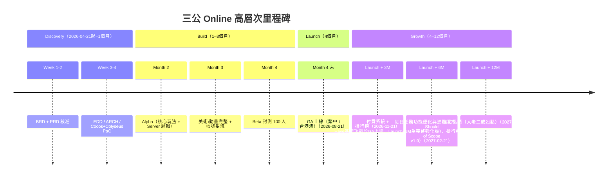

# BRD — 三公遊戲（Sam Gong 3-Card Poker）即時多人線上平台

<!-- SDLC Requirements Engineering — Layer 1：Business Requirements -->

---

## Document Control

| 欄位 | 內容 |
|------|------|
| **DOC-ID** | BRD-SAM-GONG-GAME-20260421 |
| **專案名稱** | 三公遊戲（Sam Gong 3-Card Poker）即時多人線上平台 |
| **文件版本** | v0.12-draft |
| **狀態** | DRAFT（STEP-01 Review Round 11 完成）|
| **作者** | Evans Tseng（由 /devsop-idea 自動生成） |
| **日期** | 2026-04-22 |
| **建立方式** | /devsop-idea 自動生成；由 /devsop-autodev STEP-01 Review Loop 自動修正（current: v0.12-draft） |

---

## Change Log

| 版本 | 日期 | 作者 | 變更摘要 |
|------|------|------|---------|
| v0.1-draft | 2026-04-21 | /devsop-idea | 初稿，由 AI 自動生成 |
| v0.2-draft | 2026-04-21 | /devsop-autodev STEP 01 BRD Fixer | 修復 16 個 Findings（F1-F16）：新增核心目標宣言、IAP條件語句、三公規則附錄、觀戰模式排除、P0業務驗收條件、NFR章節、年齡驗證方案、防沉迷機制、Colyseus版本鎖定、籌碼經濟約束、市場數據免責聲明、美術策略決策機制、好友系統說明、§9.4合規矩陣、聊天室合規備注、Glossary擴充 |
| v0.3-draft | 2026-04-22 | /devsop-autodev STEP 01 BRD Fixer Round 2 | 修復 28 個 Findings（F1-F28）：F1新增房間人數及配對超時AC、F2新增輪莊制定義、F3修正同點比牌規則消除歧義並新增D8、F4新增斷線行為定義、F5修正籌碼守恆AC、F6新增Q5截止日及§8.1備注、F7更新O1/O2/O3時間框架錨定基準日、F8定義付費率分母、F9新增北極星量化目標、F10新增PostgreSQL/Redis版本、F11新增OTP年齡驗證風險備注、F12補充白銀/鉑金下注上限、F13新增VIP系統功能描述、F14新增房間生命週期終止條件、F15補充Beta視覺滿意度AC細節、F16鎖定Cocos Creator小版本、F17移動法律問題至Open Questions、F18新增防沉迷計時器重置條件、F19補充洗牌亂度AC樣本數、F20新增每日任務至MoSCoW、F21新增廣告模式功能需求、F22新增Unit Economics免責聲明、F23新增Cookie同意需求、F24替換相對日期、F25修正Colyseus版本標注、F26定義滲透測試頻率、F27新增聊天室關鍵字清單負責人、F28定義誤判率分母 |
| v0.4-draft | 2026-04-22 | /devsop-autodev STEP-01 Review Round 3 | 24個問題修正（VIP Out of Scope清理、O4/Q4/§3.5絕對日期、TypeScript版本鎖定、Node.js 22.x升級、RTM/Roadmap/商業模式VIP一致性、RTO/RPO NFR、籌碼底池定義等） |
| v0.5-draft | 2026-04-22 | /devsop-autodev STEP-01 Review Round 4 | 17個問題修正（三公規則完整化、操作計時器、Sam Gong vs Sam Gong平手規則、§7.3/§9.3絕對日期、WebSocket NFR、MAU詞彙、房間級距表、新手引導納入MoSCoW等） |
| v0.6-draft | 2026-04-22 | /devsop-autodev STEP-01 Review Round 5 | 12個問題修正（F1：修正D8 Ace為最小與台灣慣例一致，消除§5.5與D8矛盾；F2：三表統一房間級距/等級門檻/Glossary，新增獨立系統說明注，初始籌碼更正為100,000；F3：RTM新增Tutorial O2行；F4：定義斷線期間計時器不暫停行為；F5：新增中途跌破入場門檻移出規則；F6：Glossary新增WAU/Rake/Banker詞條並依字母重排；F7：Step2新增莊家30秒計時器，D12記入決策；F8：Dependencies表新增Node.js 22.x與TypeScript 5.4.x；F9：Q6截止日改為絕對日期2026-04-21；F10：H9/H10/H11補章節參考；F11：Step4明確Fold手牌保持暗牌；F12：救濟機制補充觸發時機與廣播提示） |
| v0.7-draft | 2026-04-22 | /devsop-autodev STEP-01 Review Round 6 | 8個問題修正（結算雙向方向、三步→兩步統一、RTM格式修正、§7.3 Launch+6M里程碑、Tutorial server-authoritative、Cookie MoSCoW、同花色牌比較規則） |
| v0.8-draft | 2026-04-22 | /devsop-autodev STEP-01 Review Round 7 | 9個問題修正（莊家破產D13、賠率語義明確化、Step6三步驟結算、Q5待決標注、§7.3 Amber Zone + NPS、Cookie目標修正、混合結算順序） |
| v0.9-draft | 2026-04-22 | /devsop-autodev STEP-01 Review Round 8 | 9個問題修正（抽水底數統一、Step6c賠付來源明確、§3.1相對日期、每日贈籌重置時間、§9.4絕對日期、§3.3免責聲明、§12 Roadmap日期錨定、D13日期修正、廣告指標統一）|
| v0.10-draft | 2026-04-22 | /devsop-autodev STEP-01 Review Round 9 | 10個問題修正（結算邏輯五處統一、Glossary Rake修正、D7格式、防沉迷時區、§5.4底池說明、KYC 90日→絕對日期、初始籌碼說明補充）|
| v0.11-draft | 2026-04-22 | STEP-01 Review Round 10 | 4個問題修正（Step6a底池收齊邏輯、Step6b抽水基數明確化、Glossary補Fold/Call、500-999籌碼邊緣情況）|
| v0.12-draft | 2026-04-22 | STEP-01 Review Round 11 | 4個問題修正（RTM補齊REQ-013~016、混合結算Step3語義統一、每日任務獎勵範圍、DOC-ID日期）|

---

## §0 背景研究（/devsop-idea 自動蒐集）

### 競品/參考資源

- **colyseus-2d-multiplayer-card-game-templates**（GitHub，sominator）：Unity / Phaser / Defold / Godot 四種 2D 卡牌模板，使用 Colyseus 作為 Server backend。可直接參考其 room state 設計。
- **Colyseus 官方 UNO 範例**：Turn-based 卡牌遊戲官方範例，完整展示 Schema-based state sync 與 Command Pattern。
- **Riffle**（GitHub，Ronan-H）：Angular + Colyseus 的 Web 卡牌遊戲，展示 Web client 與 Colyseus 整合實務。
- **Colyseus Cocos Creator SDK**（官方）：Colyseus 已提供 Cocos Creator 官方 SDK，使用方式與 JavaScript/TypeScript SDK 一致。
- **既有三公遊戲**：多為單機版、地區性娛樂 App（如各類「三公」關鍵字 Google Play App），但普遍欠缺專業 UI/UX、無 Server-authoritative 架構保證公平性。

### 技術建議

- **Client**：Cocos Creator 3.x（Web + 手機跨平台），TypeScript 開發。
- **Server**：Colyseus 0.15.x（locked）（Node.js/TypeScript），`@colyseus/schema` 做狀態同步。
- **架構原則**：Server-authoritative — Schema 類別僅含欄位定義，遊戲邏輯獨立於 State，使用 Command Pattern 管理回合流程。
- **持久層**：PostgreSQL（玩家資料、牌局紀錄）+ Redis（matchmaking queue、session cache）。
- **部署**：Colyseus Cloud 或自建 k8s【Q5 待決，截止 2026-05-15，見§14】；Client 走 WebSocket + TLS。

### 已知風險

- **R-Legal（台灣法規）**：三公屬「博弈」性質遊戲。依我國《刑法》第 266 條與最高法院判例，凡以「財物或可兌換財物之物」為賭注即違法。本產品必須採「虛擬籌碼、不可兌換、不可購買」模式以規避賭博罪嫌疑。《詐欺犯罪危害防制條例》亦將線上遊戲經營者納入規管，須遵守身份驗證、可疑交易通報等義務。
- **R-Cheat**：卡牌遊戲最大技術風險為作弊（偷看牌、結果預測、外掛注入）。Server-authoritative 是基本功，但 Client 端仍可能有自動下注/讀秒外掛，須配合行為分析與伺服器速率限制。
- **R-Scale**：Colyseus 單實例約支援 1,000-3,000 同時連線；若目標規模 >10,000，需提早規劃 horizontal scaling（@colyseus/redis-presence + matchmaker driver）。
- **R-UX**：賭場風格 + 像素美術在跨平台（手機小螢幕）易顯擁擠；UI 需響應式設計並考慮大螢幕／小螢幕不同 layout。

---

## 1. Executive Summary（PR-FAQ 風格）

### 1.1 假設新聞稿

> **標題：** Sayyo Games 推出「三公 Online」，打造華人市場首款 Server-Authoritative 公平三公即時多人遊戲
>
> **第一段（What & Who）：** Sayyo Games 今日推出「三公 Online」，一款主打「絕對公平」的即時多人三公遊戲。玩家可跨手機與網頁加入房間，與真人對戰，享受復古像素風賭場氛圍，所有牌局計算由伺服器權威判定，杜絕任何作弊可能。
>
> **第二段（Why Now）：** 市面既有三公遊戲多為單機 App 或 P2P 連線，玩家普遍擔心對手作弊或伺服器灌水；同時現代華人玩家在手機與網頁間頻繁切換，需要跨平台即時對戰體驗。Colyseus 等 authoritative 框架成熟、Cocos Creator 跨平台能力完整，讓我們得以用小團隊在 4 個月內交付專業級多人遊戲。
>
> **第三段（How It Works）：** （1）進入大廳，選擇籌碼級距或快速配對；（2）房間開局後，伺服器洗牌、發牌，Client 僅呈現動畫；（3）玩家下注、比牌、結算，所有計算在 Server 完成，玩家獲得無作弊疑慮的公平體驗。
>
> **用戶引言：** 「以前玩三公 App 最怕對手作弊或 App 發牌不公平。這款每一張牌、每一次比較都由伺服器決定，終於能安心玩了。」— 張先生，45 歲，華人社群三公老玩家。

### 1.2 FAQ（預先回答最困難的問題）

| 問題 | 回答 |
|------|------|
| 為什麼現在做這個？ | Cocos Creator 3.x 與 Colyseus 0.15 成熟，跨平台多人遊戲開發成本降至小團隊可承擔；華人手機遊戲市場對「公平性」呼聲高，Server-authoritative 成為差異化關鍵。 |
| 為什麼是我們來做？ | 團隊具備 Cocos/Unity 跨平台開發經驗與 Node.js 後端能力，能快速交付 Server-authoritative 架構，並理解華人市場 UI 美學偏好。 |
| 最大的風險是什麼？ | **法規風險**：三公屬博弈遊戲，必須以「虛擬娛樂籌碼、不可兌換、不可購買」模式運營，避免觸犯刑法賭博罪。**作弊風險**：即便 Server-authoritative 也須防 Client 外掛自動化。 |
| 如果失敗，原因最可能是？ | （1）法規定位失誤導致被迫下架；（2）美術質感不達玩家預期；（3）房間同時在線數 < 200 使對戰配對失敗率過高，體驗崩壞。 |
| 競品為什麼沒做？ | 既有三公 App 多由小團隊或個人獨立開發者產出，缺乏 authoritative server 架構能力；大型博弈廠商則聚焦德撲、21 點等國際化品類。 |

---

## 2. Problem Statement

### 2.1 現狀描述

華人玩家（特別是 35-55 歲年齡層）對三公這類傳統撲克遊戲有強烈懷舊需求，目前主要透過：
- 線下實體聚會（受空間與時間限制）；
- 既有手機三公 App（Google Play / App Store 可搜到數十款，但多為單機對 AI、或 P2P 連線，美術簡陋、公平性不透明）；
- 通訊軟體自建群組配合線下籌碼（門檻高、易生糾紛）。

共通痛點：缺乏「可信、即時、跨平台、美術精緻」的三公多人遊戲。

### 2.2 根本原因（5 Whys）

```
問題現象：玩家擔心既有三公 App 作弊或發牌不公平
  Why 1：既有 App 多為 Client-side 計算或 P2P 架構
    Why 2：開發團隊多為小團隊/個人，缺乏後端 authoritative server 能力
      Why 3：authoritative server 需要專業後端框架與持續維運成本
        Why 4：過去幾年 authoritative 多人框架（如 Colyseus）成熟度不足且學習曲線陡
          Why 5（根本原因）：缺乏「易用、成熟、支援 Cocos Creator」的 authoritative server 框架生態，使小團隊無法負擔此類產品開發
```

### 2.3 問題規模（量化）

> **【F11 重要聲明】** 下表所有財務預測數字**均基於 AI 推斷假設**，非來自可信第三方市場研究報告。數字僅供內部方向性參考，**不得作為投資決策或財務承諾依據**。驗證期限：假設 A1（付費/留存偏好）需於封測前驗證；假設 A5（付費率 3%）需於 Launch+3M 前以同類 App Benchmark 驗證（見 §8.2）。

| 指標 | 數據 | 來源 | 驗證狀態 |
|------|------|------|---------|
| 受影響用戶數（華人三公潛在玩家） | 估計全球華人市場 500 萬+ 潛在玩家 | **AI 推斷假設**，待市場調查驗證 | ⚠️ 未驗證（A1 驗證期：封測前） |
| 每人每週娛樂時間（可轉移至本產品） | 3-5 小時 | **AI 推斷假設** | ⚠️ 未驗證 |
| 市場規模（TAM） | 華人休閒博弈類 App 年收入約 USD 8 億 | **AI 推斷假設**，待第三方報告（如 Newzoo / Sensor Tower）驗證 | ⚠️ 未驗證 |
| 可服務市場（SAM） | 繁體中文市場（台灣 / 港澳 / 海外華人）約 USD 1 億 | **AI 推斷假設** | ⚠️ 未驗證 |
| 可獲取市場（SOM） | SAM 的 5-10%，約 USD 500 萬-1,000 萬/年 | **AI 推斷假設**（A5 驗證期：Launch+3M） | ⚠️ 未驗證（A5 驗證期：Launch+3M） |

---

## 3. Business Objectives

### 3.1 商業目標

> **核心目標宣言（F1）：** 至 **2026-08-21**（BRD核准日2026-04-21起4個月）上線一款 Server-authoritative 即時多人三公遊戲，以「絕對公平」為差異化核心，於 Launch+6M 達成 Peak CCU ≥ 500、DAU ≥ 2,000、於 Launch+3M 達成公平性 NPS ≥ 70，並於 Launch+9M 建立合規虛擬籌碼變現模式，付費率 ≥ 3%，奠定 Sayyo Games 華人休閒遊戲平台基礎。

| # | 目標 | 量化指標 | 時間框架 | 優先度 |
|---|------|---------|---------|--------|
| O1 | 推出 Server-authoritative 公平三公多人遊戲 | GA 上線、Server 權威計算率 100%、Client 無任何結果計算邏輯 | **4個月（自BRD核准 2026-04-21起，GA目標 2026-08-21）**（F7） | Must |
| O2 | 建立穩定同時在線（CCU）基礎 | Peak CCU ≥ 500，DAU ≥ 2,000 | **GA後6個月（≤2027-02-21）**（F7） | Must |
| O3 | 建立變現模式（虛擬籌碼商店）**【F2條件】** 依據法律意見書結果：若IAP合法，啟用虛擬籌碼IAP；若存在法律疑慮，降級為廣告觀看換籌碼模式（Rewarded Ad），IAP停用。 | ARPPU ≥ USD 10，付費率 ≥ 3%（IAP模式）；廣告觀看完成率 ≥ 80%（由 AdMob SDK 確認）；DAU 廣告觀看人數 ≥ 20% DAU（廣告模式） | **GA後9個月（≤2027-05-21）**（F7）（法律意見書 2026-05-15 前決定） | Should |
| O4 | 擴展遊戲品類（大老二、21 點） | 至少 1 個新品類上線 | GA後12個月（≤2027-08-21） | Could |
| O合規 | 建立台灣法規合規基礎（防沉迷、年齡驗證、詐欺防制、KYC） | 防沉迷合規100% + 法規審查通過 | GA前 | Must |

### 3.2 與公司策略的對應

| 公司策略目標 | 本專案如何貢獻 |
|------------|--------------|
| 建立華人市場休閒遊戲 IP 組合 | 以三公為首發，驗證 authoritative 多人框架，複製至其他撲克類遊戲 |
| 累積多人遊戲後端能力 | Colyseus + Cocos 技術棧可複用於未來所有多人專案 |
| 合規營運模式探索 | 以虛擬籌碼娛樂為底線，建立可跨境複製的合規 playbook |

### 3.3 投資報酬分析（3 情境）

> **【免責聲明】** 本表收益預測均為 AI 推斷假設，非來自可信第三方市場研究（詳見§2.3 免責聲明）。不得作為投資決策或財務承諾依據。建議 Launch+3M 後以實際數據更新。

| 項目 | 悲觀（-30%）| 基準 | 樂觀（+30%）|
|------|-----------|------|-----------|
| 開發成本（4 個月） | NT$ 300 萬 | NT$ 450 萬 | NT$ 600 萬 |
| 12 個月維運成本 | NT$ 180 萬 | NT$ 240 萬 | NT$ 300 萬 |
| 預期年收益（Launch+12M） | NT$ 200 萬 | NT$ 800 萬 | NT$ 2,000 萬 |
| Payback Period | >24 個月 | 14 個月 | 6 個月 |

### 3.4 Requirements Traceability Matrix（需求追溯矩陣，RTM）

| 業務目標 | 成功指標 | 功能需求（PRD REQ-ID）| 測試覆蓋 | 狀態 |
|---------|---------|---------------------|---------|------|
| O1：Server authoritative 公平性 | Server 權威計算 100%、0 P0 Cheat Bug | REQ-001（洗牌）、REQ-002（發牌）、REQ-003（比牌）、REQ-004（結算）、REQ-013（UI動畫）、REQ-017（反作弊） | BDD S-001~S-004, S-013, S-017; IT-anticheat-001 | ✅ PRD已對應 |
| O2：CCU 規模 | Peak CCU ≥ 500 | REQ-010（配對）、REQ-011（房間狀態）、REQ-012（新手引導）、REQ-020a（每日贈送）、REQ-021（每日任務） | Load Test L-001; BDD S-010, S-011, S-012, S-020a, S-021 | ✅ PRD已對應 |
| O2 | 新手引導完成率 ≥ 60%（§5.3 MoSCoW） | REQ-012 Tutorial, REQ-010, REQ-011 | BDD Scenario S-012 | ✅ PRD已對應 |
| O2（留存/社群） | 週榜活躍玩家數≥500人（提案值，2026-05-15前確認） | REQ-006（排行榜） | UT/IT: IT-rank-001; BDD S-006（STEP-15回填） | 🔲 待填 |
| O2（社群參與） | 每房間每小時訊息≥1,000則（提案值，2026-05-15前確認） | REQ-007（聊天室） | UT/IT: IT-chat-001; BDD S-007（STEP-15回填） | 🔲 待填 |
| O3：變現 | ARPPU ≥ USD 10 | REQ-020b（Should Have，IAP/廣告） | BDD S-020b（REQ-020b IAP/廣告）| ✅ PRD已對應 |
| O4：品類擴展 | 1 個新品類 | （未來 PRD v2） | N/A | 🔲 待 v2 |
| O1 | 動畫流暢度：基準裝置≥30fps；旗艦機型目標≥60fps（§5.3 UI）| REQ-013 UI/Animation | BDD Scenario S-013 | ✅ PRD已對應 |
| O2 | 帳號系統：日留存率（§5.3 Account）| REQ-014 Account | BDD Scenario S-014 | ✅ PRD已對應 |
| O合規 | 防沉迷合規100%（§5.3 Anti-Addiction）| REQ-015 AntiAddiction | BDD Scenario S-015 | ✅ PRD已對應 |
| O合規 | Cookie同意橫幅覆蓋率（§9.0）| REQ-016 Cookie | BDD Scenario S-016 | ✅ PRD已對應 |
| O合規 | 個資刪除請求7工作日內完成100% | REQ-014（帳號驗證）、REQ-015（防沉迷）、REQ-016（Cookie）、REQ-019（個資刪除） | IT-delete-001; BDD S-014, S-015, S-016, S-019（STEP-15回填） | ✅ PRD已對應 |
| O1（Server-authoritative公平性）| 反作弊投訴率≤0.1% | REQ-017 反作弊與速率限制 | BDD S-017; IT-anticheat-001 | ✅ PRD已對應 |
| O2（留存）| 每日任務完成率≥40% DAU (Should) | REQ-021每日任務系統 | BDD S-021 | 🔲 待填 |
| O2（留存）| 每日贈送籌碼領取率≥60% DAU (Must) | REQ-020a每日贈送+救濟 | BDD S-020a; IT-chip-001 | 🔲 待填 |


### 3.5 Benefits Realization Plan（效益實現計畫）

| 效益 | 基準值（Pre-launch）| 目標值 | 測量時間點 | 測量方式 | 負責人 | 若未達標的行動 |
|------|:------------------:|:-----:|----------|---------|--------|--------------|
| 公平性信任度（NPS "認為遊戲公平" 題目） | N/A | ≥ 70 | Launch+3M（≤2026-11-21） | In-app Survey | PM | 公開 Server 洗牌日誌 / 第三方審計 |
| CCU 規模 | 0 | Peak CCU ≥ 500 | Launch+6M（≤2027-02-21） | Colyseus Monitor | Eng Lead | 啟動廣告採買 / Hotfix Sprint |
| 付費率 | 0% | ≥ 3% | Launch+9M（≤2027-05-21） | Revenue Dashboard | PM | A/B 測試定價 / 用戶訪談 |
| 留存率（7 日）| N/A | ≥ 35% | Launch+6M（≤2027-02-21） | Analytics | Product | 新手引導優化 / 每日任務改版 |

---

## 4. Stakeholders & Users

### 4.1 Target Users

| 用戶群 | 規模估算 | 核心需求 | 目前解法 | 痛點 |
|--------|---------|---------|---------|------|
| 華人 35-55 歲休閒博弈玩家（主群） | 300 萬+ | 懷舊三公、社交對戰 | 既有 App / 線下 | 擔心作弊、App 美術差、無法跨平台 |
| 華人 25-34 歲上班族（次群） | 150 萬+ | 碎片時間娛樂、輕社交 | 手遊 / 社群 | 三公門檻高、缺乏新手引導 |
| 海外華人社群 | 50 萬+ | 文化連結、同鄉社交 | 線下聚會 | 實體距離限制 |

### 4.2 Not Our Users

- ❌ 未成年玩家（18 歲以下）：法規與道德考量，必須有年齡驗證閘門。
- ❌ 尋求真實金錢賭博的玩家：本產品僅提供虛擬籌碼，不可兌換實體金錢。
- ❌ 國際市場非華人用戶：首發聚焦繁體中文市場，英文/其他語系為未來擴展。

### 4.3 Stakeholder Map

| 角色 | 職責 | 主要關切 |
|------|------|---------|
| Product Lead | 需求定義、玩法規則、UX | 玩家留存、公平性、變現 |
| Engineering Lead | Client + Server 技術實作 | 同時在線數、延遲、安全 |
| Art/UI Designer | 像素風 / 賭場美術、動畫 | 視覺品質、跨螢幕適配 |
| Game Designer | 牌局規則、賠率、籌碼曲線 | 遊戲性、平衡、留存 |
| Legal | 法規合規（賭博、個資） | 合規邊界、免責聲明 |
| Marketing / Ops | 獲客、社群運營 | CAC、LTV、活動 |
| End User | 玩家 | 好玩、公平、流暢 |

### 4.4 RACI Matrix

| 活動 | Product Lead | Engineering Lead | Art Designer | Game Designer | Legal |
|------|:-----------:|:---------------:|:-----------:|:-------------:|:-----:|
| 需求定義 | A/R | C | C | C | I |
| 技術架構（Cocos + Colyseus） | C | A/R | I | I | I |
| 三公規則與賠率設計 | A | C | I | R | C |
| UI/UX（像素/賭場風格） | A | C | R | C | I |
| 法規審查（博弈定位） | A | I | I | I | R |
| 上線決策 | A/R | C | C | C | C |

---

## 5. Proposed Solution

### 5.1 解法概述

打造一款 **Server-authoritative 即時多人三公遊戲**，Client 端以 **Cocos Creator** 負責 UI/動畫/輸入，Server 端以 **Colyseus（Node.js/TypeScript）** 負責所有遊戲邏輯。

**【F12 美術策略決策】** v1.0 **以像素風為主要美術風格**（完整實作所有畫面）。賭場風格**僅製作 2-3 個關鍵畫面的 A/B 測試素材**（大廳主頁、牌局主畫面、結算畫面），供 Beta 封測期間進行用戶測試。**2026-07-21（GA-1M）前**由 PM + Art Director 依測試數據做出最終美術方向決策，決策結果記入 Decision Log（D7）。若決策未能於 Beta 前完成，預設維持像素風為正式版風格。

### 5.2 核心價值主張

**Customer Jobs（用戶要完成的任務）：**
- Functional：與真人玩一場公平、流暢、跨平台的三公牌局。
- Emotional：懷舊感、賭場刺激感、贏牌成就感、社交歸屬感。
- Social：與朋友組桌、炫耀手氣、累積牌技聲望。

**Pain Relievers：**
- Server-authoritative 架構，杜絕 Client 作弊疑慮。
- 跨平台（Web + Android + iOS）即時連線，不分裝置自由加入。
- 專業像素/賭場美術，提升質感。

**Gain Creators：**
- 虛擬籌碼等級（青銅→鑽石）累積，產生進度感。
- 每日任務、排行榜、好友組桌，強化社交。
- 新手引導教學，降低老玩家以外的進入門檻。

### 5.3 解法邊界與 MoSCoW

**In Scope（本版本 MVP）：**

| 功能 | MoSCoW | 對應目標 | 業務層驗收條件（F5） |
|------|--------|---------|-------------------|
| 三公核心玩法（發牌/比牌/結算）| Must Have | O1 | 1. 100局牌局中比牌結果與手動驗算一致率 100%；2. P0 Bug 數量 = 0 方可上線 |
| Server-authoritative 洗牌與判牌 | Must Have | O1 | 1. **洗牌亂度 AC（F19）：** 樣本數 ≥ 10,000 次洗牌；52張牌 × 52位置分佈卡方檢定，自由度 = 51，p-value > 0.05 為通過；2. Client 端無任何判牌邏輯代碼；**測試方式（F7）：靜態代碼分析掃描Client bundle；禁止關鍵字清單：compareCards、calculatePoints、determineWinner、cardValue、handRank、shuffle、sortCards、suitRank、suitOrder、tieBreak、rakeFee、settlementCalc、bankerPayout、Math.random；掃描結果0命中為Pass（工具：grep/ESLint custom rule，CI/CD每次build執行）** |
| Room State + 玩家狀態同步 | Must Have | O1 | 1. 玩家狀態延遲 ≤ 100ms（P95）；2. 斷線重連後狀態完整恢復，無資料遺失；**可測AC（F6）：模擬斷線後29秒重連測試（執行100次），重連成功率 = 100%；重連後玩家手牌/籌碼/當局下注額與Server記錄完全一致，差異容忍 = 0籌碼。**；**3. 斷線行為定義（F4）：** 玩家斷線後有 **30 秒重連窗口**；30 秒內未重連則視為棄牌（Fold），下注額=0，不入底池，無任何籌碼損失，牌局繼續進行；重連後可查看當局結果但不可補下注或操作；斷線期間由 Server 維持玩家席位狀態不釋放（30 秒內）；**4. 房間生命週期終止條件（F14）：** (a) 等待玩家超過 60 秒無人加入自動解散房間；(b) 玩家人數低於最低人數（2 人）時停止接受新局、等待玩家補入或解散；(c) 無最大場次限制，玩家可主動離開；(d) 所有玩家離開後房間立即銷毀，Server 釋放 Room 資源 |
| 下注系統（虛擬籌碼）| Must Have | O1 | 1. 籌碼計算無浮點誤差（整數運算）；2. **籌碼守恆 AC（F5/F16）：每局結算後，所有玩家淨增減籌碼之和 = 負（抽水額）；抽水 = floor(本局莊家獲勝之閒家下注額加總 × 5%，floor取整，最少1籌碼（底池 > 0時生效；底池 = 0時抽水 = 0，不適用最少1籌碼條款））；閒家獲勝局不計入抽水底數；每局結算後，玩家籌碼增減：贏家閒家淨增 N× 下注額；莊家淨增 = 所有輸家下注額 - 所有贏家賠率 - 抽水；抽水 = floor(輸家閒家下注額加總 × 5%)，精確整數運算，誤差容忍 = 0** |
| 大廳 + Matchmaking（快速配對 / 指定房間）| Must Have | O2 | 1. 等待時間中位數 ≤ 30 秒（500 CCU 壓測環境）；2. 配對失敗率 ≤ 5%；3. **每房間最少 2 人、最多 6 人**；4. 快速配對等待超過 90 秒（30 秒同廳+60 秒擴展）自動取消配對並通知玩家（F1 配對超時 AC） |
| 像素風 / 賭場風 UI（至少一套完整）| Must Have | O1 | 1. **Beta 封測視覺滿意度 AC（F15）：** in-app 5星問卷「您對本遊戲視覺風格的滿意度」；有效樣本 ≥ 50 人；平均評分 ≥ 4.0/5.0；2. 移動端（375px 寬）無元素重疊或截斷 |
| 發牌/翻牌/結算動畫 | Must Have | O1 | 1. 動畫流暢度 ≥ 30fps（中低階手機）；2. 動畫時長不超過 3 秒，不阻塞玩家操作 |
| 帳號系統（遊客登入 + Google/Facebook 綁定）| Must Have | O2 | 1. 遊客轉正式帳號流程 ≤ 3 步驟；2. 年齡驗證閘（出生年份 + OTP）100% 覆蓋新帳號（F7） |
| 防沉迷提醒（F8）| Must Have | O合規（法規合規） | 1. 連續遊玩 2 小時後顯示提醒彈窗；2. 未成年帳號每日遊戲時數上限 2 小時強制下線；3. 每日遊玩時間顯示於帳號頁；**準確度AC（F14）：連續遊玩30分鐘後，帳號頁顯示值與Server Session Log誤差 ≤ 1分鐘（60秒）** |
| 虛擬籌碼每日贈送（留存機制）★ | **Must Have**（升級自Should Have，決策D14，2026-04-22） | O2 | 1. 7 日留存率 ≥ 35%（Launch+6M 追蹤）；2. 每日領取率 ≥ 60% DAU |
| **每日任務系統（F20）** | **Should Have** | O2 | **AC：每日任務完成率 ≥ 40% DAU（Launch+3M 量測）**；任務範例：每日完成 3 場對戰、連續登入 7 日、完成教學。任務獎勵為虛擬籌碼；每項任務獎勵：500–2,000 籌碼（具體金額由 PRD Game Designer 定義，確保 500–999 籌碼邊緣情況玩家可透過單日任務恢復進房資格）。 |
| 好友系統（最小化版本，F13）| Should Have | O2 | 1. 支援搜尋好友 ID 並新增；2. 支援邀請好友進入指定房間；3. **明確不支援好友間籌碼轉移**（防洗籌碼）；4. 好友清單上限 100 人 |
| 虛擬籌碼商店（IAP）**【F2條件：依法律意見書啟用】** | Should Have | O3 | 1. IAP 交易成功率 ≥ 99%；2. 支付失敗退款流程 ≤ 24 小時；**【F21 廣告降級模式】** 3. 廣告降級模式候選 SDK：Google AdMob；每次廣告獎勵：500 籌碼；每日廣告觀看上限：5 次；廣告播放完成率 AC：已觀看廣告中完整觀看比例 ≥ 80%（由 AdMob SDK 回傳確認）|
| 排行榜 | Could Have | O2 | 1. 排行榜數據更新延遲 ≤ 1 分鐘；2. 支援週榜/月榜切換 |
| 聊天室（房間內）**【F15 合規備注】** 含關鍵字過濾、舉報機制、訊息留存 30 日 | Could Have | O2 | 1. 敏感關鍵字過濾覆蓋率 ≥ 95%；2. 舉報後 24 小時內審核處理 |
| **VIP 訂閱系統（F13）** | **Won't Have（v1.0）**（Out of Scope，v1.x Backlog（無v1.0 REQ-ID，待v1.x PRD分配）） | O3 | N/A（v1.0 不實作；功能描述：VIP月費 USD 9.99；權益包含每日額外籌碼獎勵 +50%、VIP 頭像框、優先配對；列入 v1.x Backlog） |
| Cookie 同意橫幅（Web 平台）| Must Have | O合規（§9合規）| 1. Web 首次載入顯示 Cookie 同意橫幅；2. 必要/分析/行銷 Cookie 三類分別取得同意；3. 同意紀錄含時間戳+版本號，保留 3 年；4. 歐盟 IP（CloudFlare CF-IPCountry偵測）觸發 GDPR opt-in（非 pre-checked）；5. 用戶可隨時撤回同意（帳號設定頁）|
| 新手引導教學（Tutorial Onboarding）| Must Have | O2 | AC：首次登入玩家的教學完成率 ≥ 60%（Launch+1M量測，分母為當月首次登入帳號數）；教學包含：三公規則說明、**3輪固定劇本模擬牌局（詳見PRD REQ-012 AC-5）**（不消耗籌碼）、籌碼系統說明；完成後解鎖正式對戰入口；**模擬牌局邏輯由 Server 執行（tutorial_mode=true，籌碼扣除邏輯跳過）；Client 僅呈現動畫，與正式牌局相同 Server-authoritative 路徑** |
| 多語系（英、簡中）| Won't Have（v1.0） | — | N/A |
| 其他撲克品類 | Won't Have（v1.0） | O4 | N/A |

> ★ **虛擬籌碼每日贈送腳注：** PRD已升級為Must Have；升級決策記入D14。

**Out of Scope（明確排除）：**
- ❌ 真實金錢下注（法規風險）。
- ❌ 虛擬籌碼兌換現實財物（法規風險）。
- ❌ 未成年用戶（必須有年齡閘）。
- ❌ 跨區伺服器（首版僅亞太區）。
- ❌ **觀戰模式（Spectator Mode）**：v1.0 不實作，避免 Schema 複雜度上升與延遲問題，需求已記錄至 Q6 與 D5，延後至 v1.x 評估。（F4）
- ❌ **【F2條件】IAP 虛擬籌碼購買**：是否在 Out of Scope 取決於法律意見書（預計 2026-05-15 完成）。法律意見書完成前，IAP 功能不得進入開發排程；若法務判定有法律風險，IAP 移入 Out of Scope，以 Rewarded Ad 廣告模式替代。

### 5.4 籌碼經濟設計約束（F10）

| 設計項目 | 約束值 | 說明 |
|---------|--------|------|
| **初始籌碼量** | 新玩家註冊贈送 100,000 虛擬籌碼 | 可完成至少 200 局基礎下注（500/局）；新玩家首次登入持 100,000 籌碼可進入黃金廳（入場門檻 ≥ 100,000）；注意：首局最低下注後餘額可能跌至 99,500，依§5.4「中途跌破入場門檻規則」，當局結算後將移至白銀廳大廳 |
| **每日免費贈送上限** | 5,000 籌碼/日（玩家每日可主動從大廳領取5,000籌碼（主動領取模式，非登入自動發送））（每日 00:00 UTC+8 重置；超過 7 日未登入者不補發累積天數） | 防止通膨；超過 7 日未登入則累積不補發 |
| **等級門檻籌碼數（玩家等級徽章）** | 青銅：0–9,999；白銀：10,000–99,999；黃金：100,000–999,999；鉑金：1,000,000–9,999,999；鑽石：≥10,000,000 | 等級門檻決定玩家徽章/獎勵（與房間入場條件為獨立系統，見下方房間級距表） |
| **每局下注範圍（依等級）** | 青銅廳：100–500；白銀廳：1,000–5,000；黃金廳：10,000–50,000；鉑金廳：100,000–500,000；鑽石廳：1,000,000–5,000,000 | 各廳下注範圍詳見下方房間級距表；防止籌碼快速集中 |
| **零餘額救濟機制** | 餘額 < 500 時，系統自動補發 1,000 救濟籌碼（每帳號每日上限 1 次）。**觸發時機**：當局牌局結算後，若玩家餘額 < 500 籌碼，Server 在下一局開始前自動補發 1,000 籌碼，並廣播狀態更新至 Client 顯示補發提示（提示文字：「您的籌碼已不足，系統已補發 1,000 救濟籌碼」）。 | 防止用戶因零餘額流失，維持基本遊玩體驗 |
| **籌碼回收機制** | 房間系統抽水 5%（扣除的5%抽水進入遊戲維運基金，剩餘95%依結算結果分配） | 控制籌碼通膨速率 |

#### 房間級距表（Room Tier）

| 房間等級 | 進入條件（最低持有籌碼） | 每局最低下注 | 每局最高下注 |
|---------|----------------------|------------|------------|
| 青銅廳 | ≥ 1,000 | 100 | 500 |
| 白銀廳 | ≥ 10,000 | 1,000 | 5,000 |
| 黃金廳 | ≥ 100,000 | 10,000 | 50,000 |
| 鉑金廳 | ≥ 1,000,000 | 100,000 | 500,000 |
| 鑽石廳 | ≥ 10,000,000 | 1,000,000 | 5,000,000 |

> **注意（F2）：** 房間入場條件（房間級距）與等級門檻（玩家等級）為獨立系統：等級門檻決定徽章/獎勵，房間入場條件決定可進入房間。

**中途跌破入場門檻規則**：玩家在遊戲過程中籌碼跌破當前房間入場條件時，當局牌局繼續正常進行；當局結算後，若玩家餘額仍低於入場門檻，系統提示「餘額不足本房間入場條件，本局結束後將移至大廳」，並於下一局開始前自動將玩家移出房間至大廳，不影響已在進行的牌局。

**籌碼 500-999 邊緣情況**：若玩家餘額介於 500-999 籌碼（高於救濟觸發值 <500，但低於最低房間入場門檻青銅廳 ≥1,000），系統於大廳顯示提示：『您的籌碼不足進入任何房間，請完成每日任務或等待每日免費籌碼（每日 00:00 UTC+8 重置）』；不觸發救濟機制；玩家可透過完成每日任務（獎勵≥500籌碼）或等待每日免費籌碼（+5,000籌碼）後恢復青銅廳進房資格（entry≥1,000）。

> **設計原則：** 籌碼為純娛樂性虛擬貨幣，不反映任何真實財務價值，不可兌換、不可轉移至其他帳號（好友間籌碼轉移明確禁止）。

### 5.5 三公規則草案附錄（F3）

> **【Q2 關閉決策】** 採用**台灣標準版三公規則**，詳見下表。本決策已記入 Decision Log（見 §15 D6）。

#### 莊家（Banker）機制（F2）

| 項目 | 定義 |
|------|------|
| **莊家制度** | 輪莊制（輪流坐莊，Rotating Banker） |
| **首局莊家** | 房間內持有籌碼最多的玩家擔任首局莊家；同籌碼量時以加入房間先後順序決定 |
| **輪莊規則** | 每局結束後，莊家位置順時鐘移至下一位玩家；中途加入的玩家排隊等待輪莊，不插隊。**【F8】棄牌（Fold）玩家正常保留輪莊序列席位，不因本局棄牌而跳過輪莊；與PRD §5.0輪莊規則一致** |
| **莊家義務** | 莊家需優先下注底注；其他玩家可選擇跟注（Call）或棄牌（Fold） |
| **無純P2P比牌** | 本版本不採用純P2P比牌模式；所有比牌以莊家為對比基準進行 |
| **莊家籌碼不足處理（D9）** | 若莊家當前籌碼餘額低於本廳最低下注額（依房間tier動態決定，見§5.4房間級距表），系統自動輪莊至下一位玩家（跳過本局莊家資格）；此規則無例外。記入 Decision Log D9。 |

**玩家操作計時器**：每位閒家有 30 秒決定 Call 或 Fold（莊家下注後計時開始）；超時自動視為 Fold，下注額=0，不入底池，無任何籌碼損失；計時器倒數顯示於 Client UI。（30 秒為預設值，PRD 可調整；記入 Decision Log D11。）

**斷線期間計時器行為**：玩家斷線時，其操作計時器繼續倒數（不暫停）；若30秒內重連，顯示剩餘時間，玩家可繼續操作；若剩餘時間已歸零，系統已自動視為Fold，重連後玩家可觀看當局結果但無法再操作。

#### 牌局流程（Server 執行順序）

1. Server 洗牌（費雪-葉茨演算法）→ 發牌（每人 3 張暗牌）
2. 莊家查看手牌 → 下注底注（≥ 本廳最低下注額，≤ 當局最高限注；依房間tier動態決定，見§5.4房間級距表）；**莊家操作計時器**：莊家有 30 秒完成底注下注；超時後系統自動以本廳最低下注額代為下注並進入Step 3。（規則與閒家計時器一致；記入 Decision Log D12）
3. 閒家依順時鐘順序逐一決定 Call（跟注，下注與莊家等額）或 Fold（棄牌）；每人 30 秒計時
4. 所有未 Fold 玩家翻牌；Fold 玩家手牌於結算時保持暗牌狀態（不公開，v1.0規則）；結算動畫僅顯示未Fold玩家的手牌比較過程。
5. Server 比牌（依 §5.5 比牌規則）→ 計算結算金額
6. **結算與籌碼分配（三步驟）**：
   - Step 6a（確認結果與底池）：Server 確認每位閒家的比牌結果；莊家獲勝之閒家下注額歸入底池；棄牌（Fold）閒家下注額=0，不下注，不入底池；莊家敗之閒家下注額不入底池（由莊家直接支付本金 1× + 賠率 N×）。
   - Step 6b（抽水）：從底池（輸家閒家下注額加總）扣除 5% 抽水（floor 取整，最少 1 籌碼）；抽水進入遊戲維運基金。**空底池守衛：若底池（輸家閒家下注額加總）= 0（即全部閒家均勝、全員棄牌、或勝者與棄牌者合計無任何輸家），則抽水=0；最少1籌碼條款不適用，與PRD §5.3 Step 6b空底池守衛一致。**
   - Step 6c（分配）：閒家勝時，莊家直接支付給該閒家：本金（1× 下注額，不經底池）+ N× 下注額賠率；合計閒家總取回 = (1+N)× 下注額，淨利潤 = N× 下注額。莊家勝時，底池中閒家下注額（扣 5% 抽水後）歸莊家。抽水僅從莊家獲勝收取的閒家下注額中扣除；閒家勝時的本金與賠率由莊家全額支付，不受抽水影響。結算完成後 Server 廣播最終狀態至所有 Client。

#### 基礎規則

| 規則項目 | 定義 |
|---------|------|
| **牌數** | 每人發 3 張牌 |
| **點數計算** | 3 張牌點數相加 mod 10；A=1, 2-9 面值, **10**/J/Q/K=0（均為10點牌，點值計算為0） |
| **三公定義** | 三張牌均為 10 點牌（J/Q/K/10），點數合計為 30（mod 10 = 0），三公為最大牌型 |
| **比牌順序** | 三公 > 9 點 > 8 點 > ... > 1 點 > 0 點（非三公） |
| **同點比大小（F3 確定規則）** | 同點數時：**第一順位比最大單張花色**（黑桃 > 紅心 > 方塊 > 梅花）；花色相同時，再比最大單張點數（K>Q>J>10>9>8>7>6>5>4>3>2>A，A 為最小）；兩步皆同則平手退注。不採用「視地區習慣」之模糊規則（決策見 D8）（注意：若玩家持有多張相同花色的牌作為最大花色牌，以其中點數最高的一張作為代表牌進行比較） |

#### 公牌規則（F3 明確決定）

| 項目 | 決定 | 說明 |
|------|------|------|
| **公牌規則啟用** | **否（N）** | v1.0 不採用公牌（翻牌）規則，所有牌均為暗牌發完再比 |
| **理由** | 公牌規則地區差異大（台灣各地不同）、增加遊戲複雜度、提高開發成本 | 可於 v1.x 作為可選規則變體推出 |

#### 賠率表（台灣標準版）

| 牌型 | 賠率 | 說明 |
|------|------|------|
| 三公（30點/三公牌型） | 1:3 | 閒家勝：莊家向該閒家支付 下注額 × 3；莊家勝：閒家下注額歸底池 |
| 9 點 | 1:2 | 閒家勝：莊家向該閒家支付 下注額 × 2；莊家勝：閒家下注額歸底池 |
| 0–8 點（含8點，非三公）| 1:1 | 閒家勝：莊家向該閒家支付 下注額 × 1；莊家勝：閒家下注額歸底池 |
| 平手（兩步比牌皆相同：第一步最大單張花色相同，第二步最大單張點數亦相同；依D8決勝規則）| 退注 | 退回下注籌碼，不計輸贏 |

**賠率計算語義（Payout Semantics）**：
- 閒家勝時：閒家本金（1×下注額）由莊家直接歸還（不經底池），另外由莊家額外支付對應倍數賠率（N×）；總取回 = (1+N)× 下注額。
- 例：閒家下注 1,000 籌碼、三公勝（1:3）→ 取回 1,000（本金，莊家直接歸還）+ 3,000（莊家賠付）= 共 4,000 籌碼；淨利潤 +3,000。
- 莊家勝時：閒家下注額全額歸底池，莊家從底池獲得（扣抽水後）。
- 抽水：僅從莊家獲勝所得的閒家下注額加總（輸家下注額）× 5%，floor取整，結算前扣除；閒家獲勝局的本金與賠率由莊家全額支付，不受抽水影響。
- 【抽水說明】：抽水僅從「莊家獲勝局的閒家下注額」中扣除，閒家獲勝局的本金與賠率不含抽水（由莊家全額支付）。

**【F2 全閒家棄牌特殊情境】** 全閒家棄牌時：底池=0，抽水=0，莊家底注退回（莊家籌碼淨變動=0）。

**結算方向（雙向）**：莊家與每位未 Fold 閒家進行獨立比牌結算。閒家勝→莊家直接從自身籌碼支付（1+N）×下注額給該閒家（本金與賠率均不經底池）；閒家敗→閒家下注額歸入底池。閒家下注額構成底池（莊家本金不入底池）；閒家勝時，莊家直接從自身籌碼支付（1+N）×下注額；閒家敗時，閒家下注額入底池；結算後從底池（輸家下注額合計）扣除5%抽水（floor取整，最少1籌碼），剩餘歸莊家。輸家閒家下注額構成底池（贏家閒家本金由莊家直接返還，不入底池）。

**混合結果結算順序**（莊家同局有贏有輸時）：Server 採原子性三步驟：(1) 確認每位閒家的本局比牌結果（贏/輸/Fold）；莊家敗的閒家下注額由莊家從自身籌碼支付（本金+賠率）；莊家勝的閒家下注額歸入底池；(2) 從底池（輸家閒家下注額合計）扣除 5% 抽水（floor取整，最少1籌碼）；(3) 依比牌結果依順時鐘順序逐一支付：莊家直接支付給贏家閒家：本金（1×下注額）+ N×賠率；輸家閒家不取回；莊家最終淨增減 = 所有輸家下注總額 – 所有贏家賠率支出 – 抽水（含莊家破產規則 D13）。

**莊家結算破產處理**：若莊家在結算過程中籌碼不足以支付所有贏家賠率，採用以下規則：(1) 依閒家**順時鐘**順序逐一結算；(2) 每位贏家依序收取其應得賠率（先到先得）；(3) 莊家籌碼歸零後，後續排隊贏家所得為零（不按比例分配，不取回本金，得零）；(4) 抽水 = floor(破產前已完成結算之輸家閒家下注額加總 × 5%)，最少1籌碼（底池 > 0 時）；未完成結算部分不計入抽水底數；不按比例扣除；(5) 此規則已納入 Decision Log D13。

**特殊情況：三公 vs 三公**：若莊閒均持三公（Sam Gong，三張牌均為10點牌（10/J/Q/K）），則依 D8 同點比大小規則（第一步比最大單張花色：黑桃>紅心>方塊>梅花；花色亦同則比最大單張點數：K>Q>J>10>9>...>2>A）比較；若兩步皆相同（完全相同花色牌，理論上不可能），則平手退注。（決策見 §15 D10）

> **注意：** 上述賠率為虛擬籌碼計算基準，不涉及任何真實金錢。賠率設計需由 Game Designer 在 PRD 階段進行籌碼平衡模擬驗證，確保長期籌碼總量維持合理。

---

## 6. Market & Competitive Analysis

### 6.1 競品分析

| 競品 | 優勢 | 劣勢 | 我們的差異化 |
|------|------|------|------------|
| 既有「三公」手機 App（多家）| 已有用戶基礎 | 美術簡陋、Client-side 計算、疑似作弊 | Server-authoritative、專業美術 |
| 德州撲克類 App（Zynga Poker, PokerStars）| 成熟變現模式、國際化 | 非三公、華人親切度低 | 聚焦華人本土遊戲 |
| 大老二 / 麻將 App（多家）| 華人市場熟悉 | 品類不同 | 差異化品類定位 |
| 線下實體牌局 | 社交深度、氛圍 | 空間時間受限 | 隨時隨地、跨平台 |

### 6.2 市場定位（Positioning Map）

```
          專業級 / 授權級
               │
               │  ○ PokerStars（國際撲克）
               │         ● 三公 Online（目標定位：華人專業三公）
               │
非華人導向 ────┼──────── 華人導向
               │
  ○ Zynga Poker│  ○ 既有三公 App（華人但業餘）
               │
          業餘 / 單機級
```

**定位聲明：** 三公 Online 定位為「華人市場首款 Server-Authoritative 專業級三公多人遊戲」，差異化在於公平性保證 + 華人原生玩法 + 專業跨平台美術。

---

## 7. Success Metrics

### 7.1 北極星指標

**North Star：** 週活躍對戰場次數（Weekly Active Rounds）— 代表真正在玩、回來玩、並且享受對戰的使用者總量。

**量化目標（F9）：** Launch+6M 目標：週活躍對戰場次 ≥ 50,000 場

### 7.2 業務指標階層

```
Outcome：華人三公玩家信任並長期使用「三公 Online」作為主要娛樂平台
  Output：CCU ≥ 500 / DAU ≥ 2,000 / 7日留存 ≥ 35%
  Output：公平性 NPS ≥ 70 / 投訴作弊率 ≤ 0.1%
    Input：每週上線場次 / 籌碼商店轉換率 / 新手引導完成率
```

> **【F8】付費率定義：** 付費率 = 當月有IAP消費唯一帳號數 / 當月MAU × 100%。分母為當月登入至少1次之唯一帳號數（MAU），分子為同月內完成至少1筆IAP交易之唯一帳號數。

### 7.3 投資門檻（Go / No-Go 條件）

| 里程碑 | 評估時間 | Go 條件 | No-Go 條件 | 決策者 |
|--------|---------|---------|-----------|--------|
| Alpha 驗收 | 2026-06-21（GA-2M） | 核心玩法完整、P0 Bug = 0、Server 洗牌通過亂度測試 | P0 Bug ≥ 1 或核心玩法未完成 | PM + Eng Lead |
| Beta 驗收（封測 100 人） | 2026-07-21（GA-1M） | 7日留存 ≥ 25%、主觀公平性評分 ≥ 4/5 | 留存 < 15% 或公平性 < 3.5/5；※ Amber Zone：7日留存介於15%-25%時，由PM+Exec Sponsor書面記錄決策是否延期Beta或有條件通過 | PM + Exec Sponsor |
| GA 決策 | 2026-08-21 | 負載測試 500 CCU 通過、合規審查完成 | 壓測失敗或法務未簽核 | Exec Sponsor + Legal |
| Post-Launch 3M | 2026-11-21（Launch+3M） | DAU ≥ 1,000、付費率 ≥ 1%、公平性 NPS ≥ 70（Should，Amber Zone < 50 時書面說明）| DAU < 300 或持續負成長 | Exec Sponsor |
| Post-Launch 6M | 2027-02-21（Launch+6M）| Peak CCU ≥ 500、DAU ≥ 2,000、7日留存 ≥ 35% | DAU < 1,000 或 Peak CCU < 200 持續 2 週 | Exec Sponsor |
| | | ※ Amber Zone：Peak CCU 介於 200-499 持續 2 週時，由 Exec Sponsor 書面決策（追加廣告預算 / 延長評估期 / 啟動應急方案）| | |

---

## 8. Constraints & Assumptions

### 8.1 業務限制

| 限制 | 類型 | 影響 |
|------|------|------|
| 技術：必須 Cocos Creator Client + Colyseus Server | 硬性 | 技術選型鎖定 |
| **【F9】Colyseus 版本鎖定：0.15.x（minor locked）** | 硬性 | package.json 固定 `"colyseus": "~0.15.0"`（npm semver ~0.15.0 = ≥0.15.0且<0.16.0，允許patch更新）；升級需通過完整回歸測試並記入 Change Log；禁止自動升級至 0.16+ |
| **【F6】部署目標決定（Q5）** | 硬性 | 部署目標（Colyseus Cloud vs 自建 k8s）必須於 **2026-05-15 前**決定，否則 EDD 無法啟動；詳見 §14 Q5 |
| 法規：禁止真實金錢下注 / 籌碼兌換 | 硬性 | 商業模式鎖定 |
| 規模：MVP 支援 500 Peak CCU | 軟性 | 影響架構設計 |
| 預算：NT$ 450 萬開發成本上限 | 軟性 | 功能優先序取捨 |
| 時程：4 個月 MVP 上線 | 硬性 | Scope 必須縮至 MoSCoW Must-Have |

### 8.2 關鍵假設（需驗證）

| # | 假設 | 驗證方式 | 若假設錯誤的影響 |
|---|------|---------|----------------|
| A1 | 華人玩家對 Server-authoritative 公平性有明顯付費/留存偏好 | 封測 A/B 訊息測試 | 差異化失效，需重新定位 |
| A2 | Cocos Creator 3.x + Colyseus SDK 整合無阻塞性技術問題 | 2 週 PoC | 延期或換技術棧 |
| A3 | Colyseus 單節點可承載 500 CCU + < 100ms latency | 壓測 | 需提早 horizontal scaling |
| A4 | 以虛擬籌碼/不可兌換模式在台灣法律風險可控 | 法務意見書 | 商業模式重建 |
| A5 | 付費率 3% 在華人休閒博弈類為合理目標 | Benchmark 同類 App | 財務預測調整 |

### 8.3 非功能需求（NFR）（F6）

| # | 類別 | 需求描述 | 量化指標 | 驗證方式 | 優先度 |
|---|------|---------|---------|---------|--------|
| NFR-01 | **效能：延遲** | Server 遊戲邏輯回應延遲（玩家操作至 Server 確認） | ≤ 100ms（P95，亞太區用戶） | 壓測工具（Colyseus Load Test）+ APM 監控 | Must |
| NFR-02 | **效能：並發** | 支援 Peak CCU 同時在線 | ≥ 500 CCU，單節點；≥ 2,000 CCU（水平擴展後） | 壓測（Artillery / k6） | Must |
| NFR-03 | **可用性** | 服務可用性（不含計劃維護）；計劃維護窗口：每月最大4小時（需提前24小時公告）；SLA測量排除計劃維護時間；緊急維護（未預告）計入SLA停機時間 | ≥ 99.5% / 月（≤ 3.6 小時停機，不含計劃維護）；各組件獨立可用性目標：Colyseus WS ≥99.9%、REST API ≥99.9%、PostgreSQL ≥99.9%、Redis ≥99.9%（四組件串聯：0.999^4≈99.6%>99.5%） | 監控儀表板（Uptime Robot / Grafana） | Must |
| NFR-04 | **安全：傳輸加密** | 所有 Client-Server 通訊 | TLS 1.2+（禁止降級至 TLS 1.0/1.1） | SSL Labs 掃描 / 部署前安全審查 | Must |
| NFR-05 | **安全：資料加密** | 靜態敏感資料（密碼、KYC、支付） | AES-256 加密儲存 | 安全審查 + **滲透測試（F26）：GA 前執行一次完整滲透測試；後續每 6 個月或重大版本上線前執行一次** | Must |
| NFR-06 | **相容性：瀏覽器** | Web 端主流瀏覽器支援 | Chrome 100+、Safari 15+、Firefox 100+、Edge 100+ | BrowserStack 跨瀏覽器測試 | Must |
| NFR-07 | **相容性：行動裝置** | Android / iOS 最低版本 | Android 8.0+（API 26+）、iOS 14+ | 實機測試 + Firebase Test Lab | Must |
| NFR-08 | **相容性：解析度** | 行動端最小支援螢幕寬度 | 375px（iPhone SE）以上無 UI 截斷 | 視覺回歸測試 | Must |
| NFR-09 | **可擴展性** | 水平擴展觸發條件 | 單節點 CPU > 70% 持續 5 分鐘觸發自動擴容 | Colyseus + k8s HPA 設定 | Should |
| NFR-10 | **可觀測性** | 關鍵業務指標監控覆蓋 | CCU、延遲 P95/P99、錯誤率、籌碼異常 100% 覆蓋 | Grafana Dashboard | Should |
| NFR-11 | **合規：個資** | 用戶資料刪除請求處理時效 | 收到請求 7 個工作日內完成刪除 | 合規審計 | Must |
| NFR-12 | **效能：啟動時間** | 遊戲 Web 端首屏載入時間 | ≤ 5 秒（4G 網路，1MB/s）| Lighthouse 測試 | Should |
| NFR-13 | **資料備份與還原** | PostgreSQL每日全量備份+每小時WAL增量備份；Redis每15分鐘RDB快照 | RPO ≤ 1小時；RTO ≤ 4小時 | 季度備份恢復演練，實際還原測試通過 | Must |
| NFR-14 | **連線可靠性：WebSocket** | Colyseus WebSocket 心跳與重連 | ping/pong 心跳間隔 ≤ 10 秒；客戶端斷線後自動重連最多 3 次（退避：1/2/4 秒）；超 30 秒斷線觸發 §5.3 斷線行為處理 | 網路模擬斷線測試（Playwright + 網路節流）| Must |
| NFR-15 | **安全：WebSocket速率限制** | 每連線每秒消息數上限；單條消息最大payload；超限觸發速率限制 | 每連線每秒 ≤ 10條；單條 ≤ 4KB；超限斷線30秒冷卻 | Artillery/k6 | Must |
| NFR-16 | **效能：DB查詢延遲** | PostgreSQL查詢延遲；Redis操作延遲；含Circuit Breaker | PostgreSQL P95≤50ms；Redis P95≤5ms；含Circuit Breaker | k6 load test | Must |
| NFR-17 | **安全：JWT Session安全** | 存取Token ≤ 1小時；Refresh Token有效期 ≤ 7天；封號後1分鐘失效；RS256/ES256簽名 | 封號後Token失效 ≤ 60秒 | 封號流程測試 + Token驗證 | Must |
| NFR-18 | **可用性：DB熱備援Failover** | PostgreSQL主從streaming replication；自動failover ≤ 5分鐘 | 服務恢復時間 ≤ 5分鐘 | 季度failover演練（實際恢復測試通過）| Must |
| NFR-19 | **安全：REST API速率限制** | 認證端點≤30次/min/IP；每日籌碼/任務端點≤5次/min/user；一般API≤60次/min/user；全局IP≤300次/min；超限返回HTTP 429（詳見PRD NFR-19） | 各端點超限返回HTTP 429 | 壓測工具模擬超限請求驗證 | Must |

---

## 9. Regulatory & Compliance Requirements

### 9.0 Web 平台 Cookie 同意需求（F23）

**【F23】** Web 平台首次載入時顯示 Cookie 同意橫幅，符合個資法告知義務。若有歐盟用戶，需符合 GDPR ePrivacy 指令之明確 opt-in 同意（不得預設勾選）。Cookie 分類至少包含：必要性 Cookie（不可拒絕）、分析性 Cookie（可選拒絕）、行銷性 Cookie（可選拒絕）。同意紀錄需記錄時間戳與版本號，保留 3 年。

**歐盟用戶觸發條件（F17）：** 以IP地理位置偵測（CloudFlare CF-IPCountry header或MaxMind GeoIP DB）；若用戶IP所屬國家為歐盟成員國，強制顯示GDPR opt-in同意流程（明確opt-in，非pre-checked）。

### 9.1 適用法規

| 法規 / 標準 | 適用範圍 | 關鍵義務 | 負責人 |
|-----------|---------|---------|--------|
| 中華民國《刑法》第 266 條（賭博罪） | 遊戲機制 | 不得以財物或可兌換財物之物為賭注 | Legal |
| 《詐欺犯罪危害防制條例》| 線上遊戲經營者 | 實名制/KYC、可疑交易通報、配合檢警調查 | Legal + Ops |
| 《個人資料保護法》| 玩家資料處理 | 告知、同意、最小蒐集、刪除權 | Legal + Eng |
| 《兒童及少年福利與權益保障法》| 未成年保護 | 年齡驗證、防沉迷機制 | Product |
| Google Play / App Store 政策 | 上架審查 | 博弈類 App 嚴格審查；必須強調「無實質獎勵」 | Product |
| GDPR（若海外華人用戶涉入歐盟） | 歐盟個資 | DSR、DPO、DPIA | Legal |

### 9.2 合規影響評估

| 合規要求 | 對產品設計的影響 | 對架構的影響 | 合規成本估算 |
|---------|--------------|------------|------------|
| 刑法賭博罪 | **【F17 設計決策】v1.0採純虛擬娛樂籌碼，不可購買；IAP 啟用條件依 Q1 法律意見書（2026-05-15）決定**（原法律開放問題已移至 §14 Q1） | 籌碼系統需可靈活切換模式 | 法律顧問費 NT$ 30 萬 |
| 詐欺防制條例 | 需實名制 / KYC 機制 | 帳號模組需串接身份驗證 | 3rd-party KYC 服務 NT$ 20 萬/年 |
| 個資法 | 隱私權政策、刪除機制 | 資料刪除 API | 開發內建 |
| 未成年保護（F7年齡驗證）| **v1.0年齡驗證方案：出生年份自填 + 手機 OTP 雙重驗證**。流程：①玩家填入出生年份 → ②系統驗算是否 ≥18 歲 → ③若通過，發送手機 OTP 驗證（6 碼，5 分鐘有效）→ ④OTP 驗證成功後帳號啟用。未完成驗證帳號只可進入教學模式，無法參與正式對戰。**【F11 風險備注】OTP 限制：OTP 只驗證手機持有人，無法確認實際年齡。v1.0 門檻為出生年自填 + OTP。若法律意見書（2026-05-15）認定此方案不足，升級至第三方 KYC（TW 自然人憑證）。升級觸發條件見 §9.4 合規矩陣。** **OTP 安全限制**：（1）錯誤輸入上限：同一 OTP 最多 3 次錯誤後自動失效（需重送）；（2）重送冷卻：每次重送間隔 ≥ 60 秒；（3）每日上限：同一手機號每日最多 5 次 OTP 請求；超限後需等至次日 00:00（UTC+8）重置；（4）異常偵測：同 IP 10 分鐘內超過 3 支手機號請求 OTP 觸發 Rate Limit（HTTP 429）。 | 帳號系統新增年齡欄位 + SMS OTP 服務整合（如 Twilio / AWS SNS） | 開發成本 + SMS 費用約 NT$0.3/次 |
| 平台審查 | 強調「娛樂性質、無實質獎勵」 | 文案與行銷材料 | 開發內建 |
| 防沉迷機制（F8）| **具體實施方案：** (1) 連續遊玩計時器：每局結束後累計，滿 2 小時（120分鐘）強制顯示休息提醒彈窗，玩家需主動確認後方可繼續；(2) 每日遊玩時間顯示：帳號主頁顯示今日累計遊玩時間；(3) 未成年帳號強制限制：年齡 <18 歲帳號每日遊玩時數上限 2 小時，達上限後強制登出，次日 00:00（UTC+8）重置；(4) 防沉迷提醒內容：「您已連續遊玩 X 分鐘，請適度休息，注意健康。」**【F18 計時器重置條件】** (5) 連續遊玩計時器重置條件：玩家主動登出後重置；或離線（網路斷線 / App 關閉）超過 **30 分鐘**後重置；App 切換至背景超過 30 分鐘視為中斷並重置計時器。**【F19 成人帳號午夜重置說明】** 注意：成人帳號連續遊玩計時器不在UTC+8午夜自動重置（成人無每日強制時數限制）；僅主動登出或離線>30分鐘時重置；每日累計遊玩時間（UI顯示用）每日00:00 UTC+8重置（顯示清零，不影響2小時提醒計時器） | 帳號系統新增遊玩計時模組；後端 Session 時間追蹤 | 開發內建 |

### 9.3 合規時程里程碑

| 里程碑 | 預計日期 | 負責人 | 狀態 |
|--------|---------|--------|------|
| 法律意見書（博弈定位釐清） | 2026-05-15 | Legal | PENDING |
| DPIA（資料保護影響評估） | 2026-06-01 | Legal | PENDING |
| 架構安全審查 | 2026-07-01（EDD完成後約30日） | Eng + Legal | PENDING |
| 法規合規測試 | 2026-07-21（Beta前） | QA + Legal | PENDING |
| 平台審查材料備齊 | 2026-08-07（GA-2週） | Product + Legal | PENDING |
| GA法務簽核 | 2026-08-21 | Legal + Exec Sponsor | PENDING |

### 9.4 合規責任矩陣（F14）

| 合規領域 | 主責人 | 協作方 | 執行方式 | 驗收標準 | 截止節點 |
|---------|--------|--------|---------|---------|---------|
| 博弈罪定位（刑法 §266） | Legal | PM + Exec | 取得法律意見書 | 法律意見書正式出具，明確「合法」或「需調整」 | 2026-05-15 |
| KYC / 實名制 | Legal + Ops | Eng（帳號模組）| 串接第三方 KYC 服務或手機 OTP 驗證方案；**【F11 升級觸發條件】若法律意見書（2026-05-15）認定 OTP 方案不足，則須於 2026-08-13（2026-05-15 法律意見書出具後 90 日）前完成升級至第三方 KYC（TW 自然人憑證或等效方案）；此截止日早於 GA（2026-08-21），確保合規在上線前完成** | 100% 新帳號經過年齡 + 身份驗證 | 2026-06-21（GA-2M） |
| 個人資料保護法合規 | Legal + DPO | Eng | 撰寫隱私權政策、實作資料刪除 API | 法務審查通過、DPIA 完成 | 2026-06-01 |
| 未成年保護（防沉迷）| Product | Eng + Legal | 年齡驗證閘 + 連續遊玩提醒 + 未成年時數限制；法規依據：《兒童及少年福利與權益保障法》第46條及主管機關（數位部/文化部）防沉迷行政指導；**【注意】法律意見書（2026-05-15）確認未成年2小時強制限制的法規依據及強制程度** | QA 驗收：連續 2 小時提醒出現率 100%；未成年帳號 2 小時強制登出 | 2026-07-21（Beta前）|
| GDPR（歐盟用戶）| Legal + DPO | Eng | DSR 機制、SCCs、DPO 指定 | DPIA 完成；SCCs 簽署 | GA 前（若有歐盟用戶）|
| Google / Apple 平台審查 | Product | Legal + Art | 審查材料備齊、文案避博弈字眼 | 通過上架審查，無須重大修改 | GA - 2 週 |
| 詐欺防制條例通報機制 | Legal + Ops | Eng | 建立可疑交易通報 SOP、配合檢警調查流程 | SOP 文件完成、Legal 審查通過 | GA 前 |
| 聊天室內容合規（F15）| Product + Ops | Eng | 關鍵字過濾清單、舉報機制、訊息留存 30 日；**【F27】關鍵字過濾清單由 Ops 負責維護，存放於專案 Git repo `/docs/content-policy/`；初始版本 GA 前完成，異常事件後 5 工作日內更新** | 過濾覆蓋率 ≥ 95%；舉報處理 SLA ≤ 24 小時 | 聊天室功能上線前 |

### 9.5 Data Governance & Lifecycle Management

| 資料類型 | 資料擁有人 | 保留期限 | 存取控制政策 | 刪除程序 | 稽核需求 |
|---------|----------|---------|------------|---------|---------|
| 玩家個人資料（暱稱、Email、手機）| DPO | 帳號關閉後 90 日 | 最小權限、加密儲存 | 用戶請求 7 日內完成 | 個資法 |
| 牌局紀錄（含洗牌種子、手牌）| Eng Lead | 180 日（熱）/ 2 年（冷）| 僅反作弊與客服可查 | 自動歸檔後銷毀 | 反作弊審計 |
| 支付紀錄 | Finance | 7 年（稅務）| Finance + 稽核 | 法定期限後銷毀 | 財政部規範 |
| 系統日誌 | SRE | 90 日 | SRE 內部 | 自動銷毀 | ISO27001 |
| KYC 資料（若適用） | DPO + Legal | 法定期限 | 加密、稽核 | 法律要求下銷毀 | 反詐法 |

**資料主權：** 首版資料存於台灣 / 日本 AWS 區域；若歐盟用戶介入，啟動 GDPR SCCs。

### 9.6 Intellectual Property & Licensing

| 項目 | 內容 |
|------|------|
| **專利風景分析** | 三公為公共領域傳統遊戲，無核心專利；需確認美術資產無侵權 |
| **OSS License 合規** | Cocos Creator（專有但免費商用條款）、Colyseus（MIT）、相關套件 license 清單需整理 |
| **第三方資產授權** | 像素素材 / 音效若購買自資產商店，需保存授權證明；AI 生成資產須審定 |
| **客戶資料所有權** | 玩家個資屬玩家所有；牌局資料屬公司所有（反作弊用途） |
| **IP 歸屬** | 遊戲軟體 IP 歸 Sayyo Games，貢獻者 CLA：待評估 |

---

## 10. Risk Assessment

| 風險 | 類型 | 可能性 | 影響 | 緩解策略 | 負責人 |
|------|------|--------|------|---------|--------|
| R1 台灣賭博罪定位風險 | 法規 | MEDIUM | HIGH | 虛擬籌碼不可兌換 + 法律意見書 + 平台審查材料 | Legal |
| R2 Client 外掛/自動化 | 安全 | HIGH | MEDIUM | Server 速率限制 + 行為異常偵測 + 帳號封鎖機制 | Eng Lead |
| R3 Colyseus 單節點承載不足 | 技術 | MEDIUM | HIGH | 提早壓測 + Redis Presence 水平擴展 PoC | Eng Lead |
| R4 美術質感不達預期 | 產品 | MEDIUM | MEDIUM | 像素 vs 賭場雙軌 A/B + 封測反饋 | Art + PM |
| R5 Cocos + Colyseus SDK 整合 Bug | 技術 | LOW | HIGH | 2 週 PoC + 官方 UNO 範例對照 | Eng |
| R6 平台（Google/Apple）審查駁回 | 商業 | MEDIUM | HIGH | 文案避開博弈字眼、強調娛樂、第三方審查預審 | Product |
| R7 未成年玩家規避年齡閘 | 法規 | MEDIUM | MEDIUM | KYC + 行為偵測 + 防沉迷提醒 | Product |
| R8 競品快速跟進 | 市場 | MEDIUM | MEDIUM | 建立 Server-authoritative 技術護城河 + 快速迭代 | Product |
| R9 籌碼經濟通膨/崩盤 | 遊戲設計 | MEDIUM | HIGH | 籌碼發放/回收曲線模擬 + 每日上限 | Game Designer |
| R10 KYC / 個資外洩 | 安全 | LOW | HIGH | 加密儲存 + 第三方 KYC 服務 + 定期滲透測試 | Eng + Legal |
| R11 年齡計算誤差（最多11個月17歲用戶通過） | 合規 | MEDIUM | HIGH | 緩解：法律意見書2026-05-15確認可行性；若不接受則v1.0即升級完整生日驗證 | Legal | 2026-05-15 |

---

## 11. Business Model

### 11.1 商業模式畫布

| 要素 | 內容 |
|------|------|
| **收入來源** | 虛擬籌碼 IAP（基本款）+ VIP 訂閱（進階）（VIP訂閱：v1.x計畫，v1.0 Out of Scope）+ 廣告（免費用戶觀看取得籌碼） |
| **定價策略** | Freemium：免費遊玩、每日贈送基礎籌碼；付費購買虛擬籌碼包 / VIP |
| **成本結構** | 開發（一次性）、Colyseus Cloud 或 k8s 維運【Q5 待決，截止 2026-05-15，見§14】、客服、行銷 CAC、支付手續費 |
| **核心資源** | Colyseus + Cocos 技術棧、華人美術風格、反作弊演算法、KYC 整合 |
| **關鍵活動** | 遊戲迭代、社群運營、反作弊運維、合規監控 |
| **關鍵夥伴** | Colyseus（雲服務或開源支援）、Cocos（引擎）、KYC 服務商、支付通道（IAP / 信用卡） |
| **獲客管道** | Facebook 華人社團、YouTube 華人頻道贊助、Google UAC、App Store / Play Store 搜尋優化 |
| **Unit Economics** | CAC 估 USD 5-10 ｜ LTV 估 USD 30-60 ｜ LTV:CAC ≥ 3 目標 **【F22 免責聲明】AI推斷假設，待市場測試驗證，不得作為財務承諾依據；建議 Launch+3M 後以實際數據更新** |

### 11.2 商業模式假設驗證

| 假設 | 驗證方式 | 驗證期限 | 若錯誤的影響 |
|------|---------|---------|------------|
| 付費率 3% 可達成 | 封測 + Launch + 3M 追蹤 | Launch + 3M | 改用訂閱制或廣告主導 |
| 華人市場 CAC < USD 10 | FB/Google 小額測試 | **2026-05-05**（F24） | 行銷預算重估 |
| VIP 訂閱付費意願 > 單次購買 | A/B 測試 | v1.x Launch+3M（v1.x功能，暫列至v1.x計畫確認後移入v1.x BRD） | 只保留單次購買 |

---

## 12. High-Level Roadmap



---

## 13. Dependencies

| 依賴項 | 類型 | 負責方 | 若延誤的影響 | 來源 | 備注 |
|--------|------|--------|------------|------|------|
| Cocos Creator 3.8.x（minor locked）（F16） | 技術 | Cocos 官方 | 開發阻塞 | 內部 | if 延誤：Client 開發停擺 |
| Colyseus 0.15.x（locked）（F25） | 技術 | Colyseus 官方 | 開發阻塞 | 內部 | if 延誤：Server 開發停擺 |
| **PostgreSQL 16.x（locked）**（F10） | 技術 | 內部 DBA / 雲服務 | 持久層開發阻塞 | 內部 | if 延誤：玩家資料/牌局紀錄無法持久化 |
| **Redis 7.x（locked）**（F10） | 技術 | 內部 SRE / 雲服務 | Matchmaking / Session Cache 阻塞 | 內部 | if 延誤：配對與Session功能失效 |
| **Node.js 22.x（Active LTS）** | 技術 | SRE/Engineering Lead | Server 編譯與運行阻塞 | 內部 | if 延誤：開發環境不一致 |
| **TypeScript 5.4.x** | 技術 | Engineering Lead | Client/Server 編譯阻塞 | 內部 | if 延誤：跨開發者代碼相容性問題 |
| KYC 服務商（如 Jumio / 國內 HotAI）| 外部 | Vendor | 帳號系統延期 | 外部 | — |
| 支付通道（Google Play IAP / App Store IAP）| 外部 | Platform | 變現延期 | 外部 | — |
| 法律意見書 | 外部 | 律師事務所 | 上線延期 | 外部 | — |
| 美術素材（像素風 + 賭場風雙軌）| 內部/外包 | Art Team | Beta 延期 | 內部 | — |

### 13.0 版本鎖定策略（F9）

| 套件 / 框架 | 鎖定版本 | 鎖定策略 | 升級政策 |
|-----------|---------|---------|---------|
| **Colyseus** | `0.15.x`（minor locked） | `package.json` 使用 `"colyseus": "~0.15.0"`（patch 可自動更新，minor 禁止跳） | 升級至 0.16+ 需：完整回歸測試通過 + PM + Eng Lead 雙簽核 + Change Log 記錄 |
| Cocos Creator | **`3.8.x`（minor locked）**（F16） | 鎖定大版本與次版本；patch 更新需 PoC 驗證；使用 `"cocos-creator": "3.8.x"` 版本約束 | 跨次版本（3.8→3.9）或跨大版本升級需 EDD 評估 + PM + Eng Lead 雙簽核 |
| `@colyseus/schema` | 隨 Colyseus 0.15.x | 與主框架同步 | 同 Colyseus 升級政策 |
| Node.js | LTS（22.x，Active LTS） | 使用 `.nvmrc` 固定；Node.js 20.x於2026-04進入Maintenance LTS；22.x為Active LTS，GA目標2026-08-21時仍在Active維護期 | 隨 LTS 週期更新，每年評估一次 |
| TypeScript | 5.4.x（minor locked） | `tsconfig.json` strict mode 啟用；patch更新允許 | minor升級須全團隊同步，需更新 tsconfig 並全量回歸測試 |

> **風險說明（F9）：** Colyseus 0.15 → 0.16 有重大 API Breaking Changes（Room lifecycle、Schema 序列化格式均有變動）。版本過於寬鬆（`>=0.15`）可能導致 npm install 時自動升級，引發線上不相容問題。

### 13.1 Vendor & Third-Party Dependency Risk Assessment

| 供應商 / 服務 | 關鍵性 | 替代方案 | SLA 假設 | 若失敗的影響 | 退出計畫 |
|-------------|:------:|---------|---------|------------|---------|
| Colyseus（框架）| Tier 1 | Nakama / 自研 WebSocket | 開源社群支援 | 核心架構重寫 | 6 個月遷移 |
| Cocos Creator（引擎）| Tier 1 | Unity / Godot | 官方維護 | Client 重寫 | 12 個月遷移 |
| Colyseus Cloud（若採用） | Tier 2 | 自建 k8s | 99.5% | 降級至 IaaS | 2 週遷移 |
| KYC 服務商 | Tier 2 | 多家可選 | 99.5% | 帳號新增暫停 | 30 日替換 |
| IAP 平台（Google / Apple）| Tier 1 | — | 平台 SLA | 付費功能停擺 | 無（平台壟斷） |
| AWS / GCP | Tier 2 | 多雲 | 99.9% | 短期不可用 | 多 region 備援 |

---

## 14. Open Questions

| # | 問題 | 影響層級 | 負責人 | 截止日 | 狀態 |
|---|------|---------|--------|--------|------|
| Q1 | 虛擬籌碼是否可由玩家用現金購買？購買是否觸犯賭博罪？ | 策略 | Legal | 2026-05-15 | OPEN |
| Q2 | 三公的「公牌」規則（地區差異大）採用哪一種標準？ | 範圍 | Game Designer | 2026-05-01 | **CLOSED（F3）** — 採台灣標準版，不啟用公牌規則（詳見 §5.5 及 D6） |
| Q3 | 是否需要實名 KYC？還是手機簡訊驗證即可？ | 法規 | Legal + Product | 2026-05-15 | OPEN |
| Q4 | 像素風與賭場風美術，最終採一套或雙主題？ | 產品 | Art + PM | 2026-07-21（GA-1M） | OPEN |
| Q5 | Colyseus Cloud 還是自建 k8s？成本/維運對比？ | 技術 | Eng Lead | **2026-05-15**（F6：部署目標決定截止日，EDD 開始前必須完成） | OPEN |
| Q6 | 是否支援觀戰模式？（影響 Schema 複雜度） | 範圍 | PM | 2026-04-21（已關閉） | **CLOSED（F4）** — v1.0 不支援觀戰模式，移入 Out of Scope（詳見 §5.3 及 D5），v1.x 再評估 |

---

## 15. Decision Log

| # | 決策日期 | 議題 | 決策內容 | 決策依據 | 決策者 | 影響範圍 |
|---|---------|------|---------|---------|--------|---------|
| D1 | 2026-04-21 | BRD 初稿建立 | 以 /devsop-idea 自動生成 BRD | 加速 Discovery 階段 | AI + Evans | 全文件 |
| D2 | 2026-04-21 | 技術棧鎖定 | Cocos Creator（Client）+ Colyseus（Server） | 使用者草稿指定 | Evans | 全架構 |
| D3 | 2026-04-21 | 架構原則 | Server authoritative，Client 零結果計算 | 防作弊核心需求 | Evans | 全架構 |
| D4 | 2026-04-21 | 商業模式 | 虛擬籌碼不可兌換（娛樂性質） | 規避賭博罪 | AI + Legal 待確認 | 全產品 |
| D5 | 2026-04-21 | 觀戰模式（Spectator Mode） | v1.0 不實作觀戰模式，移入 Out of Scope | Schema 複雜度、延遲風險、Q6 評估後延期 | PM | §5.3 Out of Scope、§14 Q6 |
| D6 | 2026-04-21 | 三公規則標準版本 | 採用台灣標準版三公規則：不啟用公牌規則（N），三公賠率 1:3，9點賠率 1:2，8點以下 1:1 | 地區規則統一減少開發複雜度；Q2 關閉 | PM + Game Designer | §5.5 三公規則草案附錄 |
| D7 | TBD（截止 2026-07-21） | 美術風格最終選定 | **暫定：像素風為主；2026-07-21 前由 PM + Art Director 依 A/B 測試數據決定** | 像素風成本低風險小，賭場風僅試做關鍵畫面，Beta 數據驅動決策 | PM + Art Director | §5.1、美術資源分配 |
| D8 | 2026-04-22 | 同點比大小決勝規則 | 同點比大小順序（D8）：第一步比最大單張花色（黑桃>紅心>方塊>梅花）；花色相同時比最大單張點數（K>Q>J>10>9>8>7>6>5>4>3>2>A，A為最小）。此規則適用於所有同點數情境，包含三公vs三公（見D10）。 | 消除地區差異歧義，確保Server判牌邏輯唯一確定性，避免玩家爭議；A為最小符合台灣三公慣例 | PM + Game Designer | §5.5 同點比大小規則 |
| D9 | 2026-04-22 | 莊家籌碼不足處理規則 | 若莊家當前籌碼餘額低於本廳最低下注額（依房間tier動態決定，見§5.4房間級距表），系統自動輪莊至下一位玩家（跳過本局莊家資格）；此規則無例外 | 避免莊家無法下注導致牌局卡死，確保遊戲流程不中斷 | PM + Game Designer | §5.5 莊家機制 |
| D10 | 2026-04-22 | 三公 vs 三公平手規則 | 若莊閒均持三公，依D8同點比大小規則（第一步比最大單張花色；花色相同再比最大單張點數K>Q>J>10>9>...>2>A）；兩步皆同則平手退注（依D8：①最大單張花色 ②最大單張點數；由於52張標準牌組中每張牌唯一，實際不可能發生完全平手） | 三公對三公屬邊緣情境，必須明確定義避免Server邏輯未覆蓋導致遊戲卡死或爭議 | PM + Game Designer | §5.5 賠率表後 |
| D11 | 2026-04-22 | 閒家操作計時器預設值 | 每位閒家有30秒決定Call或Fold；超時自動視為Fold；計時器倒數顯示於Client UI；30秒為預設值，PRD可調整 | 防止玩家長時間不操作導致牌局卡死，提升遊戲節奏與其他玩家體驗 | PM + Game Designer | §5.5 莊家機制 |
| D12 | 2026-04-22 | 莊家自動下注行為（超時） | 莊家有30秒完成底注下注；超時後系統自動以本廳最低下注額代為下注並進入Step 3；規則與閒家計時器一致 | 防止莊家長時間不下注導致牌局卡死；與閒家超時規則對稱，確保遊戲流程完整性 | PM + Game Designer | §5.5 牌局流程 Step 2 |
| D13 | 2026-04-22 | 莊家結算破產處理順序 | 採順時鐘優先支付（先到先得）；莊家籌碼歸零後，後續排隊贏家所得為零（不按比例分配，不取回本金，得零） | 確保Server邏輯確定性，防止爭議 | PM + Engineering Lead | §5.5 結算邏輯 |
| D14 | 2026-04-22 | 每日贈送籌碼優先度升級 | 每日贈送籌碼由Should Have升級為Must Have，依PRD團隊留存需求分析決策 | 每日贈送籌碼直接驅動留存（Retention），已成為O2 Must達成條件的關鍵依賴 | PM | §5.3 MoSCoW表 |
| D15 | 2026-04-21 | 好友系統v1.0範圍排除 | 好友房間功能（REQ-005）延後至v1.x；BRD §5.3 MoSCoW原標注為「Should Have」，但依Sprint容量評估決定v1.0 DEFERRED至v1.x，不影響BRD §5.3既有標注 | Sprint容量評估，v1.0聚焦核心遊戲機制 | PM | REQ-005, BRD §5.3 MoSCoW表 |

---

## 16. Glossary

| 術語 | 業務定義 |
|------|---------|
| ARPPU | Average Revenue Per Paying User，每付費用戶平均收入 |
| Banker / 莊家 | 每局牌局負責先下底注的玩家，其他玩家跟注或棄牌；採輪莊制（見§5.5）。 |
| Call／跟注 | 閒家在莊家下注底注後，選擇以等額籌碼跟注，進入翻牌比牌流程；Call額 = 莊家本局底注額。 |
| CCU | Concurrent Users，同時在線人數 |
| Cocos Creator | 跨平台 2D/3D 遊戲引擎，支援 Web + iOS + Android + Windows |
| Colyseus | Node.js 多人遊戲框架，提供 Room / State / Schema / Matchmaker |
| **DAU** | Daily Active Users，每日活躍用戶數，為留存與參與度的核心指標 |
| **Freemium（F16）** | 免費增值商業模式。基礎遊戲免費、核心功能免費，但提供可選付費項目（如虛擬籌碼包、VIP 訂閱）以產生收入。本專案採 Freemium 模式，確保付費不影響遊戲公平性 |
| Fold／棄牌 | Fold／棄牌：閒家在莊家下注底注後，選擇放棄本局比牌；不下注，無任何籌碼損失；下注額=0，不入底池；手牌保持暗牌，結算時不公開（v1.0規則）。 |
| **IAP（F16）** | In-App Purchase，應用程式內購買。玩家在 App 內以真實金錢購買虛擬物品（如虛擬籌碼包）的機制，需透過 Google Play / App Store 平台支付通道進行，受平台政策與台灣法規約束（本專案啟用條件依法律意見書） |
| **KYC（F16）** | Know Your Customer，認識你的客戶。指對用戶進行身份驗證的流程，在本專案中包含年齡驗證（出生年份）與手機 OTP 雙重驗證機制，用以確認玩家已成年並防範詐欺行為 |
| **MAU（Monthly Active Users）** | 月活躍用戶數。本專案定義：當月內至少完成 1 次登入之唯一帳號數；作為§7.2付費率公式的分母。 |
| Matchmaking | 配對系統，依籌碼等級/牌技/等待時間將玩家配入房間 |
| **NPS** | Net Promoter Score，淨推薦值，衡量用戶推薦意願（-100 到 +100），本專案用於衡量公平性信任度 |
| **OTP** | One-Time Password，一次性密碼。用於手機驗證（SMS 傳送 6 碼數字），有效期 5 分鐘，防止帳號被盜用或偽造年齡 |
| Rake / 抽水 | 每局牌局系統從底池（輸家閒家下注額加總）扣取的手續費，固定為5%（floor取整，最少1籌碼，底池>0時生效）；扣除後剩餘底池歸莊家。 |
| Server-authoritative | 伺服器權威架構，所有遊戲邏輯與狀態由伺服器決定，Client 僅呈現 |
| **Server-side Rendering（SSR）** | 本專案**不適用**；Cocos Creator 為 Client-side 渲染引擎 |
| Virtual Chip（虛擬籌碼） | 遊戲內娛樂性貨幣，無法兌換現金或實體物品，無真實財務價值 |
| WAU / Weekly Active Rounds（週活躍對戰場次） | 本專案北極星指標。定義為自然週（週一00:00至週日23:59 UTC+8）內所有完成至少一輪完整比牌流程的對戰場次總計（包含平手場次，不含中途解散場次）。 |
| **防沉迷（F16）** | 防止遊戲沉迷機制的統稱。本專案實施內容包含：連續遊玩 2 小時提醒彈窗、每日遊玩時間顯示、未成年帳號每日 2 小時遊玩上限並強制登出。依《兒童及少年福利與權益保障法》要求執行 |
| **虛擬籌碼等級清單（F16）** | 依持有籌碼量劃分的帳號等級，決定玩家徽章與獎勵：青銅（0–9,999）、白銀（10,000–99,999）、黃金（100,000–999,999）、鉑金（1,000,000–9,999,999）、鑽石（≥10,000,000）。**注意：玩家等級（徽章）與房間入場條件為獨立系統**（見§5.4 房間級距表），等級不直接決定可進入房間；房間入場需符合各廳最低持有籌碼門檻（青銅廳≥1,000；白銀廳≥10,000；黃金廳≥100,000；鉑金廳≥1,000,000；鑽石廳≥10,000,000）。等級僅影響徽章/獎勵，不影響比牌規則或賠率 |
| 三公（Sam Gong） | 華人傳統撲克玩法：每人發 3 張牌，依點數總和 mod 10 比大小。三公定義：三張牌均為10點牌（10/J/Q/K），點數合計30（mod 10=0），三公為最大牌型；優先於所有非三公牌型（包括9點）。注意：僅有三張均為10點牌（合計30）才構成三公；一般手牌點數mod 10=0（如2+9+9=20，mod 10=0）並非三公。三公雖計算點數為0，但牌型優先級最高。 |

---

## 17. References

- 背景研究（/devsop-idea 自動蒐集）：見 §0
- 競品資訊：見 §6
- 使用者原始需求草稿：docs/IDEA.md §6 原文
- Colyseus 官方文件：https://docs.colyseus.io/
- Cocos Creator 官方文件：https://docs.cocos.com/creator/
- 台灣線上遊戲反詐義務：《詐欺犯罪危害防制條例》

---

## 18. BRD→PRD Handoff Checklist

### 18.1 Handoff 前置條件確認

| # | 確認項目 | 狀態 | 負責人 |
|---|---------|:----:|--------|
| H1 | BRD 已取得所有利害關係人核准（§20 Approval Sign-off） | 🔲 PENDING | PM |
| H2 | 北極星指標已確認並量化 | ✅ | PM |
| H3 | 用戶研究計畫已排程（封測 100 人） | 🔲 PENDING | PM |
| H4 | 技術可行性已初步評估（2 週 PoC） | 🔲 PENDING | Eng Lead |
| H5 | 成功指標（§7）已量化且有基準值 | ✅ | PM |
| H6 | 法務初步審查已完成（§9 合規需求確認） | 🔲 PENDING | Legal |
| H7 | PRD Owner 已指定 | 🔲 PENDING | PM |
| H8 | PRD Kick-off 會議已排程 | 🔲 PENDING | PM |
| H9 | VIP訂閱已確認Out of Scope v1.0，RTM/Roadmap/商業模式表已清理（詳見§3.4、§11.1、§12） | 🔲 PENDING | PM |
| H10 | 廣告降級模式（AdMob）需求已納入PRD範圍確認（詳見§5.3、§3.1 O3） | 🔲 PENDING | PM |
| H11 | 防沉迷計時器重置條件（30分鐘離線閾值）已由法務確認符合兒少法要求（詳見§9.2、§5.3） | 🔲 PENDING | Legal |

### 18.2 Handoff 時移交的文件

| 文件 / 產出物 | 存放位置 | 狀態 |
|-------------|---------|:----:|
| BRD.md（本文件）| docs/BRD.md | ✅ 已生成 |
| IDEA.md（原始需求）| docs/IDEA.md | ✅ 已生成 |
| 背景研究摘要（§0）| BRD §0 | ✅ 已含入 |
| 競品分析（§6）| BRD §6 | ✅ 已含入 |
| RTM 初稿（§3.4）| BRD §3.4 | ✅ 已完成 |
| 技術限制清單（§8）| BRD §8 | ✅ 已含入 |
| 風險清單（§10）| BRD §10 | ✅ 已含入 |

### 18.3 PRD Owner 接受確認

| 欄位 | 內容 |
|------|------|
| **PRD Owner** | Evans Tseng（專案負責人） |
| **確認聲明** | 已由 /devsop-autodev STEP-03/04 自動生成並通過多輪 Exhaustive Review |
| **預計 PRD 初稿完成日** | 2026-04-22（已完成，v0.14-draft） |

---

## 19. Organizational Change Management

### 19.1 變革影響評估

| 受影響部門 / 團隊 | 變革程度 | 主要影響 | 變革冠軍 |
|----------------|:-------:|---------|---------|
| 工程團隊 | 高 | 新技術棧（Colyseus + Cocos 3.x） | Eng Lead |
| 美術團隊 | 中 | 像素 / 賭場雙軌美術嘗試 | Art Director |
| 客服團隊（新建） | 高 | 首次建立遊戲客服流程 | Ops Lead |
| 合規 / 法務 | 中 | 博弈類產品首度上線 | Legal Lead |

### 19.2 訓練與溝通計畫

| 目標群體 | 訓練內容 | 溝通形式 | 時程 | 負責人 |
|---------|---------|---------|------|--------|
| 工程團隊 | Colyseus + Cocos 內部 Workshop | Tech Talk + Hands-on | Discovery Week 3 | Eng Lead |
| 客服團隊 | FAQ + 申訴流程 + 反作弊升級 | SOP + 影片教學 | Launch - 2 週 | Ops Lead |
| 高階 | 合規邊界與應對預案 | 簡報 | BRD 審查時 | Legal |
| 玩家 | 新手引導、遊戲規則、公平性說明 | In-app + YouTube | Launch | Product |

### 19.3 抗拒緩解策略

| 可能抗拒 | 原因 | 緩解策略 | 早期預警 |
|---------|------|---------|---------|
| 團隊對 Colyseus 陌生 | 學習曲線 | 2 週 PoC + 官方 UNO 範例研讀 | Sprint velocity 下降 |
| 美術雙軌額外成本 | 資源加倍 | 先做像素（成本低），賭場風僅做關鍵畫面 | 美術 backlog 延宕 |
| 法務謹慎導致時程延後 | 博弈類模糊地帶 | 早期介入 + 外部法律意見書 | Legal 回覆 > 1 週 |

### 19.4 成功衡量（Internal Adoption）

| 指標 | 基準 | 目標（Launch + 3M）|
|------|------|:------------------:|
| 內部測試活躍度（Alpha Dogfooding） | 0 | ≥ 80% 團隊每週至少 1 局 |
| 客服 SLA（首回應時間） | N/A | ≤ 4 小時；計算方式：工單系統自動記錄提交至首次回覆時間戳；計算範圍：工作日09:00-18:00（UTC+8），非工作時間不計入 |
| **反作弊誤判率（F28）** | N/A | ≤ 1%（**誤判率定義：被標記後人工審查確認為誤判帳號數 / 當期所有被標記帳號數 × 100%；以 30 日滾動窗口計算**） |

---

## 20. Approval Sign-off

| 角色 | 姓名 | 核准範圍 | 簽核日期 | 意見 |
|------|------|---------|---------|------|
| Product Lead | （待填）| 需求完整性與業務邏輯 | | |
| Engineering Lead | （待填）| 技術可行性與架構合理性 | | |
| Art Director | （待填）| 美術規格與視覺風格 | | |
| Legal | （待填）| 法規合規邊界 | | |
| Executive Sponsor | （待填）| 預算授權與策略優先順序 | | |

---

*此 BRD 由 /devsop-idea 自動生成（v0.1-draft），請執行 /devsop-brd-review 進行正式審查與補齊缺漏。*
