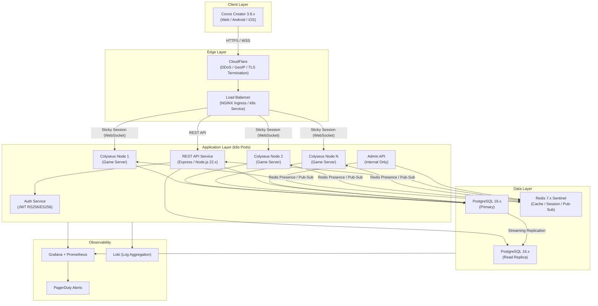
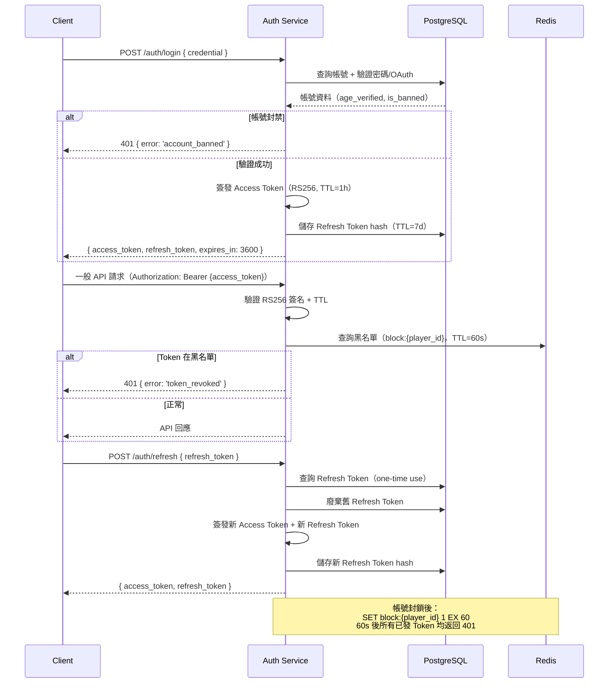
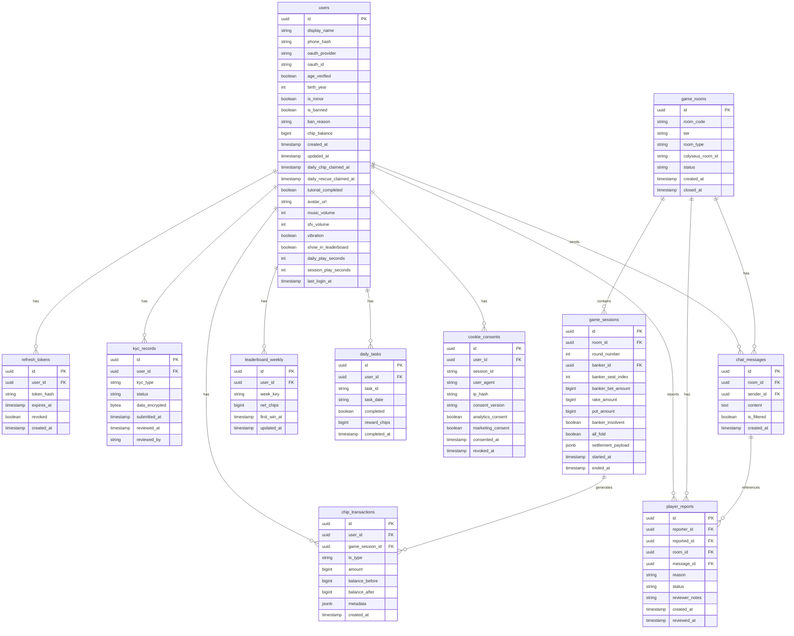

# EDD — Sam Gong 三公 多人紙牌遊戲

<!-- SDLC Engineering Design — Layer 3：Engineering Design Document -->

---

## Document Control

| 欄位 | 內容 |
|------|------|
| **DOC-ID** | EDD-SAM-GONG-GAME-20260422 |
| **專案名稱** | 三公遊戲（Sam Gong 3-Card Poker）即時多人線上平台 |
| **文件版本** | v1.4-draft |
| **狀態** | DRAFT（STEP-08 Round 10 精查完成，待 STEP-09 架構圖生成） |
| **作者** | Evans Tseng（由 /devsop-autodev STEP-07 自動生成） |
| **日期** | 2026-04-22 |
| **來源 PRD** | PRD-SAM-GONG-GAME-20260421 v0.14-draft |
| **來源 BRD** | BRD-SAM-GONG-GAME-20260421 v0.12-draft |
| **來源 PDD** | PDD-SAM-GONG-GAME-20260422 v0.2-draft |
| **建立方式** | /devsop-autodev STEP-07 自動生成 |

---

## Change Log

| 版本 | 日期 | 作者 | 變更摘要 |
|------|------|------|---------|
| v1.0-draft | 2026-04-22 | /devsop-autodev STEP-07 | 初稿；依 PRD v0.14 + BRD v0.12 + PDD v0.2 生成；涵蓋系統架構、Colyseus Room 設計、完整 TypeScript Schema、狀態機、結算引擎、REST API、PostgreSQL DDL、Redis 使用、安全架構、k8s 部署、可觀測性、可行性評估 |
| v1.1-draft | 2026-04-22 | STEP-08 Review Round 5 | 修復 18 個 findings：F1 HPA scaleDown + preStop；F2 HPA CPU-only觸發/CCU告警對齊；F3 Colyseus health probe；F4 rescue-chip條件統一/typo修正；F5 CSRF說明；F6 CORS策略；F7 SQL Injection防護+Semgrep；F8 WS Close Code表；F9 統一ErrorResponse Schema；F10 Error Code枚舉；F11 環境變數清單；F12 chip_transactions分區；F13 Replica pgBouncer；F14 SLO定義；F15 覆蓋率+Auto-rollback；F16 Alertmanager規則；F17 Colyseus Monitor安全；F18 API版本策略 |
| v1.2-draft | 2026-04-22 | STEP-08 Review Round 6 | 修復 10 個 findings：F1 onDispose欄位對齊DDL（rake_total→rake_amount/player_count說明/tier說明）；F2 PlayerState.session_id移除@type裝飾器（Server-only）；F3 players MapSchema key說明與onMessage反查模式；F4 resetForNextRound()方法補充；F5 封號後WebSocket即時踢出Pub/Sub機制；F6 多裝置登入4005踢出機制；F7 show_in_leaderboard=false Redis ZSET過濾說明；F8 測試策略（Colyseus Testing/E2E Fixtures/Mock策略）；F9 all_fold 2人桌邊界條件；F10 chip_balance Open Information設計說明 |
| v1.3-draft | 2026-04-22 | STEP-08 Review Round 7 | 修復 12 個 findings：F1 Tutorial R1牌面去除重複牌張（player改為A♠/2♣/8♦=1pt）；F2 Admin ban路徑統一為POST /api/v1/admin/player/:id/ban；F3 §5.1 erDiagram補充cookie_consents.session_id/user_agent和player_reports.message_id/reviewer_notes；F4 §3.7新增my_session_info訊息類型；F5 §13 REQ-017引用修正為§4.6，補充§4.4保留章節；F6 §3.5狀態機settled補充分支（→dealing/→waiting）並更新§3.6 resetForNextRound說明；F7 §5.3 Leaderboard ZSET修正端點路徑為PUT /api/v1/player/settings；F8 §7.1補充pgBouncer Transaction Mode與SERIALIZABLE相容性說明；F9 §3.6 HandEvaluator補充SUIT_RANK常數定義；F10 §8章節順序修正（8.1→8.2→8.3→8.4）；F11 §6.1 STRIDE補充Admin 2FA/MFA說明及OQ-3待決策；F12 §3.7 rescue_chips補充DB原子操作防Race Condition說明 |
| v1.4-draft | 2026-04-22 | STEP-08 Review Round 8 | 修復 5 個 findings：F1 Tutorial R2/R3 player hand去除重複牌張（R2 player改為3♦/K♣/Q♠=3pt；R3 player改為6♥/J♠/Q♣=6pt，18張全部唯一）；F2 §5.2 player_reports DDL補充idx_player_reports_reported和idx_player_reports_reporter兩個FK索引；F3 §13 REQ-014描述修正為「年齡驗證（OTP）/帳號管理」並補充對應章節§4.1 OTP端點/§4.5 Auth Flow；REQ-018加注釋區分語意（REQ-014=OTP驗證機制；REQ-018=KYC身份文件上傳）；F4 §4.1 POST /api/v1/player/ad-reward回應碼補充為200/400/401/429並說明各碼含義；F5 §13 REQ-012章節引用更新為§3.1 Tutorial SamGongRoom（tutorial_mode=true）；§3.6 TutorialScriptEngine（固定劇本R1/R2/R3） |
| v1.4-draft | 2026-04-22 | devsop STEP-08 | 完成 9 輪 Exhaustive Review Loop，共修復 95+ findings；文件品質達 Production-ready draft |

---

## 1. Executive Summary

三公遊戲（Sam Gong 3-Card Poker）是一款 Server-Authoritative 即時多人紙牌遊戲，目標於 **2026-08-21** GA 上線。所有遊戲邏輯（洗牌、發牌、比牌、結算）完全由 Server 執行，Client（Cocos Creator 3.8.x）僅負責狀態渲染與使用者互動收集，實現「啞渲染器（dumb renderer）」架構。

**關鍵架構決策：**

1. **Server-Authoritative 架構**：Colyseus 0.15.x（Node.js 22.x + TypeScript 5.4.x）作為 Game Server，透過 WebSocket 即時同步 Room State；Client 不包含任何遊戲邏輯。
2. **資料持久層**：PostgreSQL 16.x 作為主要持久化資料庫（玩家資料、交易記錄、KYC）；Redis 7.x 作為快取、Session、Rate Limit 計數器、Leaderboard Sorted Set。
3. **身份驗證**：JWT RS256/ES256；Access Token ≤ 1 小時，Refresh Token ≤ 7 天；帳號封鎖後 ≤ 60 秒失效。
4. **部署**：Kubernetes（k8s）叢集，Colyseus 水平擴展配合 `@colyseus/redis-presence`；GitHub Actions CI/CD。
5. **台灣法規合規**：虛擬籌碼不可兌換、OTP 年齡驗證、防沉迷計時器、KYC、詐欺犯罪危害防制條例遵從。

**核心技術挑戰：**
- 結算引擎的籌碼守恆驗證（誤差容忍 = 0）
- 莊家破產先到先得（Sequential）支付邏輯的原子性保證
- Colyseus Room State 下手牌隔離（filterBy / 私人訊息），防止其他玩家取得手牌資訊
- 水平擴展至 ≥ 2,000 CCU 時 Colyseus 跨節點協調（Redis Presence）

**可行性評估：GO** — 架構成熟、技術棧驗證充分、NFR 目標可達。詳見第 10 章。

---

## 2. System Architecture Overview

### 2.1 Architecture Diagram (Mermaid)



### 2.2 Component Overview Table

| 元件名稱 | 技術 | 角色 | 可擴展性策略 |
|---------|------|------|------------|
| Colyseus Game Server | Colyseus 0.15.x / Node.js 22.x / TypeScript 5.4.x | 管理 WebSocket 連線、Room 生命週期、遊戲狀態同步 | k8s HPA 水平擴展；`@colyseus/redis-presence` 跨節點協調；Sticky Session |
| REST API Service | Express.js / Node.js 22.x / TypeScript 5.4.x | 處理非即時操作：帳號、排行榜、每日任務、籌碼領取、個資刪除 | k8s HPA 無狀態水平擴展 |
| Auth Service | JWT RS256/ES256 / Node.js | Token 簽發、驗證、Refresh Token Rotation；帳號封鎖後 60s 失效 | 無狀態；可隨 REST API 部署或獨立 Pod |
| PostgreSQL 16.x | PostgreSQL（Primary + Read Replica） | 主要持久化存儲：users、chip_transactions、game_sessions、kyc_records、daily_tasks | 主從熱備援（Streaming Replication）；讀取走 Replica；pgBouncer 連線池 |
| Redis 7.x Sentinel | Redis Sentinel 模式 | Session Cache、Rate Limit 計數器、Leaderboard Sorted Set、Matchmaking Queue、Colyseus Room Presence | Sentinel 自動 Failover；叢集模式（v1.x 視需求） |
| NGINX Ingress | k8s NGINX Ingress Controller | 負載均衡、TLS Termination、Sticky Session（WebSocket）、Rate Limit 第一層 | k8s Ingress 擴展 |
| CloudFlare | CDN / DDoS 防護 | TLS、GeoIP 偵測（REQ-016 EU GDPR）、DDoS 緩解 | CloudFlare 彈性擴展 |
| Admin API | Internal Node.js Service | SRE 操作工具：查詢帳號狀態、封號、籌碼審計；僅限內網 VPN 存取 | 單一 Pod（非關鍵路徑） |
| Grafana + Prometheus | Monitoring Stack | CCU、延遲 P95/P99、錯誤率、籌碼異常監控 | Prometheus 抓取所有 Pod metrics |
| Loki | Log Aggregation | 結構化日誌（JSON）彙整，支援 Grafana Dashboard | Loki 水平擴展 |

### 2.3 Architecture Decisions (ADR format)

---

**ADR-001：Server-Authoritative 架構（所有遊戲邏輯在 Server 端執行）**

- **狀態**：已採用（Locked）
- **背景**：三公遊戲涉及虛擬籌碼增減，必須防止 Client 端作弊（偷看牌、結果預測、外掛注入）。台灣法規要求遊戲公平性可稽核。
- **決策**：所有遊戲邏輯（Fisher-Yates 洗牌、發牌、D8 比牌、三步驟結算、抽水計算、莊家破產處理）完全在 Server 端 TypeScript 執行。Client 僅接收 Room State diff，執行動畫與 UI 渲染。Server 遊戲邏輯置於獨立 server-only TypeScript package，Client build 系統透過 TypeScript project references 強制隔離，CI 驗證 Client bundle 不含遊戲邏輯關鍵字（REQ-001 AC-3/AC-7）。
- **後果**：增加 Server 計算負載；Client 體驗依賴網路延遲（NFR-02 P95 ≤ 100ms 為強制目標）；Client 開發複雜度降低（無需實作遊戲規則）。

---

**ADR-002：Colyseus 0.15.x 而非自建 WebSocket Server**

- **狀態**：已採用（Locked）
- **背景**：需要即時 Room State 同步、Matchmaking、Presence 管理、斷線重連。自建 WebSocket Server 需要大量工程投入且缺乏 Cocos Creator 官方 SDK。
- **決策**：採用 Colyseus 0.15.x。理由：(1) 官方 Cocos Creator SDK 支援；(2) `@colyseus/schema` 提供高效 Room State diff 同步；(3) 內建 Matchmaking、Room 生命週期、Presence；(4) 支援 Redis Presence 跨節點水平擴展；(5) 社群活躍，有 UNO 等卡牌遊戲官方範例。版本鎖定 `~0.15.0`，minor 禁止跳版（PRD §4a）。
- **後果**：受 Colyseus 0.15.x API 限制約束；升級至 0.16+ 需完整回歸測試。

---

**ADR-003：JWT RS256/ES256 而非 Session-Based 驗證**

- **狀態**：已採用（Locked，來源 NFR-17）
- **背景**：系統需要水平擴展，Session-based 驗證需要 Session 共享（Redis）或 Sticky Session，增加基礎設施複雜度。JWT 無狀態但需管理 Token 失效（特別是帳號封鎖後 ≤ 60s 失效）。
- **決策**：JWT RS256（RSA 2048-bit）或 ES256（ECDSA P-256）非對稱簽名。Access Token TTL ≤ 1h；Refresh Token TTL ≤ 7d，一次性使用（Rotation）。帳號封鎖後 ≤ 60s 失效透過 Redis 短效黑名單（block-to-expire key TTL = 60s）實現，不需要全量 Token 查詢。禁止 HS256（對稱密鑰洩漏風險）。
- **後果**：需要管理公私鑰對（AWS KMS 或等效 HSM）；Refresh Token Rotation 需要 PostgreSQL 儲存；封鎖後 60s 失效窗口為已知接受限制。

---

**ADR-004：PostgreSQL 16.x 而非 MongoDB**

- **狀態**：已採用（Locked）
- **背景**：需要 ACID 事務保證籌碼守恆（誤差 = 0）、財務記錄 7 年保留合規、複雜結算查詢（JOIN、GROUP BY）。
- **決策**：採用 PostgreSQL 16.x。理由：(1) ACID 事務 + SERIALIZABLE 隔離等級保證結算原子性；(2) 強型別 Schema 適合財務記錄；(3) 主從 Streaming Replication 支援 NFR-18（Failover ≤ 5min）；(4) 豐富的 JSON 支援（settlement payload 存儲）；(5) pgBouncer 連線池管理（NFR-16）。MongoDB 的最終一致性模型不適合籌碼守恆要求。
- **後果**：Schema 遷移需要 DDL 管理（使用 node-pg-migrate 或 Flyway）；讀取擴展依賴 Read Replica。

---

**ADR-005：Redis 7.x 多重用途策略**

- **狀態**：已採用（Locked）
- **背景**：系統需要：(1) Colyseus 跨節點 Presence；(2) JWT 短效黑名單；(3) Rate Limit 計數器（NFR-19 四層限制）；(4) Leaderboard Sorted Set（REQ-006 ≤ 1min 更新）；(5) Session Cache（REST API 減少 PostgreSQL 查詢）；(6) Matchmaking Queue（REQ-010）。
- **決策**：Redis 7.x Sentinel 模式（非 Cluster，v1.0 規模可接受）。單 Redis 部署多個 DB 或使用 namespace prefix 隔離不同用途。Sentinel 提供自動 Failover（NFR-18）。Redis RPO ≤ 15 分鐘（RDB 快照，NFR-13）。
- **後果**：Redis 是關鍵基礎設施單點；Sentinel 模式需要 3 個節點；若 Redis 失效，Matchmaking 隊列從 PostgreSQL 重建（fallback）。

---

## 3. Server Architecture (Colyseus)

### 3.1 Room Design

**私人房間加入流程：** Client 使用 `POST /api/v1/rooms/private` 取得 room_code，REST API 回傳 `{room_code, colyseus_room_id}`；Client 再呼叫 `client.joinById(colyseus_room_id)` 連線至 Colyseus 房間。其他玩家可使用 `GET /api/v1/rooms/private/{room_code}` 查詢 `colyseus_room_id` 後加入。

**SamGongRoom 繼承自 Colyseus `Room<SamGongState>`，實現以下生命週期方法：**

```typescript
// server/src/rooms/SamGongRoom.ts
import { Room, Client } from '@colyseus/core';
import { SamGongState, PlayerState } from './schema/SamGongState';
import { DeckManager } from '../game/DeckManager';
import { HandEvaluator } from '../game/HandEvaluator';
import { SettlementEngine } from '../game/SettlementEngine';
import { AntiAddictionManager } from '../game/AntiAddictionManager';
import { BankerRotation } from '../game/BankerRotation';

export class SamGongRoom extends Room<SamGongState> {
  maxClients = 6;
  private deckManager: DeckManager;
  private handEvaluator: HandEvaluator;
  private settlementEngine: SettlementEngine;
  private antiAddiction: AntiAddictionManager;
  private bankerRotation: BankerRotation;
  private phaseTimers: Map<string, ReturnType<typeof setTimeout>>;
  private disconnectTimers: Map<string, ReturnType<typeof setTimeout>>;

  // onCreate: 房間建立，初始化 State 與模組
  // 注意：Colyseus 0.15.x 使用 this.onMessage<T>('type', handler) 於 onCreate 內註冊，
  // 不支援單一 onMessage override
  async onCreate(options: RoomOptions): Promise<void> {
    // ... 初始化 State、模組 ...

    // 註冊個別訊息 Handler（Colyseus 0.15.x API）
    this.onMessage<BankerBetMessage>('banker_bet', (client, message) => {
      this.handleBankerBet(client, message);
    });
    this.onMessage<CallFoldMessage>('call', (client, message) => {
      this.handleCall(client, message);
    });
    this.onMessage<CallFoldMessage>('fold', (client, message) => {
      this.handleFold(client, message);
    });
    this.onMessage<SeeCardsMessage>('see_cards', (client, message) => {
      this.handleSeeCards(client, message);
    });
    this.onMessage<ChatMessage>('send_chat', (client, message) => {
      this.handleChat(client, message);
    });
    this.onMessage<ReportMessage>('report_player', (client, message) => {
      this.handleReport(client, message);
    });
    this.onMessage<{ type: 'adult' }>('confirm_anti_addiction', (client, message) => {
      this.antiAddiction.onAdultWarningConfirmed(client.auth.player_id);
    });
  }

  // onJoin: 玩家加入，驗證 JWT、籌碼門檻、分配座位
  async onJoin(client: Client, options: JoinOptions): Promise<void>;

  // onLeave: 玩家離開，啟動 30s 重連窗口或直接 Fold
  async onLeave(client: Client, consented: boolean): Promise<void>;

  // onDispose: 房間銷毀，清理計時器、釋放資源、寫入 game_sessions 記錄
  async onDispose(): Promise<void>;
}
```

**Room 生命週期流程：**

```
onCreate
  → 初始化 SamGongState（phase=waiting）
  → 設定 TierConfig（min_bet, max_bet, entry_chips）
  → 啟動 60s 等待計時器（無人加入自動解散）

onJoin（每位玩家）
  → 驗證 JWT token（RS256/ES256）
  → 驗證 chip_balance ≥ tier entry_chips
  → 預扣 entry escrow（如適用）
  → 分配 seat_index（若 >= maxClients 拒絕 room_full；與 phase 無關）
  → 初始化 PlayerState
  → **Mid-game join 判定（BUG-20260422-001）**：若當前 `phase !== 'waiting'`（遊戲進行中），
    設 `PlayerState.is_waiting_next_round = true`；此玩家本局不發牌、不下注、不跟注、
    不棄牌、不參與輪莊序列，直至 `resetForNextRound()` 清除旗標正式入局下一局。
    Server **不得**於 `startNewRound()` 呼叫 `this.lock()`；房間開放加入到 `maxClients` 上限為止。
  → **年齡路由**：讀取 `player_session.is_minor`（來自 JWT payload 或 DB 查詢）；
    - `is_minor === true` → `antiAddiction.trackUnderageDaily(playerId)` （2h 每日上限）
    - `is_minor === false` → `antiAddiction.trackAdultSession(playerId)` （2h 重複提醒）
  → ≥ 2 人且 phase === 'waiting' 時啟動遊戲循環（`startNewRound()`）

onLeave（玩家離開）
  → consented=true：即時 Fold（如遊戲進行中）
  → consented=false：啟動 30s 重連計時器
    → 重連成功：恢復 PlayerState，重推 myHand
    → 30s 超時：自動 Fold，移除玩家席位

onMessage
  → 驗證玩家身份（client.sessionId === player）
  → 驗證操作合法性（phase、金額、餘額）
  → 派發至對應 Handler（bankerBetHandler, callHandler, foldHandler, etc.）
  → 違規記錄日誌 + 返回 error 訊息

onDispose
  → 寫入 game_sessions（room_id, round_number, banker_id, banker_seat_index, banker_bet_amount, rake_amount, pot_amount, banker_insolvent, all_fold, settlement_payload, started_at, ended_at）
  → 注意：player_count 從 this.state.players.size 推導，不單獨寫入 DB；廳別（tier）記錄於 game_rooms 表，不重複寫入 game_sessions
  → 清理所有 setTimeout
  → 釋放 Redis Presence
```

### 3.2 Room State Schema (Colyseus @type decorators)

```typescript
// server/src/rooms/schema/SamGongState.ts
import { Schema, MapSchema, ArraySchema, type } from '@colyseus/schema';

// ──── 卡牌表示 ────
export class Card extends Schema {
  @type('string') suit: string;    // 'spade'|'heart'|'diamond'|'club'
  @type('string') value: string;   // '2'|'3'|...|'9'|'10'|'J'|'Q'|'K'|'A'
  @type('number') point: number;   // 計分點數：A=1, 2-9=面值, 10/J/Q/K=0
}

// ──── 結算子物件 ────
export class SettlementEntry extends Schema {
  @type('string') player_id: string;
  @type('number') seat_index: number;
  @type('number') net_chips: number;     // 整數，正=贏, 負=輸, 0=Fold/平手；insolvent_winner 情境：net_chips = -called_bet（非零）
  @type('number') bet_amount: number;
  @type('number') payout_amount: number; // payout_amount = called_bet + N × banker_bet_amount（總返回額，贏家）；0（輸家/Fold/平手）
  // net_chips = N × banker_bet_amount（純利潤）
  @type('string') result: string;        // 'win'|'lose'|'fold'|'tie'|'insolvent_win'
  @type('string') hand_type: string;     // 'sam_gong'|'9'|'8'|...|'0'（非三公）
  @type('boolean') is_sam_gong: boolean;
}

export class SettlementState extends Schema {
  @type([SettlementEntry]) winners = new ArraySchema<SettlementEntry>();
  @type([SettlementEntry]) losers = new ArraySchema<SettlementEntry>();
  @type([SettlementEntry]) ties = new ArraySchema<SettlementEntry>();
  @type([SettlementEntry]) folders = new ArraySchema<SettlementEntry>();
  @type([SettlementEntry]) insolvent_winners = new ArraySchema<SettlementEntry>(); // 莊家破產後未獲支付；net_chips = -called_bet（莊家破產後未獲支付；扣除已投入之 called_bet）
  @type('number') rake_amount: number = 0;
  @type('number') pot_amount: number = 0;          // 輸家下注額加總（抽水底數）
  @type('boolean') banker_insolvent: boolean = false;
  @type('number') banker_remaining_chips: number = 0;
  @type('boolean') all_fold: boolean = false;      // 全員棄牌
}

// ──── 玩家狀態 ────
export class PlayerState extends Schema {
  @type('string') player_id: string;
  // session_id 為 Server-only 欄位，不加 @type 裝飾，不廣播至 Client。
  // Client 識別自身 session 使用連線建立時 Server 推送的私人訊息：
  // { type: 'my_session_info', session_id, player_id }
  session_id: string;
  @type('number') seat_index: number;
  // chip_balance 廣播策略（Open Information 設計）：
  // 本遊戲採用「開放籌碼」設計，所有玩家的 chip_balance 對房間內其他玩家可見（廣播至 Client Schema）。
  // 設計理由：增加遊戲策略性（玩家可根據對手籌碼調整跟注策略）；三公遊戲中莊家設定的
  // banker_bet 本身就受自身籌碼限制，公開籌碼不會產生額外資訊優勢。
  // 若未來版本需要隱藏籌碼，可使用 Colyseus FilteredRoom（State Filtering）機制，
  // 為不同玩家提供不同的 State 視圖。
  @type('number') chip_balance: number;  // 即時餘額（含 escrow 預扣後）；公開可見（Open Information 設計）
  @type('number') bet_amount: number = 0; // 本局下注額（Fold 時為 0）
  @type('boolean') is_connected: boolean = true;
  @type('boolean') is_folded: boolean = false;
  @type('boolean') has_acted: boolean = false;  // 本輪是否已行動
  @type('boolean') is_banker: boolean = false;
  @type('boolean') is_waiting_next_round: boolean = false;
  // BUG-20260422-001：true 表示此玩家在當前局進行中加入（mid-game join），
  // 本局不發牌、不下注、不跟注、不棄牌、不進輪莊序列；
  // resetForNextRound() 清除旗標後正式納入下一局（依先進先莊 / 順時鐘輪莊規則）。
  @type('string') display_name: string;
  @type('string') avatar_url: string;
  // 手牌僅透過 filterBy 或私人訊息發送，不放入公開 Schema
  // hand: Card[] — 不在此 Schema（防止洩漏）
}

// ──── 廳別設定 ────
export class TierConfig extends Schema {
  @type('string') tier_name: string;    // '青銅廳'|'白銀廳'|'黃金廳'|'鉑金廳'|'鑽石廳'
  @type('number') entry_chips: number;  // 進場最低籌碼
  @type('number') min_bet: number;      // 最低下注
  @type('number') max_bet: number;      // 最高下注
  @type(['number']) quick_bet_amounts = new ArraySchema<number>(); // 快捷下注金額（Client 不硬編碼）
  // 注意：quick_bet_amounts 為建議快速下注顯示值（UI hint）。Server 在處理實際下注時獨立驗證
  // `banker_bet ∈ [min_bet, max_bet]`，不信任 Client 傳入的快速下注金額。
}

// ──── 配對狀態 ────
export class MatchmakingStatus extends Schema {
  @type('boolean') is_expanding: boolean = false;
  @type(['string']) expanded_tiers = new ArraySchema<string>(); // 擴展配對的相鄰廳別名稱
  @type('number') wait_seconds: number = 0;
}

// ──── 主 Room State ────
export class SamGongState extends Schema {
  // ── 玩家管理 ──
  @type({ map: PlayerState }) players = new MapSchema<PlayerState>(); // key = seat_index.toString()

  // ── 牌局控制 ──
  @type('string') phase: string = 'waiting'; // 'waiting'|'dealing'|'banker-bet'|'player-bet'|'showdown'|'settled'
  @type('number') banker_seat_index: number = -1;    // -1 = 尚未決定
  @type(['number']) banker_rotation_queue = new ArraySchema<number>(); // 順時鐘輪莊序列（seat_index）

  // ── 下注管理 ──
  @type('number') banker_bet_amount: number = 0;    // 莊家本局底注（閒家 Call 用）
  @type('number') min_bet: number = 0;               // 來自 TierConfig
  @type('number') max_bet: number = 0;               // 來自 TierConfig
  @type('number') current_pot: number = 0;           // 即時底池（閒家跟注加總；莊家下注屬 escrow 不入池；BUG-20260422-002）

  // ── 計時器 ──
  @type('number') action_deadline_timestamp: number = 0; // Server Unix ms（Client 以此計算剩餘時間）

  // ── 牌組管理（Server-only，不同步至 Client） ──
  // deck: number[] — 僅在 Server 記憶體中，不在此 Schema

  // ── 局數 ──
  @type('number') round_number: number = 0;
  @type('number') current_player_turn_seat: number = -1; // 當前行動玩家座位（player-bet phase）

  // ── 結算 ──
  @type(SettlementState) settlement = new SettlementState();

  // ── 廳別設定 ──
  @type(TierConfig) tier_config = new TierConfig();

  // ── 房間設定 ──
  @type('boolean') is_tutorial: boolean = false;    // 教學模式（tutorial_mode=true）
  @type('string') room_id: string = '';             // 房間 ID（6位大寫英數字，私人房間）
  @type('string') room_type: string = 'matchmaking'; // 'matchmaking'|'private'

  // ── 配對狀態 ──
  @type(MatchmakingStatus) matchmaking_status = new MatchmakingStatus();

  // ── 翻牌資訊（showdown phase 揭示） ──
  // revealed_cards: { [seat_index]: Card[] } — 用於斷線重連後還原
  // 以私人訊息實作，不在公開 Schema（防止提前洩漏）

  // ── 防沉迷 ──
  // 防沉迷計時由 AntiAddictionManager 管理，透過私人訊息發送至個別 Client
  // 不在 Room State（避免不同玩家的計時資訊互相可見）
}
```

**players MapSchema Key 設計與身份驗證：**

players MapSchema 的 key 為 `seat_index.toString()`（`'0'`, `'1'`, ..., `'5'`）。在 onMessage Handler 中，**不可用 `client.sessionId` 直接索引** players map（key 為 seat_index，非 sessionId）。應透過以下方式反查 PlayerState：

```typescript
const playerState = Array.from(this.state.players.values())
  .find(p => p.player_id === client.auth.player_id);
```

注意：`client.auth.player_id` 來自 onJoin 時驗證的 JWT payload，`client.sessionId` 為 Colyseus 內部連線識別碼，兩者用途不同。

**手牌隔離機制：**

```typescript
// 手牌透過私人訊息推送，非公開 Schema
// onJoin 後 dealing phase 結束時：
client.send('myHand', {
  cards: [
    { suit: 'spade', value: 'K', point: 0 },
    { suit: 'heart', value: 'Q', point: 0 },
    { suit: 'club',  value: 'J', point: 0 },
  ]
});
// 斷線重連後重新推送
// showdown phase 時，揭示所有未 Fold 玩家手牌（廣播）
this.broadcast('showdown_reveal', { hands: revealedHands });
```

### 3.3 Room Tier Configuration

**廳別進入資格與下注範圍（BRD 授權數值）：**

| 廳別 | Entry 籌碼下限 | min_bet | max_bet | quick_bet_amounts |
|------|:------------:|:-------:|:-------:|:-----------------:|
| 青銅廳 | 1,000 | 100 | 500 | [100, 200, 300, 500] |
| 白銀廳 | 10,000 | 1,000 | 5,000 | [1000, 2000, 3000, 5000] |
| 黃金廳 | 100,000 | 10,000 | 50,000 | [10000, 20000, 30000, 50000] |
| 鉑金廳 | 1,000,000 | 100,000 | 500,000 | [100000, 200000, 300000, 500000] |
| 鑽石廳 | 10,000,000 | 1,000,000 | 5,000,000 | [1000000, 2000000, 3000000, 5000000] |

```typescript
// src/config/tierConfig.ts
export const TIER_CONFIGS: Record<string, TierConfigValues> = {
  '青銅廳': { entry_chips: 1000,      min_bet: 100,     max_bet: 500,     quick_bets: [100, 200, 300, 500] },
  '白銀廳': { entry_chips: 10000,     min_bet: 1000,    max_bet: 5000,    quick_bets: [1000, 2000, 3000, 5000] },
  '黃金廳': { entry_chips: 100000,    min_bet: 10000,   max_bet: 50000,   quick_bets: [10000, 20000, 30000, 50000] },
  '鉑金廳': { entry_chips: 1000000,   min_bet: 100000,  max_bet: 500000,  quick_bets: [100000, 200000, 300000, 500000] },
  '鑽石廳': { entry_chips: 10000000,  min_bet: 1000000, max_bet: 5000000, quick_bets: [1000000, 2000000, 3000000, 5000000] },
};
```

### 3.4 Matchmaking & Room Assignment

*本節由 Colyseus 原生 matchmaking 處理，詳見 §3.1 Room Lifecycle。*

### 3.5 Game State Machine

```mermaid
stateDiagram-v2
    [*] --> waiting : onCreate（房間建立）

    waiting --> dealing : ≥ 2 玩家就緒，開始新局
    waiting --> [*] : 60s 無人加入，自動解散

    dealing --> banker-bet : 發牌完成（每人 3 張）\n推送 myHand 至各玩家
    dealing --> waiting : 玩家數 < 2（中途離開）

    banker-bet --> player-bet : 莊家下注確認（或 30s 超時自動最低下注）\n廣播 banker_bet_amount\n啟動閒家計時器
    banker-bet --> dealing : 莊家籌碼 < min_bet（跳過當前莊家：banker_index += 1 mod N，輪至下一位後重新發牌；若所有人都不夠資格則回到 waiting）

    player-bet --> showdown : 所有閒家行動完成（Call / Fold / 30s 超時 Fold）
    player-bet --> showdown : 所有閒家均 Fold（all_fold 情境）

    showdown --> settled : Server 比牌完成\n廣播 showdown_reveal（所有未 Fold 手牌）
    showdown --> settled : all_fold：直接進入結算（莊家底注退回）

    settled --> dealing : 結算廣播完成\n籌碼更新持久化\n輪莊至下一位\n5s 後自動開始下一局（players.size ≥ 2）\n呼叫 resetForNextRound()
    settled --> waiting : 結算廣播完成\n玩家不足（players.size < 2）\n等待更多玩家加入
    settled --> [*] : 玩家數 < 2 且 60s 無人加入（解散）\n或所有玩家主動離開

    note right of waiting
        room_type: matchmaking / private
        entry_chips 驗證
        60s 超時解散
    end note

    note right of banker-bet
        莊家 30s 計時器
        see_cards 可選（D12）
        escrow: banker chip_balance -= bet
    end note

    note right of player-bet
        閒家逐一 30s 計時
        Call: chip_balance -= banker_bet_amount
        Fold: bet=0, no chips deducted
    end note

    note right of settled
        三步驟原子性結算
        籌碼守恆驗證
        rake 計算 + 持久化
        anti-addiction 計時累積
    end note
```

**Phase ENUM 定義（PRD §5）：**

| Phase | 說明 | 持續時間 |
|-------|------|---------|
| `waiting` | 等待玩家加入 | 無限（最多 60s 無人自動解散） |
| `dealing` | Server 洗牌 + 發牌中 | ≤ 1s（Server 計算） |
| `banker-bet` | 莊家查看手牌 + 下注 | 30s 計時（D12） |
| `player-bet` | 閒家逐一決策（Call / Fold） | 每人 30s（D11） |
| `showdown` | 翻牌比牌（Server 計算） | ≤ 1s |
| `settled` | 結算廣播 + 顯示 | ≈ 5s（等待下一局） |

### 3.6 Game Logic Modules

**模組目錄結構（server-only TypeScript package，不得被 Client import）：**

```
server/src/game/
├── DeckManager.ts         — 洗牌、發牌
├── HandEvaluator.ts       — 點數計算、D8 比牌
├── SettlementEngine.ts    — 三步驟結算、抽水、莊家破產
├── AntiAddictionManager.ts — 防沉迷計時器（成人 2h / 未成年 2h）
├── BankerRotation.ts      — 輪莊邏輯
└── TutorialScriptEngine.ts — 教學固定劇本（tutorial_mode=true）
```

**DeckManager：**

```typescript
// server/src/game/DeckManager.ts
import { randomInt } from 'crypto'; // 禁止 Math.random()

export class DeckManager {
  private deck: number[]; // 0-51 代表 52 張牌

  buildDeck(): void;
  // Fisher-Yates Knuth Shuffle（使用 crypto.randomInt）
  shuffle(): void {
    for (let i = this.deck.length - 1; i > 0; i--) {
      const j = randomInt(0, i + 1); // crypto secure
      [this.deck[i], this.deck[j]] = [this.deck[j], this.deck[i]];
    }
  }
  deal(count: number): CardDTO[];
  // tutorial_mode 時使用固定牌序（PRD REQ-012 AC-5）
  loadTutorialScript(round: 1 | 2 | 3): void;
}
```

**HandEvaluator：**

```typescript
// server/src/game/HandEvaluator.ts
export interface HandResult {
  points: number;      // 0-9（三公時 points=0，is_sam_gong=true）
  is_sam_gong: boolean;
  hand_type: string;   // 'sam_gong'|'9'|...|'0'
}

export class HandEvaluator {
  // 計算 3 張牌點數 mod 10（整數運算，禁止浮點）
  calculate(cards: CardDTO[]): HandResult;

  // D8 同點比牌（BRD §5.5 D8）
  // 第一步：比最大單張花色（spade > heart > diamond > club）
  // 第二步：比最大單張點數（K > Q > J > 10 > ... > 2 > A，A 最小）
  // 兩步皆同 → 平手（return 0）
  //
  // D8 Tiebreak Step1: Suit Rank（花色比較）
  // const SUIT_RANK: Record<string, number> = {
  //   'spade': 4,    // ♠ 最大
  //   'heart': 3,    // ♥
  //   'diamond': 2,  // ♦
  //   'club': 1,     // ♣ 最小
  // };
  // D8 tiebreak 完整邏輯：
  // Step1: max SUIT_RANK among hand cards
  // Step2: max VALUE_RANK among hand cards（使用已定義的 VALUE_RANK）
  //
  // D8 Tiebreak Value Rank（獨立於 point 計算）
  // const VALUE_RANK: Record<string, number> = {
  //   'A':1,'2':2,'3':3,'4':4,'5':5,'6':6,'7':7,
  //   '8':8,'9':9,'10':10,'J':11,'Q':12,'K':13
  // };
  // D8 tiebreak Step2: max VALUE_RANK among hand cards
  // const maxRank = (hand: Card[]) => Math.max(...hand.map(c => VALUE_RANK[c.value]));
  // 注意：VALUE_RANK 與 Card.point（mod10 計算用）是兩個獨立映射，不可混用。
  tiebreak(hand1: CardDTO[], hand2: CardDTO[]): -1 | 0 | 1;

  // 判斷閒家結果（相對莊家）
  compare(playerHand: CardDTO[], bankerHand: CardDTO[]): 'win' | 'lose' | 'tie';

  // 測試向量驗證（≥ 200 vectors，CI 執行）
  // REQ-003 AC-3: 向量集 Alpha（2026-06-21）前完成
}
```

**SettlementEngine（核心，精確實作 PRD §5.3）：**

```typescript
// server/src/game/SettlementEngine.ts
export interface SettlementInput {
  players: PlayerSettlementDTO[];  // 含 seat_index, bet_amount, hand_result, is_folded
  banker_seat_index: number;
  banker_chip_balance: number;     // Step 2 後的 chip_balance（escrow 已扣）
  banker_bet_amount: number;       // 已 escrow 的莊家下注額
}

export interface SettlementOutput {
  winners: SettlementResultDTO[];
  losers: SettlementResultDTO[];
  ties: SettlementResultDTO[];
  folders: SettlementResultDTO[];
  insolvent_winners: SettlementResultDTO[]; // 莊家破產後未獲支付的贏家；net_chips = -called_bet（非零）
  banker_settlement: SettlementResultDTO;   // 莊家結算結果
  // 莊家 net_chips = sum(losers' called_bets) - rake - sum(winners' N × banker_bet_amount)
  rake_amount: number;             // floor(pot × 0.05)，底池 > 0 時最少 1
  pot_amount: number;              // 輸家閒家下注額加總
  banker_insolvent: boolean;
  banker_remaining_chips: number;
  all_fold: boolean;
  // 籌碼守恆驗證：sum(all participants' net_chips) + rake_amount === 0
}

export class SettlementEngine {
  settle(input: SettlementInput): SettlementOutput {
    // ── Step 1：驗證 phase === 'showdown' ──
    // 確認當前牌局狀態為 showdown，否則拒絕執行

    // ── Step 2：取得所有 callers 與 folders ──
    // callers：bet_action='call'（已跟注閒家）
    // folders：bet_action='fold'（已棄牌閒家）

    // ── Step 3：確認 escrow 已扣除 ──
    // banker chip_balance = banker_chip_balance - banker_bet
    // callers chip_balance = chip_balance - called_bet
    // escrow 在下注時即扣除，此步驟為驗證

    // ── Step 4：呼叫 HandEvaluator.evaluate() 比牌 ──
    // 建立 winners/losers 陣列（相對莊家）
    // winners：閒家點數 > 莊家 或 閒家三公
    // losers：閒家點數 < 莊家 或 莊家三公
    // ties：同點且 D8 tiebreak 相同

    // ── Step 5：莊家破產檢查 ──
    // banker_bet_pool = banker_bet_amount × caller_count
    // 若 banker_chips < 莊家應支付額，觸發 D13 先到先得

    // ── Step 6a：莊家支付贏家（順時針）──
    // **底池定義（重要）：** `pot_amount` = 所有輸家（losers）的 `called_bet` 加總（已放棄的下注）。
    // 贏家的 `called_bet` **不進入底池**（留在贏家手中，莊家須額外從自身籌碼支付 N×banker_bet 給每位贏家）。
    // 抽水（rake）計算基礎為此 `pot_amount`：`rake = Math.floor(pot_amount × 0.05)`，
    // `pot_amount > 0` 時最少 1 籌碼。
    // Fold 閒家 bet=0，不入底池
    // 平手閒家不入底池

    // ── Step 6b：收取 Rake ──
    // pot = 輸家閒家下注額加總
    // rake = pot > 0 ? Math.max(Math.floor(pot * 0.05), 1) : 0
    // 空底池守衛：pot=0 時 rake=0，不適用最少 1 籌碼

    // ── Step 6c：更新 chip_balance ──
    // 賠率表：三公 N=3, 9點 N=2, 0-8點（非三公）N=1, 平手 N=0（退注）
    // 閒家勝：net_chips = N × banker_bet_amount（純利潤）
    //   payout_amount = called_bet + N × banker_bet_amount（總返回額）
    //   莊家破產檢查：chip_balance + escrow < 本次應付額 → 觸發 D13
    // 閒家敗：net_chips = -called_bet（escrow 已扣除，payout_amount = 0）；bet_amount 入底池，底池扣 rake 後歸莊家
    // Fold：net_chips = 0，籌碼無損失
    // 平手：退回 bet_amount，net_chips = 0

    // ── Step 6d：記錄 chip_transactions ──
    // 每位玩家各一筆（含莊家），tx_type='game_win'|'game_lose'
    // 若 rake_amount > 0，額外新增一筆 tx_type='rake'（user_id = SYSTEM_ACCOUNT_UUID）

    // ── Step 7：設置 phase = 'settled'，廣播 settlement 結果 ──

    // ── 莊家破產（D13）先到先得 ──
    // 依閒家順時鐘座位順序逐一支付
    // 支付後 banker_chip_balance 歸零 → 後續贏家進入 insolvent_winners（net_chips = -bet）
    // 破產後已完成的輸家下注計入 rake；破產後未完成的不計入

    // ── 全員棄牌（all_fold）──
    // pot = 0, rake = 0
    // 莊家底注退回（escrow 釋放）：banker_chip_balance += banker_bet_amount
    // 所有玩家 net_chips = 0
    //
    // 邊界條件：2 人桌唯一閒家 Fold（all_fold 最常見情境）
    // - caller_count = 0, pot = 0, rake = 0
    // - 莊家 escrow 退回：banker_chip_balance += banker_bet_amount（退回預扣）
    // - 所有玩家 net_chips = 0
    // - settlement ArraySchema 記錄每個閒家 is_folded=true, net_chips=0, payout_amount=0
    // - 此情境觸發「莊家自動獲勝」邏輯，不呼叫 HandEvaluator（無需比牌）
    // 注意：pot=0 時 Step 6b rake 守衛確保 rake=0（不適用最少 1 籌碼規則）

    // ── 籌碼守恆驗證 ──
    // assert: sum(net_chips) + rake_amount === 0
    // 失敗：回滾事務 + CRITICAL log + PagerDuty

    // ── Rake 帳目記錄 ──
    // 每局結算後，若 rake_amount > 0，於 chip_transactions 新增一筆 tx_type='rake' 的紀錄
    // （user_id = NULL 或系統帳戶 UUID，amount = rake_amount）以維持完整帳目稽核。
    // rake 交易因 user_id = NULL，自然不計入排行榜（REQ-006 AC-8）。
  }
}
```

**AntiAddictionManager：**

```typescript
// server/src/game/AntiAddictionManager.ts
export class AntiAddictionManager {
  // 成人：連續遊玩 2h 提醒（計時器重置條件：主動確認 / 離線 > 30min）
  // sessionSeconds 由內部計時器維護，不由呼叫端傳入
  trackAdultSession(playerId: string): Promise<AntiAddictionStatus>;
  onAdultWarningConfirmed(playerId: string): void;      // 重置計時器

  // 未成年：每日 2h 硬停（UTC+8 00:00 重置）
  // dailySeconds 由內部計時器維護，不由呼叫端傳入
  trackUnderageDaily(playerId: string): Promise<AntiAddictionStatus>;
  // 牌局中觸發：等待本局結算後強制登出（REQ-015 AC-3 F20）
  scheduleUnderageLogout(playerId: string, afterSettlement: boolean): void;

  // 計算台灣午夜 Unix ms（UTC+8 次日 00:00）
  getTaiwanMidnightTimestamp(): number;

  // Timer Persistence：每局 settled 後將計時資料寫透至 PostgreSQL（users.daily_play_seconds, users.session_play_seconds）
  // Redis 為 write-through cache；Redis 重啟後從 PostgreSQL 回填，避免 Sentinel 切換時遺失計時資料。
  persistTimers(playerId: string): Promise<void>;
}

// Wiring in SamGongRoom.onJoin():
async onJoin(client: Client, options: JoinOptions, auth: AuthToken) {
  const isMinor = auth.is_minor ?? false; // from JWT claim populated by KYC/OTP
  if (isMinor) {
    await this.antiAddiction.trackUnderageDaily(auth.player_id);
  } else {
    await this.antiAddiction.trackAdultSession(auth.player_id);
  }
}
```

**TutorialScriptEngine：**

```typescript
// server/src/game/TutorialScriptEngine.ts
// 教學模式固定劇本引擎（tutorial_mode=true 時使用）

interface TutorialRound {
  round: 1 | 2 | 3;
  banker_hand: [string, string, string]; // 固定牌面，例如 ['K♠','Q♥','J♦']
  player_hands: Record<string, [string, string, string]>; // 固定玩家牌（key=seat_index）
  force_tie?: boolean; // R3: true（依教程合約強制平局，非依 D8 tiebreak）
  expected_outcome: 'banker_win' | 'player_win' | 'tie';
  hint_i18n_key: string; // 提示文字 i18n key，例如 'tutorial.hint.sam_gong'
}

class TutorialScriptEngine {
  loadScript(round: 1 | 2 | 3): TutorialRound;
  // R1: 三公 vs 1pt → 展示三公最高牌型（banker_win，banker 三公）
  // R2: 5pt vs 3pt → 展示普通比點（banker_win，5pt > 3pt）
  // R3: 6pt vs 6pt + force_tie=true → 展示平局概念（tie，依教程合約，非依 D8）
  //
  // 精確牌面序列由 Q7（Open Question）確定後填入，暫定如下：
  // R1: banker=['K♠','Q♥','J♦']（三公=0pts, is_sam_gong=true）
  //     player_hands: { 'P1': ['A♠','2♣','8♦'] }（1+2+8=11 mod 10=1pt）→ 展示三公 vs 1pt，banker_win
  //     注意：A♠/2♣/8♦ 與莊家牌張（K♠/Q♥/J♦）無重複，確保同一副牌中不出現重複牌張。
  // R2: banker=['5♠','A♥','9♦']（5pt）
  //     player_hands: { 'P1': ['3♦','K♣','Q♠'] }（3+0+0=3pt）→ 展示普通比點 5pt > 3pt，banker_win
  //     注意：3♦/K♣/Q♠ 與 R1 所有牌張（K♠/Q♥/J♦/A♠/2♣/8♦）及 R2 banker 牌張均無重複。
  // R3: banker=['2♠','4♥','K♦']（6pt）
  //     player_hands: { 'P1': ['6♥','J♠','Q♣'] }（6+0+0=6pt, force_tie）→ 展示平局概念
  //     注意：6♥/J♠/Q♣ 與所有已用牌張均無重複（18 張全部唯一）。
  //     完整 18 張牌驗證：K♠,Q♥,J♦,A♠,2♣,8♦（R1）/ 5♠,A♥,9♦,3♦,K♣,Q♠（R2）/ 2♠,4♥,K♦,6♥,J♠,Q♣（R3）
}
```

**resetForNextRound（新一局 State 重置）：**

在 `settled → dealing` 轉換時（players.size ≥ 2，5 秒後自動）呼叫，確保下一局以乾淨狀態開始。若 players.size < 2，則轉換至 `waiting` 狀態而非 `dealing`，此情境下不呼叫 resetForNextRound（等玩家補齊後由 onJoin 觸發新局流程）：

```typescript
// 在 SamGongRoom 內（settled → dealing 轉換，5 秒後）
private resetForNextRound(): void {
  // PlayerState 重置（保留 is_banker、chip_balance、player_id）
  this.state.players.forEach((player) => {
    player.bet_amount = 0;
    player.has_acted = false;
    player.is_folded = false;
    // BUG-20260422-001：清除 mid-game join 旗標，使排隊玩家於下一局正式入局
    player.is_waiting_next_round = false;
    player.hand = new ArraySchema<string>(); // 清空手牌（Server-only 欄位）
  });

  // RoomState 重置
  this.state.banker_bet_amount = 0;
  this.state.current_pot = 0;
  this.state.action_deadline_timestamp = 0;
  this.state.current_player_turn_seat = -1;
  this.state.settlement = new SettlementState(); // 清空結算結果

  // 輪莊（由 BankerRotation.rotate() 計算，統一使用 rotate() API）
  // BankerRotation 過濾 is_waiting_next_round 與 insolvent 玩家，剛解鎖的排隊玩家
  // 首次參與不搶莊家位（依 PRD §5.0.3 先進先莊規則）
  this.state.banker_seat_index = this.bankerRotation.rotate(
    this.state.banker_seat_index,
    Array.from(this.state.players.values())
  );
}
```

**BankerRotation：**

```typescript
// server/src/game/BankerRotation.ts
export class BankerRotation {
  // 首局：持有最多籌碼者擔任莊家；同籌碼按進入順序
  determineFirstBanker(players: PlayerState[]): number;
  // 輪莊：每局結束後順時鐘至下一位（Fold 玩家正常參與輪莊，不跳過）
  rotate(currentBankerSeat: number, players: PlayerState[]): number;
  // 跳過：莊家籌碼 < min_bet（D9）
  skipInsolventBanker(queue: number[], players: PlayerState[], minBet: number): number;
}
```

**Rotation Algorithm（輪莊制）：**

```
每局結束時：
1. 取得當前已入座玩家的 seat_index 列表（排除已離線玩家）：seats = [s0, s1, s2, ...]
2. 尋找當前莊家 seat 的位置：idx = seats.indexOf(currentBankerSeat)
3. 下一莊家：nextBankerSeat = seats[(idx + 1) % seats.length]  // 順時鐘循環
4. 若下一莊家因破產或其他原因須跳過：skipInsolventBanker() 繼續 (idx+2) % N
5. banker_rotation_queue 在每局結束時由當前在席玩家重建（動態列表，自動處理中途離場）
```

### 3.7 Message Protocol

**Client → Server 訊息（Colyseus onMessage）：**

| 訊息類型 | Payload | 驗證規則 | 說明 |
|---------|---------|---------|------|
| `banker_bet` | `{ amount: number }` | phase === 'banker-bet'；is_banker；min_bet ≤ amount ≤ max_bet；amount ≤ chip_balance | 莊家下注 |
| `call` | `{}` | phase === 'player-bet'；本人輪次；chip_balance ≥ banker_bet_amount | 閒家跟注（Call） |
| `fold` | `{}` | phase === 'player-bet'；本人輪次 | 閒家棄牌 |
| `see_cards` | `{}` | phase === 'banker-bet'；is_banker | 莊家查看手牌 |
| `send_chat` | `{ text: string }` | text.length ≤ 200；rate limit ≤ 2/s | 房間內聊天 |
| `report_player` | `{ target_id: string, message_id: string, reason: string }` | target_id 存在於房間；reason 合法枚舉 | 舉報玩家 |
| `confirm_anti_addiction` | `{ type: 'adult' }` | is_adult；type=adult | 成人確認防沉迷提醒 |

**Server → Client 訊息：**

| 訊息類型 | Payload | 說明 |
|---------|---------|------|
| Room State Sync | Schema diff（自動） | Colyseus 自動推送 Room State 變更 |
| `my_session_info` | `{ session_id: string, player_id: string }` | 玩家加入後 Server 推送私人訊息（sendTo client），Client 用以識別自身 session（因 session_id 不在公開 Schema 中） |
| `myHand` | `{ cards: Card[] }` | 推送玩家本人手牌（私人訊息，dealing phase 後） |
| `showdown_reveal` | `{ hands: { [seat]: Card[] } }` | 所有未 Fold 玩家手牌（廣播，showdown phase） |
| `anti_addiction_warning` | `{ type: 'adult', session_minutes: number }` | 成人 2h 連續遊玩提醒 |
| `anti_addiction_signal` | `{ type: 'underage', daily_minutes_remaining: number, midnight_timestamp: number }` | 未成年每日 2h 硬停訊號 |
| `rescue_chips` | `{ amount: 1000, new_balance: number }` | 結算後餘額 < 500 觸發救濟籌碼補發。Server 偵測 chip_balance < 500 時，先查 daily_rescue_claimed_at（與 POST /api/v1/player/rescue-chip REST API 共用同一冪等判斷）。若今日未領取，則自動發放並推送 rescue_chips 通知；若已領取（無論透過 REST 或自動觸發），不重複發放，改推送 rescue_not_available 通知。Race Condition 防護：使用 DB 原子更新（單一 SQL UPDATE）確保冪等：`UPDATE users SET daily_rescue_claimed_at = NOW(), chip_balance = chip_balance + 1000 WHERE id = $1 AND chip_balance < 500 AND (daily_rescue_claimed_at IS NULL OR DATE(daily_rescue_claimed_at AT TIME ZONE 'Asia/Taipei') < CURRENT_DATE AT TIME ZONE 'Asia/Taipei') RETURNING id, chip_balance;` — 若 RETURNING 返回空（無符合行），代表已領取或餘額不足，返回 403。此單一 SQL 原子操作防止並發雙重發放（Colyseus 自動觸發 + REST API 同時呼叫）。 |
| `rescue_not_available` | `{ reason: 'already_claimed' \| 'balance_sufficient' }` | 餘額 < 500 但今日已領取（already_claimed）或餘額 ≥ 500（balance_sufficient）時推送；Client 顯示對應提示訊息 |
| `rate_limit` | `{ error: 'rate_limit', retry_after_ms: number }` | 訊息速率超限回應 |
| `error` | `{ code: string, message: string }` | 一般錯誤回應（非法操作、驗證失敗） |
| `matchmaking_expanded` | `{ expanded_tiers: string[] }` | 配對擴展至相鄰廳別（30s 後） |
| `send_message_rejected` | `{ reason: 'content_filter' \| 'rate_limit' }` | 聊天訊息被拒絕 |

#### WebSocket Close Code 定義表

| Code | 含義 | Client 處理 |
|------|------|-------------|
| 4000 | 被系統踢出（禁止重連） | 顯示封號訊息，清除 token |
| 4001 | Token 失效或帳號封禁 | 清除 token，跳轉登入頁 |
| 4002 | 伺服器維護 | 顯示維護中訊息，5 分鐘後重試 |
| 4003 | 未成年每日遊戲時間上限 | 顯示下線提示，次日台灣午夜後可重連 |
| 4004 | 重連逾時（reconnect window 過期）| 清除 reconnect_info，返回大廳 |
| 4005 | 重複登入（同帳號其他裝置已登入）| 顯示「其他裝置已登入」訊息 |
| 1001 | 伺服器正常關閉（Going Away） | 嘗試重連，最多 3 次 |

#### 重連流程 (Reconnect Flow)

**Client 端實作（Cocos Creator）：**

```typescript
// 1. 連線成功時儲存重連憑證
room.onLeave(async (code) => {
  if (code === 4000) return; // 被踢出，不重連
  const stored = { roomId: room.id, sessionId: room.sessionId };
  cc.sys.localStorage.setItem('reconnect_info', JSON.stringify(stored));
  // 2. 嘗試重連（30s 視窗內）
  try {
    const reconnInfo = JSON.parse(cc.sys.localStorage.getItem('reconnect_info'));
    room = await client.reconnect(reconnInfo.roomId, reconnInfo.sessionId);
  } catch (e) {
    // 重連失敗：清除憑證，導向大廳
    cc.sys.localStorage.removeItem('reconnect_info');
    UIManager.navigateTo('LobbyScene');
  }
});
```

**Server 端（onLeave）：**
- `allowReconnection(client, 30)` 保留 30s 重連視窗
- 重連成功 → Server 重新推送 `myHand`（private message）
- 重連失敗 → onLeave final callback → 玩家處理為棄牌（mid-game）或退出（waiting phase）

---

## 4. REST API Design

### 4.0 API Versioning Policy

API 版本策略：使用 URL Path 版本控制（`/api/v1/`）。v2 引入條件：當有 Breaking Changes（欄位移除/重命名、語義變更）時建立 v2。v1 Deprecation 通知期限：至少 6 個月，在 Response Header 加入 `Deprecation: date` 和 `Sunset: date`。OpenAPI/Swagger 規格由 `express-openapi-validator` 自動生成並發佈至 `/api/docs`。

### 4.1 API Endpoints Table

| 方法 | 路徑 | 說明 | 認證 | Rate Limit | 回應碼 |
|------|------|------|------|-----------|--------|
| POST | `/api/v1/auth/register` | 新帳號註冊（Guest / OAuth）| 無 | 30/min/IP | 201/400/409 |
| POST | `/api/v1/auth/login` | 登入（取得 Access + Refresh Token）| 無 | 30/min/IP | 200/401/429 |
| POST | `/api/v1/auth/refresh` | Refresh Token Rotation | Refresh Token | 30/min/IP | 200/401/429 |
| POST | `/api/v1/auth/logout` | 登出（撤銷 Refresh Token）| JWT | 60/min/user | 200/401 |
| POST | `/api/v1/auth/otp/send` | 發送 OTP（年齡驗證）| 無 | 5/min/user | 200/400/429 |
| POST | `/api/v1/auth/otp/verify` | 驗證 OTP + 啟用帳號 | 無 | 30/min/IP | 200/400/401/429 |
| GET | `/api/v1/player/me` | 取得玩家個人資料 + 籌碼餘額 | JWT | 60/min/user | 200/401 |
| PUT | `/api/v1/player/settings` | 更新玩家設定（音量、動畫、Cookie）| JWT | 60/min/user | 200/400/401 |
| DELETE | `/api/v1/player/me` | 申請帳號刪除（7 工作日）| JWT | 60/min/user | 202/401 |
| GET | `/api/v1/leaderboard` | 排行榜（weekly / chip type）| JWT（可選）| 60/min/user | 200/400 |
| POST | `/api/v1/player/daily-chip` | 每日籌碼領取（冪等）| JWT | 5/min/user | 200/400/429 |
| POST | `/api/v1/player/rescue-chip` | 申請救援籌碼（chip_balance < 500 時可申請，每日1次，今日已領取返回 403）| Bearer JWT | ≤1/day/user | 200/400/401/403/429 |
| GET | `/api/v1/tasks` | 取得每日任務列表 | JWT | 60/min/user | 200/401 |
| POST | `/api/v1/tasks/:id/complete` | 完成任務 + 發放獎勵 | JWT | 5/min/user | 200/400/401/404/429 |
| POST | `/api/v1/kyc/submit` | KYC 資料提交 | JWT | 60/min/user | 200/400/401 |
| GET | `/api/v1/kyc/status` | KYC 驗證狀態 | JWT | 60/min/user | 200/401 |
| GET | `/api/v1/player/chip-transactions` | 籌碼交易記錄（分頁）| JWT | 60/min/user | 200/401 |
| POST | `/api/v1/player/cookie-consent` | 提交 Cookie 同意（REQ-016）；接受 `{analytics_consent: boolean, marketing_consent: boolean, consent_version: string}`，存入 cookie_consents 表 | JWT optional | N/A | 200/400 |
| POST | `/api/v1/player/ad-reward` | AdMob 廣告觀看獎勵（REQ-020a）；接受 `{ad_view_token: string}`（冪等 by token），插入 chip_transaction tx_type='ad_reward'；400=ad_view_token 格式無效；401=JWT 缺失或失效 | JWT required | ≤5/min/user | 200/400/401/429 |
| POST | `/api/v1/rooms/private` | 建立私人房間（返回 room_code）| JWT required | general | 201/400 |
| GET | `/api/v1/rooms/private/{room_code}` | 查詢房間資訊（給 Colyseus joinById 使用）| JWT required | general | 200/404 |
| POST | `/api/v1/admin/player/:id/ban` | 封鎖帳號（Admin only）| Admin JWT | 內網 VPN | 200/400/401/403 |
| GET | `/api/v1/admin/audit-log` | 稽核日誌查詢（Admin only）| Admin JWT | 內網 VPN | 200/401/403 |
| GET | `/api/v1/health` | 健康檢查（k8s liveness probe）| 無 | 無限 | 200 |
| GET | `/api/v1/health/ready` | 就緒探針（DB + Redis 連線檢查）| None | N/A | 200/503 |
| GET | `/api/v1/config` | 用戶端設定（伺服器域名、廳別設定等）| 無 | 300/min/IP | 200 |

### 4.2 Unified Error Response Schema

```typescript
// REST API 統一錯誤回應格式
interface ErrorResponse {
  error: string;        // Error code（機器可讀，如 'insufficient_chips'）
  message: string;      // 人類可讀說明（英文，用於 debug）
  detail?: object;      // 額外上下文資訊（可選）
  request_id?: string;  // 分散式追蹤 ID（X-Request-ID header）
}

// WebSocket 錯誤訊息格式
interface WsErrorMessage {
  code: string;    // Error code（同 ErrorResponse.error）
  message: string;
}
```

Client 端根據 `code`（即 i18n key `error.{code}`）本地化顯示。

### 4.3 Error Codes

完整 Error Code 枚舉清單（每個 code 對應 i18n key 格式：`error.{code}`，如 `error.insufficient_chips`）：

```
# 認證/授權
token_expired | token_invalid | token_revoked | account_banned | account_not_found

# 遊戲邏輯
invalid_phase | insufficient_chips | invalid_bet_amount | bet_out_of_range
already_called | already_folded | banker_insolvent | room_full | room_not_found

# 速率限制
rate_limit_exceeded | daily_task_limit | rescue_chip_claimed

# KYC/合規
age_verification_required | underage_session_expired | otp_invalid | otp_expired

# 系統
server_maintenance | internal_error | request_timeout
```

### 4.4（保留）

*本節保留，章節號預留供未來擴充使用。*

### 4.5 Authentication Flow

**JWT RS256 完整流程：**



**60 秒 Block-to-Expire 機制（NFR-17）：**

> **帳號封禁即時效果：** 當封禁用戶時，除了設定 `SETEX block:{player_id} 60 1`，必須同時執行 `DEL session:{player_id}` 使 session 快取失效。下次 API 請求將強制從 PostgreSQL 重新讀取 `is_banned=true` 狀態，避免長達 1h 的快取過期視窗造成被封禁用戶仍可操作。

```
封號時：
  1. 更新 DB accounts.is_banned = true
  2. SETEX block:{player_id} 60 "1"  ← Redis TTL 60s
  3. DEL session:{player_id}           ← 強制 Session Cache 失效，避免 1h 快取視窗

Token 驗證時：
  1. 驗證 JWT 簽名 + TTL（正常）
  2. EXISTS block:{player_id}  ← 封號後 60s 內命中 → 401

60s 後：
  - Redis key 自動過期
  - 封號後的舊 Access Token（TTL ≤ 1h）仍在有效期，但帳號狀態 is_banned=true
  - 下次請求時，DB 查詢帳號狀態 is_banned=true → 401
  - 實際上 60s 的黑名單覆蓋了最敏感的即時封號窗口
```

**同帳號多裝置登入處理（Close Code 4005）：**

```
同帳號多裝置登入偵測流程：
1. JWT 登入成功後：
   Redis SET active_device:{player_id} {device_id+session_token}（TTL = refresh_token 有效期）
2. 下一個裝置登入時，若 active_device:{player_id} 存在：
   Redis PUBLISH sam-gong:admin:force_disconnect_device "{player_id}:{old_session_token}"
3. 各 Colyseus Pod 收到後：
   找到對應舊裝置 client → client.leave(4005)（WS Close Code 4005：重複登入）
4. 更新 Redis active_device:{player_id} 為新裝置資訊

注意（業務規則）：
- 本規格：同一帳號允許多裝置瀏覽大廳（Lobby），但同一 Room 禁止重複加入
  （由 Colyseus 原生 rejoinOrCreate 處理，同 sessionId 不可重複加入同一 Room）
- 多裝置踢出（4005）為 Optional 功能，依業務需求決定是否啟用
- Client 收到 Close Code 4005 時：顯示「其他裝置已登入」提示，清除本地 token
```

**封號後 Active WebSocket 連線即時踢出機制：**

Admin `POST /api/v1/admin/player/:id/ban` 執行後，除 REST API 封鎖外，必須即時踢出該玩家的所有 Active WebSocket 連線：

```
封號流程（完整）：
1. 更新 DB is_banned = true
2. SETEX block:{player_id} 60 "1"   ← 60s JWT 黑名單
3. DEL session:{player_id}            ← 強制 Session Cache 失效
4. Pub/Sub 踢出機制：
   Redis PUBLISH sam-gong:admin:force_disconnect "{player_id}"

各 Colyseus Pod 訂閱 sam-gong:admin:force_disconnect 頻道：
  - 收到後：在本 Pod 內找到 player_id 對應的 client
  - 呼叫 client.leave(4001)（WS Close Code 4001：封號/Token 失效）
```

Redis Pub/Sub 訂閱於 `SamGongRoom.onCreate()` 中初始化，或於 Colyseus Server 全局初始化（推薦全局，避免每個 Room 重複訂閱）：

```typescript
// server/src/index.ts（全局初始化）
const subscriber = redis.duplicate();
subscriber.subscribe('sam-gong:admin:force_disconnect');
subscriber.on('message', (_channel, player_id) => {
  // 遍歷所有 Room，找到對應 client 踢出
  gameServer.presence.query(/* all rooms */).forEach(room => {
    const client = room.clients.find(c => c.auth?.player_id === player_id);
    if (client) client.leave(4001);
  });
});
```

### 4.6 Rate Limiting Implementation

**NFR-19 四層速率限制（Redis Token Bucket）：**

```typescript
// 使用 redis-rate-limit 或 ioredis + Lua script 實作

// 層次 1：認證端點 — 每 IP 每分鐘 ≤ 30 次
// 路由：/auth/*
// Key：rl:auth:{ip}
// Window：60s sliding window

// 層次 2：高敏感端點 — 每帳號每分鐘 ≤ 5 次
// 路由：POST /player/daily-chip, POST /tasks/:id/complete
// Key：rl:sensitive:{player_id}
// Window：60s sliding window

// 層次 3：一般 API — 每用戶每分鐘 ≤ 60 次
// 路由：所有其他 /api/v1/* 端點
// Key：rl:general:{player_id}
// Window：60s sliding window

// 層次 4：IP 全局 — 每 IP 每分鐘 ≤ 300 次
// 適用：所有 API 端點（最後防線）
// Key：rl:global:{ip}
// Window：60s sliding window

// 超限回應：HTTP 429 + Retry-After header
// {
//   "error": "rate_limit_exceeded",
//   "retry_after_seconds": 30,
//   "limit": 30,
//   "window_seconds": 60
// }
```

**Redis Lua Script（原子性計數）：**

```lua
-- rate_limit.lua（原子性：GET + INCR + EXPIRE）
local key = KEYS[1]
local limit = tonumber(ARGV[1])
local window = tonumber(ARGV[2])
local current = redis.call('INCR', key)
if current == 1 then
  redis.call('EXPIRE', key, window)
end
if current > limit then
  return redis.call('TTL', key)  -- 返回剩餘秒數
else
  return 0  -- 0 = 未超限
end
```

---

## 5. Database Design

### 5.1 Entity Relationship Overview (Mermaid erDiagram)



### 5.2 Core Table Schemas (SQL)

```sql
-- ══════════════════════════════════════════════
-- PostgreSQL 16.x DDL — Sam Gong Database Schema
-- ══════════════════════════════════════════════

-- 啟用 UUID 擴充
CREATE EXTENSION IF NOT EXISTS "uuid-ossp";
CREATE EXTENSION IF NOT EXISTS "pgcrypto";

-- ────────────────────────────────
-- Table: users（玩家帳號）
-- ────────────────────────────────
CREATE TABLE users (
    id                      UUID PRIMARY KEY DEFAULT uuid_generate_v4(),
    display_name            VARCHAR(24) NOT NULL,
    phone_hash              VARCHAR(64),          -- SHA-256(phone_number)，不存明文
    oauth_provider          VARCHAR(20),          -- 'google'|'facebook'|null
    oauth_id                VARCHAR(128),
    age_verified            BOOLEAN NOT NULL DEFAULT FALSE,
    birth_year              SMALLINT,             -- 年份（v1.0 僅比較年份）
    is_minor                BOOLEAN NOT NULL DEFAULT FALSE,  -- 未成年旗標
    is_banned               BOOLEAN NOT NULL DEFAULT FALSE,
    ban_reason              TEXT,
    chip_balance            BIGINT NOT NULL DEFAULT 100000,  -- 初始籌碼 100,000
    created_at              TIMESTAMPTZ NOT NULL DEFAULT NOW(),
    updated_at              TIMESTAMPTZ NOT NULL DEFAULT NOW(),
    daily_chip_claimed_at   DATE,                 -- UTC+8 日期（每日重置）
    daily_rescue_claimed_at DATE,                 -- UTC+8 日期（每日上限 1 次）
    tutorial_completed      BOOLEAN NOT NULL DEFAULT FALSE,
    avatar_url              TEXT,
    music_volume            SMALLINT NOT NULL DEFAULT 70,
    sfx_volume              SMALLINT NOT NULL DEFAULT 80,
    vibration               BOOLEAN NOT NULL DEFAULT TRUE,
    show_in_leaderboard     BOOLEAN NOT NULL DEFAULT TRUE,
    daily_play_seconds      INT NOT NULL DEFAULT 0,    -- 今日累計（UTC+8 00:00 重置）
    session_play_seconds    INT NOT NULL DEFAULT 0,    -- 連續遊玩（離線 > 30min 重置）
    last_login_at           TIMESTAMPTZ,
    UNIQUE (oauth_provider, oauth_id),
    CONSTRAINT chip_balance_non_negative CHECK (chip_balance >= 0)
);

CREATE INDEX idx_users_chip_balance ON users(chip_balance DESC);  -- 首莊選擇
CREATE INDEX idx_users_is_banned ON users(is_banned) WHERE is_banned = TRUE;

-- ────────────────────────────────
-- Table: chip_transactions（籌碼交易記錄）
-- 財務記錄保留 7 年（REQ-019；匿名化處理）
-- tx_type 合法枚舉（REQ-006 AC-8）：
--   game_win | game_lose | daily_gift | rescue | iap | task_reward
--   ad_reward | refund | tutorial | admin_adjustment | rake
-- 注意：rake 交易 user_id = NULL（系統帳戶），不計入排行榜
-- ────────────────────────────────
CREATE TYPE tx_type_enum AS ENUM (
    'game_win', 'game_lose', 'daily_gift', 'rescue', 'iap',
    'task_reward', 'ad_reward', 'refund', 'tutorial', 'admin_adjustment', 'rake'
);

-- 按月分區（pg_partman 管理）
CREATE TABLE chip_transactions (
    id                UUID NOT NULL DEFAULT uuid_generate_v4(),
    user_id           UUID REFERENCES users(id) ON DELETE SET NULL,
                      -- 帳號刪除後 user_id 設 NULL（匿名化，保留 7 年記錄）；不加 NOT NULL 以允許 ON DELETE SET NULL
    game_session_id   UUID REFERENCES game_sessions(id) ON DELETE SET NULL,
    tx_type           tx_type_enum NOT NULL,
    amount            BIGINT NOT NULL,            -- 正=增加, 負=減少
    balance_before    BIGINT NOT NULL,
    balance_after     BIGINT NOT NULL,
    metadata          JSONB,                       -- settlement_detail, task_id 等
    created_at        TIMESTAMPTZ NOT NULL DEFAULT NOW(),
    -- rake 紀錄使用系統帳戶：SYSTEM_ACCOUNT_UUID = '00000000-0000-0000-0000-000000000001'
    -- balance_before/balance_after 追蹤累計 rake 餘額（系統帳戶）
    -- 若不維護系統帳戶餘額，允許系統帳戶 balance_before=0, balance_after=0
    CONSTRAINT balance_consistency CHECK (user_id IS NULL OR balance_before + amount = balance_after),
    PRIMARY KEY (id, created_at)
) PARTITION BY RANGE (created_at);

-- 範例子表（由 pg_partman 自動建立）
-- chip_transactions_2026_01, chip_transactions_2026_02, ...

-- 補充說明：使用 pg_partman 設定自動建立未來分區，自動 DROP 7 年前的分區
COMMENT ON TABLE chip_transactions IS 'Partitioned by month (created_at). Managed by pg_partman. Retention: 7 years.';

CREATE INDEX idx_tx_user_id ON chip_transactions(user_id, created_at DESC);
CREATE INDEX idx_tx_game_session ON chip_transactions(game_session_id);
CREATE INDEX idx_tx_type_created ON chip_transactions(tx_type, created_at DESC);

-- 分週排行榜聚合（REQ-006 AC-8）
-- 排行榜僅計算 game_win / game_lose tx_type
-- 每週清算由排程任務執行

-- ────────────────────────────────
-- Table: game_sessions（牌局記錄）
-- ────────────────────────────────
CREATE TABLE game_sessions (
    id                  UUID PRIMARY KEY DEFAULT uuid_generate_v4(),
    room_id             UUID NOT NULL REFERENCES game_rooms(id) ON DELETE CASCADE,
    round_number        INT NOT NULL,
    banker_id           UUID REFERENCES users(id) ON DELETE SET NULL,
    banker_seat_index   SMALLINT NOT NULL,
    banker_bet_amount   BIGINT NOT NULL,
    rake_amount         BIGINT NOT NULL DEFAULT 0,
    pot_amount          BIGINT NOT NULL DEFAULT 0,
    banker_insolvent    BOOLEAN NOT NULL DEFAULT FALSE,
    all_fold            BOOLEAN NOT NULL DEFAULT FALSE,
    settlement_payload  JSONB NOT NULL,             -- 完整結算快照（稽核用）
    started_at          TIMESTAMPTZ NOT NULL,
    ended_at            TIMESTAMPTZ,
    CONSTRAINT rake_non_negative CHECK (rake_amount >= 0),
    CONSTRAINT pot_non_negative CHECK (pot_amount >= 0)
);

CREATE INDEX idx_sessions_room_id ON game_sessions(room_id, round_number);
CREATE INDEX idx_sessions_banker_id ON game_sessions(banker_id, ended_at DESC);

-- ────────────────────────────────
-- Table: daily_tasks（每日任務）
-- ────────────────────────────────
CREATE TABLE daily_tasks (
    id              UUID PRIMARY KEY DEFAULT uuid_generate_v4(),
    user_id         UUID NOT NULL REFERENCES users(id) ON DELETE CASCADE,
    task_id         VARCHAR(64) NOT NULL,    -- 任務識別符（e.g., 'complete_3_games'）
    task_date       DATE NOT NULL,            -- UTC+8 日期
    completed       BOOLEAN NOT NULL DEFAULT FALSE,
    reward_chips    BIGINT NOT NULL DEFAULT 0,
    completed_at    TIMESTAMPTZ,
    UNIQUE (user_id, task_id, task_date)
);

CREATE INDEX idx_tasks_user_date ON daily_tasks(user_id, task_date DESC);

-- ────────────────────────────────
-- Table: leaderboard_weekly（週榜聚合）
-- ────────────────────────────────
CREATE TABLE leaderboard_weekly (
    id              UUID PRIMARY KEY DEFAULT uuid_generate_v4(),
    user_id         UUID NOT NULL REFERENCES users(id) ON DELETE CASCADE,
    week_key        VARCHAR(10) NOT NULL,    -- 格式：'2026-W17'（ISO Week）
    net_chips       BIGINT NOT NULL DEFAULT 0,  -- 本週 game_win + game_lose 加總
    first_win_at    TIMESTAMPTZ,             -- D5 平手決勝：先達到同分數者
    updated_at      TIMESTAMPTZ NOT NULL DEFAULT NOW(),
    UNIQUE (user_id, week_key)
);

CREATE INDEX idx_weekly_ranking ON leaderboard_weekly(week_key, net_chips DESC, first_win_at ASC);

-- ────────────────────────────────
-- Table: kyc_records（KYC 記錄）
-- ────────────────────────────────
CREATE TABLE kyc_records (
    id              UUID PRIMARY KEY DEFAULT uuid_generate_v4(),
    user_id         UUID NOT NULL REFERENCES users(id) ON DELETE CASCADE,
    kyc_type        VARCHAR(32) NOT NULL,    -- 'otp_age_verify'|'full_kyc'
    status          VARCHAR(16) NOT NULL,    -- 'pending'|'approved'|'rejected'
    data_encrypted  BYTEA,                   -- AES-256 加密（AWS KMS 管理）
    submitted_at    TIMESTAMPTZ NOT NULL DEFAULT NOW(),
    reviewed_at     TIMESTAMPTZ,
    reviewed_by     VARCHAR(64)
);

CREATE INDEX idx_kyc_user_id ON kyc_records(user_id, submitted_at DESC);

-- ────────────────────────────────
-- Table: refresh_tokens（Refresh Token 管理）
-- ────────────────────────────────
CREATE TABLE refresh_tokens (
    id              UUID PRIMARY KEY DEFAULT uuid_generate_v4(),
    user_id         UUID NOT NULL REFERENCES users(id) ON DELETE CASCADE,
    token_hash      VARCHAR(64) NOT NULL UNIQUE,  -- SHA-256(refresh_token)
    expires_at      TIMESTAMPTZ NOT NULL,
    revoked         BOOLEAN NOT NULL DEFAULT FALSE,
    created_at      TIMESTAMPTZ NOT NULL DEFAULT NOW()
);

CREATE INDEX idx_refresh_tokens_user ON refresh_tokens(user_id, expires_at DESC)
    WHERE revoked = FALSE;

-- ────────────────────────────────
-- Table: game_rooms（遊戲房間）
-- ────────────────────────────────
CREATE TABLE game_rooms (
  id UUID PRIMARY KEY DEFAULT gen_random_uuid(),
  room_code VARCHAR(6) UNIQUE, -- NULL for matchmaking rooms; 6-char alphanumeric for private
  tier VARCHAR(20) NOT NULL CHECK (tier IN ('青銅廳','白銀廳','黃金廳','鉑金廳','鑽石廳')),
  room_type VARCHAR(20) NOT NULL DEFAULT 'matchmaking' CHECK (room_type IN ('matchmaking','private')),
  colyseus_room_id VARCHAR(100) UNIQUE, -- Colyseus internal room ID
  created_at TIMESTAMPTZ NOT NULL DEFAULT NOW(),
  closed_at TIMESTAMPTZ,
  status VARCHAR(20) NOT NULL DEFAULT 'active' CHECK (status IN ('active','closed'))
);
CREATE INDEX idx_game_rooms_status ON game_rooms(status) WHERE status = 'active';
CREATE INDEX idx_game_rooms_code ON game_rooms(room_code) WHERE room_code IS NOT NULL;

-- ────────────────────────────────
-- Table: cookie_consents（Cookie 同意記錄）
-- ────────────────────────────────
CREATE TABLE cookie_consents (
  id UUID PRIMARY KEY DEFAULT gen_random_uuid(),
  user_id UUID REFERENCES users(id) ON DELETE SET NULL,
  session_id VARCHAR(100), -- for pre-login consent
  consent_version VARCHAR(20) NOT NULL,
  analytics_consent BOOLEAN NOT NULL DEFAULT false,
  marketing_consent BOOLEAN NOT NULL DEFAULT false,
  consented_at TIMESTAMPTZ NOT NULL DEFAULT NOW(),
  revoked_at TIMESTAMPTZ,
  ip_hash VARCHAR(64),
  user_agent TEXT
);
CREATE INDEX idx_cookie_consents_user ON cookie_consents(user_id);

-- ────────────────────────────────
-- Table: chat_messages（聊天訊息；30 日自動清除）
-- ephemeral; soft-stored for moderation review, auto-purge after 30 days
-- ────────────────────────────────
CREATE TABLE chat_messages (
  id UUID PRIMARY KEY DEFAULT gen_random_uuid(),
  room_id UUID REFERENCES game_rooms(id) ON DELETE CASCADE,
  sender_id UUID REFERENCES users(id) ON DELETE SET NULL,
  content TEXT NOT NULL CHECK (char_length(content) <= 200),
  created_at TIMESTAMPTZ NOT NULL DEFAULT NOW(),
  is_filtered BOOLEAN NOT NULL DEFAULT false
);
CREATE INDEX idx_chat_messages_room ON chat_messages(room_id, created_at DESC);
-- Auto-purge: pg_partman or cron DELETE WHERE created_at < NOW() - INTERVAL '30 days'

-- ────────────────────────────────
-- Table: player_reports（玩家舉報）
-- ────────────────────────────────
CREATE TABLE player_reports (
  id UUID PRIMARY KEY DEFAULT gen_random_uuid(),
  reporter_id UUID REFERENCES users(id) ON DELETE SET NULL,
  reported_id UUID REFERENCES users(id) ON DELETE SET NULL,
  room_id UUID REFERENCES game_rooms(id) ON DELETE SET NULL,
  message_id UUID REFERENCES chat_messages(id) ON DELETE SET NULL,
  reason VARCHAR(50) NOT NULL,
  status VARCHAR(20) NOT NULL DEFAULT 'pending' CHECK (status IN ('pending','reviewed','resolved','dismissed')),
  created_at TIMESTAMPTZ NOT NULL DEFAULT NOW(),
  reviewed_at TIMESTAMPTZ,
  reviewer_notes TEXT
);
CREATE INDEX idx_player_reports_status ON player_reports(status) WHERE status = 'pending';
CREATE INDEX idx_player_reports_reported ON player_reports(reported_id);
CREATE INDEX idx_player_reports_reporter ON player_reports(reporter_id);
```

### 5.3 Redis Usage

| 用途 | Key Pattern | 資料結構 | TTL | 說明 |
|------|------------|---------|-----|------|
| JWT 黑名單（帳號封鎖） | `block:{player_id}` | String | 60s | 封號後 60s 失效（NFR-17） |
| Session Cache | `session:{player_id}` | Hash | 1h | 避免每次請求查 DB |
| Rate Limit（認證） | `rl:auth:{ip}` | String（計數）| 60s | 每 IP 每分鐘 ≤ 30 |
| Rate Limit（敏感端點） | `rl:sensitive:{player_id}` | String（計數）| 60s | 每帳號每分鐘 ≤ 5 |
| Rate Limit（一般 API） | `rl:general:{player_id}` | String（計數）| 60s | 每帳號每分鐘 ≤ 60 |
| Rate Limit（IP 全局） | `rl:global:{ip}` | String（計數）| 60s | 每 IP 每分鐘 ≤ 300 |
| Leaderboard Sorted Set | `lb:weekly:{week_key}` | ZSET（score=net_chips）| 8 天 | O(log N) 排名查詢。`show_in_leaderboard=false` 處理：(1) 玩家設定更新（PUT /api/v1/player/settings `show_in_leaderboard=false`）時同時執行 `ZREM lb:weekly:{week_key} {player_id}`；(2) 後續每局結算後，不執行 ZADD（跳過排行榜更新）；(3) GET /api/v1/leaderboard 回應前，應用層額外查詢 players 表 `show_in_leaderboard` 欄位過濾（雙重保護）；(4) 每週歸檔排程（leaderboard_weekly cron）同樣過濾此欄位。 |
| Matchmaking Queue | `mm:queue:{tier_name}` | List / Sorted Set | 90s（隊列項目）| 配對等待佇列 |
| Colyseus Room Presence | `colyseus:presence:{room_id}` | Hash | 由 Colyseus 管理 | 跨節點房間狀態協調 |
| OTP 每日計數 | `otp:daily:{phone_hash}:{date}` | String（計數）| 24h | 每手機號每日 ≤ 5 次 OTP |
| Anti-Addiction Session | `aa:session:{player_id}` | Hash（seconds）| 距次日 UTC+8 00:00 剩餘秒數（動態計算）| 連續遊玩計時（Server-side）；TTL = 距次日 UTC+8 00:00 的剩餘秒數（由 getTaiwanMidnightTimestamp() 取得），確保與台灣午夜重置一致；寫透策略（Write-Through）：每局 settled 後同步更新 users 表的 `daily_play_seconds` 和 `session_play_seconds` 欄位；Redis 為 write-through cache，Redis 重啟後從 PostgreSQL 回填，避免 Sentinel 切換時遺失計時資料。計算示例：`const ttlSeconds = Math.ceil((getTaiwanMidnightTimestamp() - Date.now()) / 1000); await redis.setex('aa:session:'+playerId, ttlSeconds, JSON.stringify(session));` |

### 5.4 Data Retention & Compliance

**財務記錄（REQ-019 + 台灣金融法規）：**

| 資料類型 | 保留期限 | 處理方式 |
|---------|---------|---------|
| chip_transactions | 7 年 | 帳號刪除後：user_id 設為 NULL（匿名化），保留交易記錄 |
| game_sessions（settlement_payload）| 7 年 | 保留完整結算快照（稽核用） |
| kyc_records | 7 年（法規要求）| 加密存儲；帳號刪除後仍保留匿名化版本 |
| 個人資料（display_name, phone_hash, avatar_url）| 帳號刪除後 7 工作日內完成刪除 | DELETE /player/me 觸發 |
| chat_messages | 30 日自動刪除（REQ-007 AC-3）| 定時任務每日掃描 expires_at |
| cookie_consents | 3 年（REQ-016）| 含時間戳、IP hash、同意版本號 |
| refresh_tokens（已撤銷）| 7 日後清理 | 定時任務清理 revoked=true 且過期 Token |

**REQ-006 AC-8 — 排行榜計入 tx_type 範圍：**
- 計入：`game_win`、`game_lose`
- 不計入：`daily_gift`、`rescue`、`iap`、`task_reward`、`ad_reward`、`refund`、`tutorial`、`admin_adjustment`、`rake`
- 注意：`rake` 交易的 `user_id = NULL`（系統帳戶），自然排除於排行榜聚合之外（REQ-006 AC-8）

---

## 6. Security Architecture

### 6.1 Threat Model (STRIDE)

| 威脅類型 | 威脅情境 | 緩解措施 |
|---------|---------|---------|
| **S - Spoofing（身份偽造）** | 偽造其他玩家 JWT Token | RS256/ES256 非對稱簽名；私鑰由 AWS KMS 管理；Token 驗證在 Auth Service 執行 |
| **S - Spoofing** | 偽造 OTP 繞過年齡驗證 | OTP 3 次錯誤失效；每日 5 次上限；同 IP 10 分鐘 > 3 支手機號觸發 Rate Limit |
| **S - Spoofing** | CSRF 跨站請求偽造 | 所有 REST API 端點使用 `Authorization: Bearer JWT`（HTTP Header），不依賴 Cookie 認證，瀏覽器端 CSRF 攻擊無法利用此認證機制（攻擊者無法讀取 Authorization header）。若未來引入 Session Cookie 認證，必須加入 `SameSite=Strict` Cookie 及 CSRF Token 機制。 |
| **T - Tampering（資料竄改）** | SQL Injection 攻擊 | 所有 PostgreSQL 查詢使用 node-postgres parameterized queries（`$1`, `$2` 佔位符），嚴禁字串拼接 SQL。CI pipeline Semgrep SAST 規則包含 SQL injection 偵測規則（`rules/sql-injection.yaml`）。 |
| **T - Tampering** | 篡改 WebSocket 訊息（如修改下注金額）| Server-Authoritative：所有金額由 Server 驗證（phase、餘額、tier 範圍）；Client 數值僅供顯示 |
| **T - Tampering** | Client 注入遊戲邏輯（compareCards, shuffle 等）| TypeScript project references CI 邊界強制；Client bundle 關鍵字掃描（REQ-001 AC-3/AC-7）；CI 違反阻擋 build |
| **T - Tampering** | 中間人攻擊（修改傳輸資料）| 強制 TLS 1.2+（NFR-04）；CloudFlare TLS Termination；WebSocket over wss:// |
| **R - Repudiation（否認）** | 玩家否認牌局結算結果 | 每局 settlement_payload 完整快照存 PostgreSQL；chip_transactions 不可變記錄；DB 稽核日誌 |
| **I - Information Disclosure（資訊洩漏）** | 取得其他玩家手牌 | 手牌透過私人訊息（非公開 Schema）推送；Wireshark 抓包測試（REQ-002 AC-5） |
| **I - Information Disclosure** | 個資外洩（KYC、電話）| phone 僅存 SHA-256 hash；KYC 資料 AES-256 加密（AWS KMS）；HTTPS 全程加密 |
| **D - Denial of Service（阻斷服務）** | WebSocket 訊息洪水攻擊 | 每連線每秒 ≤ 10 條訊息（NFR-15）；Colyseus 內建速率限制；CloudFlare DDoS 防護；IP 全局 Rate Limit 300/min |
| **D - Denial of Service** | API 暴力破解 | 認證端點 30/min/IP；一般端點 60/min/user（NFR-19）；HTTP 429 + Retry-After |
| **E - Elevation of Privilege（權限提升）** | 普通玩家呼叫 Admin API | Admin API 僅限內網 VPN；獨立 Admin JWT（claims: role=admin，不同私鑰）；所有 Admin 操作記入稽核日誌。高風險操作（封號、批次操作）建議要求 Admin TOTP 2FA（雙因素驗證）；當前版本：Admin API 使用獨立 Admin JWT（claims: role=admin）+ VPN IP 限制；TOTP 2FA 記錄於 Open Questions OQ-3（待決策）。 |
| **E - Elevation of Privilege** | 未成年繞過防沉迷 | Server 端計時（不信任 Client）；suspicious_underage_flag 異常行為標記（REQ-015 設計說明）；法律意見書確認後 KYC 升級 |

### 6.2 CORS Policy

```
CORS 設定（Production）：
- Access-Control-Allow-Origin: https://samgong.io, https://app.samgong.io
- Access-Control-Allow-Methods: GET, POST, PUT, DELETE, OPTIONS
- Access-Control-Allow-Headers: Authorization, Content-Type, X-Request-ID
- Access-Control-Max-Age: 86400（preflight 快取 24h）
- Access-Control-Allow-Credentials: false（Bearer Token 不需要）
- 禁止：Access-Control-Allow-Origin: *（生產環境）
```

### 6.3 Anti-Cheat Design

**多層防作弊架構：**

1. **架構隔離（最根本防護）**
   - Server-only TypeScript package：含 DeckManager、HandEvaluator、SettlementEngine
   - TypeScript project references 強制 Client 無法 import server package
   - CI lint rule 驗證（違反則 exit code 1，阻擋 build）

2. **靜態代碼分析（CI/CD 每次 build 執行）**
   - 禁止關鍵字掃描（REQ-001 AC-3）：`compareCards`、`calculatePoints`、`determineWinner`、`cardValue`、`handRank`、`shuffle`、`sortCards`、`suitRank`、`suitOrder`、`tieBreak`、`rakeFee`、`settlementCalc`、`bankerPayout`、`Math.random`、`AntiAddictionManager`、`trackAdultSession`、`trackUnderageDaily`、`getTaiwanMidnight`、`SettlementEngine`、`HandEvaluator`、`BankerRotation`
   - 工具：ESLint custom rule 或 grep；0 命中為 Pass
   - 補充：TypeScript AST 分析偵測遊戲邏輯模式是否出現在 client package

3. **Server 端驗證（每次訊息）**
   - 下注金額：`min_bet ≤ amount ≤ max_bet` AND `amount ≤ chip_balance`
   - 操作 phase 驗證：確認當前 phase 允許此操作
   - 身份驗證：確認操作者是當前輪次玩家
   - 速率限制：每玩家每秒 ≤ 10 條 WebSocket 訊息（REQ-017 AC-1）

4. **異常行為偵測（REQ-017 AC-2）**
   - 重複請求：同玩家同動作 1 秒內 ≥ 3 次 → 標記
   - 超速下注：> 10 次/秒 → 標記
   - 非法金額：超過餘額或 tier 限額 → 拒絕 + 記錄
   - 滾動窗口：任意 10 局內累計 ≥ 5 次標記 → 臨時封號 24h

5. **CI/CD 安全管線（REQ-001 F50）**
   - `npm audit`（高危阻擋合併）
   - SAST（Semgrep）
   - 容器鏡像漏洞掃描（Trivy）
   - OSS License 合規檢查

6. **封包截取測試（Alpha 前，REQ-002 AC-5）**
   - 工具：Wireshark 或 mitmproxy
   - 模擬 6 人房間，驗證每位玩家僅收到自身手牌
   - Pass 條件：6 位玩家封包抽樣全通過，0 次手牌洩漏

### 6.4 Taiwan Compliance

**台灣合規架構：**

| 合規要求 | 對應機制 | 來源 |
|---------|---------|------|
| 虛擬籌碼不可兌換聲明 | 8 個畫面強制顯示免責聲明（REQ-013 AC-5）；12pt 最小字體 | 《刑法》§266 賭博罪 |
| 年齡驗證（18 歲以上）| OTP 手機驗證（出生年份 + 6 碼 OTP）；100% 新帳號覆蓋（REQ-014 AC-3）| 《兒少保護法》 |
| 防沉迷（成人 2h 提醒）| Server 端連續遊玩計時器；2h 後強制彈窗確認（REQ-015 AC-1）| 遊戲平台規範 |
| 防沉迷（未成年 2h 硬停）| 每日 2h 上限；達限後等本局結算強制登出（REQ-015 AC-3 F20）；UTC+8 00:00 重置 | 《兒少保護法》 |
| KYC / 詐欺防制 | KYC 記錄保留 7 年；可疑行為 suspicious_underage_flag 人工審查；詐欺 SOP（PRD §9.1a）| 《詐欺犯罪危害防制條例》 |
| 個資保護 | 手機號 SHA-256 hash 存儲；KYC AES-256 加密（AWS KMS）；帳號刪除 7 工作日；聊天訊息 30 日自動刪除 | 《個人資料保護法》 |
| Cookie 同意 | Web 首次載入 Cookie 橫幅；GDPR opt-in（歐盟 IP）；非歐盟告知義務（REQ-016）| GDPR / 個資法 |
| 財務記錄保留 | chip_transactions 7 年保留；匿名化處理（user_id = NULL）| 財務法規 |
| 滲透測試 | GA 前 1 次；後續每 6 個月或重大版本前 1 次（NFR-05）| 資安合規 |

---

## 7. Scalability & Performance

### 7.1 Horizontal Scaling Strategy

**Colyseus 水平擴展：**

```
單節點容量：~500 CCU（~83 個 6 人房間）
目標：≥ 2,000 CCU（k8s HPA 自動擴展至 4+ 節點）

擴展條件（NFR-09）：
  CPU > 70% 持續 5 分鐘 → 自動觸發 HPA 新增 Pod

Colyseus 跨節點協調：
  @colyseus/redis-presence → Redis Pub/Sub
  Matchmaking 由 Redis Queue 集中管理
  Room Presence 由 Redis 共享（玩家可跨節點重連）

Sticky Session（WebSocket 必要）：
  NGINX Ingress：upstream hash $cookie_colyseus_session
  或 ip_hash（備選，準確度較低）
  k8s Service: sessionAffinity: ClientIP（備選）
```

**PostgreSQL 讀寫分離：**

```
Write（INSERT/UPDATE）：Primary 節點
Read（SELECT）：Read Replica 節點
  - 排行榜查詢（GET /leaderboard）
  - 玩家資料讀取（GET /player/me）
  - 籌碼交易記錄查詢

連線池（Primary）：pgBouncer（Transaction Mode）
  max_client_conn: 200
  default_pool_size: 50（500 CCU 壓測環境）
  Circuit Breaker：連線池耗盡後 30s Circuit Breaker（返回 HTTP 503 + Retry-After:30）

pgBouncer Transaction Mode 與 SERIALIZABLE 隔離等級相容性說明：
  結算事務使用 BEGIN/COMMIT 顯式事務包裹，Transaction Mode 下
  SET TRANSACTION ISOLATION LEVEL SERIALIZABLE 可正常運作。
  確認系統未使用 advisory lock（pg_advisory_lock）或 PREPARE TRANSACTION
  （Transaction Mode 不支援 session-level 狀態跨查詢保持）。
  若未來需要 advisory lock，應改用 Session Mode 或直接 node-postgres 連線。

連線池（Read Replica）：獨立 pgBouncer 實例（replica-pgbouncer:5432）
  pool_mode: transaction
  pool_size: 30
  max_client_conn: 100
  應用程式透過 DATABASE_REPLICA_URL 環境變數連接 Replica
  排行榜查詢、玩家資料讀取走 Replica 分流
```

### 7.2 Performance Targets

| NFR | 指標 | 目標值 | 測試方式 |
|-----|------|--------|---------|
| NFR-02 | 遊戲操作至 Server 確認延遲（P95）| ≤ 100ms | k6 / Colyseus Load Test（500 CCU，10min） |
| NFR-02 | WebSocket 訊息延遲（P99）| ≤ 500ms（目標值，非 NFR 硬性規格）| k6 Load Test |
| NFR-03 | 整體服務 SLA（end-to-end）| ≥ 99.5% / 月 | Uptime Robot |
| NFR-03 | 各組件獨立可用性 | 各 ≥ 99.9%（串聯 0.999^4 ≈ 99.6%）| 組件獨立 Health Check |
| NFR-12 | Web 端首屏載入 | ≤ 5s（4G, 1MB/s）| Lighthouse |
| NFR-16 | PostgreSQL P95 查詢延遲 | ≤ 50ms | APM 監控 |
| NFR-16 | Redis P95 操作延遲 | ≤ 5ms | APM 監控 |
| NFR-18 | DB Failover 恢復時間 | ≤ 5 分鐘 | 季度 Failover 演練 |

### 7.3 Load Estimation

| 指標 | 估算值 | 計算基礎 |
|------|--------|---------|
| 目標 Peak CCU | 500（GA）→ 2,000（+6M）| BRD O2 |
| 同時遊戲房間數 | 83（500 CCU）→ 333（2,000 CCU）| floor(CCU / 6) |
| 每房間每局訊息數 | ~20 條（發牌+下注+結算）× 6 人 = ~120 | 估算 |
| 每秒總 WebSocket 訊息（Peak）| 83 房間 × 120 / 30s = ~330 msg/s | 估算 |
| PostgreSQL 每秒寫入（結算）| ~3 TPS（83 房間 × 每 30s 一局）| 估算 |
| Redis 每秒操作（Rate Limit + Session）| ~1,000 ops/s（Peak）| 估算 |
| 每日籌碼領取請求（Peak）| ~2,000 req（DAU=2,000，領取率 60%）| 估算 |
| 排行榜更新頻率 | ~3 writes/s（Peak，Redis ZADD）| 估算 |

---

## 8. Deployment Architecture

### 8.1 Kubernetes Setup

```yaml
# 命名空間規劃
namespaces:
  - sam-gong-prod       # 生產環境
  - sam-gong-staging    # 測試環境
  - sam-gong-dev        # 開發環境
  - monitoring          # Prometheus + Grafana + Loki

# Kubernetes 服務清單
services:
  colyseus-server:
    type: Deployment
    replicas: 2  # 初始；HPA 自動擴展
    image: sam-gong/colyseus-server:${VERSION}
    ports:
      - containerPort: 2567  # WS
      - containerPort: 3001  # Health HTTP
    resources:
      requests: { cpu: "500m", memory: "512Mi" }
      limits:   { cpu: "2000m", memory: "2Gi" }
    lifecycle:
      preStop:
        exec:
          command: ["/bin/sh", "-c", "sleep 30"]  # 優雅排空連線 30 秒
    livenessProbe:
      httpGet:
        path: /health
        port: 3001
      initialDelaySeconds: 15
      periodSeconds: 20
      failureThreshold: 3
    readinessProbe:
      httpGet:
        path: /ready
        port: 3001
      initialDelaySeconds: 5
      periodSeconds: 10
      successThreshold: 1
      failureThreshold: 3
    # 說明：colyseus-server 需在 port 3001 啟動獨立 HTTP health server（Express）
    # /health 回應 200；/ready 在 Room state 初始化後才回應 200
    # CCU 監控（> 450）為輔助告警（PagerDuty Warning），非自動擴容觸發
    hpa:
      minReplicas: 2
      maxReplicas: 10
      metric: cpu > 70%（持續 5min）  # HPA 僅使用 CPU metric；CCU 監控為輔助告警，非自動擴容觸發
      behavior:
        scaleDown:
          stabilizationWindowSeconds: 300
          policies:
          - type: Percent
            value: 25
            periodSeconds: 60

  rest-api:
    type: Deployment
    replicas: 2
    image: sam-gong/rest-api:${VERSION}
    ports: [3000]
    hpa:
      minReplicas: 2
      maxReplicas: 8
      metric: cpu > 70%

  postgres-primary:
    type: StatefulSet
    replicas: 1
    image: postgres:16
    storage: PersistentVolumeClaim (50Gi SSD)
    env: [POSTGRES_DB, POSTGRES_USER, POSTGRES_PASSWORD（from Secret）]

  postgres-replica:
    type: StatefulSet
    replicas: 1
    image: postgres:16
    storage: PersistentVolumeClaim (50Gi SSD)

  redis-sentinel:
    type: StatefulSet
    replicas: 3  # 3 節點 Sentinel HA（1 master + 2 replicas，各節點同時運行 redis-server + sentinel）
                 # quorum=2，replica 自動提升；Sentinel 自動 Failover（NFR-18）
    image: redis:7
    storage: PersistentVolumeClaim (10Gi SSD)

  nginx-ingress:
    type: LoadBalancer（或 NodePort + CloudFlare）
    rules:
      - host: api.samgong.io
        path: /api → rest-api:3000
      - host: ws.samgong.io
        path: / → colyseus-server:2567（WebSocket Upgrade）
    annotations:
      nginx.ingress.kubernetes.io/proxy-read-timeout: "3600"  # WebSocket
      nginx.ingress.kubernetes.io/affinity: "cookie"           # Sticky Session
```

### 8.2 Environment Strategy

| 環境 | 用途 | 資源規格 | 部署觸發 |
|------|------|---------|---------|
| dev | 功能開發、本地測試 | 單節點（docker-compose）| push to feature/* |
| staging | Integration Test、性能測試、Beta 測試 | 2 Colyseus + 1 PG + 1 Redis（縮小版）| push to develop |
| prod | 正式服務 | 完整 k8s 叢集（HPA）| push to main（需 Review + Approval）|

**Blue-Green Deployment（Zero-downtime）：**

```
部署流程（prod）：
1. 部署新版本至 Green 環境（保持 Blue 繼續服務）
2. Smoke Test + Health Check 通過
3. NGINX Ingress 流量從 Blue → Green（30 秒內完成）
4. 監控 5 分鐘（Error Rate、Latency P95）
5. 無異常：下線 Blue 環境
6. 有問題：Rollback（流量切回 Blue）≤ 30 秒

Feature Flags：
  - 使用 Redis 或環境變數控制功能開關
  - REQ-020b（IAP）：feature_flag.iap_enabled = false（預設）
  - 依法律意見書（2026-05-15）決定啟用
```

**CI/CD Pipeline（GitHub Actions）：**

```yaml
# .github/workflows/deploy.yml 高層次流程

on:
  push:
    branches: [main, develop]

jobs:
  test:
    steps:
      - npm audit（高危阻擋）
      - ESLint（含 client bundle 關鍵字掃描）
      - TypeScript project references 邊界驗證
      - Unit Tests（HandEvaluator ≥ 200 vectors）
      - Integration Tests（Settlement 並發）
      - Semgrep SAST（含 SQL injection 偵測規則 rules/sql-injection.yaml）

  build:
    steps:
      - Docker build（multi-stage：build + runtime）
      - Trivy 容器漏洞掃描
      - OSS License 檢查
      - Push to ECR（tagged with commit SHA）

  deploy-staging:
    needs: [test, build]
    steps:
      - kubectl apply -f k8s/staging/
      - Wait for rollout
      - Smoke Tests

  deploy-prod:
    needs: [deploy-staging]
    if: github.ref == 'refs/heads/main'
    environment: production  # 需要手動 Approval
    steps:
      - kubectl apply -f k8s/prod/（Blue-Green）
      - Monitor 5min
      - Auto-rollback on failure
```

**測試覆蓋率要求：**

```bash
jest --coverage --coverageThreshold='{"global":{"lines":80,"branches":80,"functions":80}}'
```

覆蓋率不足（lines/branches/functions 任一 < 80%）阻擋 PR 合併。

**Auto-rollback 觸發條件（Blue-Green 切換後 5 分鐘觀察窗）：**

滿足以下任一條件時自動回滾：
- `api_error_rate_5xx > 1%`（持續 2 分鐘）
- `websocket_latency_p95 > 200ms`（持續 2 分鐘）
- health check 失敗率 > 30%

回滾命令：`kubectl rollout undo deployment/sam-gong-api`

### 8.3 Environment Variables

**ConfigMap（非敏感）：**

| 變數名稱 | 預設值 | 說明 |
|---------|--------|------|
| `NODE_ENV` | `production` | 環境識別 |
| `PORT` | `3000` | REST API 監聽埠 |
| `COLYSEUS_PORT` | `2567` | Colyseus WebSocket 監聽埠 |
| `HEALTH_PORT` | `3001` | Health HTTP server 監聽埠 |
| `API_VERSION` | `v1` | API 版本前綴 |
| `SYSTEM_ACCOUNT_UUID` | `00000000-0000-0000-0000-000000000001` | 系統帳戶 UUID（rake 記錄用） |
| `RESCUE_CHIP_THRESHOLD` | `500` | 救援籌碼申請門檻（chip_balance < 此值可申請） |
| `RESCUE_CHIP_AMOUNT` | `1000` | 每次救援籌碼發放額度 |

**Secret（敏感，由 k8s Secret 管理）：**

| 變數名稱 | 說明 |
|---------|------|
| `DATABASE_URL` | PostgreSQL Primary 連線字串（含帳密） |
| `DATABASE_REPLICA_URL` | PostgreSQL Read Replica 連線字串（含帳密） |
| `REDIS_URL` | Redis Sentinel 連線字串 |
| `REDIS_PASSWORD` | Redis 認證密碼 |
| `JWT_PRIVATE_KEY` | RS256 私鑰（PEM 格式） |
| `JWT_PUBLIC_KEY` | RS256 公鑰（PEM 格式） |
| `OTP_SMS_API_URL` | OTP 簡訊服務 API URL |
| `OTP_SMS_API_KEY` | OTP 簡訊服務 API Key |
| `GOOGLE_CLIENT_ID` | Google OAuth Client ID |
| `GOOGLE_CLIENT_SECRET` | Google OAuth Client Secret |
| `FACEBOOK_APP_ID` | Facebook OAuth App ID |
| `FACEBOOK_APP_SECRET` | Facebook OAuth App Secret |
| `SENTRY_DSN` | Sentry 錯誤追蹤 DSN |

**Colyseus Monitor Dashboard 安全性：**

Colyseus Monitor Dashboard（expose 於 `/colyseus` 路徑或獨立 port）在 Production 環境必須停用（`NODE_ENV=production` 時不掛載 monitor middleware）或限制存取：
- 僅在 Staging 環境啟用
- Production 若需啟用，使用 k8s NetworkPolicy 限制只有 VPN/Bastion IP 可存取，且加入 BasicAuth
- k8s Ingress 排除 `/colyseus*` 路徑（僅允許內部 InternalLoadBalancer 存取）

**Secrets 管理（AWS KMS / k8s Secret）：**

```
# 不 hardcode 任何密鑰於代碼庫（NFR-05）
k8s Secret:
  - postgres-credentials (POSTGRES_PASSWORD)
  - redis-password
  - jwt-private-key (RS256 PEM)
  - jwt-public-key
  - aws-kms-key-id（KYC 加密金鑰）
  - otp-sms-api-key

# 金鑰輪換：每 90 天（NFR-05）
# 金鑰存取日誌保留 180 天
```

### 8.4 Testing Strategy

**Colyseus Room 單元測試：**

使用 `@colyseus/testing` 套件，`ColyseusTestServer.create(SamGongRoom)` 建立測試環境，模擬多個 Client 連線與訊息交換：

```typescript
// tests/unit/SamGongRoom.test.ts
import { ColyseusTestServer, boot } from '@colyseus/testing';
import { SamGongRoom } from '../../server/src/rooms/SamGongRoom';

describe('SamGongRoom', () => {
  let colyseus: ColyseusTestServer;
  beforeAll(async () => { colyseus = await boot(SamGongRoom); });
  afterAll(async () => { await colyseus.shutdown(); });

  it('should settle correctly with 2 players', async () => {
    const room = await colyseus.createRoom('sam_gong', {});
    const client1 = await colyseus.connectTo(room);
    const client2 = await colyseus.connectTo(room);
    // 模擬 banker_bet / call / showdown 流程
  });
});
```

**E2E 測試 Fixtures / Seeds：**

TypeScript seed scripts 位於 `tests/fixtures/`，預置測試帳號（`player_id='test-player-1'`，`chip_balance=50,000`）、廳別（青銅廳），測試結束後執行清理 script 還原狀態。

**效能測試：**

- k6 WS 腳本（`tests/performance/ws-load.js`）：模擬 500 CCU 並發 WebSocket 連線，量測 P95/P99 延遲
- `@colyseus/loadtest`：測試 Room 吞吐量（房間創建速率、訊息處理 TPS）

**測試 DB：**

獨立 PostgreSQL 實例（`docker-compose.test.yml`），每次測試前執行 `prisma migrate reset` 或自定義清理 script，確保隔離性。

**Mock 策略：**

| 依賴 | Mock 工具 |
|------|----------|
| Redis | `ioredis-mock`（單元測試）；真實 Redis 容器（整合測試）|
| PostgreSQL | `pg-mem`（輕量 in-memory，單元測試）；`testcontainers`（整合測試）|
| OTP SMS | 固定 OTP Code（測試環境 env var `TEST_OTP_BYPASS_CODE`）|

---

## 9. Monitoring & Observability

### 9.1 Logging & Metrics Strategy

**日誌策略（Structured JSON Logging）：**

```typescript
// 所有 Server 日誌使用結構化 JSON
{
  "timestamp": "2026-04-22T10:00:00.000Z",
  "level": "info" | "warn" | "error" | "critical",
  "service": "colyseus-server" | "rest-api" | "auth-service",
  "room_id": "...",       // 遊戲日誌必含
  "player_id": "...",     // 玩家操作必含
  "game_session_id": "...",
  "event": "settlement_completed" | "rate_limit_triggered" | ...,
  "payload": { ... },
  "trace_id": "..."       // 分散式追蹤
}

// CRITICAL 事件（立即 PagerDuty）：
// - 籌碼守恆失敗（sum(net_chips) ≠ -rake）
// - 單玩家 chip_balance 出現負值
// - 結算事務回滾
// - DB 連線池耗盡
```

**Grafana Dashboard 指標（NFR-10）：**

| 指標類別 | 指標名稱 | 告警閾值 | 動作 |
|---------|---------|---------|------|
| CCU | `colyseus_room_clients_total` | > 450（單節點）| PagerDuty Warning，人工評估是否手動擴容（HPA 僅由 CPU > 70% 觸發，CCU 監控為輔助告警）|
| 延遲 | `websocket_latency_p95_ms` | > 100ms | PagerDuty Warning |
| 延遲 | `websocket_latency_p99_ms` | > 500ms | PagerDuty Critical |
| 錯誤率 | `api_error_rate_5xx` | > 1% | PagerDuty |
| 房間數 | `colyseus_rooms_total` | > 350（單節點）| PagerDuty Warning |
| 籌碼異常 | `chip_conservation_violation` | > 0（任何違反）| PagerDuty Critical（SRE ≤ 15min）|
| 負值餘額 | `chip_balance_negative_count` | > 0 | PagerDuty Critical |
| 異常抽水 | `rake_exceeds_theoretical_max` | > 0 | PagerDuty Critical |
| DB Lag | `postgres_replication_lag_bytes` | > 10MB | PagerDuty Warning |
| Redis 記憶體 | `redis_memory_usage_percent` | > 80% | PagerDuty Warning |
| SLA | `service_availability_percent` | < 99.9% | PagerDuty Critical |

### 9.2 Alertmanager Rules

Prometheus Alertmanager 告警規則定義於 `k8s/monitoring/alerts.yaml`，關鍵規則：

| 規則名稱 | 表達式 | 持續時間 | Severity | 路由 |
|---------|--------|---------|---------|------|
| `ChipConservationViolation` | `chip_conservation_violation > 0` | 0m（立即）| critical | PagerDuty（立即）|
| `HighErrorRate` | `api_error_rate_5xx > 0.01` | 2m | warning | Slack #alerts-sam-gong（5 分鐘匯聚）|
| `ColyseusLatencyHigh` | `ws_latency_p95 > 100` | 3m | warning | Slack #alerts-sam-gong（5 分鐘匯聚）|
| `DatabaseFailover` | `pg_primary_unavailable == 1` | 0m（立即）| critical | PagerDuty（立即）|
| `AntiAddictionMiss` | `anti_addiction_session_write_failure > 0` | 0m（立即）| critical | PagerDuty（立即）|

告警路由：`critical` → PagerDuty（立即）；`warning` → Slack #alerts-sam-gong（5 分鐘匯聚）。

### 9.3 SLO Definition

**SLI 定義：**
- 可用性 SLI = 成功回應請求數 / 總請求數（HTTP 5xx 視為失敗）
- 延遲 SLI = P95 WS 訊息延遲 < 100ms 的比例

**SLO：**
- 可用性：99.5%/月（Error Budget = 每月 3.65 小時）
- 延遲：95% WebSocket 訊息 P95 < 100ms

**Error Budget Policy：**
- 消耗 50%：凍結非緊急上線，集中修復
- 消耗 100%：立即凍結所有發布直到下月

**On-call Escalation：**
- L1（SRE On-call）→ 5 分鐘無回應 → L2（Tech Lead）→ 10 分鐘無回應 → L3（CTO）

**可觀測性工具鏈：**

```
應用層：
  - Prometheus + prometheus-client（Node.js）
  - OpenTelemetry（分散式追蹤，trace_id 跨服務）

日誌：
  - Pino（結構化 JSON 日誌）→ Loki（收集）→ Grafana（查詢）

APM：
  - Datadog 或 Grafana（PostgreSQL P95 查詢延遲，NFR-16）
  - Colyseus Monitor（房間/CCU 即時監控，Admin Dashboard）

告警：
  - PagerDuty（SRE 響應 SLA ≤ 15 分鐘，NFR-10）
  - OpsGenie / Grafana（計劃維護 Audit Trail，NFR-03 F11）

健康檢查：
  - Liveness Probe：GET /api/v1/health（HTTP 200）
  - Readiness Probe：GET /api/v1/health/ready（含 DB + Redis 連線檢查）
```

---

## 10. Feasibility Assessment

### 10.1 Technical Risks

| # | 風險 | 可能性 | 影響 | 緩解措施 |
|---|------|--------|------|---------|
| R1 | **Colyseus 水平擴展複雜度**：跨節點 Room Presence + Sticky Session 設定錯誤導致重連失敗 | 中 | 高 | 早期 Spike（Sprint 1）驗證 @colyseus/redis-presence；使用官方範例；Staging 壓測 |
| R2 | **結算籌碼守恆失敗**：並發事務競爭條件（Race Condition）導致籌碼不一致 | 低 | 極高 | PostgreSQL SERIALIZABLE 隔離 + SELECT FOR UPDATE；並發測試 100 個並發結算請求；即時守恆驗證 + 事務回滾 |
| R3 | **手牌洩漏**：Colyseus Schema 公開欄位設計錯誤，其他玩家可取得手牌 | 低 | 極高 | 手牌僅透過私人訊息推送（非 Schema）；Alpha 前 Wireshark 抓包測試（REQ-002 AC-5）；CI 邊界驗證 |
| R4 | **台灣法規不確定性**：IAP 法律意見書（2026-05-15）決定 IAP 是否可啟用 | 中 | 中 | feature_flag.iap_enabled=false 預設；廣告降級模式（AdMob）作為替代；法律意見書完成前 IAP 不進入開發 |
| R5 | **防沉迷繞過**：玩家透過出生年份偽報繞過未成年限制 | 中 | 中 | suspicious_underage_flag 行為分析標記；法律意見書確認後 KYC 升級；v1.0 明確接受年份計算誤差（最多 11 個月，法律意見書確認可行）|

### 10.2 Timeline Estimate

| 模組 | 估算工時 | 里程碑 | 負責人 |
|------|---------|--------|--------|
| Colyseus Room 基礎（Schema + 生命週期）| 2 週 | Alpha -8W | Eng Lead |
| DeckManager + HandEvaluator（含 200 測試向量）| 1 週 | Alpha -8W | Eng Lead |
| SettlementEngine（含破產、守恆驗證）| 2 週 | Alpha -6W | Eng Lead |
| REST API（Auth + Player + Leaderboard）| 2 週 | Alpha -6W | Backend Dev |
| PostgreSQL Schema + Migration | 1 週 | Alpha -8W | Eng Lead |
| Cocos Creator Client（基本 UI + State 同步）| 3 週 | Alpha -5W | Client Dev |
| AntiAddictionManager + Tutorial | 1 週 | Alpha -4W | Eng Lead |
| BankerRotation + Matchmaking | 1 週 | Alpha -4W | Backend Dev |
| 防沉迷 + 年齡驗證（OTP）| 1 週 | Alpha -3W | Backend Dev |
| k8s 部署 + CI/CD + Monitoring | 2 週 | Alpha -3W | SRE |
| 安全測試（Wireshark + SAST + 滲透測試）| 1 週 | Alpha -1W | QA + Eng |
| Alpha 驗收（2026-06-21）| — | Alpha | All |
| Beta UI 精修 + 性能測試 | 2 週 | Beta | Client Dev + QA |
| Beta 封測（2026-07-21）| — | Beta | All |
| GA 壓測 500 CCU + 合規審查 | 2 週 | GA -2W | SRE + Legal |
| **GA 上線（2026-08-21）** | — | **GA** | **All** |

**總計估算：約 16 週（4 個月）；BRD O1 GA 目標 2026-08-21（自 BRD 核准 2026-04-21 起 4 個月）可達。**

### 10.3 Feasibility Verdict

**GO — 架構可行，建議啟動開發。**

**理由：**

1. **技術棧成熟**：Colyseus 0.15.x + Cocos Creator 3.8.x 均有官方 SDK 整合支援；PostgreSQL + Redis 為業界標準；所有框架均有充足社群資源與範例（包含 Colyseus 官方 UNO 卡牌範例）。

2. **架構簡潔**：Server-Authoritative 架構清晰分離 Client（純顯示）與 Server（全邏輯），降低開發複雜度，也使測試更易進行（Server 邏輯純 TypeScript 單元測試）。

3. **NFR 可達**：P95 ≤ 100ms 延遲目標在亞太區 k8s 部署下可達（Colyseus 官方在類似規模已驗證）；99.5% SLA 透過各組件 99.9% 串聯（0.999^4 ≈ 99.6%）可達；DB Failover ≤ 5min 透過 PostgreSQL Streaming Replication + Sentinel 可達。

4. **風險可控**：最高風險（R2 結算一致性）透過 PostgreSQL ACID + 即時守恆驗證完全可控；R3（手牌洩漏）透過私人訊息 + CI 邊界驗證可控；R4 法規風險有廣告降級方案備選。

5. **時程可達**：16 週開發周期對應 BRD O1 GA 目標 2026-08-21，在小型高效工程團隊下可達。

---

## 11. Open Questions & Decisions Needed

| # | 問題 | 截止日 | 負責人 | 影響 |
|---|------|--------|--------|------|
| Q1 | IAP 虛擬籌碼購買法律意見書：是否合法？ | 2026-05-15 | Legal | REQ-020b 啟用或廢棄（廣告降級）|
| Q2 | KYC 強制程度：法律意見書是否要求台灣自然人憑證？ | 2026-05-15 | Legal | REQ-014 帳號系統升級 |
| Q3 | Colyseus Cloud vs 自建 k8s：是否使用 Colyseus Cloud 管理服務？ | 2026-05-15 | Eng Lead + SRE | k8s 運維複雜度 vs 成本 |
| Q4 | 排行榜指標最終確認（週榜活躍玩家數 ≥ 500、每房間聊天 ≥ 1,000 則）| 2026-05-15 | PM | REQ-006、REQ-007 AC 正式化 |
| Q5 | Beta 美術方向決策（像素風 vs 賭場風）| 2026-07-21 | PM + Art Director | REQ-013；影響美術資源量 |
| Q6 | 每日任務具體清單（任務類型、獎勵金額範圍）| 2026-05-15 | Game Designer | REQ-021 AC-1 驗收條件 |
| Q7 | Tutorial 第 3 輪精確牌面序列（EDD 需指定 tutorial_hand_sequence）TENTATIVE_RESOLVED：暫定版本已填入 §3.6 TutorialScriptEngine（R1/R2/R3 共 18 張唯一牌），待 Game Designer 最終確認牌面後即可關閉。| 2026-05-30 | Eng Lead | REQ-012 AC-5；PRD §5 設計說明 |
| Q8 | OTP 簡訊服務供應商（Twilio / 本地電信業者）| 2026-05-15 | Eng Lead | REQ-014；成本與可靠性 |
| Q9 | 滲透測試廠商選定 | 2026-07-01 | Legal + Eng Lead | NFR-05；GA 前完成 |
| Q10 | suspicious_underage_flag 具體觸發邏輯（設備指紋、行為分析）| EDD 下次修訂 | Eng Lead | REQ-015；v1.0 是否列入 AC |
| OQ-3 | Admin API 高風險操作（封號、批次操作）是否啟用 TOTP 2FA（雙因素驗證）？當前版本僅使用獨立 Admin JWT + VPN IP 限制。| 2026-05-15 | Eng Lead + Legal | §6.1 Admin API 安全等級；若啟用需增加 TOTP 驗證器整合工時 |

---

## 12. References

| 文件 | DOC-ID | 版本 | 說明 |
|------|--------|------|------|
| BRD | BRD-SAM-GONG-GAME-20260421 | v0.12-draft | 商業需求、遊戲規則、合規要求、房間級距 |
| PRD | PRD-SAM-GONG-GAME-20260421 | v0.14-draft | REQ-001~021、NFR-01~19、結算規格 §5.3、賠率表 §5.4 |
| PDD | PDD-SAM-GONG-GAME-20260422 | v0.2-draft | Cocos Creator Client 設計、SCR-001~016、CMP-001~010、Room State §10.7 |
| NFR 參照 | PRD §4（Non-Functional Requirements）| v0.14 | NFR-02（延遲）、NFR-03（SLA）、NFR-17（JWT）、NFR-18（Failover）、NFR-19（Rate Limit）|
| ADR 外部參考 | BRD §13.0（技術版本鎖定）| v0.12 | Colyseus ~0.15.0, Cocos Creator 3.8.x, Node.js 22.x, TypeScript 5.4.x, PostgreSQL 16.x, Redis 7.x |
| 遊戲規則 | BRD §5.5 / PRD §5 | v0.12 / v0.14 | 三公規則、D8 比牌、D13 莊家破產、輪莊制、三步驟結算 |
| 合規參考 | BRD §9 / PRD §9 | v0.12 / v0.14 | 台灣《刑法》§266、《詐欺犯罪危害防制條例》、《個資法》、GDPR |
| Colyseus 官方 | https://docs.colyseus.io/ | 0.15.x | Room API, Schema, Redis Presence, Matchmaking |
| Colyseus Cocos Creator SDK | https://docs.colyseus.io/getting-started/cocos-creator/ | 0.15.x | Client SDK 整合 |

---

## 13. REQ Traceability Matrix

| REQ | 描述摘要 | EDD 對應章節 |
|-----|---------|-------------|
| REQ-001 | 房間加入/配對 | §3.1 Room Lifecycle (onJoin), §4.1 POST /api/v1/rooms |
| REQ-002 | 遊戲流程（發牌/下注/翻牌）| §3.5 Game State Machine, §3.6 DeckManager, HandEvaluator |
| REQ-003 | 結算系統 | §3.6 SettlementEngine |
| REQ-004 | 私人房間/密碼房 | §3.1 Room Design (room_type=private), §4.1 POST /api/v1/rooms/private |
| REQ-005 | 輪莊制 | §3.6 BankerRotation |
| REQ-006 | 排行榜（含交易類型過濾）| §4.1 GET /api/v1/leaderboard, §5.2 leaderboard_weekly DDL, §5.4 REQ-006 AC-8 |
| REQ-007 | 聊天功能 | §3.7 Message Protocol (send_chat), §5.2 chat_messages DDL |
| REQ-008 | 多語系（i18n 框架）| Client-side only（PDD §8）；Server 回傳 error code, Client 本地化 |
| REQ-009 | 每日/週任務 | §4.1 GET /api/v1/tasks、POST /api/v1/tasks/:id/complete, §5.2 daily_tasks DDL |
| REQ-010 | 籌碼救援（Rescue Chips）| §4.1（救援端點）, §5.2 chip_transactions tx_type='rescue' |
| REQ-011 | 廳別進入資格 | §3.3 Room Tier Configuration（entry_chips 欄位）|
| REQ-012 | 機器人（NPC）| §3.1 Tutorial SamGongRoom（tutorial_mode=true）；§3.6 TutorialScriptEngine（固定劇本 R1/R2/R3）；正式房不含 NPC |
| REQ-013 | 法律免責聲明 | Client-side only（PDD §5 每個畫面 wireframe）；Server 不介入 |
| REQ-014 | 年齡驗證（OTP）/ 帳號管理 | §4.1 POST /api/v1/auth/otp/send, POST /api/v1/auth/otp/verify, §4.5 Auth Flow, §4.1 GET/PUT /api/v1/player/me, §5.2 users DDL |
| REQ-015 | 防沉迷（成人 2h 提醒 + 未成年 2h 硬停）| §3.6 AntiAddictionManager, §5.3 Redis aa:session, §5.2 users（daily_play_seconds）, §6.3 Taiwan Compliance（REQ-015 AC-1 / AC-3 F20）|
| REQ-016 | Cookie 同意 / 隱私政策 | §4.1 POST /api/v1/player/cookie-consent（consent_version）, §5.2 cookie_consents DDL |
| REQ-017 | 速率限制 | §4.6 Rate Limiting（NFR-19 4層）|
| REQ-018 | KYC 身份文件上傳 | §4.1 POST /api/v1/kyc/submit, GET /api/v1/kyc/status, §6.3 Taiwan Compliance（注：REQ-014=OTP 驗證機制；REQ-018=KYC 身份文件上傳，兩者語意不同）|
| REQ-019 | 財務記錄保留（chip_transactions 7 年）| §5.2 chip_transactions DDL, §5.4 Data Retention（REQ-019 + 台灣金融法規）|
| REQ-020a | 廣告獎勵（AdMob）| §4.1 POST /api/v1/player/ad-reward |
| REQ-020b | 籌碼商店（IAP）| §4.1 佔位（feature flag 2026-05-15 法律意見書後決定）|
| REQ-021 | 教學關卡 | §3.1 Tutorial Room 設計（Tutorial SamGongRoom variant）|

> **REQ 編號說明**：REQ 編號依 §6.3 Taiwan Compliance 表格確認。REQ-015=防沉迷（AC-1 成人 2h 提醒 / AC-3 F20 未成年 2h 硬停）；REQ-016=Cookie 同意 / 隱私政策；REQ-019=財務記錄保留 7 年（台灣金融法規）。全文已統一。

---

*本文件由 /devsop-autodev STEP-07 依 PRD v0.14-draft + BRD v0.12-draft + PDD v0.2-draft 自動生成。*
*所有架構決策須由 Engineering Lead 審查確認後方可執行。*
*開放問題（§11）須於各截止日前決策，否則影響 Alpha（2026-06-21）里程碑。*

---

## 變更追蹤

### BUG-20260422-003：結算亮牌順序 + 發牌動畫 + 自己手牌逐張翻開（Client only）
- **狀態**：✅ DONE
- **分類**：BUG / 工程（純 Client UX）
- **日期**：2026-04-22
- **描述**：使用者回報 (1) 開牌順序應為「閒家全部先亮牌後，莊家最後亮牌決定輸贏」；(2) 發牌不該牌直接出現，應有「莊家 round-table 逐張飛牌」動畫；(3) 自己的手牌該逐張翻面增加刺激感。原實作 `startShowdownSequence` 以 seat_index 升序亮牌，莊家順序不固定；發牌 `myHand` 訊息抵達即顯示 3 張 face-up，無過渡動畫。
- **影響範圍**：純 Client — `client/js/game.js` showdown 排序、新增發牌動畫狀態機 / 飛牌函式 / 逐張翻面邏輯、`handHTML` 擴充；`client/css/style.css` 新增 `.fly-card` 與 `.card.ghost`。Server / Schema 不變（`myHand` 私訊時機不動，Client 端僅視覺包裝）。
- **修正/實作內容**：(1) `startShowdownSequence` 排序改為「非莊家閒家 seat_index 升序 + 莊家最後」；(2) 新增 `flyCard(from, to, onLand)` 420ms 卡背飛行動畫 + `startDealAnimation()` 3 輪（每輪 N 座位，140ms / 張），由莊家座位順時鐘飛出，莊家自己最後收牌；(3) 自己的卡片飛抵時 `_myHandRevealedCount++` 並 `coinDrop` 音效；(4) `handHTML(cards, reveal, dealtCount)` 以 `.card.ghost` 佔位保留 layout；(5) `myHand` handler 判斷是否為新一局（比對前後手牌差異）才觸發動畫，重連不重播。
- **commit**：`7e98bd9`
- **完成日期**：2026-04-22

### BUG-20260422-002：current_pot 實作違反 Schema 註解語意 — 修正為僅含閒家跟注
- **狀態**：✅ DONE
- **分類**：BUG / 工程
- **日期**：2026-04-22
- **描述**：`SamGongState.current_pot` Schema 註解寫「輸家下注額加總」，但實作於 `handleBankerBet` / `handleAutoMinBet` 先把莊家下注加入 `current_pot`，造成 UI 顯示包含莊家投注，與三公規則及 PRD §5.3 不一致。修正：莊家下注只扣莊家籌碼（escrow），不進 current_pot；僅閒家 call 累加進池；結算後由 SettlementEngine 計算實際 losers_pot 作抽水底數。
- **影響範圍**：§3.2 `SamGongState.current_pot` 語意說明（改為「閒家跟注加總」）；§3.3 `handleBankerBet` / `handleAutoMinBet` 不再寫入 current_pot；Client 端動畫邏輯配合調整
- **修正/實作內容**：EDD §3.2 `current_pot` 註解更新為「閒家跟注加總；莊家下注屬 escrow 不入池」；`SamGongRoom.handleAutoMinBet` / `handleBankerBet` 移除 `current_pot = amount` 寫入（改純 escrow）；`client/js/game.js` 對應移除 banker→pot 動畫，`triggerSettleAnimation` 依規則精準分流 5 階段動畫。256 server + 32 client 測試全通過，tsc clean。
- **commit**：`d2b9465` docs + `e69ecc3` server+client
- **完成日期**：2026-04-22

### BUG-20260422-001：SamGongRoom 不再於 startNewRound 鎖房 + PlayerState 新增 is_waiting_next_round
- **狀態**：✅ DONE
- **分類**：BUG / 工程
- **日期**：2026-04-22
- **描述**：既有 `this.lock()` 於遊戲開始時阻擋新玩家加入，與 PRD §5.0.3「中途加入：遊戲進行中加入的玩家排隊等待下一局」不一致。移除 `this.lock()`，改以 PlayerState 上的 `is_waiting_next_round` 旗標，讓中途加入者不入當前局的發牌 / 下注 / 輪莊序列，待 `resetForNextRound` 清除旗標後正式加入下一局。
- **影響範圍**：§3 SamGongRoom 設計（onJoin / startNewRound / resetForNextRound / getNextPlayerToAct / BankerRotation）、PlayerState Schema 新增 `is_waiting_next_round` 欄位
- **修正/實作內容**：EDD §3.1 onJoin 新增 mid-game join 判定流程（phase ≠ waiting 時設 `is_waiting_next_round=true`）並明確禁止於 `startNewRound` 呼叫 `this.lock()`；EDD §3.2 PlayerState Schema 新增 `@type('boolean') is_waiting_next_round: boolean = false`；EDD §3.6 resetForNextRound 補充清除此旗標的邏輯；`src/rooms/SamGongRoom.ts` 移除 `this.lock()` 呼叫、`onJoin` 設旗標、`startNewRound` / `getNextPlayerToAct` 過濾排隊者、`handleBankerBet` / `handleCall` / `handleFold` 以 `waiting_next_round` error 拒絕；`src/schema/SamGongState.ts` 加欄位並於 `broadcastRoomState` 廣播；jest 單元測試 TC-ROOM-007/008 驗證欄位存在與預設值；skipped TC-ROOM-021..024 標記後續 `@colyseus/testing` 整合測試待補。
- **commit**：`7031a2b` docs + `0c61349` server + `43ba640` tests
- **完成日期**：2026-04-22
