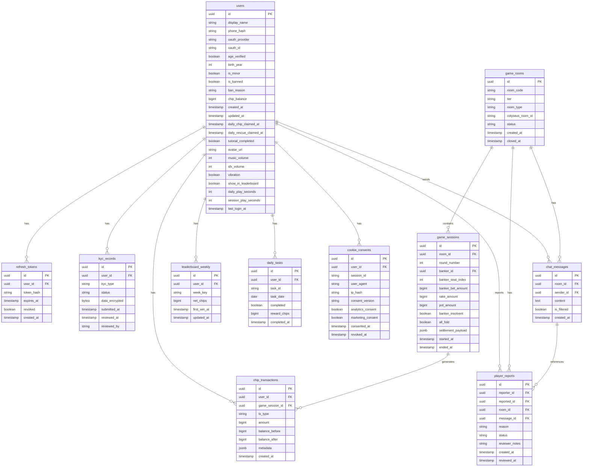

# SCHEMA — 資料庫 Schema 文件

<!-- SDLC Database Schema Document — Layer 3：Database Design -->

---

## Document Control

| 欄位 | 內容 |
|------|------|
| **DOC-ID** | SCHEMA-SAM-GONG-GAME-20260422 |
| **專案名稱** | 三公遊戲（Sam Gong 3-Card Poker）即時多人線上平台 |
| **文件版本** | v1.2 |
| **狀態** | DRAFT（STEP-12 Review Round 2 完成，1 finding 已修復；累計 10 findings 已修復）|
| **作者** | Evans Tseng（由 STEP-09 自動生成） |
| **日期** | 2026-04-22 |
| **來源 EDD** | EDD-SAM-GONG-GAME-20260422 v1.4-draft §5.1 / §5.2 / §5.3 / §5.4 |
| **資料庫版本** | PostgreSQL 16.x |

---

## Change Log

| 版本 | 日期 | 作者 | 變更摘要 |
|------|------|------|---------|
| v1.0 | 2026-04-22 | STEP-09 | 初稿；依 EDD v1.4-draft §5 生成；涵蓋所有 DDL、索引、Enum、分區策略、保留政策、遷移策略 |
| v1.1 | 2026-04-22 | STEP-12 Review Round 1 | 修復 9 個 findings：F1 game_sessions.banker_bet_amount 補 CHECK >= 0；F2 game_sessions 補 idx_sessions_started_at 索引（稽核查詢）；F3 kyc_records 補 kyc_type 和 status CHECK 約束；F4 player_reports.reason 補 CHECK 約束；F5 cookie_consents.session_id 補部分索引；F6 users.music_volume/sfx_volume 補 BETWEEN 0 AND 100 CHECK；F7/F11 釐清 rake 記錄必須 user_id=NULL 而非 SYSTEM_ACCOUNT_UUID，更新範例與 Appendix C 說明；F10 chip_transactions 分頁策略從 OFFSET 改為 Keyset Pagination；F12 ERD 中 task_date 從 string 修正為 date；§4.2 補全所有手動 Enum CHECK 約束清單 |
| v1.2 | 2026-04-22 | STEP-12 Review Round 2 | 修復 1 個 finding：F13 chat_messages.sender_id FK 缺少索引，補 idx_chat_messages_sender（部分索引 WHERE NOT NULL，用於稽核/封號查詢） |

---

## 1. Overview

### 1.1 設計原則

1. **ACID 事務優先**：籌碼結算使用 SERIALIZABLE 隔離等級，確保籌碼守恆（誤差容忍 = 0）
2. **財務記錄保留 7 年**：chip_transactions 按月分區（pg_partman），帳號刪除後 user_id 匿名化（SET NULL）
3. **不可變記錄**：chip_transactions 不支援 UPDATE/DELETE（僅 INSERT）；balance_consistency CHECK 保證一致性
4. **讀寫分離**：排行榜、玩家資料讀取走 Read Replica；寫入（結算、籌碼更新）走 Primary
5. **索引策略**：優先支援高頻查詢（結算、排行榜、Rate Limit）；避免過度索引

### 1.2 資料庫規格

| 項目 | 值 |
|------|---|
| 資料庫引擎 | PostgreSQL 16.x |
| 字元集 | UTF-8 |
| Timezone | UTC（應用層轉換 UTC+8） |
| 連線池 | pgBouncer（Transaction Mode） |
| 分區工具 | pg_partman（自動月分區管理） |
| 遷移工具 | node-pg-migrate 或 Flyway |
| 備份策略 | Primary: WAL Streaming；快照: RDB（RPO ≤ 15min） |

### 1.3 擴充套件

```sql
CREATE EXTENSION IF NOT EXISTS "uuid-ossp";   -- UUID 生成
CREATE EXTENSION IF NOT EXISTS "pgcrypto";     -- gen_random_uuid()、加密函數
```

### 1.4 表格清單

| 表格名稱 | 說明 | 記錄保留 |
|---------|------|---------|
| `users` | 玩家帳號資料 | 永久（個資 7 工作日刪除）|
| `refresh_tokens` | Refresh Token 管理 | 7 天（過期後清理）|
| `kyc_records` | KYC 身份驗證記錄 | 7 年（法規要求）|
| `game_rooms` | 遊戲房間資訊 | 永久（closed_at 後歸檔）|
| `game_sessions` | 牌局結算記錄 | 7 年（稽核用）|
| `chip_transactions` | 籌碼交易流水帳 | 7 年（財務法規；月分區）|
| `leaderboard_weekly` | 週排行榜聚合 | 永久（歷史數據）|
| `daily_tasks` | 每日任務完成記錄 | 30 天（定時清理）|
| `cookie_consents` | Cookie 同意記錄 | 3 年（REQ-016）|
| `chat_messages` | 房間聊天訊息 | 30 天自動清除 |
| `player_reports` | 玩家舉報記錄 | 永久（稽核用）|

---

## 2. Entity Relationship Diagram



---

## 3. Table Definitions

### 3.1 users（玩家帳號）

```sql
-- ────────────────────────────────
-- Table: users（玩家帳號）
-- 初始籌碼 100,000；chip_balance 不得為負數
-- ────────────────────────────────
CREATE TABLE users (
    id                      UUID PRIMARY KEY DEFAULT uuid_generate_v4(),
    display_name            VARCHAR(24) NOT NULL,
    -- 手機號碼 SHA-256 Hash，不存明文；OAuth 登入時為 NULL
    phone_hash              VARCHAR(64),
    -- OAuth 提供商：'google'|'facebook'|null（手機/帳密登入）
    oauth_provider          VARCHAR(20),
    oauth_id                VARCHAR(128),
    -- 年齡驗證旗標（OTP 驗證後設為 TRUE）
    age_verified            BOOLEAN NOT NULL DEFAULT FALSE,
    -- 出生年份（v1.0 僅比較年份；法律意見書確認後可升級全日期）
    birth_year              SMALLINT,
    -- 未成年旗標（TRUE = 每日遊戲 2h 硬停）
    is_minor                BOOLEAN NOT NULL DEFAULT FALSE,
    is_banned               BOOLEAN NOT NULL DEFAULT FALSE,
    ban_reason              TEXT,
    -- 籌碼餘額（初始 100,000；結算後更新）；不得為負數
    chip_balance            BIGINT NOT NULL DEFAULT 100000,
    created_at              TIMESTAMPTZ NOT NULL DEFAULT NOW(),
    updated_at              TIMESTAMPTZ NOT NULL DEFAULT NOW(),
    -- 每日籌碼領取日期（UTC+8 日期，DATE 類型；每日重置）
    daily_chip_claimed_at   DATE,
    -- 每日救援籌碼領取日期（UTC+8；每日上限 1 次）
    daily_rescue_claimed_at DATE,
    tutorial_completed      BOOLEAN NOT NULL DEFAULT FALSE,
    avatar_url              TEXT,
    -- 音效設定（0-100）
    music_volume            SMALLINT NOT NULL DEFAULT 70 CHECK (music_volume BETWEEN 0 AND 100),
    sfx_volume              SMALLINT NOT NULL DEFAULT 80 CHECK (sfx_volume BETWEEN 0 AND 100),
    vibration               BOOLEAN NOT NULL DEFAULT TRUE,
    -- 排行榜顯示旗標（FALSE 時同步 ZREM Redis ZSET）
    show_in_leaderboard     BOOLEAN NOT NULL DEFAULT TRUE,
    -- 防沉迷計時（Write-Through Cache；Redis aa:session:{id}）
    daily_play_seconds      INT NOT NULL DEFAULT 0,   -- 今日累計（UTC+8 00:00 重置）
    session_play_seconds    INT NOT NULL DEFAULT 0,   -- 連續遊玩（離線 > 30min 重置）
    last_login_at           TIMESTAMPTZ,
    -- OAuth 複合唯一鍵（同一 Provider 的同一 oauth_id 只能對應一個帳號）
    UNIQUE (oauth_provider, oauth_id),
    CONSTRAINT chip_balance_non_negative CHECK (chip_balance >= 0)
);
```

**欄位說明**：

| 欄位 | 類型 | 說明 |
|------|------|------|
| `id` | UUID PK | uuid_generate_v4()；玩家唯一識別 |
| `display_name` | VARCHAR(24) NOT NULL | 遊戲顯示名稱；最長 24 字元 |
| `phone_hash` | VARCHAR(64) | SHA-256(phone_number)；不儲存明文 |
| `oauth_provider` | VARCHAR(20) | 'google'\|'facebook'\|null |
| `age_verified` | BOOLEAN | OTP 驗證後設 TRUE |
| `birth_year` | SMALLINT | 出生年份（整數） |
| `is_minor` | BOOLEAN | 未成年旗標；TRUE = 每日 2h 硬停 |
| `chip_balance` | BIGINT | 虛擬籌碼餘額；初始 100,000；CHECK ≥ 0 |
| `daily_chip_claimed_at` | DATE | UTC+8 日期（每日重置判斷） |
| `daily_rescue_claimed_at` | DATE | UTC+8 日期（每日上限 1 次） |
| `show_in_leaderboard` | BOOLEAN | FALSE 時 ZREM Redis ZSET |
| `daily_play_seconds` | INT | 今日累計遊玩秒數（UTC+8 午夜重置） |
| `session_play_seconds` | INT | 連續遊玩秒數（離線 > 30min 重置） |

**索引**：
```sql
-- 首莊選擇（首局持有最多籌碼者擔任莊家）
CREATE INDEX idx_users_chip_balance ON users(chip_balance DESC);

-- 封號快速查詢（部分索引；僅索引被封帳號）
CREATE INDEX idx_users_is_banned ON users(is_banned) WHERE is_banned = TRUE;
```

---

### 3.2 refresh_tokens（Refresh Token 管理）

```sql
-- ────────────────────────────────
-- Table: refresh_tokens（Refresh Token）
-- 一次性使用（Rotation）；7 天後清理 revoked=TRUE 記錄
-- ────────────────────────────────
CREATE TABLE refresh_tokens (
    id              UUID PRIMARY KEY DEFAULT uuid_generate_v4(),
    user_id         UUID NOT NULL REFERENCES users(id) ON DELETE CASCADE,
    -- SHA-256(refresh_token)；不儲存明文 Token
    token_hash      VARCHAR(64) NOT NULL UNIQUE,
    expires_at      TIMESTAMPTZ NOT NULL,
    revoked         BOOLEAN NOT NULL DEFAULT FALSE,
    created_at      TIMESTAMPTZ NOT NULL DEFAULT NOW()
);
```

**欄位說明**：

| 欄位 | 說明 |
|------|------|
| `token_hash` | SHA-256(refresh_token)；不儲存原始 Token；UNIQUE 確保一次性使用 |
| `expires_at` | TTL = 7 天（NFR-17）|
| `revoked` | Rotation 後設 TRUE；7 日後定時清理 |

**索引**：
```sql
-- 查詢有效 Refresh Token（/auth/refresh 時使用）
CREATE INDEX idx_refresh_tokens_user ON refresh_tokens(user_id, expires_at DESC)
    WHERE revoked = FALSE;
```

---

### 3.3 kyc_records（KYC 記錄）

```sql
-- ────────────────────────────────
-- Table: kyc_records（KYC 身份驗證記錄）
-- kyc_type: 'otp_age_verify'|'full_kyc'
-- status: 'pending'|'approved'|'rejected'
-- data_encrypted: AES-256 加密（AWS KMS 管理）；保留 7 年（法規）
-- ────────────────────────────────
CREATE TABLE kyc_records (
    id              UUID PRIMARY KEY DEFAULT uuid_generate_v4(),
    user_id         UUID NOT NULL REFERENCES users(id) ON DELETE CASCADE,
    -- KYC 類型：OTP 年齡驗證 vs 全 KYC 文件上傳
    kyc_type        VARCHAR(32) NOT NULL
                    CHECK (kyc_type IN ('otp_age_verify', 'full_kyc')),
    -- 審核狀態
    status          VARCHAR(16) NOT NULL
                    CHECK (status IN ('pending', 'approved', 'rejected')),
    -- KYC 文件內容（AES-256 加密；AWS KMS 金鑰）
    data_encrypted  BYTEA,
    submitted_at    TIMESTAMPTZ NOT NULL DEFAULT NOW(),
    reviewed_at     TIMESTAMPTZ,
    -- 審核人員識別碼（Admin user ID 或名稱）
    reviewed_by     VARCHAR(64)
);
```

**索引**：
```sql
-- 查詢玩家 KYC 記錄（依時間排序取最新）
CREATE INDEX idx_kyc_user_id ON kyc_records(user_id, submitted_at DESC);
```

---

### 3.4 game_rooms（遊戲房間）

```sql
-- ────────────────────────────────
-- Table: game_rooms（遊戲房間）
-- 廳別 (tier)：青銅廳|白銀廳|黃金廳|鉑金廳|鑽石廳
-- room_type：matchmaking（自動配對）|private（私人房間）
-- ────────────────────────────────
CREATE TABLE game_rooms (
  id               UUID PRIMARY KEY DEFAULT gen_random_uuid(),
  -- NULL = 配對房間；6 位大寫英數字 = 私人房間
  room_code        VARCHAR(6) UNIQUE,
  tier             VARCHAR(20) NOT NULL
                   CHECK (tier IN ('青銅廳','白銀廳','黃金廳','鉑金廳','鑽石廳')),
  room_type        VARCHAR(20) NOT NULL DEFAULT 'matchmaking'
                   CHECK (room_type IN ('matchmaking','private')),
  -- Colyseus 內部 Room ID（用於 Client joinById）
  colyseus_room_id VARCHAR(100) UNIQUE,
  created_at       TIMESTAMPTZ NOT NULL DEFAULT NOW(),
  closed_at        TIMESTAMPTZ,
  status           VARCHAR(20) NOT NULL DEFAULT 'active'
                   CHECK (status IN ('active','closed'))
);
```

**索引**：
```sql
-- 查詢活躍房間（狀態過濾；部分索引）
CREATE INDEX idx_game_rooms_status ON game_rooms(status) WHERE status = 'active';

-- 查詢私人房間（room_code 查詢；部分索引）
CREATE INDEX idx_game_rooms_code ON game_rooms(room_code) WHERE room_code IS NOT NULL;
```

---

### 3.5 game_sessions（牌局記錄）

```sql
-- ────────────────────────────────
-- Table: game_sessions（牌局結算記錄）
-- 每局結算後寫入一筆；保留 7 年（稽核）
-- settlement_payload：完整結算快照（含所有玩家 net_chips）
-- player_count 從 settlement_payload 或 chip_transactions JOIN 推導，不單獨儲存
-- 廳別（tier）記錄於 game_rooms 表，不重複寫入此表
-- ────────────────────────────────
CREATE TABLE game_sessions (
    id                  UUID PRIMARY KEY DEFAULT uuid_generate_v4(),
    room_id             UUID NOT NULL REFERENCES game_rooms(id) ON DELETE CASCADE,
    round_number        INT NOT NULL,
    -- banker_id 帳號刪除後設 NULL（匿名化）
    banker_id           UUID REFERENCES users(id) ON DELETE SET NULL,
    banker_seat_index   SMALLINT NOT NULL,
    banker_bet_amount   BIGINT NOT NULL,
    rake_amount         BIGINT NOT NULL DEFAULT 0,
    pot_amount          BIGINT NOT NULL DEFAULT 0,
    banker_insolvent    BOOLEAN NOT NULL DEFAULT FALSE,
    all_fold            BOOLEAN NOT NULL DEFAULT FALSE,
    -- 完整結算快照（含所有玩家 seat_index、net_chips、hand_type、is_sam_gong）
    settlement_payload  JSONB NOT NULL,
    started_at          TIMESTAMPTZ NOT NULL,
    ended_at            TIMESTAMPTZ,
    CONSTRAINT rake_non_negative CHECK (rake_amount >= 0),
    CONSTRAINT pot_non_negative CHECK (pot_amount >= 0),
    CONSTRAINT banker_bet_non_negative CHECK (banker_bet_amount >= 0)
);
```

**settlement_payload 範例**：
```json
{
  "players": [
    {
      "seat_index": 0,
      "player_id": "uuid",
      "net_chips": 500,
      "bet_amount": 500,
      "result": "win",
      "hand_type": "9",
      "is_sam_gong": false
    }
  ],
  "rake_amount": 25,
  "pot_amount": 500,
  "banker_insolvent": false,
  "all_fold": false
}
```

**索引**：
```sql
-- 查詢房間內所有牌局（依局數排序）
CREATE INDEX idx_sessions_room_id ON game_sessions(room_id, round_number);

-- 查詢莊家歷史記錄（依時間排序）
CREATE INDEX idx_sessions_banker_id ON game_sessions(banker_id, ended_at DESC);

-- 稽核查詢（依時間範圍查詢；7 年保留）
CREATE INDEX idx_sessions_started_at ON game_sessions(started_at DESC);
```

---

### 3.6 chip_transactions（籌碼交易記錄）

```sql
-- ────────────────────────────────
-- Table: chip_transactions（籌碼交易流水帳）
-- 財務記錄保留 7 年（REQ-019；台灣金融法規）
-- 帳號刪除後 user_id 設 NULL（匿名化，保留交易記錄）
-- tx_type 使用 Enum 強型別約束
-- 按月分區（pg_partman）：chip_transactions_2026_01, chip_transactions_2026_02, ...
--
-- tx_type 合法值（REQ-006 AC-8）：
--   game_win    — 遊戲贏得籌碼
--   game_lose   — 遊戲輸掉籌碼
--   daily_gift  — 每日籌碼領取
--   rescue      — 救援籌碼補發
--   iap         — 應用內購買（IAP；feature_flag 控制）
--   task_reward — 每日任務獎勵
--   ad_reward   — 廣告觀看獎勵（REQ-020a）
--   refund      — 退款
--   tutorial    — 教學模式籌碼
--   admin_adjustment — Admin 人工調整
--   rake        — 抽水（user_id = NULL 系統帳戶）
--
-- 排行榜計入：game_win、game_lose（其餘不計入）
-- ────────────────────────────────

CREATE TYPE tx_type_enum AS ENUM (
    'game_win', 'game_lose', 'daily_gift', 'rescue', 'iap',
    'task_reward', 'ad_reward', 'refund', 'tutorial', 'admin_adjustment', 'rake'
);

-- 月分區主表（PRIMARY KEY 含 created_at）
CREATE TABLE chip_transactions (
    id                UUID NOT NULL DEFAULT uuid_generate_v4(),
    -- 帳號刪除後設 NULL（ON DELETE SET NULL）；rake 記錄 user_id = NULL
    user_id           UUID REFERENCES users(id) ON DELETE SET NULL,
    -- 關聯牌局；非遊戲類型為 NULL
    game_session_id   UUID REFERENCES game_sessions(id) ON DELETE SET NULL,
    tx_type           tx_type_enum NOT NULL,
    -- 正數 = 增加；負數 = 減少
    amount            BIGINT NOT NULL,
    balance_before    BIGINT NOT NULL,
    balance_after     BIGINT NOT NULL,
    -- 附加元數據（settlement_detail, task_id, ad_view_token 等）
    metadata          JSONB,
    created_at        TIMESTAMPTZ NOT NULL DEFAULT NOW(),
    -- 余額一致性約束（rake 記錄 user_id = NULL 時跳過）
    CONSTRAINT balance_consistency CHECK (
        user_id IS NULL OR balance_before + amount = balance_after
    ),
    -- 複合主鍵（分區表必需含分區欄位）
    PRIMARY KEY (id, created_at)
) PARTITION BY RANGE (created_at);
```

**範例資料**：
```sql
-- 玩家贏得 500 籌碼（9 點勝莊）
INSERT INTO chip_transactions (user_id, game_session_id, tx_type, amount, balance_before, balance_after, metadata)
VALUES (
    'player-uuid',
    'session-uuid',
    'game_win',
    500,
    99500,
    100000,
    '{"hand_type": "9", "banker_bet_amount": 500, "multiplier": 1}'::jsonb
);

-- Rake 記錄（user_id = NULL；balance_consistency CHECK 豁免條件即為 user_id IS NULL）
-- 注意：rake 記錄必須使用 user_id = NULL，而非 SYSTEM_ACCOUNT_UUID，
-- 原因：balance_consistency CHECK (user_id IS NULL OR balance_before + amount = balance_after)
-- 若使用 SYSTEM_ACCOUNT_UUID（非 NULL），則 0 + 25 ≠ 0 將觸發 CHECK 違反。
-- Appendix C 的 SYSTEM_ACCOUNT_UUID 僅作為業務層識別常數，記錄於 metadata 供稽核用，
-- 不作為 chip_transactions.user_id 的實際插入值。
INSERT INTO chip_transactions (user_id, game_session_id, tx_type, amount, balance_before, balance_after, metadata)
VALUES (
    NULL,  -- rake 記錄必須為 NULL（豁免 balance_consistency CHECK）
    'session-uuid',
    'rake',
    25,
    0,
    25,  -- balance_after 對 NULL user_id 不受 CHECK 限制；建議設為累計 rake 金額或固定 0
    '{"pot_amount": 500, "rake_rate": 0.05, "system_account": "00000000-0000-0000-0000-000000000001"}'::jsonb
);
```

**索引**：
```sql
-- 玩家交易記錄查詢（分頁；包含 created_at 利用分區裁剪）
CREATE INDEX idx_tx_user_id ON chip_transactions(user_id, created_at DESC);

-- 牌局關聯查詢（結算稽核）
CREATE INDEX idx_tx_game_session ON chip_transactions(game_session_id);

-- 按類型時序查詢（稽核、統計）
CREATE INDEX idx_tx_type_created ON chip_transactions(tx_type, created_at DESC);
```

**分區說明**：
```sql
-- pg_partman 自動管理；範例手動建立格式：
CREATE TABLE chip_transactions_2026_04
    PARTITION OF chip_transactions
    FOR VALUES FROM ('2026-04-01') TO ('2026-05-01');

-- pg_partman 設定：
-- retention = '7 years'（7 年前分區自動 DROP）
-- premake = 3（預建 3 個月後分區）
COMMENT ON TABLE chip_transactions IS 'Partitioned by month (created_at). Managed by pg_partman. Retention: 7 years.';
```

---

### 3.7 leaderboard_weekly（週排行榜聚合）

```sql
-- ────────────────────────────────
-- Table: leaderboard_weekly（週排行榜聚合）
-- week_key 格式：'2026-W17'（ISO 8601 週）
-- net_chips：本週 game_win + game_lose 加總（只計這兩種 tx_type）
-- first_win_at：D5 平手決勝（先達到同分數者排前）
-- ────────────────────────────────
CREATE TABLE leaderboard_weekly (
    id              UUID PRIMARY KEY DEFAULT uuid_generate_v4(),
    user_id         UUID NOT NULL REFERENCES users(id) ON DELETE CASCADE,
    week_key        VARCHAR(10) NOT NULL,
    net_chips       BIGINT NOT NULL DEFAULT 0,
    -- D5 平手決勝：先達到同 net_chips 分數的時間戳
    first_win_at    TIMESTAMPTZ,
    updated_at      TIMESTAMPTZ NOT NULL DEFAULT NOW(),
    -- 同一玩家同一週只有一筆記錄
    UNIQUE (user_id, week_key)
);
```

**索引**：
```sql
-- 排行榜查詢（同週依 net_chips DESC，平手依 first_win_at ASC）
CREATE INDEX idx_weekly_ranking ON leaderboard_weekly(week_key, net_chips DESC, first_win_at ASC);
```

---

### 3.8 daily_tasks（每日任務）

```sql
-- ────────────────────────────────
-- Table: daily_tasks（每日任務完成記錄）
-- task_date 格式：UTC+8 日期（'2026-04-22'）
-- UNIQUE (user_id, task_id, task_date)：確保每日每任務只有一筆（冪等）
-- ────────────────────────────────
CREATE TABLE daily_tasks (
    id              UUID PRIMARY KEY DEFAULT uuid_generate_v4(),
    user_id         UUID NOT NULL REFERENCES users(id) ON DELETE CASCADE,
    -- 任務識別符（如 'complete_3_games'、'win_1_game'、'login_daily'）
    task_id         VARCHAR(64) NOT NULL,
    -- UTC+8 日期（應用層計算後以 DATE 字串形式存入）
    task_date       DATE NOT NULL,
    completed       BOOLEAN NOT NULL DEFAULT FALSE,
    reward_chips    BIGINT NOT NULL DEFAULT 0,
    completed_at    TIMESTAMPTZ,
    -- 複合唯一鍵：同一玩家同一天同一任務只有一筆
    UNIQUE (user_id, task_id, task_date)
);
```

**索引**：
```sql
-- 查詢玩家今日任務列表
CREATE INDEX idx_tasks_user_date ON daily_tasks(user_id, task_date DESC);
```

---

### 3.9 cookie_consents（Cookie 同意記錄）

```sql
-- ────────────────────────────────
-- Table: cookie_consents（Cookie 同意記錄）
-- REQ-016：GDPR opt-in（歐盟 IP）；非歐盟告知義務
-- session_id：未登入前的 Cookie 同意（匿名）
-- user_agent：稽核用（僅存 TEXT，不用於追蹤）
-- 保留 3 年（REQ-016）
-- ────────────────────────────────
CREATE TABLE cookie_consents (
  id               UUID PRIMARY KEY DEFAULT gen_random_uuid(),
  -- 未登入時 user_id 為 NULL
  user_id          UUID REFERENCES users(id) ON DELETE SET NULL,
  -- 未登入前的會話識別
  session_id       VARCHAR(100),
  -- 同意版本號（如 '1.0.0'）
  consent_version  VARCHAR(20) NOT NULL,
  analytics_consent  BOOLEAN NOT NULL DEFAULT false,
  marketing_consent  BOOLEAN NOT NULL DEFAULT false,
  consented_at     TIMESTAMPTZ NOT NULL DEFAULT NOW(),
  revoked_at       TIMESTAMPTZ,
  -- IP 位址 SHA-256 Hash（不存明文）
  ip_hash          VARCHAR(64),
  user_agent       TEXT
);
```

**索引**：
```sql
-- 查詢玩家 Cookie 同意記錄
CREATE INDEX idx_cookie_consents_user ON cookie_consents(user_id);

-- 未登入前 Cookie 同意查詢（by session_id；部分索引）
CREATE INDEX idx_cookie_consents_session ON cookie_consents(session_id)
    WHERE session_id IS NOT NULL;
```

---

### 3.10 chat_messages（聊天訊息）

```sql
-- ────────────────────────────────
-- Table: chat_messages（房間聊天訊息）
-- ephemeral：30 天自動清除（REQ-007 AC-3）
-- content 長度限制：200 字元（Server 驗證 + CHECK）
-- ────────────────────────────────
CREATE TABLE chat_messages (
  id          UUID PRIMARY KEY DEFAULT gen_random_uuid(),
  room_id     UUID REFERENCES game_rooms(id) ON DELETE CASCADE,
  -- 帳號刪除後 sender_id 設 NULL（匿名化，保留訊息供稽核）
  sender_id   UUID REFERENCES users(id) ON DELETE SET NULL,
  content     TEXT NOT NULL CHECK (char_length(content) <= 200),
  created_at  TIMESTAMPTZ NOT NULL DEFAULT NOW(),
  -- 是否已通過內容過濾（content_filter）
  is_filtered BOOLEAN NOT NULL DEFAULT false
);
```

**索引**：
```sql
-- 查詢房間最新聊天（依時間倒序）
CREATE INDEX idx_chat_messages_room ON chat_messages(room_id, created_at DESC);

-- 查詢玩家發送的聊天記錄（稽核 / 封號時使用；部分索引排除已匿名記錄）
CREATE INDEX idx_chat_messages_sender ON chat_messages(sender_id)
    WHERE sender_id IS NOT NULL;
```

**自動清除**：
```sql
-- 定時任務（每日執行）：清除 30 天前的聊天訊息
DELETE FROM chat_messages WHERE created_at < NOW() - INTERVAL '30 days';
```

---

### 3.11 player_reports（玩家舉報）

```sql
-- ────────────────────────────────
-- Table: player_reports（玩家舉報記錄）
-- reason 合法值：'cheating'|'inappropriate_language'|'harassment'|'spam'
-- status：'pending'|'reviewed'|'resolved'|'dismissed'
-- message_id：關聯被舉報的聊天訊息（EDD v1.3 F3）
-- reviewer_notes：稽核人員審查備注（EDD v1.3 F3）
-- ────────────────────────────────
CREATE TABLE player_reports (
  id             UUID PRIMARY KEY DEFAULT gen_random_uuid(),
  -- 舉報者（帳號刪除後設 NULL）
  reporter_id    UUID REFERENCES users(id) ON DELETE SET NULL,
  -- 被舉報者（帳號刪除後設 NULL）
  reported_id    UUID REFERENCES users(id) ON DELETE SET NULL,
  -- 發生房間（房間關閉後設 NULL）
  room_id        UUID REFERENCES game_rooms(id) ON DELETE SET NULL,
  -- 關聯聊天訊息（可選；聊天訊息刪除後設 NULL）
  message_id     UUID REFERENCES chat_messages(id) ON DELETE SET NULL,
  reason         VARCHAR(50) NOT NULL
                 CHECK (reason IN ('cheating','inappropriate_language','harassment','spam')),
  status         VARCHAR(20) NOT NULL DEFAULT 'pending'
                 CHECK (status IN ('pending','reviewed','resolved','dismissed')),
  created_at     TIMESTAMPTZ NOT NULL DEFAULT NOW(),
  reviewed_at    TIMESTAMPTZ,
  -- Admin 審查備注
  reviewer_notes TEXT
);
```

**索引**：
```sql
-- 待審查舉報快速查詢（部分索引；只索引 pending 狀態）
CREATE INDEX idx_player_reports_status ON player_reports(status) WHERE status = 'pending';

-- 查詢被舉報者的舉報記錄（EDD v1.4 F2）
CREATE INDEX idx_player_reports_reported ON player_reports(reported_id);

-- 查詢舉報者的舉報記錄（EDD v1.4 F2）
CREATE INDEX idx_player_reports_reporter ON player_reports(reporter_id);
```

---

## 4. Enum Types

### 4.1 tx_type_enum（籌碼交易類型）

```sql
CREATE TYPE tx_type_enum AS ENUM (
    'game_win',          -- 遊戲贏得籌碼
    'game_lose',         -- 遊戲輸掉籌碼
    'daily_gift',        -- 每日籌碼領取
    'rescue',            -- 救援籌碼（chip_balance < 500）
    'iap',               -- 應用內購買（feature_flag 控制）
    'task_reward',       -- 每日任務獎勵
    'ad_reward',         -- 廣告觀看獎勵（REQ-020a AdMob）
    'refund',            -- 退款
    'tutorial',          -- 教學模式籌碼
    'admin_adjustment',  -- Admin 人工調整
    'rake'               -- 抽水（user_id = NULL；不計入排行榜）
);
```

**排行榜計算規則（REQ-006 AC-8）**：

| tx_type | 計入排行榜 | 說明 |
|---------|:--------:|------|
| `game_win` | 是 | 遊戲贏得計入 net_chips |
| `game_lose` | 是 | 遊戲輸掉計入 net_chips |
| `daily_gift` | 否 | 每日免費籌碼不計 |
| `rescue` | 否 | 救援籌碼不計 |
| `iap` | 否 | 購買籌碼不計 |
| `task_reward` | 否 | 任務獎勵不計 |
| `ad_reward` | 否 | 廣告獎勵不計 |
| `refund` | 否 | 退款不計 |
| `tutorial` | 否 | 教學不計 |
| `admin_adjustment` | 否 | 人工調整不計 |
| `rake` | 否 | user_id=NULL，自然排除 |

### 4.2 手動 Enum（CHECK Constraint 方式）

以下欄位使用 VARCHAR + CHECK 約束實作（非 PostgreSQL ENUM 類型，方便未來增加值）：

```sql
-- game_rooms.tier
CHECK (tier IN ('青銅廳','白銀廳','黃金廳','鉑金廳','鑽石廳'))

-- game_rooms.room_type
CHECK (room_type IN ('matchmaking','private'))

-- game_rooms.status
CHECK (status IN ('active','closed'))

-- kyc_records.kyc_type
CHECK (kyc_type IN ('otp_age_verify', 'full_kyc'))

-- kyc_records.status
CHECK (status IN ('pending', 'approved', 'rejected'))

-- player_reports.reason
CHECK (reason IN ('cheating', 'inappropriate_language', 'harassment', 'spam'))

-- player_reports.status
CHECK (status IN ('pending','reviewed','resolved','dismissed'))

-- users.music_volume, users.sfx_volume（0-100）
CHECK (music_volume BETWEEN 0 AND 100)
CHECK (sfx_volume BETWEEN 0 AND 100)
```

---

## 5. Index Strategy

### 5.1 索引一覽表

| 索引名稱 | 表格 | 欄位 | 類型 | 查詢場景 |
|---------|------|------|------|---------|
| `idx_users_chip_balance` | users | chip_balance DESC | B-tree | 首莊選擇（持有最多籌碼）|
| `idx_users_is_banned` | users | is_banned WHERE TRUE | 部分 B-tree | 封號帳號快速查詢 |
| `idx_refresh_tokens_user` | refresh_tokens | user_id, expires_at DESC WHERE NOT revoked | 部分 B-tree | /auth/refresh Token 查詢 |
| `idx_kyc_user_id` | kyc_records | user_id, submitted_at DESC | B-tree | 玩家 KYC 狀態查詢 |
| `idx_sessions_room_id` | game_sessions | room_id, round_number | B-tree | 房間牌局歷史查詢 |
| `idx_sessions_banker_id` | game_sessions | banker_id, ended_at DESC | B-tree | 玩家莊家記錄查詢 |
| `idx_tx_user_id` | chip_transactions | user_id, created_at DESC | B-tree | 玩家交易記錄分頁查詢 |
| `idx_tx_game_session` | chip_transactions | game_session_id | B-tree | 牌局交易稽核查詢 |
| `idx_tx_type_created` | chip_transactions | tx_type, created_at DESC | B-tree | 按類型統計查詢 |
| `idx_weekly_ranking` | leaderboard_weekly | week_key, net_chips DESC, first_win_at ASC | B-tree | 週排行榜查詢 |
| `idx_tasks_user_date` | daily_tasks | user_id, task_date DESC | B-tree | 玩家今日任務查詢 |
| `idx_game_rooms_status` | game_rooms | status WHERE active | 部分 B-tree | 活躍房間查詢（Matchmaking）|
| `idx_game_rooms_code` | game_rooms | room_code WHERE NOT NULL | 部分 B-tree | 私人房間 room_code 查詢 |
| `idx_cookie_consents_user` | cookie_consents | user_id | B-tree | 玩家 Cookie 同意查詢 |
| `idx_cookie_consents_session` | cookie_consents | session_id WHERE NOT NULL | 部分 B-tree | 未登入前 Cookie 同意查詢 |
| `idx_sessions_started_at` | game_sessions | started_at DESC | B-tree | 稽核時序查詢（7 年保留）|
| `idx_chat_messages_room` | chat_messages | room_id, created_at DESC | B-tree | 房間聊天訊息分頁查詢 |
| `idx_chat_messages_sender` | chat_messages | sender_id WHERE NOT NULL | 部分 B-tree | 查詢玩家發送的聊天記錄（稽核 / 封號）|
| `idx_player_reports_status` | player_reports | status WHERE pending | 部分 B-tree | Admin 待審查舉報列表 |
| `idx_player_reports_reported` | player_reports | reported_id | B-tree | 被舉報者舉報記錄 |
| `idx_player_reports_reporter` | player_reports | reporter_id | B-tree | 舉報者舉報記錄 |

### 5.2 高頻查詢分析

**結算事務（每局 ~30s 一次）**：
```sql
-- 更新籌碼餘額（SERIALIZABLE；SELECT FOR UPDATE）
UPDATE users SET chip_balance = $1, updated_at = NOW()
WHERE id = $2 AND chip_balance >= 0  -- CHECK constraint 保護
RETURNING chip_balance;
-- 使用 PK (id) 索引；極快
```

**排行榜查詢（Redis ZSET 優先，DB 備援）**：
```sql
-- 週排行榜（Redis ZREVRANGE 優先）
SELECT lw.user_id, u.display_name, u.avatar_url, lw.net_chips, lw.first_win_at
FROM leaderboard_weekly lw
JOIN users u ON u.id = lw.user_id
WHERE lw.week_key = $1 AND u.show_in_leaderboard = TRUE
ORDER BY lw.net_chips DESC, lw.first_win_at ASC
LIMIT 100;
-- 使用 idx_weekly_ranking；Read Replica 執行
```

**玩家交易記錄分頁**：
```sql
-- 建議使用 Keyset Pagination（Cursor-Based）取代 OFFSET，
-- 避免大表（7 年、億筆記錄）OFFSET 掃描效能退化：
-- 首頁：
SELECT id, tx_type, amount, balance_before, balance_after, created_at
FROM chip_transactions
WHERE user_id = $1
  AND created_at BETWEEN $2 AND $3
ORDER BY created_at DESC
LIMIT $4;

-- 後續頁（使用上一頁最後一筆的 created_at 作為 cursor）：
SELECT id, tx_type, amount, balance_before, balance_after, created_at
FROM chip_transactions
WHERE user_id = $1
  AND created_at BETWEEN $2 AND $3
  AND created_at < $cursor  -- cursor = 上一頁最後一筆的 created_at
ORDER BY created_at DESC
LIMIT $4;
-- 使用 idx_tx_user_id；Read Replica 執行；分區裁剪利用 created_at 條件
-- 注意：禁止使用 OFFSET 分頁，對 7 年財務大表有嚴重效能風險（O(N) 掃描）
```

---

## 6. Partitioning Strategy

### 6.1 chip_transactions 月分區

**設計目標**：財務記錄保留 7 年（REQ-019），預計 7 年累積數億筆；分區查詢比全表掃描快數倍。

```sql
-- 分區主表定義（見 §3.6）
CREATE TABLE chip_transactions (...) PARTITION BY RANGE (created_at);

-- 手動建立分區格式（pg_partman 自動化）：
CREATE TABLE chip_transactions_2026_04
    PARTITION OF chip_transactions
    FOR VALUES FROM ('2026-04-01 00:00:00+00') TO ('2026-05-01 00:00:00+00');

CREATE TABLE chip_transactions_2026_05
    PARTITION OF chip_transactions
    FOR VALUES FROM ('2026-05-01 00:00:00+00') TO ('2026-06-01 00:00:00+00');
```

**pg_partman 設定建議**：

```sql
-- 使用 pg_partman 自動管理（需安裝擴充）
SELECT partman.create_parent(
    p_parent_table => 'public.chip_transactions',
    p_control => 'created_at',
    p_type => 'range',
    p_interval => '1 month',
    p_premake => 3       -- 預建 3 個月後的分區
);

-- 設定保留策略（7 年後自動 DROP）
UPDATE partman.part_config
SET retention = '7 years',
    retention_keep_table = false   -- 超過保留期直接 DROP
WHERE parent_table = 'public.chip_transactions';
```

### 6.2 分區裁剪（Partition Pruning）

查詢時**必須**在 WHERE 子句包含 `created_at` 條件，以利 PostgreSQL 分區裁剪：

```sql
-- 正確（會分區裁剪）：
SELECT * FROM chip_transactions
WHERE user_id = $1 AND created_at >= '2026-04-01' AND created_at < '2026-05-01';

-- 錯誤（全分區掃描）：
SELECT * FROM chip_transactions WHERE user_id = $1;  -- 無 created_at 條件
```

### 6.3 分區索引繼承

子分區表自動繼承父表索引定義；pg_partman 會在新分區建立時自動建立對應索引。

---

## 7. Data Retention Policy

### 7.1 各表保留期限

| 資料類型 | 表格 | 保留期限 | 清除方式 |
|---------|------|---------|---------|
| 籌碼交易記錄 | `chip_transactions` | **7 年**（REQ-019；台灣金融法規）| pg_partman 自動 DROP 舊分區 |
| 牌局結算記錄 | `game_sessions` | **7 年**（稽核用）| 手動歸檔或定時 DELETE |
| KYC 記錄 | `kyc_records` | **7 年**（法規要求）| 帳號刪除後匿名化版本仍保留 |
| Cookie 同意記錄 | `cookie_consents` | **3 年**（REQ-016）| 定時 DELETE |
| 已撤銷 Refresh Token | `refresh_tokens` | **7 日**（超過 expires_at）| 定時 DELETE WHERE revoked=TRUE |
| 聊天訊息 | `chat_messages` | **30 天**（REQ-007 AC-3）| 定時 DELETE |
| 每日任務記錄 | `daily_tasks` | **30 天**（可選）| 定時 DELETE |
| 個人資料 | `users`（display_name, phone_hash, avatar_url）| 帳號刪除後 **7 工作日** 內刪除 | DELETE /player/me 非同步處理 |
| 帳號刪除後財務記錄 | `chip_transactions` | user_id 設 NULL（匿名化），記錄保留 7 年 | ON DELETE SET NULL |

### 7.2 帳號刪除流程（DELETE /player/me）

```sql
-- Step 1：匿名化個人資料（7 工作日內）
UPDATE users SET
    display_name = 'Deleted User',
    phone_hash = NULL,
    avatar_url = NULL,
    oauth_id = NULL
WHERE id = $player_id;

-- Step 2：chip_transactions user_id 已由 ON DELETE SET NULL 自動處理
-- Step 3：refresh_tokens 已由 ON DELETE CASCADE 自動刪除
-- Step 4：daily_tasks 已由 ON DELETE CASCADE 自動刪除
-- Step 5：leaderboard_weekly 已由 ON DELETE CASCADE 自動刪除
-- Step 6：最終刪除帳號記錄
DELETE FROM users WHERE id = $player_id;
```

### 7.3 定時清除任務

```sql
-- 每日執行（建議 UTC 04:00 = UTC+8 12:00 低峰）

-- 清除 30 天前聊天訊息
DELETE FROM chat_messages WHERE created_at < NOW() - INTERVAL '30 days';

-- 清除過期且已撤銷的 Refresh Token（7 日後）
DELETE FROM refresh_tokens
WHERE revoked = TRUE AND expires_at < NOW() - INTERVAL '7 days';

-- 清除 30 天前的每日任務記錄（可選）
DELETE FROM daily_tasks WHERE task_date < CURRENT_DATE - INTERVAL '30 days';
```

---

## 8. Migration Strategy

### 8.1 Zero-Downtime Migration 原則

1. **只增不刪（Additive Only）**：v1.x 期間只新增欄位/表格，不刪除/重命名
2. **Optional 欄位優先**：新欄位必須有 DEFAULT 或允許 NULL，避免鎖表
3. **分離 Schema 變更與應用部署**：先部署 Schema 變更，再部署應用程式
4. **CONCURRENT 索引**：線上索引建立使用 `CREATE INDEX CONCURRENTLY`

### 8.2 遷移工具

| 工具 | 用途 |
|------|------|
| node-pg-migrate | 版本化 SQL 遷移腳本 |
| Flyway（備選）| Java 生態系 DB 遷移 |

**遷移命名規範**：
```
migrations/
  001_initial_schema.sql       -- 初始 Schema
  002_add_kyc_records.sql      -- KYC 表
  003_add_chat_messages.sql    -- 聊天功能
  ...
```

### 8.3 常用 Zero-Downtime 遷移模式

**新增欄位（安全）**：
```sql
-- 帶 DEFAULT 值的新欄位；PostgreSQL 16 支援立即執行
ALTER TABLE users ADD COLUMN new_feature_flag BOOLEAN NOT NULL DEFAULT FALSE;
```

**新增索引（不鎖表）**：
```sql
-- CONCURRENTLY 允許讀寫並發
CREATE INDEX CONCURRENTLY idx_new_index ON users(some_column);
```

**修改欄位類型（需停機或分步）**：
```sql
-- Step 1：新增新欄位
ALTER TABLE users ADD COLUMN display_name_v2 VARCHAR(32);
-- Step 2：雙寫期（應用同時寫 v1 + v2）
-- Step 3：回填舊資料
UPDATE users SET display_name_v2 = display_name WHERE display_name_v2 IS NULL;
-- Step 4：切換應用使用 v2
-- Step 5：DROP v1（確認無讀取後）
ALTER TABLE users DROP COLUMN display_name;
```

**分區表新增索引**：
```sql
-- 每個分區需分別建立（pg_partman 會自動處理新分區）
CREATE INDEX CONCURRENTLY idx_tx_user_id_2026_04
    ON chip_transactions_2026_04(user_id, created_at DESC);
```

### 8.4 Rollback 策略

每個遷移腳本必須包含 `rollback` SQL（node-pg-migrate 格式）：

```javascript
// migrations/004_add_leaderboard_index.js
exports.up = pgm => {
  pgm.createIndex('leaderboard_weekly', ['week_key', 'net_chips', 'first_win_at'], {
    name: 'idx_weekly_ranking',
    sort: { net_chips: 'DESC', first_win_at: 'ASC' }
  });
};

exports.down = pgm => {
  pgm.dropIndex('leaderboard_weekly', null, { name: 'idx_weekly_ranking' });
};
```

---

## Appendix A：完整 DDL 腳本

```sql
-- ══════════════════════════════════════════════
-- PostgreSQL 16.x DDL — Sam Gong Database Schema
-- Version: 1.2  Date: 2026-04-22
-- ══════════════════════════════════════════════

-- 啟用擴充
CREATE EXTENSION IF NOT EXISTS "uuid-ossp";
CREATE EXTENSION IF NOT EXISTS "pgcrypto";

-- Enum 定義
CREATE TYPE tx_type_enum AS ENUM (
    'game_win', 'game_lose', 'daily_gift', 'rescue', 'iap',
    'task_reward', 'ad_reward', 'refund', 'tutorial', 'admin_adjustment', 'rake'
);

-- 表格建立順序（按外鍵依賴）
-- 1. users（無外鍵依賴）
-- 2. game_rooms（無外鍵依賴）
-- 3. refresh_tokens（依賴 users）
-- 4. kyc_records（依賴 users）
-- 5. game_sessions（依賴 game_rooms, users）
-- 6. chip_transactions（依賴 users, game_sessions）
-- 7. leaderboard_weekly（依賴 users）
-- 8. daily_tasks（依賴 users）
-- 9. cookie_consents（依賴 users）
-- 10. chat_messages（依賴 game_rooms, users）
-- 11. player_reports（依賴 users, game_rooms, chat_messages）

-- [參考各節完整 DDL]
-- 詳細 DDL 請參閱 §3.1 - §3.11 各節定義
```

---

## Appendix B：廳別籌碼規格

| 廳別 | Entry 籌碼 | min_bet | max_bet |
|------|:---------:|:-------:|:-------:|
| 青銅廳 | 1,000 | 100 | 500 |
| 白銀廳 | 10,000 | 1,000 | 5,000 |
| 黃金廳 | 100,000 | 10,000 | 50,000 |
| 鉑金廳 | 1,000,000 | 100,000 | 500,000 |
| 鑽石廳 | 10,000,000 | 1,000,000 | 5,000,000 |

---

## Appendix C：系統帳戶

| 常數 | 值 | 用途 |
|------|---|------|
| `SYSTEM_ACCOUNT_UUID` | `00000000-0000-0000-0000-000000000001` | rake 交易稽核識別碼（記錄於 metadata.system_account 欄位，供業務層識別）|

**重要說明**：`chip_transactions` 的 `rake` 記錄 **必須** 使用 `user_id = NULL`，而非 `SYSTEM_ACCOUNT_UUID`。原因：DDL 包含 `balance_consistency CHECK (user_id IS NULL OR balance_before + amount = balance_after)`，若 user_id 為非 NULL 的 UUID，則 rake 記錄的 `balance_before + amount ≠ balance_after`（系統不維護 rake 累計餘額）將觸發 CHECK 違反。`SYSTEM_ACCOUNT_UUID` 僅作為應用層業務常數，記錄於 `metadata.system_account` 欄位，不寫入 `user_id` 欄位。

---

*文件版本 v1.2 — STEP-12 Review Round 2 修復 1 finding（累計 10 findings）— finding=0 確認 — 2026-04-22*
